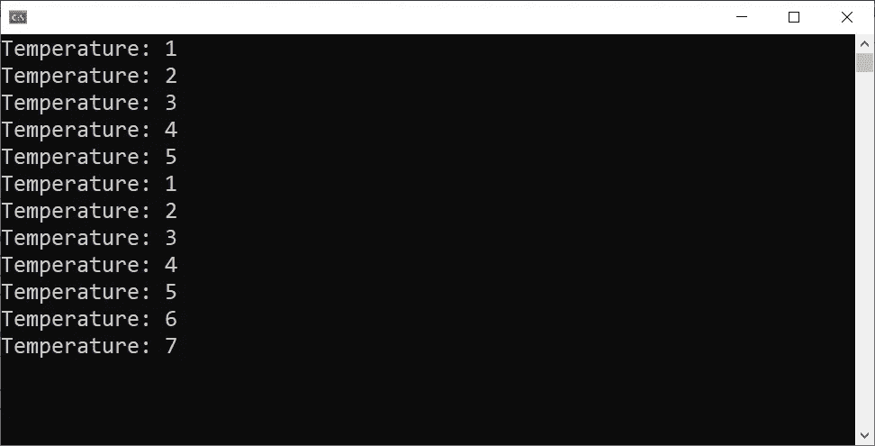

# 观察者设计模式。NET C#

> 原文：<https://levelup.gitconnected.com/observer-design-pattern-in-net-c-55633462f18e>

## 设计模式

## 中了解观察者设计模式。NET C#做了一些改进。


由 [Unsplash](https://unsplash.com/?utm_source=unsplash&utm_medium=referral&utm_content=creditCopyText) 上的[马丁·范·登·霍伊韦尔](https://unsplash.com/@mvdheuvel?utm_source=unsplash&utm_medium=referral&utm_content=creditCopyText)拍摄，由[艾哈迈德·塔雷克](https://medium.com/@eng_ahmed.tarek)调整

# **观察者设计模式**定义

**观察者设计模式**是最重要和最常用的设计模式之一，这是有原因的。

首先，让我们检查一下**观察者设计模式**的正式定义。

根据[微软的文档](https://docs.microsoft.com/en-us/dotnet/standard/events/observer-design-pattern):

> 观察者设计模式允许订阅者向提供者注册并接收来自提供者的通知。它适用于任何需要基于推送的通知的场景。该模式定义了一个*提供者*(也称为*主题*或*可观察对象*)和零个、一个或多个*观察者*。观察器向提供者注册，每当预定义的条件、事件或状态发生变化时，提供者通过调用它们的方法之一自动通知所有观察器。在这个方法调用中，提供者还可以向观察者提供当前状态信息。英寸 NET 中，通过实现通用的**系统来应用观察者设计模式。可观察的<T>和**系统。iob server<T>接口。泛型类型参数表示提供通知信息的类型。****

所以，从上面的定义，我们可以理解如下:

1.  我们有两个聚会或模块。
2.  有一些信息流要提供的模块。这个模块被称为**提供者**(因为它提供信息)，或者**主体**(因为它向外界提供信息)，或者**可观察**(因为它可以被外界观察到)。
3.  对来自其他地方的信息流感兴趣的模块。这个模块被称为**观察器**(因为它观察信息)。

[](https://medium.com/subscribe/@eng_ahmed.tarek) [## 🔥订阅艾哈迈德的时事通讯🔥

### 订阅艾哈迈德的时事通讯📰直接获得最佳实践、教程、提示、技巧和许多其他很酷的东西…

medium.com](https://medium.com/subscribe/@eng_ahmed.tarek) 

# 观察者设计模式的优势

正如我们现在所知，**观察器设计模式**规定了**可观察**和**观察器**模块之间的关系。让**观察者设计模式**与众不同的是，使用它你可以在没有紧密耦合关系的情况下实现这一点。

分析该模式的工作方式，您会发现以下内容:

1.  **可观察的**知道关于**观察器**所需的最少信息。
2.  **观察者**知道关于**可观察**所需的最少信息。
3.  甚至相互的知识也是通过抽象而不是具体的实现来实现的。
4.  最后，这两个模块都可以完成他们的工作，而且只能完成他们的工作。


# 使用的抽象

这些是用于实现**中**观察者设计模式**的**抽象**。NET C#** 。


## 可观察的

这是一个**协变**接口，表示任何**可观察的**。如果你想知道更多关于。NET 中，可以查看 [**条中的协方差和逆变。NET C#**](/covariance-and-contravariance-in-net-c-c2b8576b2155?sk=13f0128f87d2cbfb24f30219796bff31) 。

此接口中定义的成员有:

```
public IDisposable Subscribe (IObserver<out T> observer);
```

应该调用`Subscribe`方法来通知**可观察对象**某个**观察者**对其信息流感兴趣。

`Subscribe`方法返回一个实现了`IDisposable`接口的对象。然后这个对象可以被**观察器**用来取消订阅由**观察器**提供的信息流。一旦完成，观察者**将不会被通知信息流的任何更新。**

****

## **IObserver**

**这是一个代表任何**观察者**的**逆变**接口。如果你想知道更多关于。NET 中，可以查看 [**条中的协方差和逆变。NET C#**](/covariance-and-contravariance-in-net-c-c2b8576b2155?sk=13f0128f87d2cbfb24f30219796bff31) 。**

**此接口中定义的成员有:**

```
public void OnCompleted ();
public void OnError (Exception error);
public void OnNext (T value);
```

**`OnCompleted`方法应由**可观察对象**调用，以通知**观察者**信息流已完成，并且**观察者**不应期待更多信息。**

**`OnError`方法应由**观察器**调用，以通知**观察器**发生了错误。**

****可观察对象**应该调用`OnNext`方法来通知**观察对象**一条新的信息已经准备好，正在被添加到流中。**

****

# **微软的实现**

**现在，让我们看看**微软**如何推荐在 C#中实现**观察者设计模式**。稍后，我将向您展示我自己实现的一些小的增强。**

**我们将构建一个简单的**天气预报控制台应用程序**。在这个应用程序中，我们将拥有 **WeatherForecast** 模块(观察者、提供者、主体)和**WeatherForecastObserver**模块(观察者)。**

**因此，让我们开始研究实现。**

****

## **天气信息**

**这是表示信息流中流动的信息片段的实体。**

****

## **天气预报**

**我们在这里可以注意到:**

1.  **`WeatherForecast`类正在实现`IObservable<WeatherInfo>`。**
2.  **在`Subscribe`方法的实现中，我们检查传入的观察者之前是否已经注册过。如果没有，我们将其添加到本地`m_Observers`观察者列表中。然后，我们逐一循环本地`m_WeatherInfoList`列表中的所有`WeatherInfo`条目，并通过调用观察者的`OnNext`方法通知观察者。**
3.  **最后，我们返回一个`WeatherForecastUnsubscriber`类的新实例，供观察者用于取消订阅信息流。**
4.  **定义了`RegisterWeatherInfo`方法，以便主模块可以注册新的`WeatherInfo`。在现实世界中，这可以由内部预定的 **API 调用**或 **SignalR Hub** 的监听器或其他可以充当信息源的东西来代替。**

****

## **退订者**

**我们在这里可以注意到:**

1.  **这是任何非订户的基类。**
2.  **通过应用**一次性设计模式**实现`IDisposable`。**
3.  **通过构造函数，它接收观察器的完整列表以及为其创建的观察器。**
4.  **在释放时，它检查观察者是否已经存在于观察者的完整列表中。如果是，它会将其从列表中删除。**

****

## **天气预报取消订阅者**

**我们在这里可以注意到:**

1.  **这是从`Unsubscriber<T>`类继承的。**
2.  **没有发生特殊处理。**

****

## **天气预报观测服务器**

**我们在这里可以注意到:**

1.  **`WeatherForecastObserver`类正在实现`IObserver<WeatherInfo>`。**
2.  **在`OnNext`方法中，我们将温度写入控制台。**
3.  **在`OnCompleted`方法中，我们向控制台写入“已完成”。**
4.  **在`OnError`方法中，我们将“错误”写入控制台。**
5.  **我们定义了`void Subscribe(WeatherForecast provider)`方法来允许主模块触发注册过程。返回的取消订阅对象保存在内部，以便在取消订阅时使用。**
6.  **使用相同的概念，定义了`void Unsubscribe()`方法，它利用了内部保存的非订阅者对象。**

****

## **程序**

**我们在这里可以注意到:**

1.  **我们创建了提供者的一个实例。**
2.  **然后注册了 3 条信息。**
3.  **到目前为止，由于没有定义观察器，控制台中不会记录任何内容。**
4.  **然后创建了一个观察者的实例。**
5.  **然后为观察者订阅流。**
6.  **此时，我们应该在控制台中找到 3 个记录的温度。这是因为当观察者订阅时，它得到关于已经存在的信息的通知，在我们的例子中，它们是 3 条信息。**
7.  **然后我们注册两条信息。**
8.  **因此，我们在控制台上又记录了两条消息。**
9.  **然后我们退订。**
10.  **然后我们注册一条信息。**
11.  **但是，这条信息不会被记录到控制台，因为观察者已经退订了。**
12.  **然后观察者再次订阅。**
13.  **然后我们注册一条信息。**
14.  **因此，这条信息被记录到控制台。**

**最后，运行它应该会得到以下结果:**

****

**图片由[艾哈迈德·塔里克](https://medium.com/@eng_ahmed.tarek)拍摄**

****

# **我的扩展实现**

**当我检查微软的实现时，我发现了一些问题。因此，我决定做一些小改动。**

## **IExtendedObservable**

**我们在这里可以注意到:**

1.  **`IExtendedObservable<out T>`接口扩展了`IObservable<T>`接口。**
2.  **是**协变**。如果想了解更多这方面的内容，可以查看文章 [**中的协方差和逆变。NET C#**](/covariance-and-contravariance-in-net-c-c2b8576b2155?sk=13f0128f87d2cbfb24f30219796bff31) 。**
3.  **我们定义了`IReadOnlyCollection<T> Snapshot`属性，允许其他模块无需订阅就能获得现有信息条目的即时列表。**
4.  **我们还定义了带有额外的`bool withHistory`参数的`IDisposable Subscribe(IObserver<T> observer, bool withHistory)`方法，这样观察者就可以决定在订阅时是否希望得到关于已经存在的信息条目的通知。**

****

## **退订者**

**我们在这里可以注意到:**

1.  **现在，`Unsubscriber`类不是通用的。**
2.  **这是因为它不再需要知道信息实体的类型。**
3.  **它不访问观察器的完整列表和为其创建的观察器，而是在被处置时通知观察器，观察器自己处理注销过程。**
4.  **这样，它做的比以前少，它只是在做它的工作。**

****

## **天气预报取消订阅者**

**我们在这里可以注意到:**

1.  **我们删除了`Unsubscriber<T>`中的`<T>`部分。**
2.  **现在构造函数接受一个`Action`在释放的情况下被调用。**

****

## **天气预报**

**我们在这里可以注意到:**

1.  **除了返回内部`m_WeatherInfoList`列表的`IReadOnlyCollection<WeatherInfo> Snapshot`属性和作为`IReadOnlyCollection`之外，几乎是一样的。**
2.  **以及使用`withHistory`参数的`IDisposable Subscribe(IObserver<WeatherInfo> observer, bool withHistory)`方法。**

****

## **天气预报观测服务器**

**我们在这里可以注意到，除了`Subscribe(WeatherForecast provider)`现在决定它是否应该`Subscribe`与历史记录在一起之外，它几乎是相同的。**

****

## **程序**

**和以前一样。**

****

**最后，运行这个程序应该会得到与之前相同的结果:**

****

**图片由 [Ahmed Tarek](https://medium.com/@eng_ahmed.tarek) 提供**

****

**由[艾米丽·莫特](https://unsplash.com/@emilymorter?utm_source=unsplash&utm_medium=referral&utm_content=creditCopyText)在 [Unsplash](https://unsplash.com/?utm_source=unsplash&utm_medium=referral&utm_content=creditCopyText) 上拍摄，由[艾哈迈德·塔里克](https://medium.com/@eng_ahmed.tarek)调整**

# **下一步是什么**

**现在，您已经知道了中的**观察者设计模式**的基础。NET C#。然而，这并不是故事的结尾。**

**有构建在`IObservable<T>`和`IObserver<T>`接口之上的库，提供了更多你可能会发现有用的很酷的特性和功能。**

**这些库中的一个是用于的 [**。**](https://docs.microsoft.com/en-us/previous-versions/dotnet/reactive-extensions/hh242985(v=vs.103))NET(Rx)库。它由一组扩展方法和 LINQ 标准序列操作符组成，以支持异步编程。**

**因此，我鼓励您探索这些库并尝试一下。我肯定你会喜欢其中的一些。**

****

## **希望这些内容对你有用。如果您想支持:**

**如果您还不是**中介**会员，您可以使用 [**我的推荐链接**](https://medium.com/@eng_ahmed.tarek/membership) ，这样我可以从**中介**那里获得您的一部分费用，您无需支付任何额外费用。订阅 [**我的简讯**](https://medium.com/subscribe/@eng_ahmed.tarek) 将最佳实践、教程、提示、技巧和许多其他很酷的东西直接发送到您的收件箱。**

****

# **其他资源**

**这些是你可能会发现有用的其他资源。**

**[](/compiler-friendly-code-sealed-keyword-in-net-c-b363fbcd1e35) [## 编译器友好代码:在。NET C#

### Why & When Sealed 关键字可以提高。NET C#

levelup.gitconnected.com](/compiler-friendly-code-sealed-keyword-in-net-c-b363fbcd1e35) [](/defensive-copy-in-net-c-38ae28b828) [## 防御副本在。NET C#

### 所有关于防御的内容。NET C#

levelup.gitconnected.com](/defensive-copy-in-net-c-38ae28b828) [](/why-split-large-methods-into-smaller-ones-7b71f26f8745) [## 为什么要把大方法分成小方法呢？！

### 学习何时将大方法分解成小方法，让不可能变成可能。

levelup.gitconnected.com](/why-split-large-methods-into-smaller-ones-7b71f26f8745) [](/protecting-public-methods-from-illogical-calls-in-net-c-91fcbb8bee33) [## 保护公共方法免受不合逻辑的调用。NET C#

### 包含代码示例和解释的完整指南。

levelup.gitconnected.com](/protecting-public-methods-from-illogical-calls-in-net-c-91fcbb8bee33) **