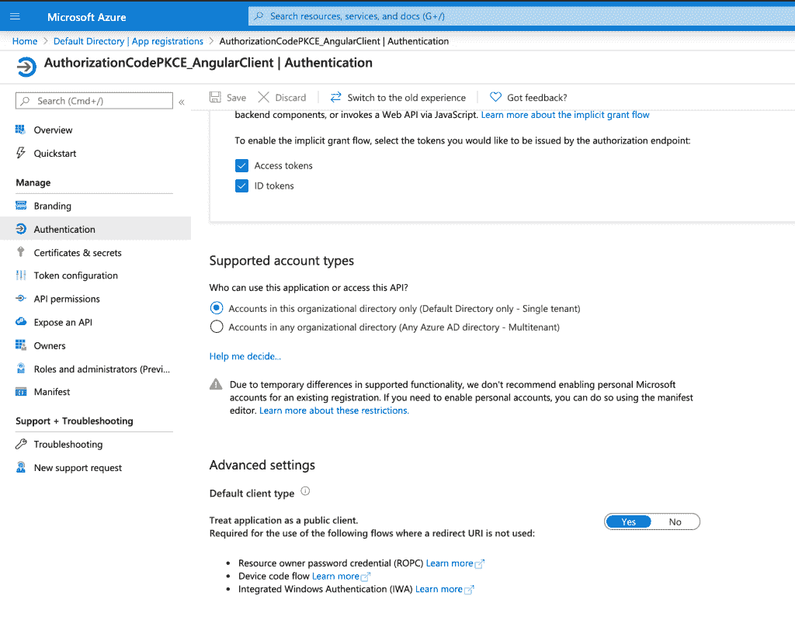
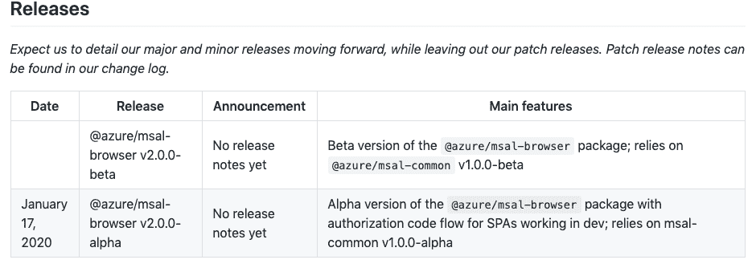

# 使用 oidc-client-js 和 Microsoft Identity Platform，通过 angular 中 PKCE 的授权码授权获得访问令牌。

> 原文：<https://levelup.gitconnected.com/obtain-access-token-via-authorization-code-grant-with-pkce-in-angular-using-oidc-client-js-and-d481873b5a8a>


Ashwini Chaudhary 在 [Unsplash](https://unsplash.com/s/photos/authorized?utm_source=unsplash&utm_medium=referral&utm_content=creditCopyText) 上拍摄的照片

最近，我了解到为什么[隐式流不安全，因为在浏览器](https://www.taithienbo.com/why-the-implicit-flow-is-no-longer-recommended-for-protecting-a-public-client/)中暴露了访问令牌。使用 PKCE 的授权码授予更安全，并且应该优先于隐式流来保护不能保证客户端秘密安全的公共应用。好消息是，如果你已经使用了 oidc-client-js，并通过隐式流从 azure ad 获得令牌，那么在 PKCE 中使用授权代码流所做的更改是最小的。在这篇文章中，我展示了你需要改变什么来使用授权码授予 PKCE。

有关代码参考，请在这里查看示例项目。

# 应用程序的变化

*   在您的 angular 应用程序中，将 oidc-client-js 的 response_type 设置为“code”。

```
{"client_id":"{replace with client id you register for your angular app in azure ad}",
   "authority":"https://login.microsoftonline.com/{replace with your tenant id}/v2.0/",
   "response_type":"code",
   "post_logout_redirect_uri":"http://localhost:4200/",
   "loadUserInfo":false,
   "redirect_uri":"http://localhost:4200/",
   "silent_redirect_uri":"http://localhost:4200/",
   "scope":"{replace with the scope you define in Expose API section of the app registration for your api in azure ad} openid profile"}
```

# azure 应用注册的变化

*   在您的 angular 应用程序注册清单中，将 **allowPublicClient** 设置为 **true** ，并将 **replyUrlsWithType** 部分下的 **type** 设置为 **Spa** 。

```
{
  "id": "...",
  "allowPublicClient": true,
  // .... "replyUrlsWithType": [
    {
      "url": "[http://localhost:4200](http://localhost:4200)",
      "type": "Spa"
    }
  ]
}
```

*   在**认证**下，**高级设置**，设置
    **将应用程序视为公共客户端**为**是**。



将应用程序设置为公共客户端，以通过 PKCE 使用授权码

就是这样。虽然变化很小，但我花了几个小时才意识到需要在清单文件中进行更改以启用授权。这可能是因为 PKCE 对授权流的支持还是新生事物。事实上，在撰写本文时，MSAL JavaScript 库刚刚发布了一个支持 PKCE 授权代码的 alpha 版本。



# 参考

[迁移 oidc-client-js 以使用 OpenID 连接授权代码流和 PKCE](https://www.scottbrady91.com/Angular/Migrating-oidc-client-js-to-use-the-OpenID-Connect-Authorization-Code-Flow-and-PKCE)

[用 PKCE 流程实现 OAuth 2.0 授权码](https://developer.okta.com/blog/2019/08/22/okta-authjs-pkce)

[隐性流量的弊端](https://tools.ietf.org/html/draft-ietf-oauth-browser-based-apps-04#section-9.8.6) [Msal-browser 发布](https://github.com/AzureAD/microsoft-authentication-library-for-js/tree/dev/lib/msal-browser#releases)

*原载于 2020 年 4 月 13 日 https://www.taithienbo.com**[*。*](https://www.taithienbo.com/obtain-access-token-via-authorization-code-grant-with-pkce-in-angular-using-oidc-client-js-and-microsoft-identity-platform/)*