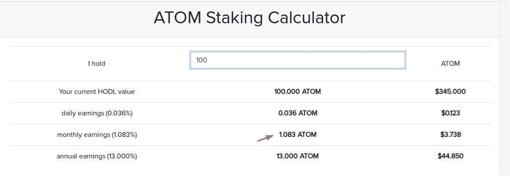
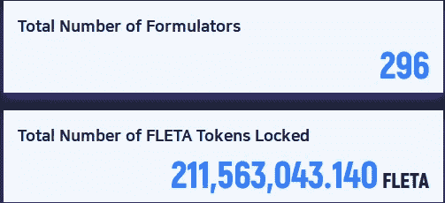

# 通过配方证明获得被动收入

> 原文：<https://levelup.gitconnected.com/obtaining-passive-income-via-proof-of-formulation-de6962e11c69>

## **果壳**

随着加密货币开始在世界范围内传播，它们的开采、赌注或利率和方法都会发生变化。加密货币爱好者都知道，第一种挖掘方法是中本聪开发的工作证明方法，目前仍用于许多项目。虽然是共识协议之首，但值得一提的是，这种挖掘的成本相当高。粗略来说，比特币挖矿目前的成本是全球每小时 40 万美元。这一巨大的能源消耗超过了世界上大多数国家一年的用电量。因此，从长远来看，比特币开采将是不可持续的。

因此，我们应该转向更重视环境或绿色能源的不同共识算法。虽然加密货币让我们的生活变得更容易，但考虑到它对环境造成的危害，它可能是相当有害的。

这就是为什么我们可以转向在**工作验证算法**之后开发的新算法，这些算法使用更少的能源，尊重环境，并利用它们赚钱。

其中一种方法是**工作证明**和**配方证明**。无论哪种方式，我们都可以通过生产更少的电力，以更有效的方式产生被动收入，而无需昂贵的 CPU 和 GPU。

## 获得被动收入

加密货币为我们提供了创造被动收入的新机会。就像银行用的计息方式，只是略有不同。你可以通过将你的硬币锁定在特定的平台上，以一定的比率来赚取每月的股份。为此，你不必在任何银行开立任何账户。你不必把你的账户，你有多少钱，以及你的凭证给第三方。

在加密货币的世界里，你可以获得匿名收入，而不必依赖银行和政府。在平台锁定一定数量的币后，可以做自己喜欢的工作，自己喜欢的爱好，还可以获得被动收入。

为此，重要的是你将投资哪个项目。投资于您可以预先投资的平台、团队、白皮书，您可以通过检查愿景来做出决定。

我要入股的项目是 [Fleta。](https://www.fleta.io/)

**那么这个 Fleta 是什么？**简单介绍一下:

Fleta 旨在建立一个区块链生态系统，旨在促进 dApps 的开发和运营，同样的目标是建立一个平台，如谷歌 Android 或苹果 IOS，并支持新的技术发展。特别是，这个伟大的平台将使以太坊和基于 EOS 的 dApps 更加独立和可扩展，旨在创建一个去中心化的经济。通过这种方式，生态系统中的气体和 ram 成本将会降低，并旨在建立一个成本更低的平台。

但是项目多我为什么要选择 Fleta 呢？最适合做桩子的项目之一是 COSMOS (Atom)。该项目在包括币安在内的几个交易所上市，并支持币安链的基础设施。它在全世界拥有成千上万的 PoS 用户。

但是，对于那些想要赚取被动收入的人来说，这就没有任何意义吗？因为下图所示的月回报，100 Atom 只有 1.08。所以当你锁定 100 个原子时，你每个月只能赚到 1.08 个原子。相当低的比率，不是吗？

让我们来谈谈**弗莱塔赌注奖励**。弗莱塔赌注奖励账户如下…

当您委托 **100 弗莱塔**时，您可以获得约**1.46**弗莱塔作为奖励，包括佣金(**月**)。但是，请注意，这只是一个估计数字；奖励的比例可以根据制定者和委托者的数量而改变。

Fleta 的奖励这么高的原因是什么？很简单，**先到先得**。Fletachain 成立于 2018 年，上个月已经转投 Mainnet。这就是他藏宝藏的原因。此外，获得专利的**配方验证方法大大降低了网络成本**。Fleta 团队自豪地与客户分享网络成本带来的利润。

当前的标桩数据可从以下网址获得:[https://f _ portal . fleta . io/](https://f_portal.fleta.io/)

该项目目前在 [GDAC](https://medium.com/fleta-first-chain/listing-announcement-fleta-on-gdac-39649da2f62e) 、 [Digifinex](https://medium.com/fleta-first-chain/listing-announcement-fleta-on-digifinex-global-bf21e69b483d) 和 [Bitsonic](https://medium.com/fleta-first-chain/listing-announcement-bitsonic-e3afbc481b5d) 上市。任何人都可以购买并使用上面的[门户链接](https://f_portal.fleta.io/)来参与 Fleta 的标桩过程。

此外，该项目于 8 月 11 日推出了自己的网络钱包。*手机钱包即将登陆 Android 和 IOS 平台。*

我还想提醒您，您可以通过这个钱包执行您的赌注交易和其他加密货币交易。

**来源**

https://www.fleta.io/

[https://medium . com/fleta-first-chain/fleta-wallet-has-be-discovered-db 74796 dbafe](https://medium.com/fleta-first-chain/fleta-wallet-has-been-unveiled-db74796dbafe)