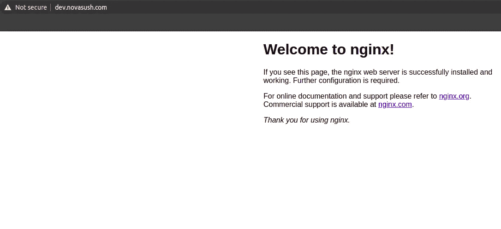
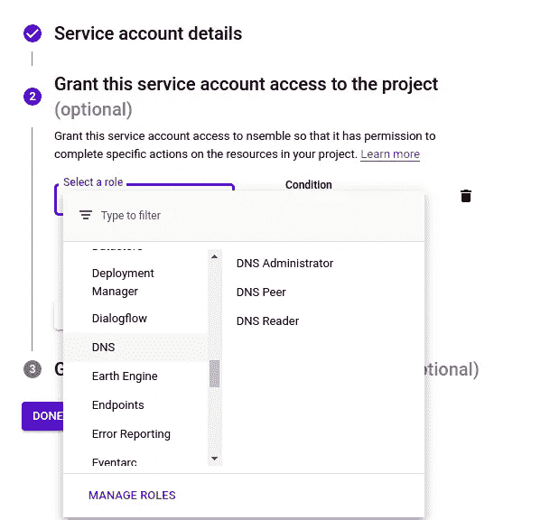
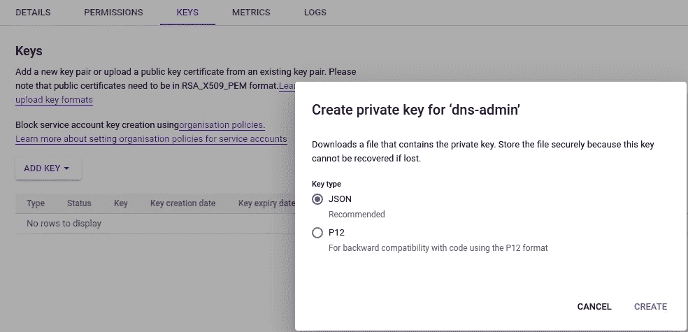
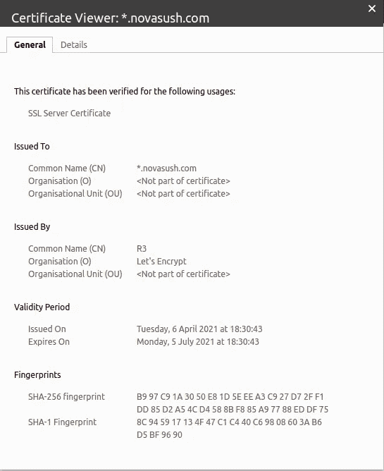

# 从“让我们加密”中获取通配符 SSL

> 原文：<https://levelup.gitconnected.com/obtaining-wildcard-ssl-from-lets-encrypt-fee9ea6ef2b3>


[Richy Great](https://unsplash.com/@richygreat?utm_source=medium&utm_medium=referral) 在 [Unsplash](https://unsplash.com?utm_source=medium&utm_medium=referral) 上的照片

**什么是 SSL 通配符证书？**
SSL 通配符证书是在域名字段中带有通配符(*)的单个证书。这允许证书保护同一个基本域的多个子域名(主机)。

例如，`*.xyz.com`的通配符证书可以用于`www.xyz.com`、`mail.xyz.com`、`docs.xyz.com`以及`xyz.com`中的任何附加子域名。

**我应该何时申请 SSL 通配符证书？**
在寻求保护多个子域时，应考虑使用 SSL 通配符证书，例如使用单个证书保护`test.xyz.com`、`www.xyz.com`和`mail.xyz.com`。

为 SSL 通配符证书输入的通用名称的格式将是`*.xyz.com`。

# 获得证书

我将使用 certbot 为我的子域`dev.novasush.com`获取一个通配符证书。我将在谷歌云平台上的一个虚拟机实例上快速启动一个 Nginx 服务器。获得的 SSL 将类似于`*.novasush.com`。

> 在继续下一步之前，确保您已经在 DNS 设置中创建了一个 **A** 记录。此外，这些步骤指的是基于 shell 的安装，如果您不想尝试基于非 shell 的安装，请遵循本指南。



正如我们在 HTTP 上运行 nginx 后在地址栏看到的`Not secure`。

> 通过检查我们文档中的[列表，检查 Certbot 是否支持您的 DNS 提供商。如果您的 DNS 提供商不在列表中，不要担心，我也写了手动安装的步骤。](https://certbot.eff.org/docs/using.html#dns-plugins)

**安装 snapd**
您需要安装 snapd，并确保按照任何说明启用经典 snap 支持。

**确保您的 snapd 版本是最新的**

```
sudo snap install core; sudo snap refresh core
```

**移除 certbot-auto 和任何 certbot 操作系统包**

```
sudo apt-get remove certbot
```

## **安装 certbot 和 certbot DNS 插件。**

```
sudo snap install --classic certbot && \
sudo ln -s /snap/bin/certbot /usr/bin/certbot
# Confirm plugin containment level
sudo snap set certbot trust-plugin-with-root=ok
```

安装 DNS 插件
我正在使用谷歌 DNS。

```
sudo snap install certbot-dns-google
```

## 设置凭据。

在上，GCP 转至导航栏> IAM >服务帐户

创建服务帐户，在角色中选择 DNS 管理员



certbot 使用的 DNS 管理服务帐户

单击您的密钥并转到密钥部分，然后单击添加密钥，然后从菜单中选择 JSON。在您的实例上复制该文件。



从菜单中选择 JSON

现在我们已经准备好了设置，只需运行 certbot 命令来为您的子域生成 SSL。

```
certbot certonly **\**
  --dns-google **\**
  --dns-google-credentials credentials.json **\**
  -d '*.novasush.com'
```

我已经将 credentials.json 复制到我机器的主目录中。

成功获得证书后，将它们安装在各自的应用服务器上，在本例中，我将其安装在 **nginx** 上。
要确认您的网站设置正确，请在浏览器中访问 https://yourwebsite.com，并在地址栏中查找锁图标。此外，单击锁图标以确认您收到了通配符 SSL。



如果您想在没有 DNS 插件的情况下手动获取，只需使用 certbot 命令添加`--manual`和`--preferred-challenges`标志，您还必须将 TXT 记录添加到您的 DNS 设置中进行验证。

```
sudo certbot certonly -d '*.yourdomain.com' --manual --preferred-challenges dns
```

在这个命令之后，它会要求你添加一个 TXT 记录。添加记录，然后等待更改传播。使用`nslookup`命令检查 TXT 记录是否已经设置。

```
nslookup -type=TXT _acme-challenge.yourdomain.com
```

certbot DNS-plugin 文档中提到了所有 DNS 提供者步骤。

## 参考

1.  https://certbot-dns-google.readthedocs.io/en/stable
2.  https://certbot.eff.org/docs/using.html#dns-plugins