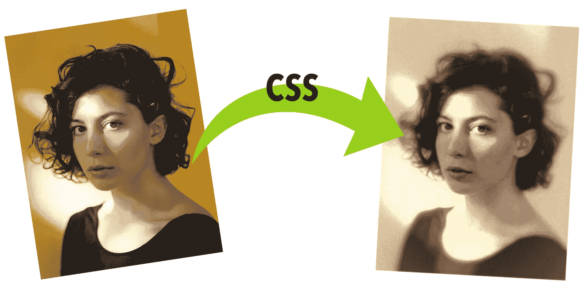
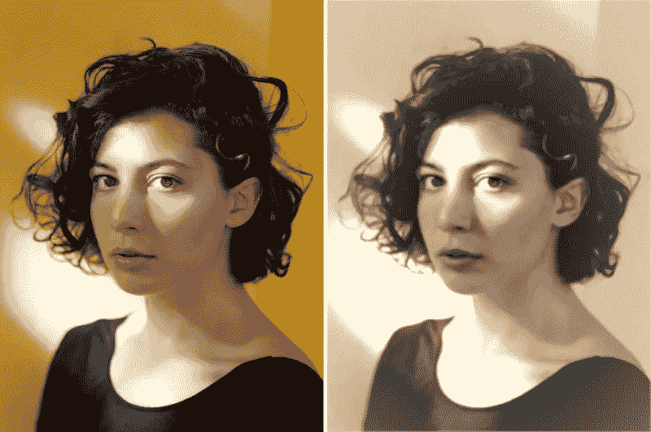
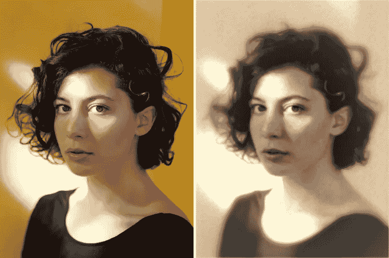
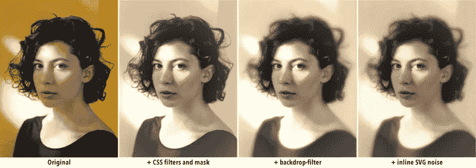
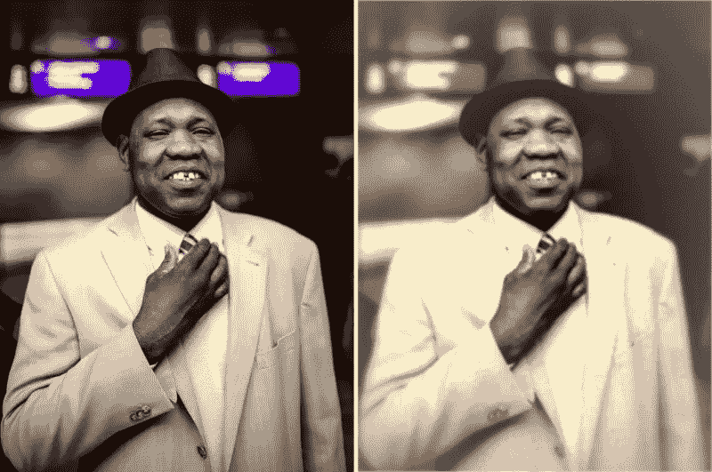
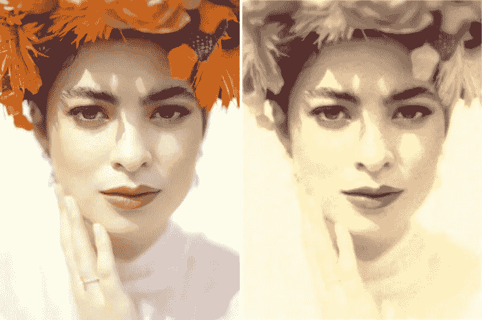
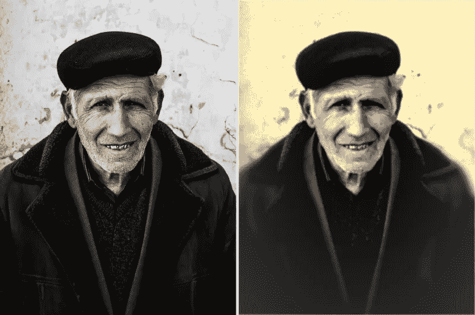
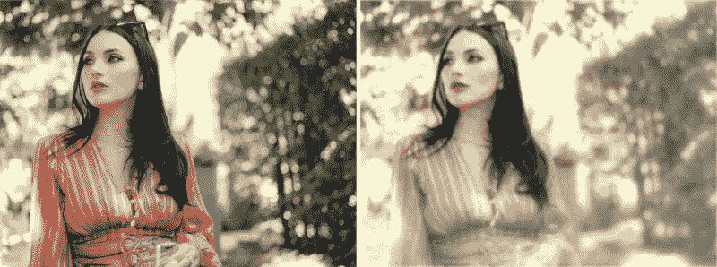
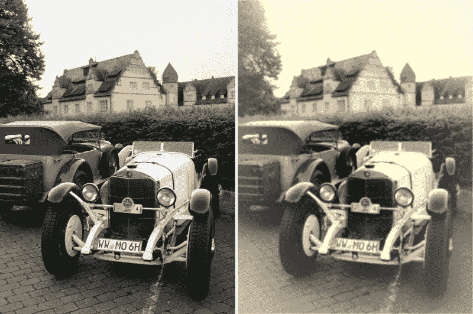

# 使用 CSS 的旧照片效果

> 原文：<https://levelup.gitconnected.com/old-photo-effect-with-css-54f5be9912b>

## 使用 CSS 创建老式照片的分步指南



本文将回顾如何只用 CSS 在任何图片上创建旧照片效果。不需要 Photoshop 或任何其他图像编辑器。所有这一切都只需要几行代码！

我们将检查建立在彼此之上的三种不同的方法，通过每次迭代增加旧照片的效果，使其看起来更真实和更好。

对于本页的例子，我们将使用 Filipp Romanovski 的照片。你可以在 Unsplash 上找到它，还有许多其他令人惊叹的图片(由菲利普和许多其他作者拍摄)。)

# 使用图像标签

创建旧照片效果的最基本方法是直接将滤镜应用到`[](https://developer.mozilla.org/en-US/docs/Web/HTML/Element/img)` [标签](https://developer.mozilla.org/en-US/docs/Web/HTML/Element/img)中的图像。这种方法很快，效果会很好，但是结果可能太基础了。

让我们从 HTML 中的一个图像开始:

```

```

然后我们将在 CSS 中应用一些[滤镜和一个简单的](https://developer.mozilla.org/en-US/docs/Web/CSS/filter)[蒙版](https://developer.mozilla.org/en-US/docs/Web/CSS/mask):

```
img {
  filter: grayscale(1) blur(1px) contrast(1.2) sepia(1);
  -webkit-mask: radial-gradient(#000, #0009);
}
```

让我们一个接一个地看看每个过滤器的作用:

*   `grayscale(1)`:将图片变成灰度。这会将一些区域混合成相似的灰色调，使图片失去一些细节。
*   `blur(1px)`:对图像应用高斯模糊。足以组合色彩区域，让画面失去更多细节。
*   `contrast(1.2)`:锐化图像。我们可以稍微调整一下这个值，使它符合我们的需要，并对每张图片进行个性化设置。但要注意:太高或太低，看起来都会很怪异。
*   `sepia(1)`:将颜色变为老照片的棕褐色。

此外，我们可以添加一个额外的`blur(0.5px)`(它不必是一个整数或大于 1)，使照片有点模糊，并完成过滤效果。但是不需要。

`-webkit-mask`多了一行。老照片看起来更集中在中心，但之后它们会退化，失去颜色，边缘变得有点模糊。我们可以通过在 CSS 中应用遮罩来实现这一点。[遗憾的是，](https://caniuse.com/?search=mask) `[mask](https://caniuse.com/?search=mask)` [并非所有浏览器都支持](https://caniuse.com/?search=mask)...幸运的是，供应商前缀是！所以我们可以使用`-webkit-mask`来应用同样的效果。

使用`-webkit-mask: radial-gradient(#000, #0009)`，我们告诉浏览器使图像的边缘半透明(通过在中心使用一个完全可见的椭圆，向外渐变)，因此图片将渐变并与背景融合。请注意，这可能会有不同的结果，取决于背景的颜色！

我们应用这四行 CSS 后，就达到了老照片的效果。以下是原始照片和最终照片的对比:



不错，但是我们可以更进一步。

# 添加伪元素

使用单个``标签的一个问题是，图像没有像`[::before](https://developer.mozilla.org/en-US/docs/Web/CSS/::before)`或`[::after](https://developer.mozilla.org/en-US/docs/Web/CSS/::after)`这样的伪元素，这限制了我们可以应用到元素上的效果。如果我们不使用``而是使用`<div>`并添加图像作为背景，我们可以对其伪元素应用滤镜和遮罩，并获得更精确的效果。

获得与``标签相似的结果很简单。HTML 应该是这样的:

```
<div class="old-style-photo demo-image"></div>
```

然后，在 CSS 中，我们将使用元素来显示旧式照片，就像上一节中一样。唯一的区别是，我们还需要设置图像的大小和背景:

```
/* specific to the demo image */
.demo-image {
  width: 45vw;
  aspect-ratio: 3/4;
  background: url(link-to-image.jpg);
  background-size: cover;
}

/* needed for the pseudo-elements and old-photo effect */
.old-style-photo {
  position: relative;
  filter: grayscale(1) blur(1px) contrast(1.2) sepia(1) blur(0.25px);
  -webkit-mask: radial-gradient(#000, #000a);
}
```

就这样，我们得到了与上一节相同的效果。我们将使用`::before`伪元素来模糊图像的边缘。老照片中常见的东西。为了实现这一点，我们将再次使用一个面具。另一个从中心到边缘的径向渐变，但这一次将是相反的方向:在中心隐藏，在末端可见。这样，我们可以在图像本身上应用一个`[backdrop-filter](https://developer.mozilla.org/en-US/docs/Web/CSS/backdrop-filter)` [效果](https://developer.mozilla.org/en-US/docs/Web/CSS/backdrop-filter)。

使用`backdrop-filter`，我们可以对元素后面的区域应用滤镜。因为中心是用蒙版裁剪的，所以滤镜不会应用于图像的中心，而只会应用于可见区域和蒙版的可见程度。例如，如果我们应用一个`blur()`背景滤镜，它在完全可见的边缘会比在部分可见的中间部分更模糊。

```
.old-style-photo::before {
  content: "";
  position: absolute;
  width: 100%;
  height: 100%;
  -webkit-mask: radial-gradient(farthest-side, #0000 30%, #000);
  backdrop-filter: blur(5px) sepia(90%);
}
```

生成的图像边缘更模糊，加上我们在混合中添加了更多的棕褐色(因此颜色组合得更多):


# 混合内嵌 SVG

有些人会叫屈，说这“不是一个纯粹的 CSS 解决方案”(我从未声称它是)，并认为这一节作弊。相反，我们将称之为“*利用 CSS 提供的所有特性*”，并在我们的书中称之为胜利。

是的，这是真的。这最后一步将包括一些 SVG。现实情况是 CSS 有过滤器，但是它们不像 SVG 中的过滤器那样多样或先进。幸运的是，我们可以以一种相对简单的方式将这两种技术结合起来。

一种选择是在 HTML 中有一些内联 SVG，并从我们的 CSS 中引用它。我们将使用的另一个选项是在 CSS 中直接内联 SVG(不在 HTML 端添加任何东西)。)这可以通过添加 SVG 作为背景，使用`[url()](https://developer.mozilla.org/en-US/docs/Web/CSS/url)` [功能](https://developer.mozilla.org/en-US/docs/Web/CSS/url)结合[数据 URIs](https://css-tricks.com/data-uris/) 来实现:

```
data:[<mime type>][;charset=<charset>][;base64],<encoded data>
```

在我们的例子中，我们甚至不需要进行 base64 编码。这是一个简单的 SVG，我们可以将它作为文本放在数据 URI 中:

```
<svg xmlns='http://www.w3.org/2000/svg' width='100' height='100'>
  <filter id='noise' x='0%' y='0%' width='100%' height='100%'>
    <feTurbulence baseFrequency='0.5' />
  </filter>
  <rect x='0' y='0' width='100%' height='100%' filter='url(#noise)' />
</svg>
```

我们唯一需要小心的是滤波器中的`#`。它需要进行 URL 编码，并用一个`%23`替换。然后我们将属性应用于`::after`伪元素:

```
.old-style-photo::after {
  content: "";
  position: absolute;
  width: 100%;
  height: 100%;
  opacity: 0.6;
  background:
    url("data:image/svg+xml;utf8,<svg xmlns='http://www.w3.org/2000/svg' width='100' height='100'><filter id='noise' x='0%' y='0%' width='100%' height='100%'><feTurbulence baseFrequency='0.5' /></filter><rect x='0' y='0' width='100%' height='100%' filter='url(%23noise)' /></svg>"), #f003;
  filter: grayscale(100%) contrast(150%);
  mix-blend-mode: darken;
}
```

噪波本身有不同的颜色，但现在它将是单色的，因为我们对父元素应用了一些颜色过滤器，这也会影响伪元素。不过，我们可以应用额外的过滤器(不需要)和混合模式，以更好地与原始图片混合。我强烈推荐使用`[mix-blend-mode](https://developer.mozilla.org/en-US/docs/Web/CSS/mix-blend-mode)`:`darken`和`multiply`的不同值来产生我们想要的效果(但也可以随意尝试其他值。)

结果是和以前一样的图像，但是我们有一个颗粒/噪声效果，增加了旧照片图像的真实感:



# 结论

在本文中，我们看到了如何一步一步地创建一个旧照片效果，只使用 CSS(和一个小的内联 SVG)而不求助于外部文件。所有代码都是独立的，可以在我们希望达到的级别上应用:



更改滤镜和蒙版中的值将生成完全不同的图像。请随意下载代码并在本地试用，或者在 CodePen 上玩这个演示:

# 更多示例

为了表明这种效果实际上在一般情况下有效，而不仅仅是演示图像特有的效果，我将它应用于另外几张图片([全部由 Filipp Romanovski 在 Unsplash](https://unsplash.com/@filipp_roman_photography) 上原创):



我们可以改变径向渐变的中心来聚焦于我们认为更重要的区域。例如，在这张照片中，渐变的中心更靠近脸部:



我喜欢用人物的照片来达到这种效果，但是没有人也可以。如果照片的主题是旧时代的物品，那就更好了:

