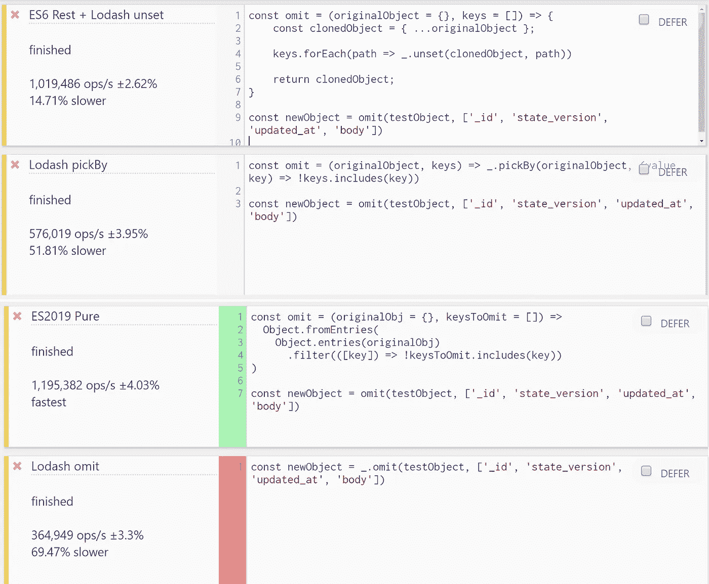
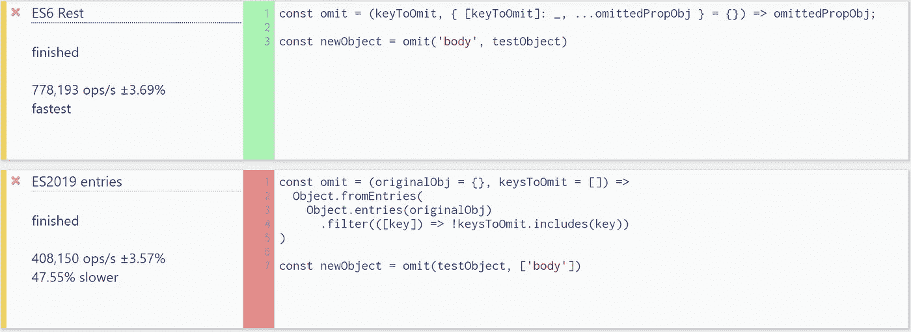
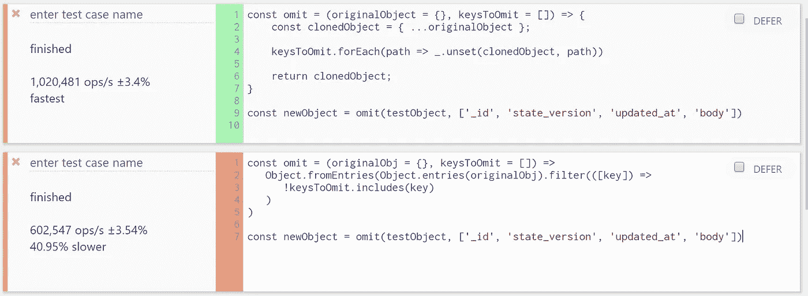
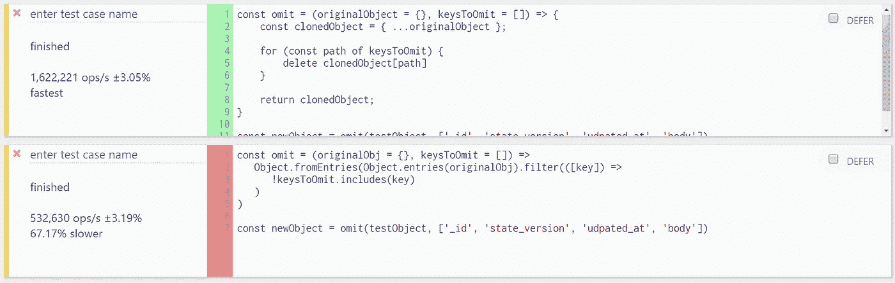
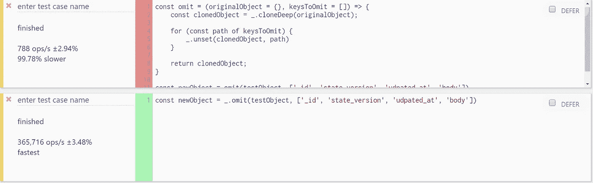

# Lodash 5 中删除了省略

> 原文：<https://levelup.gitconnected.com/omit-is-being-removed-in-lodash-5-c1db1de61eaf>

## 现在你可以使用一些替代方案来保持领先一步

***感谢[omit](https://medium.com/u/90ddf2f59e02#omit)函数。在本文中，我们来看看一些可以用来从对象中省略属性的替代方法。


[Jason Blackeye](https://unsplash.com/@jeisblack?utm_source=medium&utm_medium=referral) 在 [Unsplash](https://unsplash.com?utm_source=medium&utm_medium=referral) 上的照片

# 什么是 _。省略，我什么时候使用它？

`[Omit](https://lodash.com/docs/4.17.15#omit)`是一个函数，它接受一个`object`作为输入，以及一个或多个属性名，这些属性名将从该函数返回的结果新对象中删除。

Lodash 的省略函数的例子。请注意，原始对象不会改变。

## 在什么情况下我需要这样的功能？

这里列出的用例太多了，即使我知道所有的用例。但是我需要省略的一些原因是:

*   当一个 API 不需要，或者如果我包含了我的对象的所有属性，甚至可能会中断
*   当我插入一个数据库时，我希望数据库生成一个`ID`属性，但是它可能已经在代码中添加到我的对象中了
*   当我为了在 UI 上显示而添加属性，但想在提交给服务器之前再次删除它们时
*   当用户提交了一个对象，但我希望服务器端代码覆盖某些属性时

# 为什么会被删除？

诸如 [Semantic UI React](https://react.semantic-ui.com/) 和 [Victory](https://formidable.com/open-source/victory/) 之类的库注意到了由于使用 Lodash 的`omit`而导致的不良性能，其中 Semantic UI React 特别注意到在切换到原生替代品之后，UI 组件呈现时间大约有 **12，000 倍** **的改进**。

由于这些原因，作出了[设计决定](https://github.com/lodash/lodash/issues/2930#issuecomment-370295020)以完全移除该功能。

如果像我一样，您已经使用`omit`从现有对象创建了部分对象，请继续阅读，查看一些替代方案。

# 有哪些替代方案？

Lodash 的`[omit](https://lodash.com/docs/4.17.15#omit)`函数有很多替代方法，我将讨论使用不同 Lodash 函数的选项，以及一些本地替代方法。

## 本地替代品

第一个是 ES6 原生 JavaScript 函数，它使用[析构](https://developer.mozilla.org/en-US/docs/Web/JavaScript/Reference/Operators/Destructuring_assignment)来移除*单个*属性:

Lodash omit 的替代方法，它允许您忽略单个属性。

**注默认** `**{}**` **关于我们对象的论证。这是必要的，以防止错误，如果我们在这里传入未定义。**

接下来是一个*几乎*与 Lodash 的`omit`功能完全匹配的功能，因为它允许您指定任意数量的要删除的属性:

一个本机省略函数，允许您指定要省略的多个属性。

不幸的是，正如我们所见，`data.some`的“平坦路径”没有被移除，就像 Lodash 的`omit`一样。

最后一个本机替代方法也不支持省略展平路径，但它是省略多个顶级属性的最快方法。看起来是这样的:

仅在顶层支持省略多个属性

正如我们将在最新的基准测试中看到的，这是迄今为止省略多个顶级属性的最快方法。

## Lodash 替代品——仍然是平坦道路的王者

从上面我们可以看到，`data`子对象中的`some`属性没有被移除。这就是这些本地函数和 Lodash 的`omit`的区别。

> Lodash 虽然速度较慢，但允许为省略提供扁平的属性路径

但是，如果 Lodash 正在扼杀`omit`，我们如何仍然可以使用它来执行相同的功能？

根据[这个线程](https://github.com/lodash/lodash/issues/2930#issuecomment-272298477)，Lodash 的创建者 [jdalton](https://github.com/jdalton) 推荐使用`[pick](https://lodash.com/docs/4.17.15#pick)`或`[pickBy](https://lodash.com/docs/4.17.15#pickBy)`代替。他认为，指定一个你想保留的变量的白名单比把你不需要的变量列入黑名单更明确。因此对于`pick`，我们将使用以下内容:

**洛达什“挑选”**

使用“pick”来明确选择我们想要保留的属性，而不是扔掉我们不想要的属性。

这可能适用于小对象，或者当我们只想选择几个属性时，但是如果我们只想从一个大对象中省略一小部分属性，这可能会很麻烦。

让我们来看看如何使用 Lodash 的`pickBy`函数。

**洛达什“匹克比”**

使用 Lodash pickBy 省略多个路径，但不支持展平路径

上面已经成功地从我们的对象中移除了我们的`_id`属性，但是同样，这里不支持**而不是**展平的路径。

另一个选择是使用`ES6` `[rest](https://developer.mozilla.org/en-US/docs/Web/JavaScript/Reference/Functions/rest_parameters)`操作符克隆对象，并使用 Lodash `unset`来省略展平路径。这个方法的问题是我们不执行深度复制，所以当使用展平路径时，我们也会修改我们的原始对象。

**ES6“rest”、“forEach”和 Lodash“unset”**

使用 ES6 rest、forEach 和 Lodash 取消设置来省略多个展平路径

以上允许我们模仿`omit`的功能，**除了它修改你的原始对象，如果使用展平路径，**，即`data.some`。

我建议只使用它来删除非平坦路径。

**Lodash“cloneDeep”、“for… of”和 Lodash“unset”**

真正匹配 Lodash `omit's`功能的一个选项是使用对象自己的`cloneDeep`函数执行对象的深度克隆。正如我们将在下面看到的，这将大大降低函数的运行速度。此外，物体越大越复杂，速度越慢。

该函数如下所示:

允许省略展平路径，并且不修改我们的原始对象，但是太慢了(详见基准测试部分)

**复制 Lodash omit 的源代码**

如果我们需要省略展平路径*并且*不修改我们的原始对象，我们最后也是最好的选择是简单地复制 Lodash `omit`的[源代码](https://github.com/lodash/lodash/blob/npm/omit.js)。

# 基准—原始结果(已过时)

如果您要在大型对象上执行许多这样的操作，那么明智的做法可能是查看每种替代方法的执行情况。我使用 j [sbench.me](https://jsbench.me/) 和下面的大(> 100kb)对象比较了三个可以删除多个属性的函数:



我们提出的三个多属性省略函数与 Lodash 省略函数的性能比较

正如我们所见——正如我们所料——与`Lodash pickBy`选项相比，`ES2019 Pure`功能领先于其他功能，非常显著。

我们可以放弃`pickBy`选项，因为它太慢并且没有任何好处。

另一方面，`ES6 and Lodash unset`函数紧随其后，它允许使用指定平坦路径，如`data.some`。如果您需要该功能，可能值得考虑。

同样值得注意的是，`ES6 and Lodash unset`函数比`Lodash omit`快得多，这可能表明`Lodash omit`比我们的`unset`函数做得更多，或者它的实现不是最优的。

接下来，我将测试两个性能最好的函数，但是**不支持省略展平路径吗:**



ES6 Rest 单属性省略与支持多属性省略的 ES2019 函数省略单个属性

上面的结果表明，如果我们可能需要这个功能，保留我们的单属性省略`ES6 Rest`函数是值得的。

> Lodash 的`omit`函数允许我们指定`flattened paths`，而我们的本地替代函数不允许。如果需要此功能，请保留您自己的代码版本，但当您的键没有嵌套时，请使用本机版本。

# 新基准(2020 年 4 月 12 日)

在尝试了一些其他选项后，我再次运行了多次测试，结果表明`ES6 Rest + Lodash unset`选项比`pure ES2019`实现要快得多。

这再加上它允许您省略`flattened paths`的事实是一个巨大的惊喜，但是如果您不介意将`Lodash`导入到您的代码中，那么这个选项似乎是省略多个属性的好方法。

**更新:ES6 Rest + Lodash unset 如果与展平路径一起使用，将修改您的原始对象。我将把这些基准留在这里，但是要小心使用。如果您不想修改原始对象，请使用替代方法。**



# 新基准(2020 年 4 月 18 日)



ES2019 与 ES6 +删除多个属性



Lodsah cloneDeep + unset 对 Lodash 省略

# 总结(2020 年 4 月 12 日更新)

以下是我们调查结果的总结:

## ES6 休息

```
const omit = (keyToOmit, { [keyToOmit]: _, ...omittedPropObj } = {}) => omittedPropObj;**Fastest                 : YES
Omit single property    : YES
Omit multiple properties: NO
Omit flattened paths    : NO**
```

## ESRest + JavaScript 删除

```
const omit = (originalObject = {}, keysToOmit = []) => {  
    const clonedObject = { ...originalObject };                  for (const path of keysToOmit) {                
      delete clonedObject[path]       
    }               return clonedObject;
}**Fastest                 : YES, for multiple top level properties
Omit single property    : YES
Omit multiple properties: YES
Omit flattened paths    : NO**
```

## ES6 剩余+ Lodash 未设置

```
const omit = (originalObject = {}, keysToOmit = []) => {    
    const clonedObject = { ...originalObject };      

    for (const path of keysToOmit) {        
        _.unset(clonedObject, path)    
    }     

    return clonedObject;
}**Fastest                 : YES, for multiple properties
Omit single property    : YES
Omit multiple properties: YES
Omit flattened paths    : YES, but will modify ORIGINAL object**
```

## ES2019 来自条目+条目

```
const omit = (originalObj = {}, keysToOmit = []) =>          
   Object.fromEntries(Object.entries(originalObj).filter(([key]) => 
      !keysToOmit.includes(key)
   )
)**Fastest                 : NO, Slowest
Omit single property    : YES
Omit multiple properties: YES
Omit flattened paths    : NO**
```

## Lodash cloneDeep + Lodash unset

```
const omit = (originalObject = {}, keysToOmit = []) => {
   const clonedObject = _.cloneDeep(originalObject);     for (const path of keysToOmit) {       
        _.unset(clonedObject, path)    
    }         return clonedObject;
}**Fastest                 : NO, Extremely slow
Omit single property    : YES
Omit multiple properties: YES
Omit flattened paths    : YES**
```

我个人建议创建一个包含以下内容的实用程序类:

*   用于省略单个顶级属性的 ES6 Rest 函数
*   用于省略多个顶级属性的 ES6 Rest + Delete 函数

此外，如果您*需要*省略展平的路径，我建议要么只为`omit`功能安装 Lodash 4+,而为其他所有功能使用 Lodash 5+。

为读书欢呼。

抢劫

## 参考

1.  [https://lodash.com/docs/4.17.15#omit](https://lodash.com/docs/4.17.15#omit)
2.  [https://lodash.com/docs/4.17.15#pick](https://lodash.com/docs/4.17.15#pick)
3.  [https://lodash.com/docs/4.17.15#pickBy](https://lodash.com/docs/4.17.15#pickBy)
4.  [https://lodash.com/docs/4.17.15#unset](https://lodash.com/docs/4.17.15#unset)
5.  [https://codepen.io/travist/full/jrBjBz/](https://codepen.io/travist/full/jrBjBz/)
6.  [https://jsbench.me/](https://jsbench.me/)
7.  https://github.com/lodash/lodash/issues/2930
8.  [https://developer . Mozilla . org/en-US/docs/Web/JavaScript/Reference/Global _ Objects/Object/from entries](https://developer.mozilla.org/en-US/docs/Web/JavaScript/Reference/Global_Objects/Object/fromEntries)
9.  [https://developer . Mozilla . org/en-US/docs/Web/JavaScript/Reference/Global _ Objects/Object/entries](https://developer.mozilla.org/en-US/docs/Web/JavaScript/Reference/Global_Objects/Object/entries)
10.  [https://github.com/lodash/lodash/blob/npm/omit.js](https://github.com/lodash/lodash/blob/npm/omit.js)
11.  [语义 UI 反应](https://react.semantic-ui.com/)
12.  [胜利](https://formidable.com/open-source/victory/)