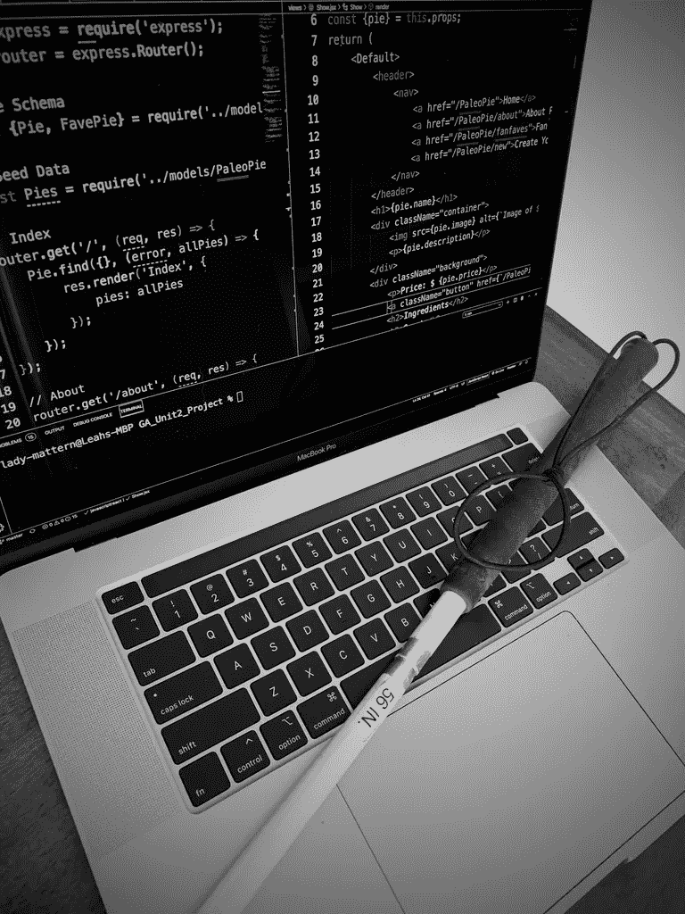
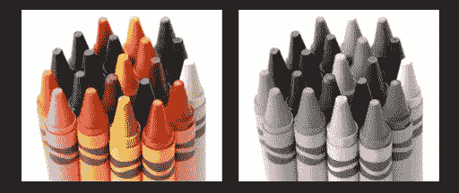
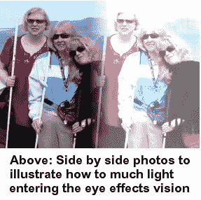
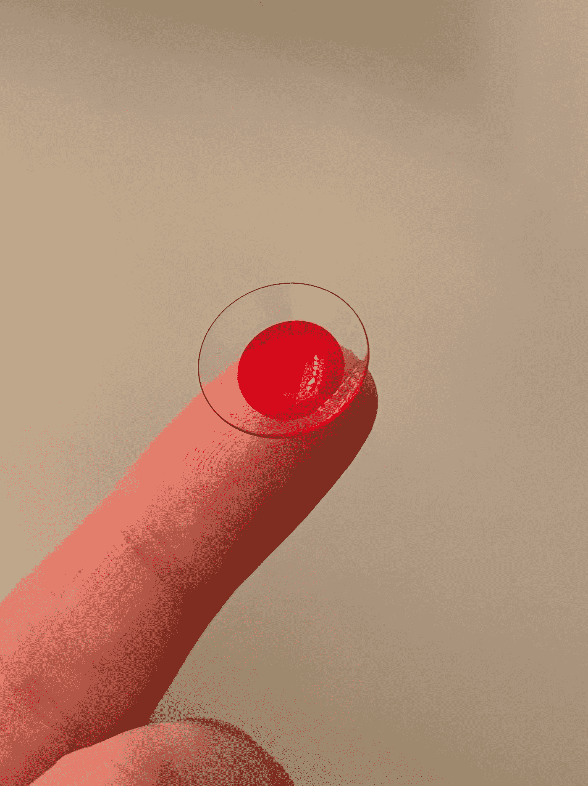
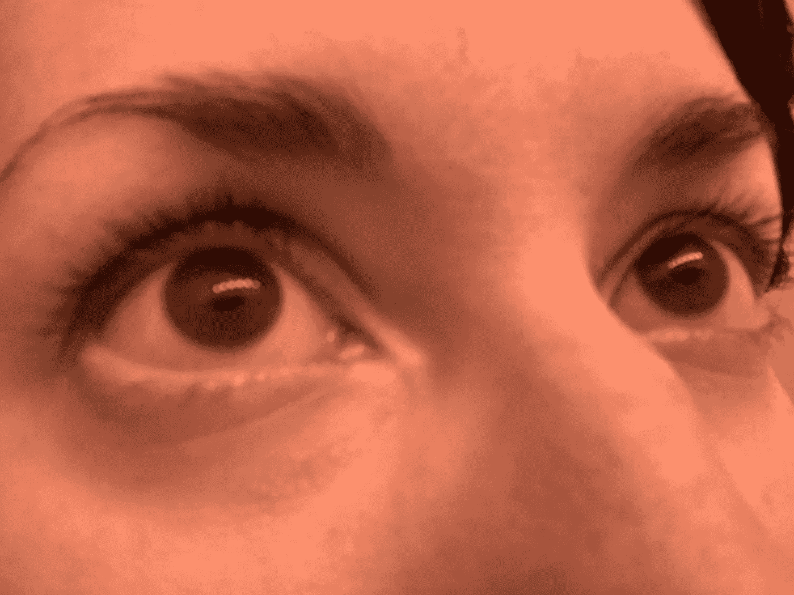

# 作为一个视障人学习编码

> 原文：<https://levelup.gitconnected.com/on-learning-to-code-as-a-visually-impaired-human-1e1ea5a56be4>

## 作为一个有视觉障碍的视觉学习者，参与到编码的视觉世界中是一种什么感觉。

你好，我叫莉亚。我是一名新兴的软件工程师，我生来就有中度的视力障碍，这使我双眼失明。这种情况称为 rod 单色性…

“罗德莫诺——什么？我看你没瞎！?"

好吧好吧。需要解释。rod 单色性是一种遗传疾病，大约每 30，000 人中有 1 人患病，并决定眼睛的身体发育。普通人拥有带视网膜的眼睛。视网膜是一个包含微小杆状细胞和视锥细胞的管道网络。当光线通过瞳孔进入眼睛时，它会撞击视网膜，视网膜杆细胞和视锥细胞将光线转化为脉冲，发送到大脑。患有视杆单色症的人发现自己没有工作视锥。因此，大脑没有接收到任何颜色脉冲，所以我们看到的世界是黑白的。

左边是正常色觉，右边是完全色盲。

花一点时间让自己稍微理解一下…

人体内的大多数东西都是作为一个系统的一部分来工作的。你的视网膜没什么不同。rod 单色仪仍然有工作棒，但这些棒对光非常敏感，仅在弱光情况下才能正常工作。没有了它们的伙伴，视锥细胞，视杆细胞接受了日常光线的全部冲击，但却无法处理它。太多的光通过，并对相关的人产生畏光的感觉。

不，这并不意味着 rod 单色仪害怕光。这意味着光伤害我们的眼睛。有点像当你头疼得厉害，眼睛受不了额外的光线时，或者说你在一个阳光明媚的日子滑雪，却没有戴太阳镜。这，加上 100，就是它的样子了。的。时间。加上一些散光、眼球震颤和 20/200 的视敏度，你会度过一段有趣的时光！

上面的图像没有完全做到这一点。如果我发现自己白天站在外面，没有隐形眼镜或太阳镜的帮助，这会导致身体疼痛，让我睁不开眼睛。我所看到的非常有限。几乎所有的东西都被完全漂白了。作为一个孩子，我的大部分记忆是由事件带来的听觉、身体和情感上的感受。视觉记忆从未真正存在过，所以它们不会转移。也就是说，由于极度的光敏性，我获得了一种像猫一样的夜视能力。一旦我的眼睛放松一点，我就是夜晚的女王！

作为一个生活在我称之为“盲孩地狱”的环境中长大的年轻人，我似乎只有两条路可走。各种专业人士向我提出的第一个选择，是向世界其他人展示我的盲目，告诉他们我是不同的，在某个时候可能需要帮助。我可以看到这背后的逻辑，所以这是我多年来选择的道路。这意味着改变我在公众面前展示自己的方式。例如，用一根白色的拐杖来步行导航，尽管事实上我能很好地看到某人的脸。

这是一次启发性的经历，让我学到了很多关于人性的东西。例如，人们想在没有我允许的情况下触摸我的次数比我希望的要多。有一次，当我在公共汽车站等车时，一个家伙和我搭讪，然后没有问我就抓住了我的手，因为它们“看起来很冷”。人们也可能非常可怕。有很多次，当我拄着白色拐杖过马路时，我会听到有人加速，然后在我旁边停下来，只是为了吓我一跳。有一次，我还被一个政府大楼的保安骂了一顿，因为他认为我是在装病。

这些以及更多的例子最终让我精疲力尽，最终我选择了第二条路。这可以说是我自己的一次尝试。我退出了视障人士的文化和社区，努力驾驭我实际拥有的视力。当然，仍然会有，而且永远会有尴尬的时刻；“嘿，你为什么拿着它离你的脸这么近？需要眼镜什么的吗？”或者“Leah，我需要你把所有这些文件放到绿色文件夹里。”，或者“嗨莉亚！看那边那个很酷的东西！”(通常指一只整洁的动物或任何我看不见的东西。)，但这是最酷的部分！

技术拯救世界！随着科技的飞速发展，越来越多的先进设备的出现使不同能力的人有可能做一些事情。不久前，我开始了进入编码世界的旅程。开始时，我怀疑自己是否能积极参与这样一个以视觉为导向的领域，但我发现了这么多好东西来帮助我征服世界！

一个红色隐形眼镜，那么多可能性。

我最喜欢的(也可能是最重要的)设备之一是红色镜片。通过这种红色过滤光线实际上帮助我更准确地感知颜色。我戴着一副中红色的隐形眼镜，它可以遮挡大部分光线，这在阅读明亮的电脑屏幕时可能是个问题。当阅读文本编辑器时，透镜也有帮助。我仍然在摆弄我的 Visual Studio 代码，以使它看起来恰到好处，但当我戴上隐形眼镜时，我可以更轻松地区分已用和未用的变量、JavaScript 关键字以及内外括号和圆括号。没有什么比试着调试代码却发现你的变量已经声明了却从未实现更让人沮丧的了……(嗯，好吧。也许还有那个丢失的分号，但希望你明白我的意思)。

在这里你可以看到我的一只棕色眼睛和一只红色隐形眼睛。暮色吞噬你的心。

在学习编码时，我的计算机软件和硬件也被证明是一些最具适应性和最方便的辅助设备！自从我今年通过多个训练营和其他在线编码课程将我的学习踢入超驱动，我已经改变了我的电脑桌面设置大概 435 次。目前的设置包括一台 2012 年末的 iMac，它坚忍地拒绝成为第三台显示器，我的 2019 年 MacBook Pro 支撑在笔记本电脑支架上，一台旧的 32 英寸电视安装在墙上。所有的大屏幕。全部都是。

现在，在我那些顽固的寡妇朋友们对我选择的操作系统发表评论之前，让我为自己辩护。自 90 年代以来，我一直使用 Windows 系统长大。成年后，我所有的工作都是在几乎只使用 Windows 系统的地方和州政府，所以我对这两种系统都有丰富的经验。我过去是一名音乐家和音乐教师，这让我转到了 Mac 端，从那以后，我还没有找到一个比 Leah 更友好的系统，而不需要安装额外的软件。(亲爱的 Linux。我不想把你排除在谈话之外，但是我们还没有见过面。很快……)

我所说的“利亚友好”是指:从我第一次启动任何新的 iMac 或 MacBook 技术的那一刻起，这台机器都需要一段时间向我介绍自己，让我熟悉非常有用的“语音”系统。它引导我完成设置，并确保我的设置符合我的要求。我可以完全控制我的辅助功能设置的配置，而无需安装任何额外的软件。我在任何系统上做的一些最有用的改变包括:切换到黑暗模式。(说真的，我很想见到负责如此崇高创作的人，代表我超负荷工作的棒棒们和他们握手。)把我的鼠标光标的大小改为“可笑的巨大”(从太空中可以认真地看到这个东西。)并开启控制/滚动功能，该功能允许用户放大光标所占据的屏幕部分。没错就是缺分号。你不能永远躲着。

我列出的修改只是我收集的定制中的一部分。他们确实帮助我把世界变得触手可及，让许多事情成为可能。也就是说，作为一名崭露头角的软件工程师，与技术打交道让我意识到，尽管我们取得了许多进步，但要让我们认为理所当然的视觉世界对像我这样没有“正常”视觉能力的人更加友好，我们还有很长的路要走。

正确的技术帮助我们、连接我们、教导我们。现在比以往任何时候，当我们发现自己处于一种彼此分离的状态，需要越来越依赖我们的计算机和应用程序时，向公众提供可访问的软件的需求是至关重要的。没有人应该被抛弃或孤立，因为他们没有被赋予主流能力。这个想法点燃了我心中的火。我希望善用我新发现的编码能力。学习如何开发高度可访问的软件已经成为我的使命。我相信这会让我把两条路合二为一。我可以和像我一样的人重新联系，也可以勇往直前，创造最好的应用程序和程序，在我们的人生旅途中帮助我们所有人。