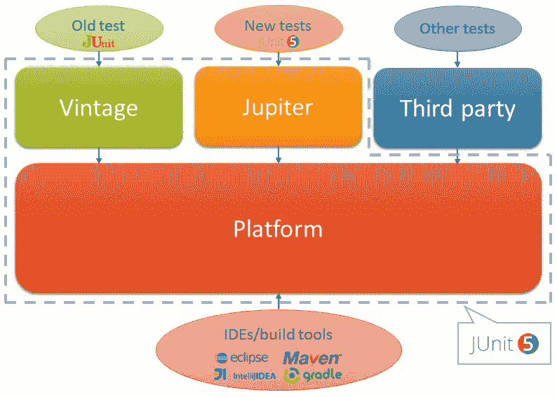
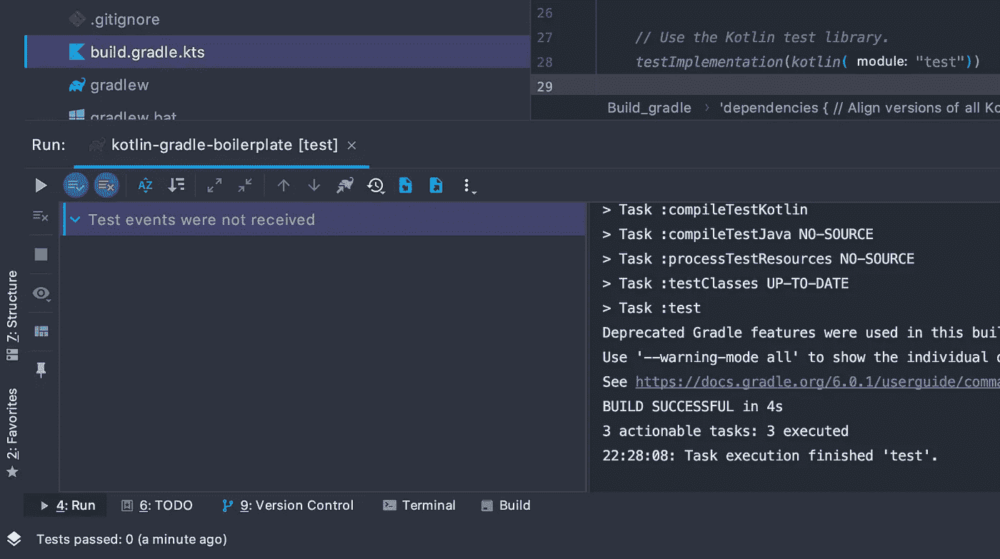

# 关于科特林的秘密

> 原文：<https://levelup.gitconnected.com/on-the-mysteries-of-kotlin-test-444cf094e69f>

## 我希望在使用 Gradle 在 Kotlin 中配置自动化测试时得到的答案

> 你听说过科特林初级读本吗？这是一个广泛的，实际操作和详细的 Kotlin 语言指南，充满了独特和原创的解释，互动练习，和基于经验的具体建议。它将在几天内把任何懂 Java 的人变成 Kotlin 专家。看看吧！

如果你曾经问过类似下面的问题，请继续阅读:

*   kotlin.test 和 KotlinTest(后来改名为 Kotest)有联系吗？
*   *gradle init* 生成的 *kotlin-test* 和 *kotlin-test-junit* 依赖关系是什么？
*   如何将 kotlin.test 从使用 JUnit4 切换到使用 JUnit5？所有这些`useJUnitPlatform()`废话是什么，更重要的是*为什么*有必要吗？
*   什么是 *junit.jupyter.engine* 和 *junit.jupyter.api* ？为什么我需要它们，什么时候需要它们，为什么我似乎只在某些时候需要它们？
*   为什么我在 IDEA 中总是收到“未收到测试事件”?为什么我有时在一次运行中得到测试结果，而在下一次运行中却得到“测试事件未被接收”？
*   为什么我从命令行运行测试时得不到任何测试结果，尽管我在 IDEA 中运行时得到了这些结果？

为了以令人满意的方式回答所有这些问题，我们将首先简要讨论一些将在整篇文章中提到的基本测试主题。在此之后，我们将消除一个误解，这可能是一个真正的初学者。

然后，我们将继续逐个模块地剖析 kotlin.test 库，并解释它们各自扮演的角色。然后，我们将继续详细了解为什么针对同一工具的不同版本的两个模块(JUnit4 和 JUnit5)需要非常不同的配置，并利用这一点来深入了解事情是如何工作的。

最后，我们将向您展示如何配置 Gradle 以在控制台中显示输出，并给出一个快速提示，告诉您在偶尔测试似乎无法运行时该做什么。


## 首先是一些基本的东西

在开始之前，我们需要澄清一些术语。我推荐阅读[这篇短文](https://amzotti.github.io/testing/2015/03/16/what-is-the-difference-between-a-test-runner-testing-framework-assertion-library-and-a-testing-plugin/)很好地介绍了这个话题，但是 TL；博士，重要的是要区分:

*   一个**测试框架** & **断言库**(可以是测试框架的一部分)，也就是给你提供 API(函数、注释等)的东西。)来编写实际的测试，并且
*   一个**测试运行程序**，它接受这些测试，运行它们，并收集结果，可能在此过程中生成各种报告或者提供额外的特性

另一个你需要熟悉的术语是 **JUnit** 。JUnit 是一个 Java 测试工具，它是测试工具集合的一部分，统称为 [XUnit](https://en.wikipedia.org/wiki/XUnit) ，它提供了上面描述的所有功能(即，它提供了测试框架、断言和测试运行程序)。

> 区分 JUnit4 和 JUnit5 很重要。JUnit5 在许多方面与 JUnit4 不同，但其中最关键的是它提供了一个平台，其他测试框架可以使用这个平台在 JVM 上运行测试。基本上，任何(基于 JVM 的)测试库都可以利用这一点，将运行测试的任务(测试运行器部分)委托给 JUnit，而不是自己实现。这样做的库的一个例子是[kotl test](https://github.com/kotlintest/kotlintest/tree/master/kotest-runner)。
> 
> 如果你有兴趣了解更多关于 JUnit5 架构的知识，Nicolai Parlog 为这个主题写了一篇优秀的文章。



感谢[用 JUnit 5 掌握软件测试](https://subscription.packtpub.com/book/web_development/9781787285736/2/ch02lvl1sec13/junit-5-architecture)

## kotlin.test vs. KotlinTest(现在称为 Kotest)

关于 [kotlin.test](https://kotlinlang.org/api/latest/kotlin.test/index.html) (也就是你将在 kotlin 参考资料中找到的库)要理解的第一件重要的事情是，据我所知，**它与库 [KotlinTest](https://github.com/kotlintest/kotlintest/blob/master/doc/reference.md) 完全没有关系。**

回想起来，这是相当明显的——例如，你可以从两个库完全不同的名称空间中清楚地看到它(*kot Lin . test*vs .*io . kot Lin test*，目前是 *io.kotest* )。但是，当我刚开始对 Kotlin 生态系统一无所知时，我被几乎相同的名称弄糊涂了，事实上，当谷歌搜索另一个时，一个总是会弹出来，而且 API 非常相似(具体来说，[应该在 kot Lin . test](https://kotlinlang.org/api/latest/kotlin.test/kotlin.test/should-be.html)vs .[应该在 KotlinTest](https://github.com/kotlintest/kotlintest/blob/master/kotest-assertions/src/commonMain/kotlin/io/kotest/should.kt) )。事实上，我几乎不好意思承认，过了多久我才意识到它们可能不是一回事(几个月)，尽管似乎我不是唯一一个犯类似错误的人。

> 自从这篇文章发表以来，KotlinTest 库已经被重新命名为 [Kotest](https://github.com/kotest/kotest) 正是因为这个原因。

kotlin.test 库基本上是 kotlin 语言的[部分(与 stdlib 或 reflect 的意义相同)，于 2015 年](https://github.com/JetBrains/kotlin/tree/master/libraries/kotlin.test)年底[问世，而 KotlinTest 是在](https://github.com/JetBrains/kotlin/commit/1867abbbe7208047c1b3a6bd4ce26351a1f67c2e#diff-2ec68e4ebc458887e2e8628997509d21)[大约一个月后](https://github.com/kotlintest/kotlintest/commits/master?after=b9f34bf596fa78128258c15b667876a524f92898+139&path%5B%5D=README.md)开始的，据我所知，它与 Jetbrains 没有任何关联(尽管另一个 Kotlin 测试库， [Spek](https://www.spekframework.org/) ，[确实来自 JetBrains](https://blog.jetbrains.com/kotlin/2014/02/speka-specification-framework/) )。

> 有趣的是，kotlin.test [的`*shouldBe*` API 似乎计划在 Kotlin 1.4](https://github.com/JetBrains/kotlin/blob/9b7e904390ce4eff2a96cc6b529e793fa4440b98/libraries/kotlin.test/jvm/src/main/kotlin/CollectionAssertions.kt#L11) 中完全移除。

## 了解 kotlin.test 中的模块

kotlin.test 的主要目的是为编写测试提供一个统一的 API，而不考虑使用的测试运行程序和断言库。这对于多平台项目尤其有用，因为它允许您使用针对 JVM 编写测试时使用的相同 API 来编写测试，例如 JavaScript。

这是通过将基本断言逻辑抽象到一个[断言器接口](https://kotlinlang.org/api/latest/kotlin.test/kotlin.test/-asserter/index.html)和[一些基本注释](https://kotlinlang.org/api/latest/kotlin.test/kotlin.test/index.html#annotations)(如`@Test`)中，然后为不同的测试框架/运行程序(如 JUnit 或 TestNG)提供实现来实现的。

`Asserter`接口和基本断言方法(如`assertSame()`)的定义在[*kotlin-test-common*](https://github.com/JetBrains/kotlin/tree/master/libraries/kotlin.test/common)中，而[*kotlin-test-annotations-common*](https://github.com/JetBrains/kotlin/tree/master/libraries/kotlin.test/annotations-common)中包含了基本注释。注释是用`expect`定义的，也就是说，它们实际上并没有在这里实现。

框架特定模块( *kotlin-test-junit* 等。)在相应测试框架的上下文中提供`Asserter`接口的实现，并提供注释的`actual`实现。

这就剩下了 [*kotlin-test*](https://github.com/JetBrains/kotlin/tree/master/libraries/kotlin.test/jvm) 模块。由于在 repo 中，它实际上是在 [*jvm* 文件夹](https://github.com/JetBrains/kotlin/tree/master/libraries/kotlin.test/jvm)下找到的(模块名`kotlin-test`作为[参数传递给编译器](https://github.com/JetBrains/kotlin/blob/master/libraries/kotlin.test/jvm/build.gradle#L58))，这引起了一点混乱。

这个模块包括[参考文献](https://kotlinlang.org/api/latest/kotlin.test/index.html)中提到的[默认声明者实现](https://github.com/JetBrains/kotlin/blob/master/libraries/kotlin.test/common/src/main/kotlin/kotlin/test/DefaultAsserter.kt)，据我所知，[它只在库](https://github.com/JetBrains/kotlin/search?q=DefaultAsserter&unscoped_q=DefaultAsserter)的内部测试中使用。除此之外，除了实现 JVM 框架特定模块使用的一些通用功能外，它真的没有做什么。它提供的许多功能都被标记为不推荐使用，或者计划删除，或者提供[二进制兼容性](https://zsmb.co/maintaining-compatibility-in-kotlin-libraries/)。

> 作为一个有趣的旁注，即使(从 Gradle 6.0.1 起) *gradle init* 包含了 *kotlin-test* 模块，您实际上并不需要这样做，因为所有特定于框架的模块都包含了它(参见[相应模块](https://github.com/JetBrains/kotlin/tree/master/libraries/kotlin.test)中的 build.gradle 文件)。

## kot Lin-test-JUnit vs . kot Lin-test-JUnit 5

[在 Gradle 6.0.1](https://medium.com/@gabrielshanahan/a-deep-dive-into-an-initial-kotlin-build-gradle-kts-8950b81b214) 下运行 *gradle init* 生成一个 *build.gradle* ，其中 *kotlin-test* 和 *kotlin-test-junit* 被包含为 [testImplementation 依赖项](https://docs.gradle.org/current/userguide/java_library_plugin.html#sec:java_library_configurations_graph)，它用 JUnit4 runner 设置 kotlin.test。可以在这里看一下稍微美化的代码[。](https://github.com/gabrielshanahan/kotlin-gradle-boilerplate/blob/after-initial-changes/build.gradle.kts)

如果您想切换到 JUnit5，这个过程并不像您想象的那么简单——仅仅将第二个依赖项更改为 *kotlin-test-junit5* 并不能解决问题，相反会导致 *test* 任务运行而不发生任何事情(在 IDEA 中，您会得到一个*Test events not received*消息)。



IDEA 中未收到的测试事件

在谷歌搜索一番后，你很可能会想出以下两步解决方案:

1.  将*org . JUnit . Jupiter:JUnit-Jupiter-API*和*org . JUnit . Jupiter:JUnit-Jupiter-engine*添加到依赖项中
2.  配置 Gradle 以使用 JUnit5:

```
*tasks* **{** *test* **{** useJUnitPlatform()
    **}
}**
```

但是为什么呢？当 JUnit4 开箱即用时，为什么还需要 JUnit5 的额外依赖项？当 JUnit4 开箱即用时，为什么您还需要 JUnit5 的额外配置？嗯，正如一篇文章所说的，“这是方式”，但这并不能真正让任何人满意。要回答这些问题，我们需要了解 JUnit4 和 JUnit5 在架构上的区别，并查看一下 *kotlin-test-junit* 和 *kotlin-test-junit5* 的 build.gradle 文件。

我们已经讨论了架构上的差异——基本上，JUnit4 是一个整体，所有的东西都包含在一个模块中，而 JUnit5 被分成多个子模块，其中的逻辑识别并运行测试(runner，在 JUnit 的说法中称为`TestEngine`)与允许你编写它们的 API(测试框架&断言库)是分离的。

这正是[这两个依赖项是什么](https://stackoverflow.com/a/48448462) : *jupiter-api* 给你编写测试所需的工具，而 *jupiter-engine* 允许你运行它们。这也解释了为什么前者包含在 [testImplementation](https://docs.gradle.org/current/userguide/java_library_plugin.html#sec:java_library_configurations_graph) 指令中，而后者包含在 [testRuntimeOnly](https://docs.gradle.org/current/userguide/java_library_plugin.html#sec:java_library_configurations_graph) 指令中。

> 如果你查看*kot Lin-test-junit5*的 [build.gradle 文件，你会看到 *jupiter-api* 依赖项也被包含在内(它必须被包含在内，否则 kotlin.test 无法将其注释/断言器接口映射到 JUnit 5 世界)，所以实际上，你真正需要包含的只是 *jupiter-engine* 依赖项。](https://github.com/JetBrains/kotlin/blob/master/libraries/kotlin.test/junit5/build.gradle)

从 JUnit 5.4 开始，[变得更加简单](https://stackoverflow.com/a/55084036)——只是[包含了新的*org . JUnit . Jupiter:JUnit-Jupiter*](https://github.com/junit-team/junit5-samples/blob/master/junit5-jupiter-starter-gradle/build.gradle)工件。就是这样。

那么，为什么 *kotlin-test-junit* 能够在没有任何额外依赖的情况下工作呢？答案就在它的 [build.gradle 文件](https://github.com/JetBrains/kotlin/blob/master/libraries/kotlin.test/junit/build.gradle)—*JUnit:JUnit*依赖项，包含了 JUnit4 的所有内容，被包含在其中，非常像 *jupiter-api* 。

总而言之——为了让 kotlin.test 正常工作，必须在依赖项中包含一个 runner。在 JUnit4 中，runner 与用于实际实现 *kotlin-test-junit* 的代码捆绑在一起，因此它被包含在 transit 中。在 JUnit5 中，它是解耦的，只有 API 是过渡性的，所以 runner 需要单独包含。

第二点，对`useJUnitPlatform()`的调用用于配置 Gradle 实际使用您决定使用的任何一个测试运行程序，无论是 JUnit4 ( `useJUnit()`)、JUnit5 ( `useJUnitPlatform()`)还是 TestNG ( `useTestNG()`)。

> 为了很好地展示 kotlin.test 的强大功能，您可以尝试从 JUnit 切换到 TestNG。只需将 *kotlin-test-junit* 的依赖关系更改为 *kotlin-test-testng* 并在配置块中调用`*useTestNG()*`就可以了。
> 
> 如果您随后查看依赖项，无论是通过[依赖项任务](https://docs.gradle.org/current/userguide/viewing_debugging_dependencies.html)，还是在[build . gradle 文件](https://github.com/JetBrains/kotlin/blob/master/libraries/kotlin.test/testng/build.gradle)，您都会看到 org.testng.testng 依赖项，它(类似于 JUnit)是一个包含 TestNG API 和 TestNG runner 的整体。

为什么 JUnit4 不需要任何额外的配置就可以工作？因为[如果没有指定，默认选择 JUnit 4](https://github.com/gradle/gradle/blob/master/subprojects/testing-jvm/src/main/java/org/gradle/api/tasks/testing/Test.java#L826-L828)。

## 配置控制台输出

即使在你完成了所有这些之后，你还会注意到最后一个奇怪的地方:虽然在 IDEA 中运行测试很好，但是如果你直接通过 Gradle Wrapper 运行任务(*)。/gradlew test* )，似乎什么都不会发生。实际发生的情况是测试运行了(您甚至可以在屏幕上看到一个快速的闪烁)，但是没有输出被发送到控制台。

要解决这个问题，请将 Gradle 配置为将测试事件记录到控制台:

```
*import* org.gradle.api.tasks.testing.logging.TestLogEvent*tasks* **{** *test* **{** testLogging **{** *events* = *setOf*(
                    TestLogEvent.STARTED,
                    TestLogEvent.PASSED,
                    TestLogEvent.FAILED
            ) *// show standard out and standard error of the test 
            // JVM(s) on the console
            showStandardStreams* = *true* **}
    }
}**
```

`TestLogEvent`是一个 enum(别忘了导入它)，所以如果你想记录所有事件，使用`events = TestLogEvent.values().toSet()`。

你还可以做更多的事情，[ukasz Wasylkowski](https://medium.com/u/c635d6fd0ed4?source=post_page-----444cf094e69f--------------------------------)写了[一篇优秀的文章](https://medium.com/@wasyl/pretty-tests-summary-in-gradle-744804dd676c)展示了这些可能性。这篇文章的目标是 Groovy，但是翻译起来应该不会太难。

> 查看 Gradle 手册中的这篇文章[以获得帮助，或者在评论中留言，我会尽力帮忙的。](https://guides.gradle.org/migrating-build-logic-from-groovy-to-kotlin/)

## 没有运行随机测试

有时，测试看起来不运行，即使你发誓它们刚刚运行过。

每当您连续多次运行*测试*任务，而没有首先对文件进行更改或运行*清理*任务时，这实际上会发生。这是有意义的——如果什么都没有改变，就不需要运行测试——但是如果你没有预料到这一点，在你弄清楚之前，它可能会令人困惑。


由杰夫·梅雷迪思提供