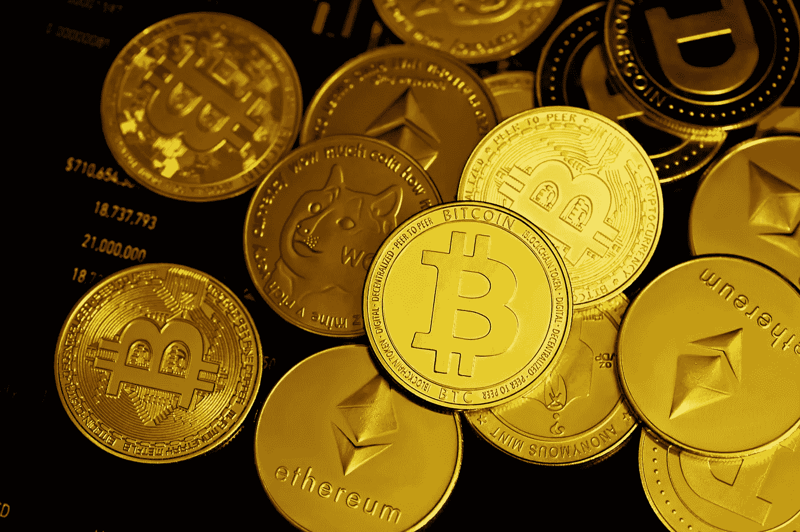
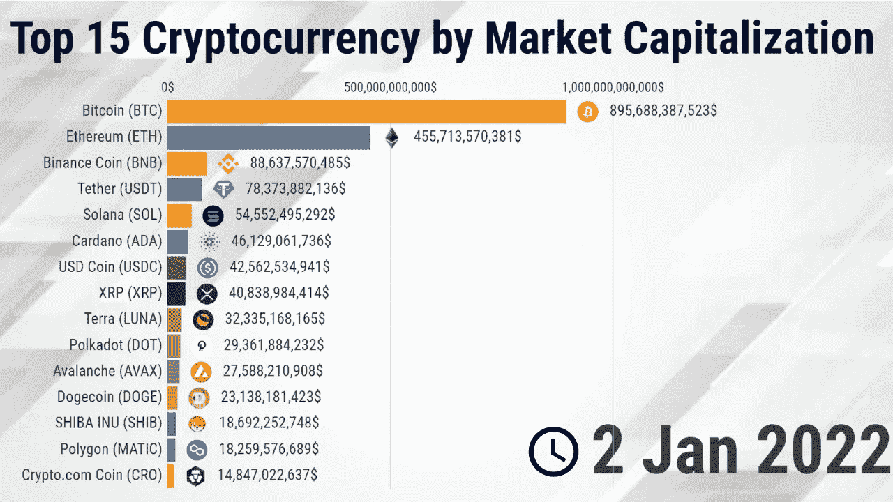
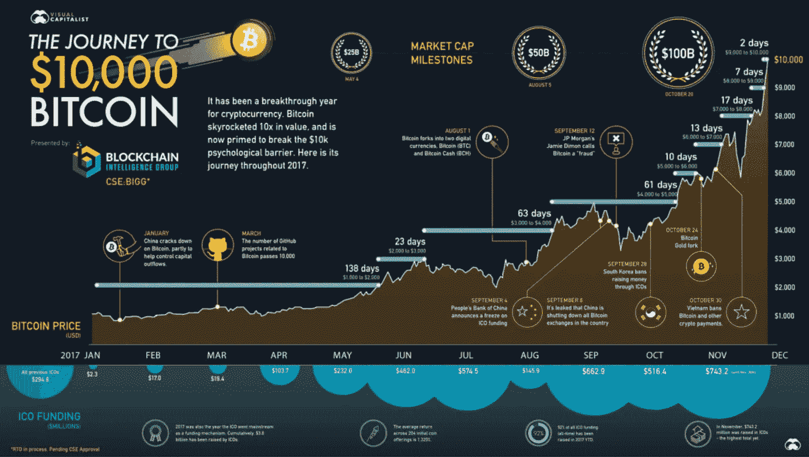
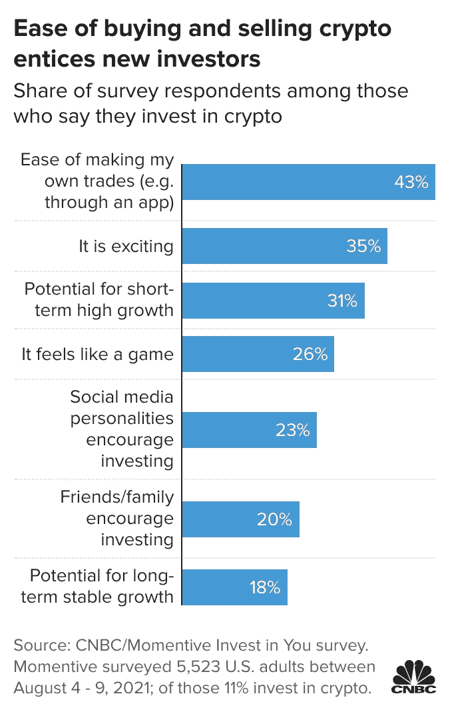

# 触礁:加密技术的冻结将如何影响投资者

> 原文：<https://levelup.gitconnected.com/on-the-rocks-how-a-freeze-in-crypto-will-affect-investors-1b0c14db0751>

加密货币市场正处于低谷，一些投资者会对此津津乐道，而另一些投资者会觉得难以承受。华尔街日报最近的一份报告称，加密技术的冻结可能会导致其在几天内暴跌 75%。

(图片来源:[统计&数据](https://statisticsanddata.org/data/top-10-cryptocurrency-2022-to-invest/))

虽然有些人欢迎这种下降，认为这是年终低迷的礼物，但对其他人来说，这并不完全是他们所希望的。

# 是什么导致了这种下降？

虽然比特币和其他加密货币的价格大幅上涨，但持有硬币的人损失的金额也在飙升。你可以把这归咎于比特币——随着比特币价值的上升，市场上其他所有东西的价格也会上升。当谈到所有类型的投资市场都存在的问题时，很难说接下来会发生什么。加密货币和其他金融工具的唯一区别是它们是去中心化的，这意味着它们没有像银行或政府那样的中央权威机构来监督它们，这意味着没有人知道事情何时何地会变得更糟(或更好)。

(图片来源:[视觉资本家](https://www.visualcapitalist.com/visualizing-journey-10000-bitcoin/))

[加密货币](/why-the-luna-crash-is-the-last-piece-of-news-that-the-cryptocurrency-market-needed-18c8f21a75e9)已经存在很长时间了，但今年是投资它们的人数增加的第一年。其原因与比特币的流行和移动技术有很大关系，移动技术使投资者能够跟踪市场。随着最新推出的 [5G](https://www.smartphonechecker.co.uk/phones/5g) 互联网，投资、跟踪和销售加密货币变得更加容易。考虑到[应用商店](https://www.makeuseof.com/tag/bitcoin-cryptocurrency-apps-iphone/)和 [Google Play](https://www.androidauthority.com/best-cryptocurrency-apps-for-android-581192/) 上有众多加密投资应用，现在使用加密只需不到 5 分钟。

随着越来越多的人参与到最初的加密货币中，可以理解的是，其他替代货币会对这种成功感到威胁。毕竟，以太坊和其他另类硬币的发展几乎完全是由一个人推动的:维塔利克·布特林。你可能知道，以太坊开发时可用的比特币数量有限，所以许多人开始投资比特币作为替代加密货币，并将投资转移到以太坊以增加其价值。

# 加密货币冻结

所有这些都被称为加密冻结。拥有一种不是由中央权威机构发行的数字货币的想法已经存在了几十年，并以许多不同的方式进行了尝试，但从未像神秘的中本聪开发的最初的加密货币那样成功。很多人实际上不知道为什么会发生这种情况，但有很多因素可以确定。比如大家都知道比特币的可扩展性问题，导致交易费用高，交易时间长。这意味着，如果没有对处理速度的某种限制，比特币交易所需的时间要比其他情况下长得多。许多人将比特币现金视为原始加密货币的替代品，这意味着他们正在投资一种与原始货币类似的数字货币，但解决了可扩展性问题。

[加密货币非常不稳定](https://www.gemini.com/cryptopedia/volatility-index-crypto-market-price)，这意味着它们价值的任何变化都会引起巨大的波动。与传统金融工具不同，加密货币不受任何政府或中央机构的监管。这意味着当事情出错时(像银行一样)，对于那些损失金钱的用户来说，没有像保险单这样的机制。虽然这让用户对自己的资金有了更多的控制权，但也增加了一层风险，因为一旦出现问题，没有人可以求助。

# 密码的未来

“加密崩溃”是预料之中的，加密领域的公司已经为此准备了相当长的时间。今年年初，比特币的价格一路飙升，创下历史新高。这一最新的牛市将许多新投资者引入了蓬勃发展的加密货币市场，并引起了主流投资媒体的更多关注。

随着所有加密货币的总市值超过 2.1 万亿美元，更不用说人们可以相对容易地进入这些市场，很明显许多人已经错过了。好消息是，随着时间的推移，越来越多的人熟悉比特币和其他加密货币的工作方式，价格肯定会上涨。

(图片来源:[美国消费者新闻与商业频道](https://www.cnbc.com/2021/08/24/1-in-10-people-invest-in-cryptocurrencies-many-for-ease-of-trading.html))

自然地，随着加密交换的流行，加密社区也在增长。这些平台的增长导致了几乎所有上市硬币的交易量增加，也增加了投资者和企业家对加密货币游戏的兴趣。

这是件好事。让更多的人参与加密货币市场意味着花更多的钱，这使得价格上涨。问题是，并不是每个人都知道如何投资 crypto，这导致了一些问题。

大多数人都希望从上涨中获利。这听起来可能很简单，但一些投资者将进入 crypto，期望在他们真正“大赚一笔”或开始使用这些硬币进行真实世界的购买之前，通过投资新硬币来赚钱。这是一个错误，如果他们没有意识到潜在的陷阱，可能会很快导致亏损。问题是，这些投资者中的大多数并不了解加密货币所包含的[风险。虽然许多人确实通过投资加密货币赚了很多钱，并在市场还年轻的时候介入市场，但这些投资确实存在风险。](https://www.keystonelaw.com/keynotes/what-are-the-risks-and-rewards-of-investing-in-cryptocurrency#:~:text=There%20has%20been%20a%20significant,transmission%20of%20funds%2C%20and%20more.)