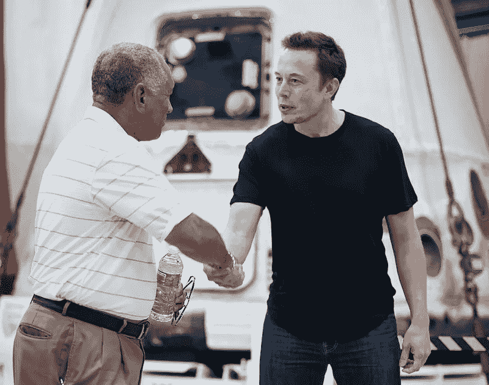
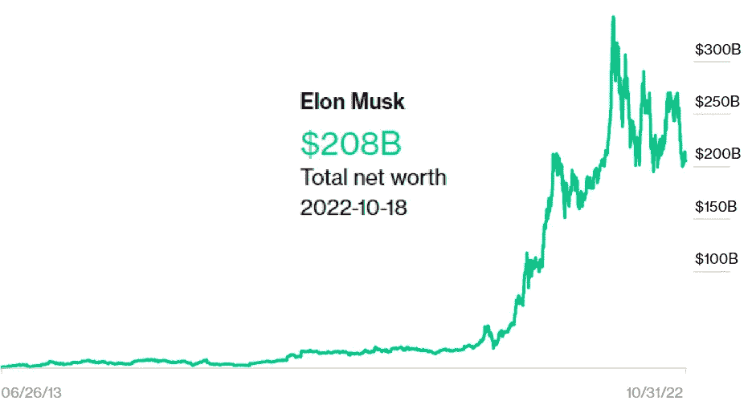

# 一代商人中有一次会说——‘奥卡姆剃刀’会告诉你哪种加密货币会成功

> 原文：<https://levelup.gitconnected.com/once-in-a-generation-businessman-says-occams-razor-will-tell-which-cryptocurrency-will-be-afba3be52d53>

最直接、最讽刺的结果是最有可能的。

来源— [公共领域图像](https://en.wikipedia.org/wiki/Elon_Musk#/media/File:Charles_Bolden_congratulates_SpaceX_CEO_and_Chief_Designer_Elon_Musk_in_front_of_the_historic_Dragon_capsule.jpg)

埃隆·马斯克的财富在一年内从 T2 的 350 亿美元增加到 2000 亿美元。

他的家庭从来不缺钱，所以这不是一个白手起家的故事。这更像是一个富人到肮脏的富人的故事。

马斯克的父亲[埃罗尔·马斯克](https://en.wikipedia.org/wiki/Errol_Musk)，是一名南非工程师、飞行员，也是赞比亚[翡翠矿的一半所有者。](https://en.wikipedia.org/wiki/Zambian)

你不能从马斯克的成功中拿走任何东西——毕竟，他父亲非常富有不是他的错。

马斯克加班加点工作的能力是无与伦比的，有时还会因为他在 Twitter 上的滑稽举动而消失。

所以这位有史以来最杰出的企业家决定，去他妈的，我要买这家社交媒体巨头。

这项收购带来了争议，马斯克对争吵并不陌生。

在与 Twitter 员工召开市政厅电话会议后，马斯克表示，应该允许用户在 Twitter 上发表自己喜欢的言论。

然后，他解雇了 122 名 Twitter 员工，包括整个董事会，使他成为 Twitter 的唯一董事。

在最近收购 Twitter 之前，马斯克的犯罪记录比你的胳膊还长。

*   2018 年，他被美国证交会起诉，在推特上说，他已经为私人收购特斯拉获得了资金——美国证交会称此举具有误导性。他在从未承认有罪的情况下与 SEC 达成和解，并暂时辞去了特斯拉董事长一职。
*   2018 年马斯克出现在[*The Joe Rogan Experience*](https://en.wikipedia.org/wiki/The_Joe_Rogan_Experience)播客上；采访时，他吸了一口大麻雪茄。特斯拉的股票暴跌，导致他的副总裁离开公司，Space X 几乎失去了他们的政府合同。
*   2020 年，马斯克在疫情期间发布了关于新冠肺炎的不科学且有争议的言论，将其比作普通感冒。
*   经济学家努里埃尔·鲁比尼指责马斯克及其称赞 Dogecoin 的推文纯粹是市场操纵。
*   凯西·强生在曼哈顿的一家联邦法院提起诉讼，指控马斯克的公司特斯拉公司和 SpaceX 公司敲诈勒索，兜售 Dogecoin 并抬高其价格。他要求赔偿荒谬的 2580 亿美元。

马斯克经常因为发一些不该发的微博而陷入困境，但这并没有影响他的净资产，他的净资产已经飙升至 2080 亿美元。

来源— [埃隆·马斯克](https://www.celebritynetworth.com/richest-businessmen/ceos/elon-musk-net-worth/)

# 最直接、最讽刺的结果是最有可能的。

马斯克公开支持 Dogecoin，这是比特币的第二大工作证明协议，他在其中也有相当大的股份。

Dogecoin 是一个支付系统软件工程师创造出来的“笑话”，取笑加密货币中的疯狂投机。

Dogecoin 被认为是第一枚“[迷因币](https://en.wikipedia.org/wiki/Meme_coin)”，更确切地说，是第一枚“狗币”。

尽管硬币周围充满讽刺，但由于马斯克等公认的商界人士给予了皇家认可，许多人现在认为这是一个合理的投资前景。

马斯克公开表示，你应该决定你认为可行的加密货币投资，如果你使用奥卡姆剃刀原理，这很容易做到。

# **奥卡姆剃刀**

奥卡姆剃刀原则是说，在有不同解释的情况下，你应该选择最直接的答案，因为它最有可能是正确的。

当我们有不止一种解释时，我们应该选择假设最少的那个，因为那个选项最有可能是正确的。

奥卡姆剃刀理论认为，去除不必要的信息是获得真相的最快途径，或者是试图理解某件事情的最佳解释。

当你听到外面柏油路上的马蹄声时，你会马上想到马，而不是斑马。

医学检查人员使用这种技术来寻找最简单的诊断来解释病人的症状。

当我们做决定时，我们经常把事情复杂化，因为我们的大脑内部发生了很多事情，我们对决策的控制比我们认为的要少。

埃隆马斯克(Elon Musk)认为，具有讽刺意味的加密货币 Dogecoin (DOGE)可能会成为最突出的数字货币。这是在一次与杰克·多西和凯茜·伍德的小组访谈中。

马斯克说，这是你应该如何使用逻辑做出任何决定。

马斯克在 Doge 和以太坊拥有巨大的头寸，最明显的是在比特币。

马斯克解释了奥卡姆剃刀的传统理论，并将其与 Dogecoin 联系起来。

> 埃隆·马斯克:
> 
> “最简单、最讽刺的解释是最可能的解释。你可以看到未来 Dogecoin 作为一个笑话被创造出来，最终成为世界领先的加密货币。
> 
> 未来应该会有繁荣的比特币、以太、Dogecoin，这些都会增加个人相对于政府的权力”。

马斯克认为 Dogecoin 的块大小和能力是相对于比特币的一个实用优势，因为它允许更快的交易速度。

马斯克承认，随着闪电网络[的出现，比特币即将解决这个问题。](https://cryptopotato.com/what-is-lightning-network-beginners-guide/)

# 最后的想法

我对 Dogecoin 没兴趣。

当你听马斯克用简单的逻辑来做商业决策时，他的成功就不足为奇了。

不要扼杀其他想法，用逻辑来解释为什么某件事可能是或可能不是一个好主意会有所帮助。

从阅读数据来看，比特币是人类历史上发展最快的技术，也是过去十年中表现最好的资产，合乎逻辑的是，我认为这不会倒退或归零。

从逻辑上讲，从长远来看，我们正变得越来越身临其境。我相信数字资产会增值，而不是贬值。

同样很有可能的是，一种旨在作为笑话来嘲笑该行业投机性质的加密货币将获得越来越多的采用，并成为该领域的领导者之一。

Dogecoin 市值排名第六，因此这绝非不可想象。

> *如果你想在 Web3 上阅读更多我的观点，考虑成为会员吧。你的会员费直接支持你读的作家。如果你用我的链接* [*注册，我会赚一小笔佣金。点击这里*](https://medium.com/@jayden_levitt/membership) *。*

*本文仅供参考；不应将其视为财务、税务或法律建议。在做出任何重大财务决定之前，请咨询财务专家。*