# OnCollisionEnter 与 OnTriggerEnter 以及何时使用它们

> 原文：<https://levelup.gitconnected.com/oncollisionenter-vs-ontriggerenter-and-when-to-use-them-c62d2ceabcbd>

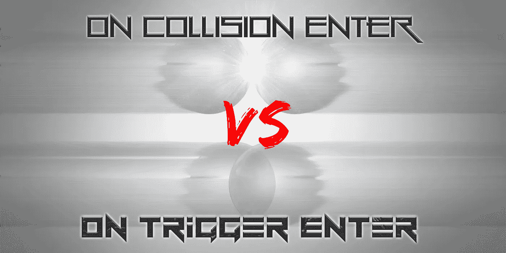

OnCollisionEnter 将会像它听起来那样被使用…带着冲撞！当我想到碰撞时，我首先想到的是**硬表面碰撞**，这正是 OnCollisionEnter 所指的。汽车碰撞、球反弹和树倒下都是硬表面碰撞的例子！我将在本文中介绍一些不同版本的 OnCollision。首先，碰撞的**进入**方面可以在下面的文档中看到。基本上，**碰撞事件**发生在一个物体**接触另一个物体**的瞬间**。当这种情况发生时，关于碰撞的**信息**就在我们的指尖，可以**访问**。如下所述，**一个**物体绝对碰撞**需要**有一个**刚体连接**才能工作。**

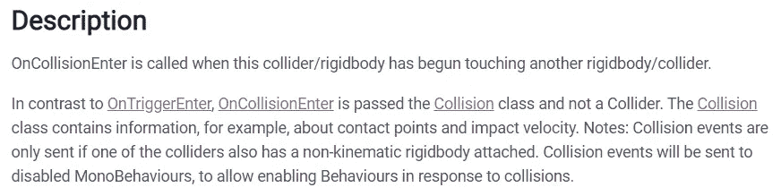

如下文所述，只要对象**相互接触**，则**oncolissionstay**方法对**有效。这可能就像当一个球停止反弹，停在地板上。还要注意的是，在进行接触时，每帧**调用一次 Stay 方法**。**

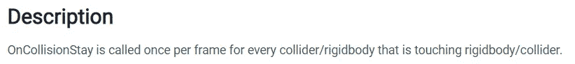

一旦对象**停止**接触，调用**oncolissionexit**方法关闭对象交互。

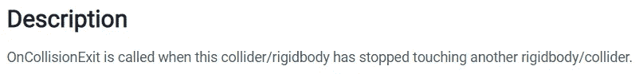

**触发**碰撞是**通过**碰撞，此时物体**不会相互弹开**，但是当**接触**时**事件**可以被**触发**。我在我的子弹和敌人的碰撞中使用这个，这样子弹就不会被敌人弹开而消失。相反，它似乎被吸收了，然后就消失了。碰撞**信息**也可用于触发事件。就像 OnCollisionEnter 一样，OnTriggerEnter get 被称为对象碰撞的时刻。

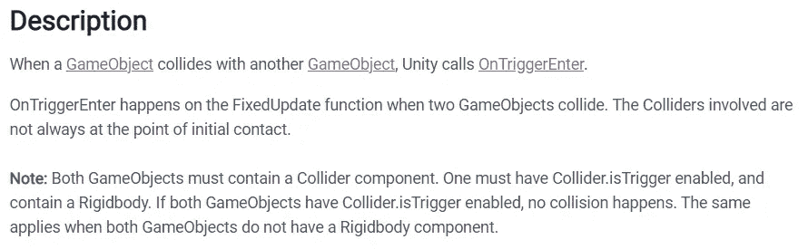

注意**是触发器**选项需要在上切换**以将其用作触发器。**

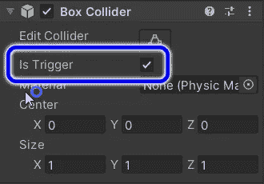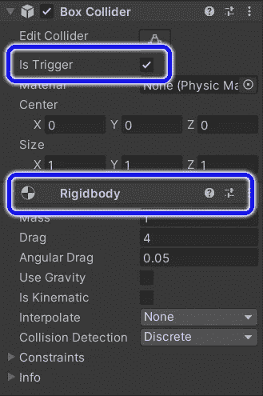

玩家盒子碰撞器(左)。敌箱碰撞器和刚体(右)。

**OnTriggerStay** 方法的工作原理类似于 OnCollisionStay，只是这些物体可以通过彼此自由移动**，然后 **Stay** 方法**继续**触发**，同时**物体碰撞器**接触**。**

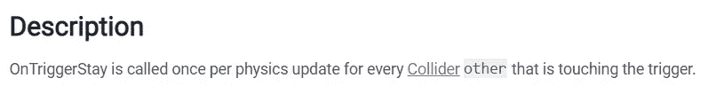

如果你已经注意到这里的一个主题，那就是 **OnTriggerExit** 方法的工作方式类似于 OnCollisionExit，当游戏对象**停止接触**时**触发**。

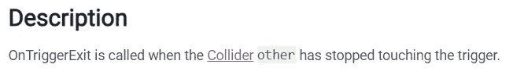

在我的敌人脚本中，我使用 OnTriggerEnter 来收集一些信息。我用**调试。日志**告诉我与我相撞的**其他**物体的**名称**。

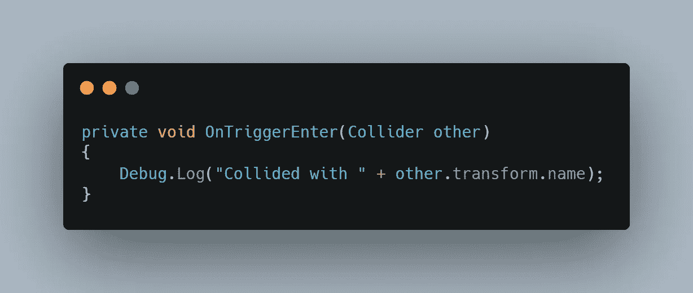

我运行了一个小的**测试**让一个敌人打**玩家**，用**子弹**射击另一个。您可以在下面控制台上看到冲突信息。

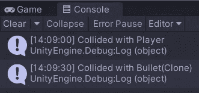

更进一步，我要求被碰撞物体的**名称**和**位置**。

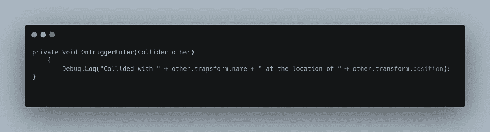

这里可以看到，与敌人碰撞的**其他**物体的**名称**和**位置**以(x，y，z)的形式打印到控制台上！

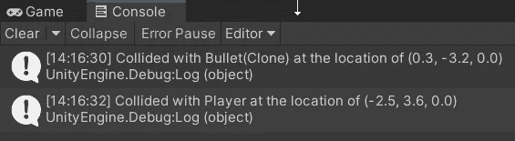

显而易见，所有这些碰撞选项都可以用于一些高级的游戏机制。即使只是一次小小的碰撞，也有很多机会获取信息并采取行动！
说到**碰撞**可能产生的**动作**，我将在下一篇文章中开始使用 **GetComponent** 进行脚本通信，在那里这些碰撞可以开始触发一些更有意义的交互。