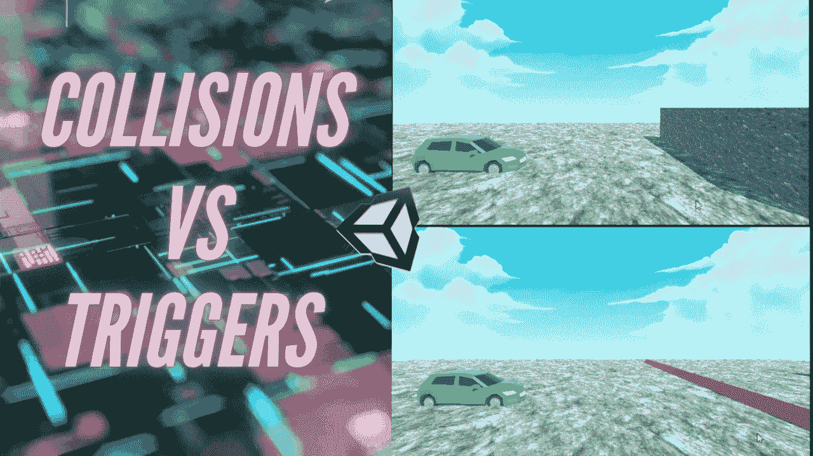
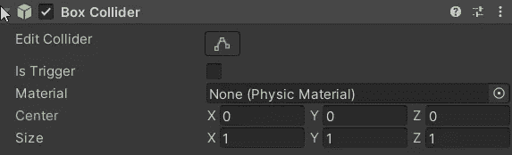
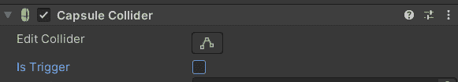
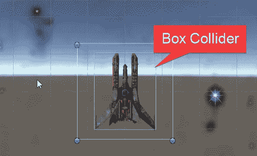
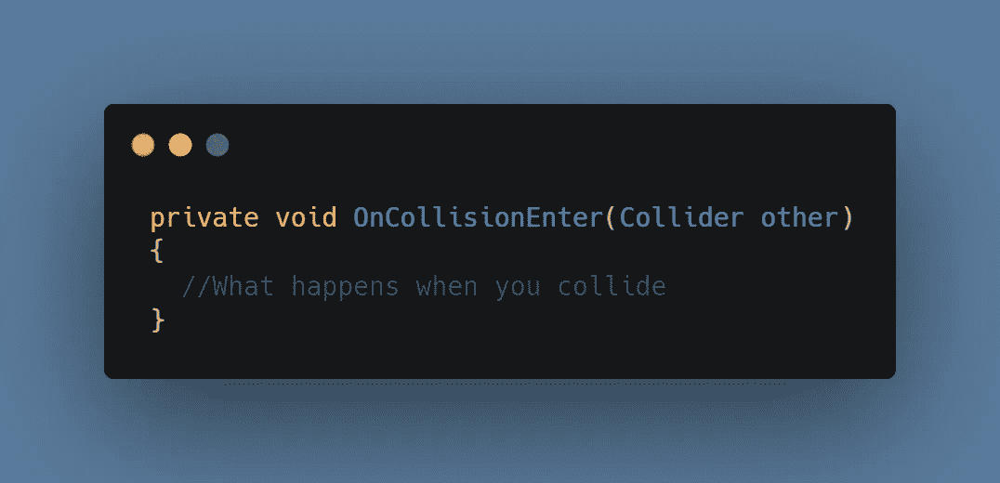
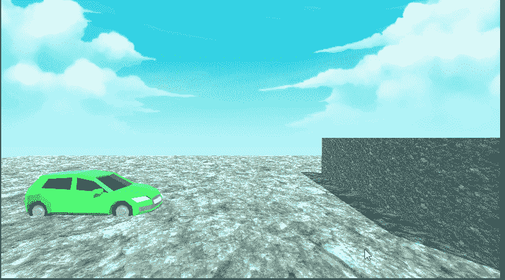
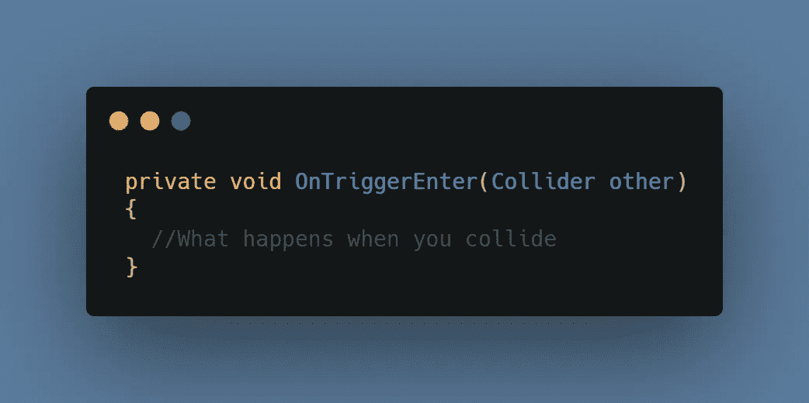
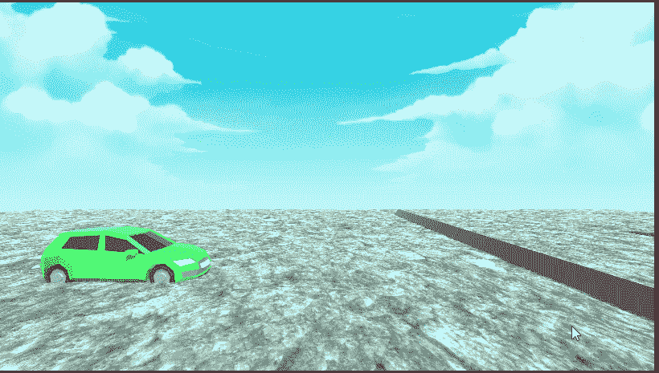

# OnCollisionEnter 与 OnTriggerEnter —何时使用它们

> 原文：<https://levelup.gitconnected.com/oncollisionenter-vs-ontriggerenter-when-to-use-them-56d42772dd22>

碰撞器被添加到游戏对象中，以反映它们的物理结构并模拟真实世界的物理。

默认情况下，带有[刚体](https://dennisse-pd.medium.com/rigidbody-physics-in-unity-c8b616beb21b)组件的对象将总是与带有碰撞器组件的对象发生碰撞。

碰撞器可以被用作触发器和阻塞刚体。当碰撞器被设置为触发器时，它可以检测与其他游戏对象的交互。

即使碰撞器被用作我们物体的物理表示，这并不意味着你必须塑造它们来匹配物体的精确轮廓。你的玩家角色可能有一个复杂的形状，但是你可以使用一个盒子碰撞器，甚至是一个胶囊碰撞器。

# 我怎么知道用哪一个？

区分这两者的一个简单方法是从视觉上考虑它们。OnCollisionEnter 可以被形象化为*撞向*墙壁，OnTriggerEnter 可以被形象化为*触发*警报。

让我们分别来看看它们。

## 肿瘤中心

这主要用于*固体*相互作用。在这个代码示例中，参数变量“ **other** ”指的是可以注册为碰撞的 *other* 游戏对象。例如，它可以用来使玩家角色*成为实体*，而不是可以穿过其他物体，甚至从地板上掉下来的实体。

**没有碰撞器**

**带碰撞器**

它也可以用于与环境和其他游戏对象碰撞的对象。

**例子**:一辆汽车实际上撞上了其他游戏物体，比如墙壁。

## OnTriggerEnter

刚体不受触发器的影响，因此，一个有刚体的游戏对象将能够穿过它并通过代码触发反应。使用触发器来激活警报，可收集的电源，甚至建立环境危害，如陷阱，一旦你踏上一个特定的区域，就会自动启动。

**例子:**比赛结束时的线是一个触发器——你不是在和它碰撞，但是一旦你和它互动，游戏就知道你赢了比赛。

在下一篇文章中，我将讨论脚本如何在 Unity 中通信。