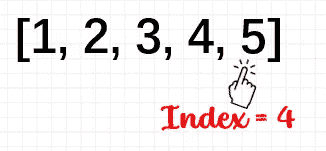
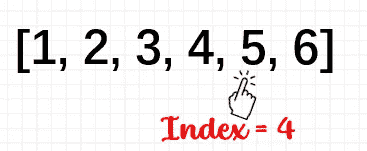
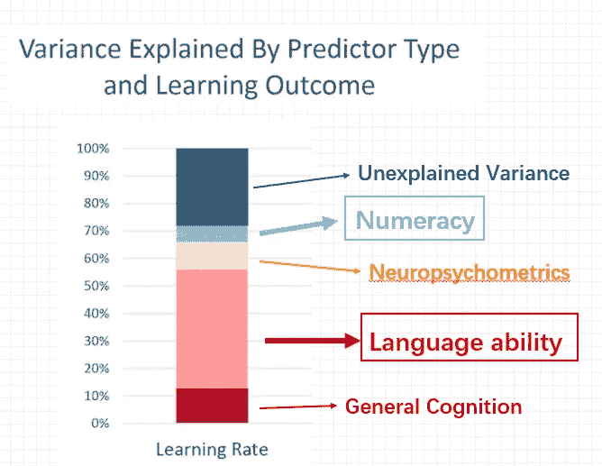

# 有人学编码比较快？原因如下

> 原文：<https://levelup.gitconnected.com/one-1-major-reason-why-some-people-learn-to-code-faster-2cb6edcabd32>

## 展示科学支持的证据

通过查看标题，您可能已经想出了一些为什么有些人学习编程更快的原因。例如，因为他们比其他人更擅长数学，或者他们可以保持专注和动力。在我看来，尽管这些都是合理的因素，但它们并没有起到关键作用。

基于我 7 年的编程经验和与未来开发人员的合作，我的理论是**更快地学习编程与解决问题和语言能力高度相关**。现在，你一定很清楚，一个人需要成为一个善于编程的问题解决者，所以在这篇博客中，我想把重点放在**的语言能力**上，以及为什么我认为它是人们如何更快地学习编程的一个关键预测因素。

## **编程是我们与计算机交流的方式**

我说的语言能力是什么意思？嗯，那是学习第二语言的能力，例如，词汇，语法，以及将它们联系在一起以交流思想和意图的规则。这是对编程语言的一个很好的类比，我认为编程语言是我们与计算机交流的基本方式。

编程包括通过将符号组合在一起来创建**指令，也称为语法，我们也以基于规则的方式**来做这件事**，就像我们做人类语言或自然语言一样。**

*****你也可以在下面我的频道看视频版🎥，也加入我们的 YouTube 社区*** [***【数据与 Kat 会谈】***](https://www.youtube.com/channel/UCbGx9Om38Ywlqi0x8RljNdw) ***😄***

现在，这里有一个我亲身经历的例子:我在大学时没有学习 STEM，直到我高三的时候我才知道什么是编程。我还记得我的第一个编码项目包含了一个从列表 中选择最后一个元素的 ***子任务，我很难实现“**最后一个元素**”的想法。***

我知道我们可以使用 ***索引*** 。例如，对于这样的列表，

作者图片

最后一个元素的*索引为 4* ，可用于提取最后一个元素。

但是，当列表变成这样时，

作者图片

*第 4 个索引*已经不再表示“最后一个元素”，我当时也不知道该怎么办。

然后我去见了我的导师，基本上她告诉我要像程序员一样思考，这个比喻就是当你学习第二语言时，你需要像母语人士一样思考。唯一的区别是，计算机是愚蠢的，它们不理解细微差别或歧义，所以你必须想出一个清晰的解决方案，并且足够通用，以处理任何长度的任何给定列表。这是这种语言的工作方式。

她说的话就像一个灯泡熄灭了！突然我意识到`**length() in R or len()-1 in Python**`函数可以用来表示任何列表的最后一个元素。

正是这个简单的想法教会了我与计算机交流的基本规则是**动态操作和概括**。换句话说，我们如何从一个案例推广到所有其他案例？

这种心态是我真正开始获得牵引力的地方。例如，如果我们组合这些通用命令的序列，我们有 ***一个逻辑流***；如果我们需要做同样的操作来适应不同的输入，我们创建 ***函数*** 。然后链接这些函数或方法给我们一个 ***对象*** 。

因此，这就是为什么我认为在它的核心，学习编程的过程更类似于学习自然语言，而不是学习数学，一旦你掌握了基本规则，它会让你走上一条更好的道路，学会更好更快地编码。

## Python 学习速度的差异:语言 vs .数学？

**这个想法并不仅仅出现在我的脑海里，2020 年发表的一项** [**科学研究**](https://www.nature.com/articles/s41598-020-60661-8) **也确定了语言能力在更快学习编程中的重要性。这是由华盛顿大学的研究人员进行的，现在，我会给你一个高层次的概述，而不会涉及技术细节。**

这项研究招募了 36 名年龄在 18 岁到 35 岁之间的说英语的人，他们从未学过编码。他们被要求参加 10 门在线 Python 课程，每门 45 分钟。

图片来源: [Pixabay](https://pixabay.com/photos/laptop-code-programming-computer-2557466/)

在上课之前，参与者做了一系列测试来衡量他们的数学技能、问题解决能力和第二语言学习能力。**在**在线编程课程期间，研究人员能够跟踪参与者学习的速度**在所有课程结束后**，参与者参加了另一项测试，以评估他们利用所学知识编写代码的能力。

研究人员发现,**语言能力**测试的分数是参与者学习 Python 速度的最强预测指标。它解释了超过 20%的学习率差异。相比之下，前测的**数学成绩**只解释了 2%。

作者图片

综上所述，这些结果表明语言技能是学习 Python 的一个重要方面，而数学技能并不能很好地预测参与者学习的好坏或快慢。

## 关于长期假设的临别赠言

有了这些，我一直在质疑一些关于程序员的假设或刻板印象，或者谁是优秀的技术人员？

例如，**大学水平的编程课程**往往只在 STEM 专业教授，因为它被视为数学密集型学科。另一个假设？**性别差距**！女性经常觉得她们不符合典型科技人的想法！

现在，我们是否应该三思而行，因为大量研究表明，平均而言，女孩比男孩拥有更高的语言技能。由于语言能力是学习编程的高度预测因素，也许女性应该更有“擅长”编程的名声。希望你觉得这个博客有趣，感谢你的阅读！😃

***想要更多数据科学和编程技巧？使用*** [***我的链接***](https://yilistats.medium.com/membership) ***注册 Medium，获得我所有内容的全部访问权限。***

**你可能会发现其他博客也很鼓舞人心，**

 [## 6 个令人捧腹的程序员/数据科学家笑话开启 2022 年

### 做好准备:这些愚蠢的老笑话会让你捧腹大笑😁

levelup.gitconnected.com](/6-hilarious-programmers-data-scientists-jokes-to-kick-start-2021-187f86dd6a4c)  [## 3 个小小的 SQL 错误让一份数据科学工作付出了代价

### 其中一个让我失去了一份 21.2 万美元的工作

levelup.gitconnected.com](/3-small-sql-errors-that-cost-a-data-science-job-offer-7ee920084aed)  [## 每个数据科学家都应该知道的 6 个 SQL 技巧

### 提高分析效率的 SQL 技巧

towardsdatascience.com](https://towardsdatascience.com/6-sql-tricks-every-data-scientist-should-know-f84be499aea5) 

# 分级编码

感谢您成为我们社区的一员！更多内容见[级编码出版物](https://levelup.gitconnected.com/)。
跟随:[推特](https://twitter.com/gitconnected)，[领英](https://www.linkedin.com/company/gitconnected)，[通迅](https://newsletter.levelup.dev/)
**升一级正在改造理工大招聘➡️** [**加入我们的人才集体**](https://jobs.levelup.dev/talent/welcome?referral=true)