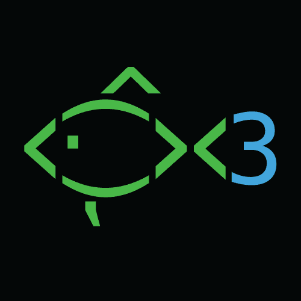
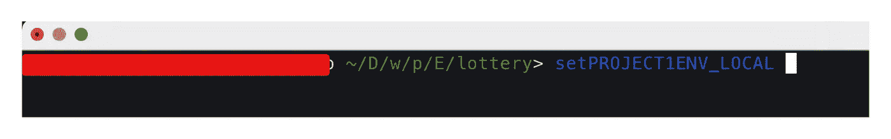
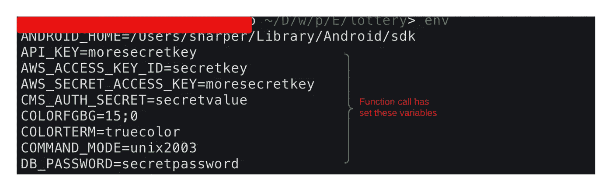

# 我喜欢鱼的一个特性(友好的交互式外壳)

> 原文：<https://levelup.gitconnected.com/one-feature-i-love-about-fish-the-friendly-interactive-shell-2494b704a1a2>

作为后端程序员，我们都有自己特定的工具选择，尤其是在使用命令行工具时。而且，正如这个帖子的标题所说，我是[鱼](https://fishshell.com/)壳(集成了 [iterm2](https://iterm2.com/) )的忠实粉丝。

你可以在它的[文档](https://fishshell.com/docs/current/tutorial.html)中找到关于 FISH 的所有信息以及它有多酷，但是真正让我印象深刻的是它的[功能](https://fishshell.com/docs/current/tutorial.html#functions)特性。

在任何给定的时间，我都在从事多个项目，这意味着我必须一直切换环境。每个环境都有自己的环境变量集，管理它们要困难得多，直到我在 fish 中发现了函数。

现在我要做的就是在 fish 的配置文件(通常在这里找到— `~/.config/fish/config.fish`)中设置函数，如下所示

现在，每当你需要切换环境时，就像这样从你的鱼壳中调用函数-
`setPROJECT1ENV_LOCAL`或`setPROJECT2ENV_LOCAL`

使用函数调用设置环境变量

变量都设置好了

祝大家钓鱼愉快🐟 😄

感谢您的阅读，如果您想支持我，请关注我，成为会员，支持更广泛的社区。

 [## 通过我的推荐链接加入媒体 Meta Collective

### 作为一个媒体会员，你的会员费的一部分会给你阅读的作家，你可以完全接触到每一个故事…

medium.com](https://medium.com/@metacollective/membership)