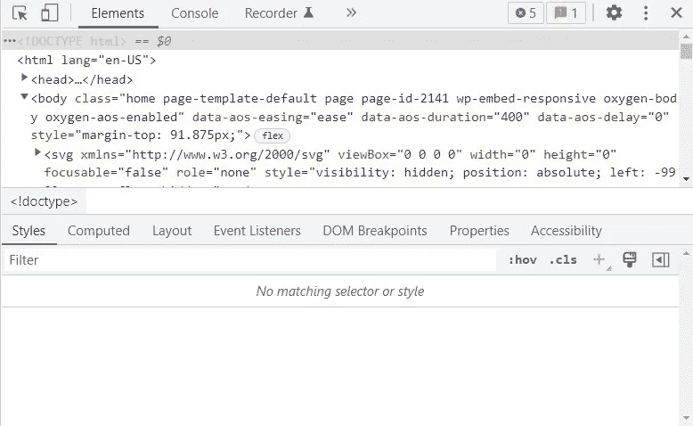
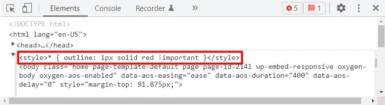

# 调试 CSS 问题的一行代码

> 原文：<https://levelup.gitconnected.com/one-line-to-debug-your-css-issues-456637a35c68>


Hitesh Choudhary 在[像素上拍摄的照片](https://www.pexels.com/photo/coding-laptop-macbook-macbook-air-693862/)

*不使用溢出防止水平滚动 CSS。了解如何使用* `*<style> * { outline: 1px solid red !important } </style>*` *、JavaScript 或开发工具来调试网站的布局问题。*

忘记你用来调试网站前端的特定平台工具。有一行代码**可以用来调试**所有**CSS 定位问题。其他人可能会建议您使用`[overflow](https://www.w3schools.com/css/css_overflow.asp)`属性并结束工作。然而，除了隐藏问题之外，使用溢出并不能保证做更多的事情。相反，让我们直接从源头解决问题。**

# 什么是水平滚动？

每当您的网站的垂直尺寸*(高度)*超过用户的屏幕高度*(视口 y)* ，就会出现滚动条。这不是问题，因为大多数人使用的设备都是针对垂直滚动优化的。不幸的是，横轴*(或者更糟)*也会发生同样的事情。当设备相应地处理额外的宽度时，这可能导致挫折。


水平滚动条。


萨奇。

为了更好的用户体验，你需要防止这些布局问题。

# 不要使用溢出

某些程序员将`overflow`属性应用于他们的元素来“修复”这个问题。然而，这样做只是治标不治本。通过使用溢出，您最终会在页面上移动元素(比视窗大)或完全隐藏它们。这会导致一系列你可以避免的问题。您不需要通过掩盖元素来解决布局问题，而是需要确定哪个特定元素导致了问题。

你如何识别哪个因素导致了问题？

# 这条线

`*<style> * { outline: 1px solid red !important } </style>*`

**就这样。**最精彩的部分？您可以随时在您访问的任何网站上运行该线路！

*不要为此使用* `[*border*](https://www.w3schools.com/cssref/pr_border.php)` *属性，因为它会影响元素的实际宽度。*

## 使用线路

为了使用该行，请在浏览器上打开有问题的页面。一旦发生这种情况，*在页面的任何地方右键单击*调出菜单，选择*“检查元素”*，然后导航到“*元素”*选项卡。这些动作相当于*右键>检查元素>元素*。或者，使用各自浏览器的快捷键:`ctrl + shift + c` *(Chrome，Firefox)*`cmd + option + i`*(Safari)*。



开发人员工具(元素)

从这里，*右击*页面上的任意一行，选择【编辑 HTML】*(右击>编辑 HTML)* 。然后，通过单击聚焦文本框之外的任意位置退出编辑器。



插入该行。

这将产生如下所示的页面。


多美的景色啊！

想要它消失吗？刷新页面。

## 使用 JavaScript

在某些情况下，上述方法不足以发现问题:人眼只能做这么多。如果是这样的话，在拿出大枪*(开发者工具)*之前，你的工具箱里可能还有一个工具。以下 JavaScript 代码查找页面上大于窗口长度的所有元素。

```
document.querySelectorAll(“*”).forEach(function(element) {
    if (element.width > window.screen.width) {
        console.log(“Wide Element: “, element, “Width: “, element.width);
    }
});
```

## 使用开发工具

开发者工具允许你测试和调试你的代码*(从浏览器)*。Chrome DevTools(Documentation)是一个流行的浏览器开发工具的现代例子。关于用开发者工具调试 HTML/CSS 的更多信息，请看这个列表:[开发者工具指南](https://switchupcb.medium.com/list/the-developer-tools-guide-789b5d733824)。

# 提交问题

浏览互联网时，你不可避免地会遇到问题。不要流着泪感到绝望，用这些工具找出问题所在。不要做那个*不跟你*讲 *sh*t* 在牙缝里的朋友。**让车主知道！你的努力将会得到极大的赞赏，或者你会因向他们展示自己在这个社会中的地位而沾沾自喜。**


[开关 CB](https://switchupcb.medium.com/?source=post_page-----456637a35c68--------------------------------)

## 开发人员工具指南

[View list](https://switchupcb.medium.com/list/the-developer-tools-guide-789b5d733824?source=post_page-----456637a35c68--------------------------------)3 stories