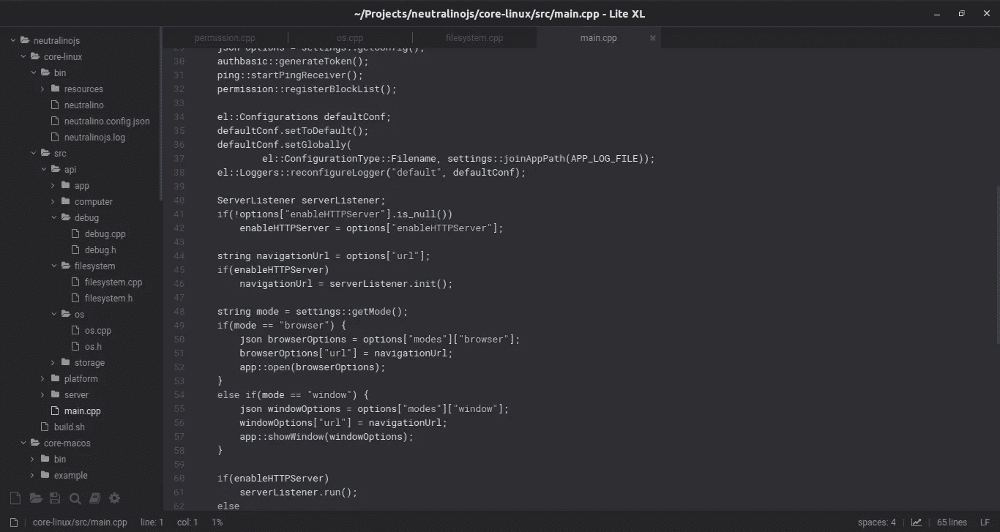
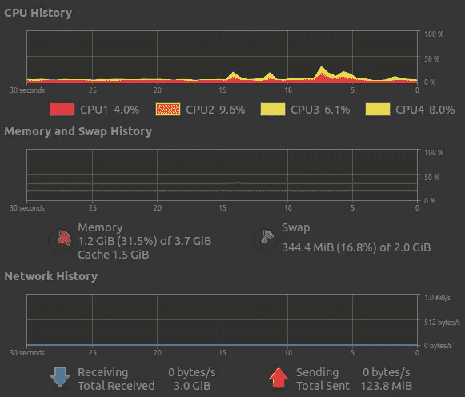
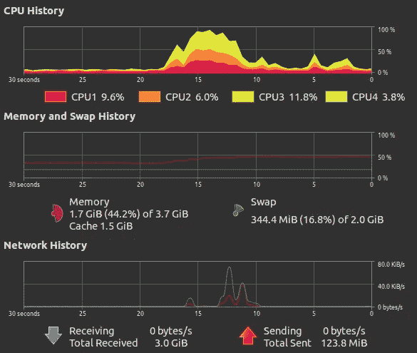

# 1mb 的 Lite-XL，而不是重量级的 Visual Studio 代码

> 原文：<https://levelup.gitconnected.com/one-megabyte-lite-xl-instead-of-heavyweight-visual-studio-code-f35d12efb09e>

## 用 Lua 和 C 编写的真正的原生代码编辑器比你的 Visual Studio 代码性能更好。

开发人员根据他们的需求和偏好选择代码编辑器。然而，现在 Visual Studio 代码已经成为每个现代开发人员的默认选择。由于其省时的特性和丰富的扩展生态系统，它每天都受到欢迎。甚至许多流行的框架都建议您将 Visual Studio 代码与它们的扩展一起使用。但是，Visual Studio 代码有一个隐藏但却至关重要的问题。你可能体验不到，因为你的电脑里可能有 16g 的内存和超快的微处理器。

Visual Studio 代码软件是用通常会产生大量二进制文件的电子框架构建的。用 Electron 制作的应用程序带有预打包的 Chromium 和节点运行时。你在基于电子的应用程序中看到的一切都呈现在 Chromium 浏览器实例上。您看到的唯一本机部分是本机窗口框架。但是大部分时间都是基于 HTML 的窗口框架代替原生窗口框架。

Visual Studio 代码是在本机窗口中运行的复杂 web 应用程序。我[在用了三年 Visual Studio 代码后，把](https://medium.com/swlh/i-switched-to-lite-after-using-vscode-for-3-years-16f2fffa6143)换成了 Lite 代码编辑器。Lite 确实是一个真正的本地超轻量级桌面应用程序，由 [SDL](https://en.wikipedia.org/wiki/Simple_DirectMedia_Layer) 图形库制作。Lite 很棒，但它在字体渲染方面有一些问题，而且它没有一些日常任务所需的重要功能。可惜 Lite 没有积极的开发进展。幸运的是，我看到了一个叫 Lite-XL 的 Lite 的主动叉。Lite-XL 支持 Linux、Windows 和 macOS，并且没有字体渲染问题。

# 超轻型 Lite-XL

Lite-XL 是从 Lite 编辑器的一个分支开发的本地代码编辑软件。它是由 SDL 图形库构建的，该图形库支持数百种计算机游戏。Lite-XL 保持了良好的项目架构。基本代码编辑器实现了基本的强制特性。另一方面，可选功能以插件的形式出现。事实上，插件只是典型的 Lua 源文件。因此，开发人员可以很容易地修改现有的插件，也可以很容易地创建和集成新的插件。

与最初的 Lite 编辑器相比，Lite-XL 有很多与 UI 相关的改进。与 Lite 相比，它的内存使用量进一步减少，并有几项与性能相关的改进。

Linux 上的 Lite-XL。作者截图。

Lite-XL 经常在 [Github](https://github.com/franko/lite-xl/releases) 上发布新版本。

# Lite-XL 与 Visual Studio 代码。

让我们从硬件资源使用比较开始。我用 Lite-XL 打开了 [Neutralinojs](https://github.com/neutralinojs/neutralinojs) 的源码，查看了资源使用情况，如上图截图所示。它占用了 5.2 兆字节的物理内存，CPU 的使用率像非门的输出一样在 0%和 1%之间切换。之后，我打开了 Lite-XL 的两个实例，注意到第二个进程消耗了相同的资源。总内存使用量是我的计算机物理内存的 0.25%(我的笔记本电脑有 4GB 内存)。下图显示了启动一个 Lite-XL 实例后资源使用情况的变化。

发布 Lite-XL 后的资源。作者截图。

然后我用没有扩展的 Visual Studio 代码做了同样的测试。由于 Electron/Chromium 的默认设计，Visual Studio 代码的一个实例会创建多个进程。所有相关的进程总计约 400 兆字节，总的 CPU 使用率在 0%–20%的范围内变化。与 Lite-XL 编辑器类似，两个代码编辑器实例的物理内存使用增加了一倍。现在总内存使用量是我总物理内存的 20%。在我的电脑上，同时使用 Google Chrome 和 Visual Studio 代码在文学上是不可能的，因为它们占用了大量的资源。现在，我甚至可以打开数百个 Lite-XL 实例，而不会降低我的计算机速度。下图显示了启动一个 Visual Studio 代码实例后资源使用情况的变化。

启动 Visual Studio 代码后的资源。作者截图。

Visual Studio 代码占用大约 300 兆字节的磁盘空间。同时，Lite-XL 只占用 1 兆字节的磁盘空间。大多数 Visual Studio 代码文件只是为了驱动混合应用程序。这个基准测试是在没有扩展的情况下完成的。如果有像 [cpptools](https://github.com/microsoft/vscode-cpptools) 这样的扩展，每个编辑器实例的物理内存使用会超过 1gb。

Visual Studio 代码有一个庞大的开发人员社区。有成千上万的扩展来做文学上的任何事情。但是，Lite-XL 社区仍然在成长，而且规模很小。我认为 Lite-XL 社区有像我一样真正关心桌面应用程序性能的开发人员。

然而，Lite-XL 提供了代码编辑所需的最少功能。它有一个非常好的语法高亮，林挺支持，文件搜索，命令运行，和内置控制台。它没有提供 Visual Studio 代码所具有的所有奇特功能。例如，没有快速文本段搜索。因此，我在一个单独的终端窗口中使用`grep`。

# 性能是应用程序的责任。

如今，混合应用程序比纯本机应用程序更受欢迎。这是因为现代强大的硬件可以隐藏混合应用程序框架造成的性能问题。这种情况将低端和中端设备推向了少数群体。因此，开发人员通常必须升级他们的硬件设备，才能正确运行混合软件(包括 Visual Studio 代码)。记住，有些人还在用 Windows 7。软件有责任高效地消耗硬件资源。例如，计算机游戏根据可用的视频图形资源自动配置图形设置，以便用可用的物理资源运行游戏。

下面的故事进一步解释了这个问题。

 [## 再见，本地应用

### 混合应用正在取代在低端和高端电脑上都能流畅运行的原生应用。

medium.com](https://medium.com/codezri/goodbye-native-apps-2ffcbd2773e7) 

但是，Visual Studio 代码无法实现任何可靠的性能改进，因为它使用了 heavy Electron 框架。类似地，电子框架不能实现性能改进，因为 Chromium 是一个庞大的项目。Chromium 是专门为 web 应用程序设计的——不是为了创建类似本机的混合应用程序。因此，我们唯一的选择就是把性能的责任交给硬件——通过升级我们的硬件资源(你经常做的事情)。

# 结论

根据您的需要选择正确的代码编辑器显然取决于您。但是，当您最喜欢的代码编辑器像膨胀软件一样减慢您的计算机速度时，您需要寻找替代方法。几个月前，我最喜欢的代码编辑器是 Visual Studio Code，但我担心它的性能。如果你有运行 Visual Studio 代码的高端机器，就用它。但是如果你面临性能问题，试试 Lite-XL 一次。这是 Visual Studio 代码有史以来最好的轻量级本机替代方案。

# 分级编码

感谢您成为我们社区的一员！[订阅我们的 YouTube 频道](https://www.youtube.com/channel/UC3v9kBR_ab4UHXXdknz8Fbg?sub_confirmation=1)或者加入 [**Skilled.dev 编码面试课程**](https://skilled.dev/) 。

 [## 编写面试问题+获得开发工作

### 掌握编码面试的过程

技术开发](https://skilled.dev)