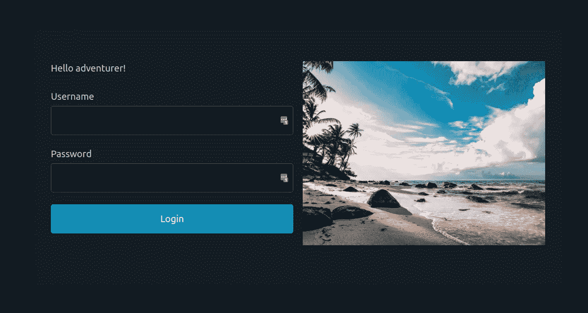
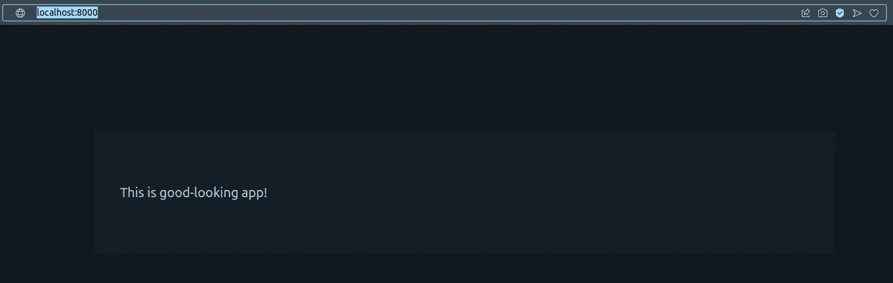
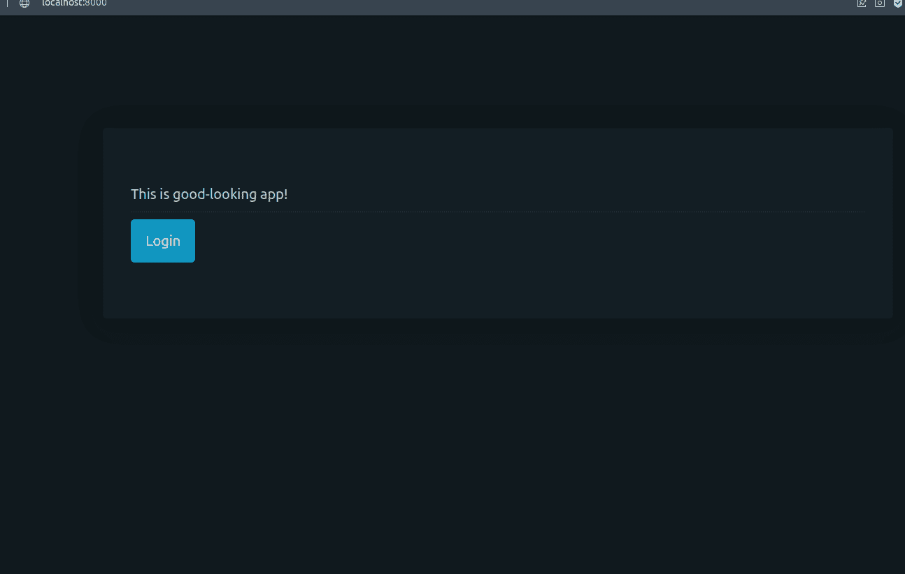

# 让 Django 应用看起来更好的最快方法之一

> 原文：<https://levelup.gitconnected.com/one-of-the-fastest-ways-to-make-the-django-app-look-good-c2b23006a574>



使用 pico.css 制作的登录页面

我一直认为自己是一个懒惰的后端工程师，不太喜欢创建好看的网页。你知道我的眼睛不好，CSS 细节让我抓狂，这种东西。因为这个原因，我期待有什么工具能让我在这方面的生活变得更轻松。所以今天，我将向你展示如何使用一个最小的 CSS 框架: [pico.css](https://picocss.com)

> 这不是我不做网页界面的情况。最近我做了一个有数百页的平台，在那里我需要一遍又一遍地质疑我的 HTML/CSS/JavaScript 技能 xD 我只是认为构建某种界面应该简单得多。我相信，并不是所有的页面都需要有动画效果。我希望你明白我的意思。

好了，我们来做点编码吧。

开始 Django 项目:`django-admin startproject goodapp`

点击从[下载 pico.css。在您的根项目目录中创建一个目录，并将下载的文件放在那里。从 pico zip 文件中选择两个文件:](https://picocss.com)

*   `pico.min.css`
*   `pico.min.css.map`

这两个文件都可以在你刚刚下载的`zip`文件的`css`目录下找到。最终结果应该是:

```
.
├── db.sqlite3
├── goodapp
│   ├── asgi.py
│   ├── __init__.py
│   ├── __pycache__
│   │   └── ... # I hide it, does not matter
│   ├── settings.py
│   ├── urls.py
│   └── wsgi.py
├── manage.py
└── static
    └── css
        └── pico
            ├── pico.min.css
            └── pico.min.css.map
```

现在我们需要 Django 应用程序的`base.html`文件。请在项目根目录下创建`templates`目录，并在那里创建一个名为`base.html`的文件，该文件的内容应该如下:

```



<!doctype html>
<html lang="en">
<head>
  <meta charset="utf-8">
  <meta name="viewport" content="width=device-width, initial-scale=1">
  <link rel="stylesheet" href="">
  <title>Good App</title>
  
  
</head>
<body>
<main class="container">
  
  
</main>
</body>
</html>
```

这是一个标准的 Django 模板，包含了 *pico.css* 。现在，测试一下我们的配置是否正常工作就好了。请创建内容为的`index.html`文件:

```



  <article>This is good-looking app!</article>

```

导航到项目根目录，并在`goodapp/iamlookingood/views.py` do 中执行`django-admin startapp iamlookingood`:

```
from django.views.generic import TemplateView

class IndexView(TemplateView):
    template_name = "index.html"
```

这里和那里的一些变化:

`goodapp/urls.py`

```
from django.urls import path

from iamlookingood.views import IndexView

urlpatterns = [
    path('', IndexView.as_view(), name="index"),
]
```

`goodapp/settings.py` — **将此添加到文件的底部**

```
STATICFILES_DIRS = [
    BASE_DIR / "static",
]
```

请在`goodapp/settings.py`中找到`TEMPLATES`——将`DIRS`改为:

```
'DIRS': [
    BASE_DIR / "templates",
]
```

并且还在`INSTALLED_APPS`中增加了一个新的应用(`iamlookingood`):

```
INSTALLED_APPS = [
    'django.contrib.admin',
    'django.contrib.auth',
    'django.contrib.contenttypes',
    'django.contrib.sessions',
    'django.contrib.messages',
    'django.contrib.staticfiles',

    'iamlookingood',
]
```

现在，运行:`python manage.py runserver 0:8000`并进入您的浏览器:`http://localhost:8000`您应该能够看到:



已经很好看了？不是吗？

现在，我将创建一个登录页面，向您展示创建它是多么容易。

`goodapp/urls.py`文件:

```
from django.urls import path
from django.contrib.auth import views as auth_views

from iamlookingood.views import IndexView

urlpatterns = [
    path('', IndexView.as_view(), name="index"),
    path('login/', auth_views.LoginView.as_view(template_name='login.html')),
]
```

使用标准的 Django 登录视图添加登录路径。现在在你的`templates`目录下，创建一个`login.html`文件:

```




  <article class="grid">
    <div>
      <p>Hello adventurer!</p>
      
        <div>
          
            {{ error }}
          
        </div>
      
      <form method="POST" action=".">
        
        
          <label for="{{ field.auto_id }}">
            {{ field.label }}
            {{ field }}
            
              <div>{{ field.errors }}</div>
            
          </label>
        
        <button type="submit">Login</button>
      </form>
    </div>
    <div>
      
    </div>
  </article>

```

这就是你所需要的，这里发生了什么？

*   `base.html`的简单扩展
*   并定义了`container`块中的内容。
*   表单以标准的类似 Django 的方式处理。
*   请注意文章 HTML 元素与网格类。
*   还要注意第二个 div 中添加的图片，去[pexels.com](https://www.pexels.com)下载一些你认为漂亮的免费图片，保存在`static/images/imagename.png`下
*   为了测试表单登录按钮，运行 Django 迁移:`python manage.py migrate`

现在你也可以稍微修改一下主页面(`index.html`)，这样你就可以点击登录按钮了:

```



  <article>
    This is good-looking app!
    <hr/>
    <a href="/login/" role="button">Login</a>
  </article>

```

注意新的`a`元素。

好看的应用程序现在看起来像这样:



一个简短的登录表单动画。

这里展示的登录表单受到了 [pico.css 示例](https://picocss.com/#examples)的启发。我鼓励您尝试一下，因为对于简单甚至更高级的用例，我没有找到更快的方法。我喜欢 pico 的创作者遵循的简约方式，这引起了我的共鸣。

## **技术说明**

最终项目结构:

```
.
├── db.sqlite3
├── goodapp
│   ├── asgi.py
│   ├── __init__.py
│   ├── settings.py
│   ├── urls.py
│   └── wsgi.py
├── iamlookingood
│   ├── admin.py
│   ├── apps.py
│   ├── __init__.py
│   ├── migrations
│   │   └──__init__.py
│   ├── models.py
│   ├── tests.py
│   └── views.py
├── manage.py
├── static
│   ├── css
│   │   └── pico
│   │       ├── pico.min.css
│   │       └── pico.min.css.map
│   └── images
│       └── sea-login.png
└── templates
    ├── base.html
    ├── index.html
    └── login.html
```

我希望你喜欢这篇文章——如果是的话，我有一个小小的请求，请与你认为可能对这样的话题感兴趣的人分享。

快乐编码。