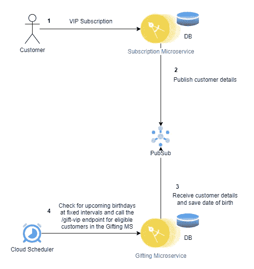

# 一个问题，多个解决方案&选择不当的风险——欢迎使用云计算

> 原文：<https://levelup.gitconnected.com/one-problem-multiple-solutions-the-risk-of-choosing-poorly-welcome-to-the-cloud-d64ed4494c27>

*对于您的云环境，什么是明智的解决方案选择？什么时候应该用什么？*

# 让那里有云

许多人会同意，云现在已经成为许多组织托管其技术的不可或缺的平台。如今，在云提供商的平台上终止部署管道流已经司空见惯。问题在于，对于一个问题，可能有许多解决方案。云技术提供的简单和丰富的选项是有代价的——根据您的情况做出*【差】*工具选择非常容易。这些糟糕的选择会导致不必要的成本，甚至更糟，因为它们对你的流程施加了不必要的限制和约束。

在本文中，我们将探讨一种非常常见的情况，这种情况可以通过多个云解决方案来管理，并确定哪种解决方案更有意义或更适合这种情况。我们将把这种情况应用到一个假想的组织中，我们称之为 CloudGifters。

# 有趣的情况

图 1 我们假设的基于云的云迁移器的期望流量

如图 1 所示，CloudGifters 期望的流程看起来非常简单明了。他们希望销售非常昂贵的精英/贵宾套餐，并希望在贵宾生日前两天为每位贵宾(订购了此功能的客户)启动特殊的赠送流程。

CloudGifters 的贵宾只是更大的客户群体中的极小一部分，因此，他们的生日是很少发生的事件。

> 为简单起见，这个假设情况中涉及的所有应用程序都在 GCP 上。

CloudGifters 的优秀工程师对这个问题感到兴奋，他们进行了头脑风暴，并提出了一个想法:由于 CloudGifters 非常严格地遵守由清晰有界的上下文定义的业务边界，他们不会在`Subscription`微服务中做这项工作，而是在`Gifting`微服务中公开一个`/gift-vip`端点，该端点将在正确的时间被调用，以开始赠送过程——正确的时间是在 VIP 生日的前两天。简单…简短！

但是，问题很快出现了:

1.  从技术上讲，我们如何保证我们总是知道这是每个贵宾生日的前两天？
2.  我们会部署一个云调度程序或一个 Kubernetes cron 作业来每天检查以了解哪些客户在两天后过生日吗？
3.  嗯……既然我们知道 VIP 生日并不常见，那么做上面的第二步有意义吗？为什么要部署每天检查的东西来确认我们已经知道的大多数日子的情况——没有即将到来的生日？每天检查一些我们知道不会发现的东西不是很浪费吗？
4.  CloudGifters 在 Kubernetes 集群中的 pods 上运行微服务，但是由于上面的 3，即使我们知道在这么多天、几周甚至可能几个月内不会有礼物要处理，继续运行`Gifting`微服务有意义吗？这难道不是一种浪费吗？这难道不会产生成本吗？如果没有这些成本，我们会过得更好，不管这些成本有多小。
5.  借助 Kubernetes 的水平 Pod Autoscaler (HPA ),我们可以轻松地将`Gifting`微服务部署扩展到 1，但我们能做得更好吗——当应用程序不处理任何礼品处理请求时，扩展到 0？
6.  我们是否可以考虑使用 Cloud Run 来运行`Gifting`微服务容器，因为 Cloud Run 可以将容器实例扩展到 0，在流量恢复时弹出适当数量的容器实例，并在微服务不服务任何请求时将容器实例缩减到 0？
7.  使用云任务队列在特定的调度时间显式调用消息(任务),而不是使用基于时间间隔的 cron 调度程序(不管是否有 VIP 要处理礼物，这些调度程序都会按照固定的周期/时间间隔运行),这样如何？
8.  等等。

在头脑风暴会议中有这么多问题，团队决定重新思考这个问题，并在急需的咖啡休息后重新召集。

# 候选解决方案

现在，团队从他们的休息中恢复过来，精力充沛，准备决定一个真正有效的简洁的解决方案。

我们会考虑 CloudGifters 的工程师和思想家试图处理这种情况并解决他们的优点和缺点的两种方法。这将有助于我们确定哪种方法更具可扩展性、更自然、更少浪费且更高效。

## Kubernetes 部署的固定间隔隐式调用

`Gifting`流程的一个非常明显的方面是，它应该异步进行，并且完全独立于`Subscription`微服务的流程。异步微服务通信的一种流行方法是使用例如 [*PubSub*](https://cloud.google.com/pubsub/docs/overview) 这样的工具进行消息调用。

> PubSub 实现了过程的*隐式调用*，完全由订阅者来监听发布的事件，并在这些事件被触发时运行相应的适当执行。

发布者是订户不可知的，并且 ***通过简单地将消息广播到 [*主题*](https://cloud.google.com/pubsub/docs/overview#core_concepts) 中，隐式地*** 在订户中引起执行。发布者无法控制已发布消息向订阅者的传递。

对于我们的 CloudGifters 情况，发布者是`Subscription`微服务，订阅者是运行在 Kubernetes pod 中的`Gifting`微服务容器。整个流程如下所示。

图 2 固定间隔隐式调用

上面的图 2 描述了 CloudGifters 的工程师们的建议，他们支持固定间隔隐式调用的思想。一旦客户进行了 VIP 订阅*(1)*,`Subscription`微服务就会发布一条适当的消息，其中包含客户的出生日期 *(2)* 。因为`Gifting`微服务已经订阅了该消息的主题，所以该消息被传递给`Gifting`微服务，后者然后将客户的详细信息保存在其数据存储中 *(3)* 。与此同时，云调度程序定期运行，检查哪些客户的生日将在两天后到来，并为任何符合条件的客户 *(4)* 调用`Gifting`微服务的`/gift-vip`端点。

## 赞成的意见

1.  `Subscription`微服务与`Gifting`微服务完全解耦并且不知道。
2.  除了`Gifting`微服务之外，`Subscription`微服务还可能有多个订户。

## 骗局

1.  浪费运行的`Gifting`微服务容器的副本，因为 VIP 生日不是经常发生的事件，微服务会在不处理礼物请求时继续运行。
2.  由于 VIP 生日活动的稀少，浪费的定期云调度检查。云调度器不断寻找符合条件的 VIP，即使在执行检查的大部分时间内都没有。
3.  PubSub 不实现计划交付。
4.  重复生日礼物请求的风险，因为没有办法指定消息队列中的消息是重复的。

## 使用云运行服务的固定时间显式调用

对于第二种方法，`Gifting`微服务容器在云运行服务中运行，该服务根据传入的请求以及有效处理这些请求所需的实例数量来扩展其容器实例——是的，如果它没有收到任何请求，它会将其容器实例缩减到 0。像第一种隐式调用方法一样，`Subscription`微服务在这里也是发布者，但不同之处在于，在这种情况下，发布者不是订户不可知的，并且`Gifting`微服务不是任何主题的订户。

> 云任务提供了针对已知目的地(发布者已知)的过程的*显式调用*。

这意味着发布者(`Subscription`微服务)控制并决定哪个微服务应该处理它的生日请求。`Subscription`微服务知道`Gifting`微服务，但只是为了指定`Gifting`微服务在要被推入云任务队列的调度任务中的`/gift-vip`端点。

这种方法如下图 3 所示。

图 3 使用云运行服务的固定时间显式调用

## 赞成的意见

1.  `Gifting`微服务不订阅任何主题，也不需要以任何方式与`Subscription`微服务集成。它只是作为一个普通的服务存在，没有任何其他的开销来集成到任何消息的主题中。
2.  云调度程序不会进行浪费的检查。没有必要保持任何 cron 工作，经常检查合格的客户，为他们准备生日礼物。
3.  云任务已经被安排在特定的时间运行，在该时间到来之前不会发生任何事情。
4.  没有浪费的`Gifting`微服务副本如果没有收到请求，云运行服务可以将容器实例扩展到 0。
5.  是的，失败的任务可以通过高度可配置的方式重试。
6.  预定交货。
7.  对于命名任务，任务创建是重复的，因此保证每个 VIP 的生日礼物只被处理一次。

## 骗局

1.  云任务目前不会持续超过 30 天，如果没有被触发，它们会被自动删除，因此 CloudGifters 必须针对这种情况实施一些解决方案。

# 结论

在考虑了上述选项之后，选择第二个选项是有意义的——使用云运行服务进行固定时间的显式调用。该选项的特点是步骤较少，浪费较少。它甚至与人们执行预定手动任务的方式自然融合——我们不会每次都试图去做任务，却被告知时间还没到，我们只是试图只在该做的时候做任务。

因此，虽然云引入了由于针对特定问题提供的多个选项而做出糟糕选择的可能性，但它真的不是什么新东西。在生活中，有很多方法去做事情，一个人必须选择哪种方法是最佳的，并且在特定的情况下更有意义。云没有任何不同，如果我们仔细想想，它是美丽的，因为它给人们提供了一个发挥创造力和独创性的机会。