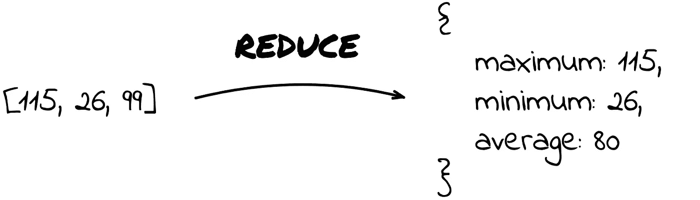
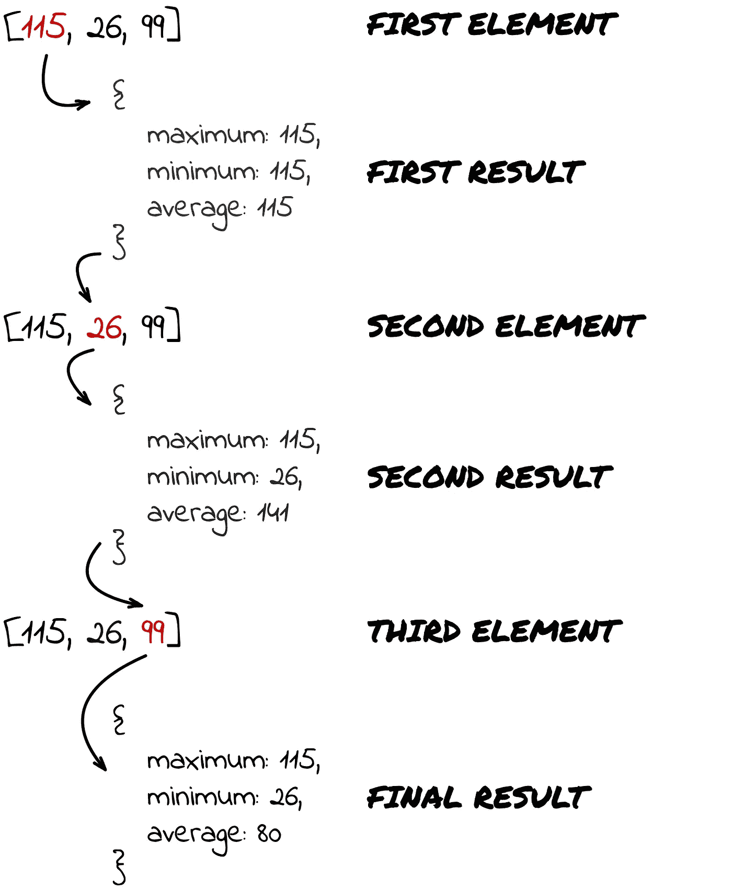
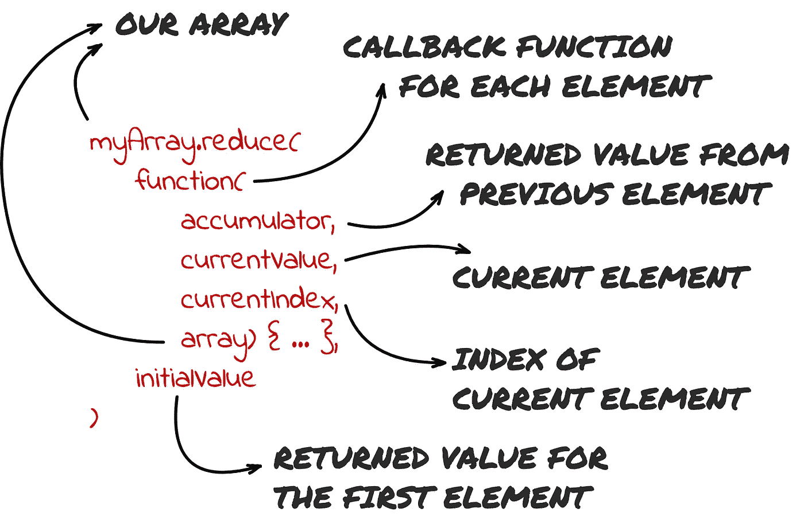
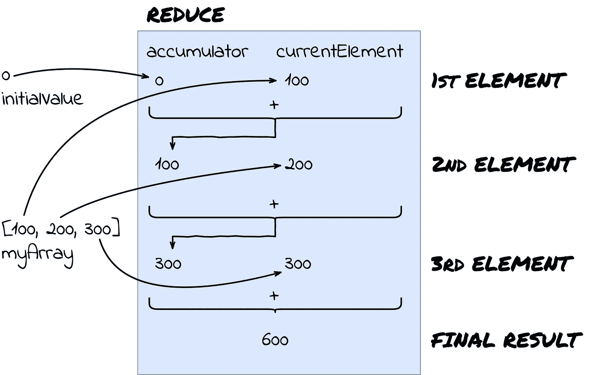
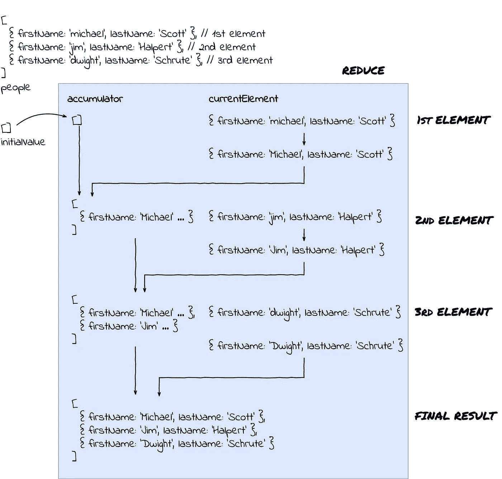

# 一个 reduce()来管理它们——如何在 JavaScript 中使用 reduce

> 原文：<https://levelup.gitconnected.com/one-reduce-to-rule-them-all-504e1b790a83>

## 如果有一个数据更改功能是每个 JavaScript 开发人员都应该学习和掌握的，那就是`reduce`。


# 减少？我把东西变小了吗？少…呃？

嗯…是*和*否。

reduce 背后的思想很简单，但是非常强大。它允许你把一组数据转换成你能想象的任何东西。

MDN 将`**reduce**`定义为:

> `**reduce()**`方法对数组的每个成员执行 **reducer** 函数(您提供的),产生一个输出值。

这是一个很好的定义，它可能会让你相信你总是需要产生一个值，比如一个数字或者一个字符串。虽然在技术上是正确的，但您仍然可以生成另一个数组(包含许多值)或一个对象(尽可能复杂)或一个对象数组。这意味着你可以将一个由 3 个字符串组成的数组转换成一个数字，或者转换成一个由 200 个非常复杂的对象组成的数组。现在，如果那个*不强大，我不知道什么才是。*



# 它是如何工作的？

`**reduce**`就像一种游戏，你可以在一两个小时内掌握规则，但仍能在未来几年里发现新的娱乐方式。

本质上，reduce 的内部工作很简单。
一个*摘要*配方应该是:

1.  取一组值，
2.  添加一个将在每个元素上运行的函数，
3.  确保函数返回值，
4.  在下一个元素上运行时使用返回值，
5.  加入一撮盐，
6.  接受函数在最后一个元素的返回值作为最终值。

简而言之——通过始终对前一个元素运行函数的结果，您正在逐步增加最终值。

下面是一个从值数组构建对象的示例:



如您所见，我们立即开始构建对象，并在处理数组时不断更改值。如果你还不知道它是如何发生的，不要担心，重要的是你总是带着你的结果，并在你处理你的价值观时修改它。

# 从小处着手

我希望我能让你明白`**reduce**`有多强大。合乎逻辑的下一步是从小处着手，积累你的`**reduce**`知识。我希望在本文结束时，您能够以优雅的方式解决广泛的问题。

## 高阶函数

在深入研究简化所有东西之前，我们还需要解决一个概念，那就是高阶函数的概念。

维基百科将它们定义为:

> 在数学和计算机科学中，**高阶函数**是至少执行下列操作之一的函数:
> -将一个或多个函数作为自变量(即程序参数)，
> -返回一个函数作为其结果。

第一点是我们感兴趣的。`**reduce**`是一个高阶函数，因为它将一个函数作为参数——正是我们已经提到的函数，将应用于每个元素的函数。

## 开始减少

基本的`**reduce**`功能很容易定义:

```
myArray.reduce(callbackFunction, initialValue)
```

基本上，这将接受一个数组，并对数组中的所有元素运行给定的回调函数。每个函数调用(每个步骤)都将传递一个返回值。这个返回值将被传递到下一步。

你可能会问:*数组的第一个元素呢？上一步的“结果”在哪里？*这是个很好的问题！这就是为什么`**reduce**`接受另一个参数— `initialValue`。我们可以对第一个元素的初始值进行硬编码，就好像它是前一个元素的返回一样。例如:如果我们要写一个函数，它将对一个数组中的所有数字求和(*剧透:我们将做*)，一个自然的初始值将是零，因为这是加法的一个很好的起点。

## 高度功能化

有了基本的`**reduce**` 定义，我们再来说说`callbackFunction`。将为每个元素调用回调函数，该函数将接收上一次调用的结果，如下所示:

```
const callbackFunction = function(
    accumulator, 
    currentValue, 
    currentIndex, 
    array) { ... }
```

虽然这看起来有点吓人，但实际上很容易理解:

*   `accumulator`代表上一次函数调用的返回值。如果我们在第一个元素，你可能已经猜到了，它将包含`initialValue`。
*   `currentValue`是正在调用函数的数组的当前元素。
*   `currentIndex`代表当前元素的索引。
*   `array`是我们现在正在缩减的数组。

大多数时候，你会对`accumulator`和`currentValue`感兴趣，因为它们会让你建立最终结果。`accumulator`和`array`很适合处理更复杂的归约逻辑(你需要知道你已经遍历了多少数组)。

如果你需要复习减压器各部分的功能，这里有一个方便的图片:



# 我们的第一个缩减器——将数组缩减为一个值

让我们写一个函数，如果在`**reduce**`函数中使用，它将对一个数组中的所有数字求和。

这可能看起来有很多代码，但是大多数时候你不会这样写。整个`**reduce**`函数(包括回调函数和初始值)只有 4 行代码。

## 现在，这是如何工作的？



如果你能把它想象成一个工作流程，那真的很简单:

1.  第一个元素以初始值(0)作为累加器，当前元素是 100(第一个元素)。它们相加(0 + 100 = 100)并返回。
2.  第二个元素的累加器是调用第一个元素的函数的返回值(100)。当前(第二个)元素是 200。它们相加在一起(100 + 200 = 300)并返回作为下一个元素的累加器。
3.  第三个元素得到一个 300 的累加器(上一步的返回值)。当前元素是 300。当我们将它们加在一起(300 + 300 = 600)时，我们返回结果，因为没有更多的元素，600 作为最终值被接受。

这可能看起来微不足道，但这正是`**reduce**`的工作方式，即使对于更复杂的情况也是如此。

**这里有几点:**

*   回调函数只有累加器和当前值作为参数——这是因为对于本例来说，其余的并不重要。
*   选择的初始值是零，因为零是一个中性元素，因此是一个完美的起点来开始求和我们的数字。

# 下一个挑战是改变数组的每个元素

假设我们有一个表示人的对象数组，我们注意到他们的名字都有一个小写的首字母。那根本不行。

潜在的解决方案如下所示:

唷。这里发生了很多事情。幸运的是，`**reduce**`的逻辑保持不变:

1.  第一个元素进入函数(michael Scott ),初始值是一个空数组。这是因为我们将用修正过的人来填充这个数组，并将这个不断增长的数组返回到下一步。这个人的名字被更正(michael → Michael ),更正后的人被添加到数组中(数组现在由 1 个元素组成:迈克尔·斯科特)。
2.  第二步从上一步获取累加器(这是一个包含 1 个人的数组)和当前元素(这是 jim Halpert)。这个人被修复(jim → jim)并被添加到数组中(现在数组中包含两个人:Michael 和 Jim)。该数组被返回，从而成为第三个元素的累加器。
3.  第三步获取包含两个人(Michael 和 Jim)和当前(第三个)元素(dwight)的累加器。Dwight 被修复，我们返回一个包含所有 3 个元素的数组(Michael、Jim 和 Dwight——可能去恶作剧了)。因为这是我们的最后一个元素，这也将是最终值。

我们也可以试着想象它:



# 我们去找 meta

到目前为止，您已经看到了如何处理不同数据的数组，以及如何基于这些数据产生不同的结果。但是，创造真正特别的东西呢？创建一个和`**map()**`函数一样的通用函数怎么样？

让我们试一试，看看会发生什么。

我们创建了一个名为`**mapFunction()**`的新函数。这个函数是一个通用的映射函数，它将遍历一个数组的所有元素，并将一个给定的函数应用于其中的每一个元素，然后返回新的数组。这与内置的`**map()**` 函数完全相同。

这个小练习很酷，因为它让你在一个更深的层次上思考，并且产生一个功能无限的函数。如果你想要改变数组中每个值的其他方法，写一个新的函数，它应该像`**addTheGreat()**` 函数一样被应用。假设你想把一个数组中的所有字符串都改成大写。这将是微不足道的:

```
const upperAll = function(element) { return element.toUpperCase(); }
```

之后，用新功能调用我们的`**mapFunction**` :

```
const upperPeople = mapFunction(people, upperAll);
```

## 更多的锻炼？

如果您想尝试更多的东西，您可以尝试实现 filter 函数，它根据输入函数的返回值(true 或 false)从数组中删除元素。

# 减少所有的事情

总之，`**reduce**` 将为你打开一个全新的数据世界，如果你尝试用它来解决一些问题的话。令人难以置信的是，使用 for 循环，你可以如此优雅地解决一些看起来令人望而生畏的问题。

这篇文章只是一个介绍，意在激起你更多的兴趣。好的一面是，有很多关于你可以用`**reduce**`做的很棒的事情的文章、演讲和视频。

使用`**reduce**` 投资数据转换，您将从中获得巨大价值。

## 但是等等，最初的例子呢？😮

注意，我们没有实现最初的例子(有最大值、最小值和平均值的例子)。这对你来说是一个很好的练习，下面是一个可能的解决方案:

[](https://gitconnected.com/learn/javascript) [## 学习 JavaScript -最佳 JavaScript 教程(2019) | gitconnected

### 50 大 JavaScript 教程-免费学习 JavaScript。课程由开发人员提交并投票，从而实现…

gitconnected.com](https://gitconnected.com/learn/javascript)