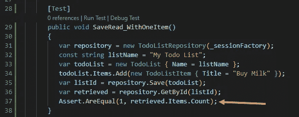

# 流畅的一对多关系

> 原文：<https://levelup.gitconnected.com/one-to-many-relationships-with-fluent-nhibernate-a26dcad42427>

## 如何处理亲子关系？NET 与 Fluent Migrator 的 Fluent 接口


待办事项列表可以有许多待办事项列表项

在本文中:

*   添加测试
*   扩展领域模型
*   更新对象关系映射代码
*   解决常见的 NHibernate 和数据库异常
*   惰性装载
*   通过使用约定简化映射代码

# 介绍

## 概述

在之前的文章中，我们介绍了作为对象关系映射器(ORM) 的 [NHibernate 来访问关系数据库中的数据。然后我们](https://medium.com/nerd-for-tech/easy-database-access-with-nhibernate-in-net-5-0-3cc7e36510c9?sk=d83d22c7197e509193c59eafc848e18c)[添加了事务](https://medium.com/swlh/database-transactions-with-nhibernate-in-net-5-0-caab8c82d62a?sk=cac595c539cff46f7e883385febb6602)来保持数据的一致性。这在本文中将变得更加重要，因为我们将使用一对多关系来扩展我们的领域模型。

## 运行示例

在本文中，我们将再次使用一个名为“Mahi”的虚构产品作为运行示例。Mahi 一词在 Te Reo 毛利语中的意思是“任务”,这是奥特罗亚(也称为新西兰)土著人所说的语言。

Mahi 是一个非常简单的任务管理器。请记住，代码库并不是用于生产的。目的是阐明有用的软件工程概念。

## 先决条件

*   VS 代码
*   VS 代码扩展包“远程开发”
*   您平台的 Git 客户端
*   适用于您平台的 Docker，例如适用于 Windows 或 MacOS 的 Docker Desktop，或适用于 Linux 的 Docker engine

**使用 WSL1 或 WSL2 的 Windows 用户注意:**请确保您熟悉文章[“wsl 2 上的 Docker 桌面:混合文件系统的问题”](/docker-desktop-on-wsl2-the-problem-with-mixing-file-systems-a8b5dcd79b22?sk=53d24e33a9f247fd626e3aa6959de7d4)的内容。

## 源代码

本文的完整源代码可在 https://github.com/mahi-app/CmdLine[获得。该条的起始位置为](https://github.com/mahi-app/CmdLine)[分支“article-2021–01–02”](https://github.com/mahi-app/CmdLine/tree/article-2021-01-02)。截至本文结尾的代码库在[分支“文章-2021–01–06”](https://github.com/mahi-app/CmdLine/tree/article-2021-01-06)

# 写作测试

到目前为止，我们已经实现了保存和检索“ToDoList”对象的代码。此时，该类的代码非常简单:

下一步，我们通过引入一个新的类“TodoListItem”来扩展它。每个列表可以有任意数量的项目，也可以没有项目。这是我们想要实现的目标的类图:


正如上一篇文章中的[，我们从一个测试开始。理想情况下，我们希望向列表中添加一个项目并存储它。然后，当我们读取列表时，我们的代码也应该从数据库中读取该列表的项目。](https://medium.com/nerd-for-tech/easy-database-access-with-nhibernate-in-net-5-0-3cc7e36510c9?sk=d83d22c7197e509193c59eafc848e18c)

在“TodoListRepositoryTest”类中，我们添加了以下测试:

为了进行编译，我们还需要一个新类“TodoListItem ”,如下所示:

接下来，我们向类“TodoList”添加一个新属性“Items”:

这些代码更改可以编译。然而，当我们执行时

```
dotnet test
```

我们将观察到如下错误:


原因是当我们读取 TodoList 对象时，属性“Items”将被初始化为 null。这很容易解决。我们只是通过给属性赋一个初始值来修改 TodoList 类(见第 10 行):

当我们再次执行测试时，他们无法断言我们刚刚从数据库中读取的列表包含一个项目:



断言失败，因为项数为零而不是一。这并不奇怪，因为我们还没有给 NHibernate 提供如何在类 TodoListItem 和数据库之间映射的指令。

此时，我们添加了一个失败的测试。换句话说，我们从“绿色”(所有测试都通过)到“红色”(一个或多个测试失败)。从“绿”到“红”，再从“红”到“绿”，这是一个不太坏的习惯。而后者正是我们要做的。

# 更新对象关系映射代码

描述如何在类和数据库之间映射的一种机制是映射类。我们需要一个“TodoListItem”的映射类。我们已经有了一个名为“DataAccess/Maps”的文件夹，所以我们将在这里创建它。它的实现如下所示:

我们已经将属性“Items”添加到类“TodoList”中，因此需要相应地修改映射类。这就是我们引入 Fluent NHibernate 新元素的地方:“HasMany()”。这个指令告诉 NHibernate 一个属性代表一对多关系。

下面是类“TodoListMap”的更新实现:

有了这个，让我们再次尝试我们的测试。错误消息已经改变，这表明了进度，因为这意味着我们正在代码库的正确区域进行探索:


## 解决“TransientObjectException”

让我们反思一下我们迄今为止所做的事情。我们有可以保存和读取“TodoList”对象的代码。我们还更新了对象关系(OR)映射。然而，我们忘记告诉 NHibernate 我们也想让“TodoListItem”对象持久化。一种选择是将“TodoListRepository”的实现更改如下:


这就够了。然而，我们有不同的选择。我们可以通过向“HasMany()”指令添加更多细节来更新 OR 映射。这些额外的细节告诉 NHibernate 如何根据父记录来处理子记录。换句话说，我们希望将某些事件“级联”到孩子身上。

这里我们想要传播，即“级联”，当“TodoList”对象被保存时，我们也想要保存该列表中的项目。下面是改进后的类“TodoListMap”:

如果我们现在运行测试，我们将再次得到不同的错误消息:


## 正在解析“无效的对象名‘TodoListItem’”

这个错误消息并不奇怪。我们还没有为“TodoListItem”创建表。让我们添加缺失的迁移:

这将使我们跨越障碍，但当我们重新运行测试时，我们有一个新的问题:


## 解析“无法将值 NULL 插入到列“TodoListId”中”

出现此错误消息的原因是，尽管我们将项目添加到了列表中，但是 ORM 还不能映射列表项目。让我们做一些小的改变来实现这一点。

第一个变化是在类“TodoListItem”中，我们添加了一个引用 TodoList 的属性(第 8 行):

我们还更新了映射类“TodoListItemMap”:

在第 12 行，我们添加了对“TodoList”引用的映射，即一对多关系的“一”端。

我们还需要更新测试。当我们创建“TodoListItem”对象时，我们设置了属性“TodoList ”,参见下面要点中的第 7 行:

让我们再次重新运行测试，看看这次我们能走多远:


## 解决 LazyInitializationException

“LazyInitializationException”值得稍微解释一下。当我们从数据库中读取“TodoList”对象(父对象)时，NHibernate 还没有读取“TodoListItem”对象(子对象)。默认情况下，它使用了一个叫做“延迟加载”(又名“延迟初始化”)的概念。这意味着它只在代码访问“TodoList”对象上的属性“items”时加载项目。

现在再看一下更新后的测试(参见上面最新的代码片段)。在第 10 行，我们调用了

```
retrieved.Items.Count 
```

当零件“取回”时。Items”时，延迟加载开始并尝试从数据库中加载项目。但是，问题是，此时我们没有数据库连接。NHibernate 使用一个只有在执行“TodoListRepository”时才可用的会话。

有不同的方法来解决这个问题。一种方法是在更广的范围内划分会话边界。我们将在以后的文章中研究这个选项。

另一种选择是告诉 NHibernate 在这个实例中不要使用延迟加载。对于此选项，我们需要更新类“TodoList”的映射，如下所示:

这里，在第 14 行，我们通过使用“. Not.LazyLoad()”明确地关闭了延迟加载。考虑到我们在每个列表中只有少量的待办事项，阅读全部是可以接受的。但是，如果出现可能有大量子记录的情况。在这些场景中，出于性能原因，可能需要不同的方法。不过，我们不会在本文中讨论这个问题。

让我们使用这个额外的更改再次运行测试:


厉害！正是我们想要的。我们从一个失败的测试开始，这导致我们从“绿色”(即所有测试都通过)到“红色”(一个或多个测试失败)。然后我们一次从“红”到“绿”一个问题。请记住，这仍然不是测试驱动的，但至少它是测试优先的。我们编写了测试，然后进行了足够的代码修改以使测试通过。(你可能会说，这是一种不同的“懒加载”😊)

# 家政

尽管我们现在只有一小段代码，但寻找可以清理的东西是值得的。

一个明显的候选是我们用来存储“TodoList”对象的表“List”。这与我们存储在名为“TodoListItem”的表中的类“TodoListItem”不一致。

解决这个问题只需要少量的更改。让我们从重命名表的迁移开始:

接下来，我们可以将“TodoListMap”类简化如下:

请注意，我们在这个类中不再调用“table(“List”)”。我们现在依赖于 Fluent Migrator 使用的约定。因此，重命名该表是正确的做法。

如果我们现在看一下数据库模式，画面看起来也更加一致:


如果你想知道:我正在使用一个名为“Azure Data Studio”的工具。它是开源的，基于 VS 代码。下载说明可以在微软的网站上找到。该工具适用于 Windows、macOS 和 Linux。

# 包扎

添加一对多关系是一个相当简单的步骤。然而，接下来我们需要看一些东西。例如，如果我们想从待办事项列表中更新或删除一个项目，该怎么办？或者，如果只是想要一个所有待办事项列表的名称及其 id 的列表呢？当然，我们不希望读取所有列表中的所有项目。这可能会变得非常昂贵。所以，我们可能也想调查一下。

另一个挑战是我们必须显式禁用延迟加载。理想情况下，我们不需要首先考虑这个问题。但是，我们如何在一次会议的范围内做到这一点呢？

所有这些都是我们在实践中面临的许多项目中的重要考虑因素。我将在接下来的几篇文章中提出我的建议。请在下面的评论中留下你的问题和建议。谢谢大家！

感谢您的阅读！

# 参考资料和附加材料

您可能会发现有助于进一步探索的参考资料和其他材料的链接:

*   文章[“轻松的模式迁移。净芯"](https://medium.com/swlh/easy-schema-migrations-in-net-core-abd214fa054c?sk=f81e1d26a7e58c1a864fb4f85895fe13)
*   文章[“使用 NHibernate 轻松访问数据库”](https://medium.com/nerd-for-tech/easy-database-access-with-nhibernate-in-net-5-0-3cc7e36510c9?sk=d83d22c7197e509193c59eafc848e18c)
*   文档流畅迁移器的[“流畅接口”](https://fluentmigrator.github.io/articles/fluent-interface.html)