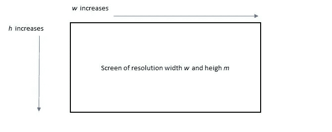

# 在微软团队中保持“活跃”的一个方法(或缩放)

> 原文：<https://levelup.gitconnected.com/one-way-to-always-be-active-on-microsoft-teams-or-zoom-b340e8925707>

## 使用 Python，用不到 10 行代码编写的分步指南


[埃德·哈迪](https://unsplash.com/@impelling?utm_source=medium&utm_medium=referral)在 [Unsplash](https://unsplash.com?utm_source=medium&utm_medium=referral) 上拍摄的照片

# 背景

由于新冠肺炎疫情，大多数公司已经转向混合工作结构，鼓励员工每周至少有几天在家工作，公司越来越依赖于微软团队(“团队”)和 Zoom 等通信工具。

在家工作时，出于各种原因，你可能想离开办公桌一段时间，但你担心在团队中的**【离开】**状态或工作时间的 Zoom 可能不会受到你的老式经理或同事的欢迎，他们没有完全或真正接受灵活工作的想法，你可能会开始想:有没有办法在团队或 Zoom 中总是以**【活跃】**的身份出现？

尽管其意图值得商榷，但本文将带您通过一种易于实现的方式使用 Python 来实现这一点。

# 现有方法

如果你在谷歌上搜索，你会发现大多数建议的解决方案都包括以下内容:

*   更改操作系统中的电源或睡眠设置，这是不可行的，因为这很可能被公司禁用，尤其是在公司发放的笔记本电脑或公司管理的虚拟平台上。
*   微软在本文[文章](https://support.microsoft.com/en-us/office/set-a-duration-for-your-status-in-teams-d82c5629-96a8-44e9-bced-2925470e0d96)中介绍了为状态设置一个持续时间，根据作者的经验，该持续时间很可能被公司禁用，以确保“生产率”(换句话说，一些公司确实希望员工展示实时状态)。
*   打开一个应用程序，如 Microsoft Excel 或 Word，在键盘上的“ENTER”键上放置一个“砝码”(如橡皮擦)(平心而论，我认为这是最实用的)。

如果你想学习使用 Python 的更具技术性的解决方案，并可以向公司以外的人炫耀(当然不是你的经理)，请继续阅读。

# 用 Python 操纵鼠标移动

提议的解决方案包括让 Python 通过向操作系统发送信号来生成特定的鼠标移动。这与移动鼠标将电脑从睡眠模式中唤醒没什么不同。

最终，下面的代码实现了在设定的时间内不断移动鼠标光标，这样计算机就不会进入“睡眠”状态，这样您就可以始终在计算机上保持“活动”状态，并随后使用 Teams 或 Zoom 等通信工具。

**步骤 1:安装并导入 PyAutoGui 库**

```
## install the library using pip, after which import as below
import pyautogui as pag
```

**第二步:获取屏幕分辨率(可选)**

```
res = pag.size()
print(res)
```

Python 中上述代码的输出是 ***Size(宽度=1920，高度=1080)*** 这是一个相当标准的屏幕分辨率。

请注意，如果您已经知道屏幕分辨率，这一步不是强制性的。目标是简单地理解鼠标光标被允许移动的数字边界。下面的步骤 3 演示了如何使用这些边界。

**第三步:生成运动**

```
for i in range(50):
    pag.moveTo(1, 1, duration = 1.0)
    pag.moveTo(1, 1000, duration = 1.0)
    pag.click(clicks = 2) 
    # The above should trigger the Start button, introduced as in some
    # setting the computer still sleeps with only the move of the mouse
    pag.moveTo(1900, 1000, duration = 1.0)
    pag.moveTo(1900, 1, duration = 1.0)
```

上面的代码沿着屏幕(分辨率为 1920 x 1080)的边缘(粗略地)移动鼠标光标，总共移动 50 次，这是用 for 循环中的 range()方法设置的。

**moveTo** 方法中的前两个参数设置我们希望鼠标光标移动到的坐标。例如，(1，1)靠近屏幕的左上角，而根据相同的逻辑,( 1900，1000)靠近右下角。坐标可以根据下图进行更改。



图 1:定义坐标。作者图片

“持续时间”参数设置鼠标光标移动到设定坐标所需的时间，单位为秒(即 1.0 = 1 秒)。换句话说，这可以用来控制你想要保持“活跃”的时间。

# 退出正在运行的脚本

现在，如果您希望退出正在运行的脚本(例如，当您将脚本设置为运行 10 小时，但您改变了主意)，只需按 CTRL + C 停止脚本。

# 结论

希望你会发现这篇文章很实用并且容易理解。注意，PyAutoGui 库中还有其他操作，比如用鼠标光标拖动和滚动，你可以参考这里的。

在我看来，如果你的经理仅仅根据你的团队在工作时间的状态来判断你的工作效率，或者从另一方面来看，你无论如何都是没有效率的，那就辞掉这份工作，做一些你真正感兴趣的事情。

点击这里跟随作者阅读更多类似的文章[！](https://jin-cui.medium.com/)