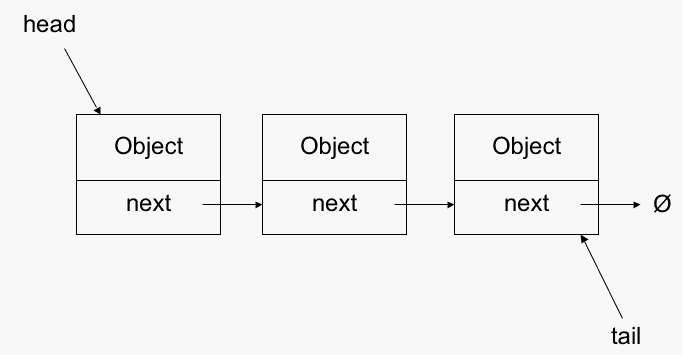

# #OneYearCodingPlan:链接列表

> 原文：<https://levelup.gitconnected.com/oneyearcodingplan-linkedlists-ec495b220ca6>

# #OneYearCodingPlan:第 2 个月

在本文中，我们将讨论编码采访的链表。

图像来源—cs.usfca.edu

# 时间线:

理解列表中的节点，它们如何相互连接，以及单向、双向和循环链表——1 周

做下面陈述的项目+解决简单的问题——1 周

简单+中等问题— 1 周

难题— 1 周

同样，1 个月是最糟糕的期限，如果你不是业余爱好者，跳过前 2 周的工作，试着在 2 周内结束这个话题。

# 理解链接列表:

一些解释链表的文章，试着不要只是浏览问题，而是稍后编码。专注于理解概念:

*   [w3 学校](https://www.w3schools.com/java/java_linkedlist.asp)
*   [JavaPoint](https://www.javatpoint.com/linked-list-interview-questions)
*   [面试蛋糕](https://www.interviewcake.com/concept/java/linked-list)

# 小项目创意(针对业余爱好者):

为了理解并能够容易地使用链表，我建议定义你自己的链表类，并向它添加特性:

节点是链表中的一个元素，这里我们在每个节点中存储一个 int。

1.  为双向链表定义一个节点类(提示:它应该有一个节点 previous，next 和 int 数据)
2.  定义一个链表类，它将创建一个头尾设置为 null 的空列表。
3.  定义一个插入 _ 开始(int 元素)，插入 _ 结束(int 元素)方法。
4.  定义 insert_at_position(int p，int element)方法，该方法将在位置 p 插入元素，如果 p 大于链表的长度，则将元素添加到末尾。
5.  定义 insert_after_element(int target，int element)，它将搜索 target 的第一个实例，并在它后面添加元素。同样，定义一个 insert _ before _ element(int target，int element)。如果元素不存在，两者都会抛出错误。
6.  定义 print_list()打印所有元素，size()返回列表的长度，reverse()反转当前列表。
7.  定义 remove_element(int element ),它删除元素的第一个实例(如果被删除的元素位于头部或尾部，请小心)。
8.  最后，定义 remove_duplicates()来删除任何重复的元素。比如你的列表是(2->3->22->4->2->3->5)，就变成(2->3->22->4->5)。

通过完成这个项目，你应该相当有信心，我向你保证，你将能够很容易地解决关于链表的竞争/面试问题。

# 练习题:

*   geeks forgeeks——有大量问题的令人敬畏的资源，这样做就足够了。
*   如果你做过这个项目，你会发现有几个问题很琐碎。
*   [Leetcode](https://leetcode.com/tag/linked-list/)
*   [黑客帝国](https://www.hackerearth.com/practice/data-structures/linked-list/singly-linked-list/tutorial/)

当你认为你准备好了，在白板上尝试[这 5 个问题](https://www.hackerrank.com/interview/interview-preparation-kit/linked-lists/challenges)。如果你让我给出破解编码面试的一个最重要的诀窍，那就是在白板上的**练习**。

# 面试技巧:

在面试中被问及链表问题相对较少(数组、字符串、树和图形被问得更多)，但是理解它们是很重要的，因为它们是超级基本的，并且它们会使理解树、图形或其他涉及相互连接的节点元素的结构相对更容易。与编码问题相比，许多面试官会更频繁地提出关于链表的口头问题，比如链表与数组相比有什么优点/缺点，在链表上插入和搜索元素的时间复杂度等。

差不多就是这样！如果你对我有任何建设性的批评，请告诉我，并在社交媒体上给我留言，我总是期待根据评论来提高我的写作水平！

谢谢，

安佳丽·维拉加马。

*脸书软件开发实习生*

[**LinkedIn**](http://www.linkedin.com/in/anjali-viramgama-085285166)**|**[**insta gram**](https://www.instagram.com/anjali.gama/)

如果你不熟悉我的博客，这是给你的:

[**一年计划概述博客**](https://medium.com/@anjaliviramgama/the-one-year-plan-for-competitive-coding-6af53f2f719c) **—介绍博客**

[**月 1**](https://medium.com/@anjaliviramgama/oneyearcodingplan-big-o-arrays-and-strings-7f4f91247f82) **—数组和字符串。**

# 我的博客格式:

1.  主题概述和要遵循的学习时间表。
2.  理解主题和练习问题的资源。
3.  与话题相关的面试技巧。

# 分级编码

感谢您成为我们社区的一员！ [**订阅我们的 YouTube 频道**](https://www.youtube.com/channel/UC3v9kBR_ab4UHXXdknz8Fbg?sub_confirmation=1) 或者加入 [**Skilled.dev 编码面试课程**](https://skilled.dev/) 。

 [## 编写面试问题

### 掌握编码面试的过程

技术开发](https://skilled.dev)