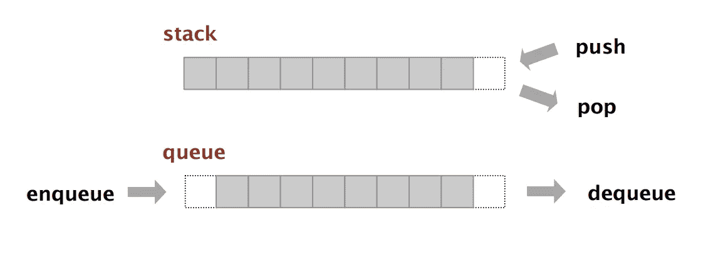

# #OneYearCodingPlan:堆栈和队列

> 原文：<https://levelup.gitconnected.com/oneyearcodingplan-stacks-queues-239024ae8d04>

# #OneYearCodingPlan:第 3 个月

在本文中，我们将讨论编码面试的堆栈和队列。

图片来源—[algs4.cs.princeton.edu](http://algs4.cs.princeton.edu/home/)

# 时间线:

堆栈和队列的格式、语法和使用—1 周

做下面陈述的项目——1 周

简单+中等问题— 1 周

难题— 1 周

如果你不是业余爱好者，可以跳过前两周。

# 学习资源:

可以把书库想象成一摞摞一摞的书。你放在书架上的最后一本书将是你拿起的第一本书。可以把队列想象成学生们在等待什么。第一个进入队列的人将是第一个被选中的人。

堆栈:后进先出。

队列:先进先出。

了解区别和语法: [GeeksForGeeks](https://www.geeksforgeeks.org/difference-between-stack-and-queue-data-structures/)

堆栈和队列的数组和链表实现:[访问位](https://www.interviewbit.com/courses/programming/topics/stacks-and-queues/)或 [GeeksForGeeks](https://www.geeksforgeeks.org/stack-data-structure-introduction-program/?ref=lbp)

实现它们会让你更好地理解这些结构是如何工作的。该项目将进一步帮助巩固你的理解。

# 小项目创意(针对业余爱好者):

1.  使用两个堆栈设计一个队列。
2.  在单个数组中实现两个堆栈。

**提示** : **在进一步阅读之前，尝试自己解决！**您可以将数组空间的一半分配给一个堆栈，另一半分配给另一个堆栈。假设数组的大小是 n，你把前半部分分配给一个栈，后半部分分配给另一个栈。但是如果第一个堆栈是满的(有 n/2 个元素)，而第二个堆栈只有 1-2 个元素呢？你会重新分配空间并移动第二个堆栈的元素来调整第一个堆栈中添加的每个新元素吗？

**提示 2** :从数组的开头开始第一个栈，从末尾开始第二个栈，怎么样？现在听起来容易吗？

注意:我刚刚意识到这个问题是关于 GFG 的-_-我真的相信是我发明的，但是好吧。

3.在单个阵列中实现 3 个堆栈。

4.用以下方法设计一个栈:Push，pop，peek，get_min，get_max。都应该是 O(1)。

**提示:**你可能已经想到有一个额外的 min 和 max 变量，当我们将元素推入堆栈时，它将存储 min 和 max。但是当那个元素被弹出时，你会再次遍历整个堆栈来寻找下一个 min 吗？

例如:堆栈 s= 7，1，3，4，5，6，2。(7 是顶)min = 1。最大值= 7。

s.max():返回存储在 max 中的值。现在是 7 点。//正确答案。

s . pop()；//弹出 7

s.max():返回 7？但它不应该，它现在应该返回 6。

所以一个 min，max 变量在 O(1)时间内不起作用。

**提示 2:** 在你的解决方案结构中有一个额外的最小堆栈和最大堆栈怎么样？所以，如果一个元素从原始堆栈中弹出，如果它在顶部，你也从 max/min 弹出它？

# 练习题:

项目能很好地帮助你理解结构，但是面试官更倾向于使用内置的堆栈/队列来提问。

[采访位](https://www.interviewbit.com/courses/programming/topics/stacks-and-queues/)

[黑客排名](https://www.hackerrank.com/domains/data-structures?filters%5Bsubdomains%5D%5B%5D=stacks&filters%5Bsubdomains%5D%5B%5D=queues)

[Leetcode](https://leetcode.com/explore/learn/card/queue-stack/)

GeeksForGeeks: [栈](https://www.geeksforgeeks.org/stack-data-structure/)，[队列](https://www.geeksforgeeks.org/queue-data-structure/)

黑客地球:[堆栈](https://www.hackerearth.com/practice/data-structures/stacks/basics-of-stacks/practice-problems/)，[队列](https://www.hackerearth.com/practice/data-structures/queues/basics-of-queues/practice-problems/)

每当你认为你准备好了，就拿起白板来解决这些问题。

# 面试技巧:

一些堆栈和队列问题是显而易见的，但另一些则不那么明显。大量的练习会有帮助。此外，请记住，您可以使用堆栈而不是递归来解决几个问题。

大约一年前，在一次白板面试中，我被问到了 8 皇后问题(找出一种在棋盘上放置 8 个皇后的方法，使任何皇后都不能杀死任何其他皇后)。我以前从来没有听说过这个问题，想出了一个极其复杂的混合递归和存储“当前”棋盘在一个堆栈中，并进一步增加皇后。这真的很奇怪，但我的采访者说他以前从未见过这个解决方案，并且很喜欢它。虽然我的空间复杂度并不“令人敬畏”,但我还是通过了这一轮。(我甚至用 5 个 hashmaps 解决了一个明显的图形问题，因为我想不出用图形的方式来做这件事)。长话短说，如果你没有为“著名的问题”想出最明显的解决方案也没关系，只要你的解决方案可行，时间复杂度最优，你就很棒。不是你之前有没有“听过”这个问题，而是你解决问题的能力。

差不多就是这样！谢谢！

安佳丽·维拉加马。

有关文章更新、建议或问题，请在 Instagram 上关注我！

[**LinkedIn**](http://www.linkedin.com/in/anjali-viramgama-085285166)**|**[**insta gram**](https://www.instagram.com/anjali.gama/)

如果你不熟悉我的博客，这是给你的:

[**一年计划概述博客**](https://medium.com/@anjaliviramgama/the-one-year-plan-for-competitive-coding-6af53f2f719c) **—介绍博客**

[**月 1 日**](https://medium.com/@anjaliviramgama/oneyearcodingplan-big-o-arrays-and-strings-7f4f91247f82) **—数组和字符串。**

[**月二**](/oneyearcodingplan-linkedlists-ec495b220ca6) **- LinkedList**

# 我的博客格式:

1.  主题概述和要遵循的学习时间表。
2.  理解主题和练习问题的资源。
3.  与话题相关的面试技巧。

# 分级编码

感谢您成为我们社区的一员！ [**订阅我们的 YouTube 频道**](https://www.youtube.com/channel/UC3v9kBR_ab4UHXXdknz8Fbg?sub_confirmation=1) 或者加入 [**Skilled.dev 编码面试课程**](https://skilled.dev/) 。

 [## 编写面试问题+获得开发工作

### 掌握编码面试的过程

技术开发](https://skilled.dev)