# Onnxruntime & OpenCV for C++

> 原文：<https://levelup.gitconnected.com/onnxruntime-opencv-for-c-b19ef189d3a8>

## 机器学习

## 点击几下就可以在 VS for C++上安装 Onnxruntime & OpenCV 的完整指南

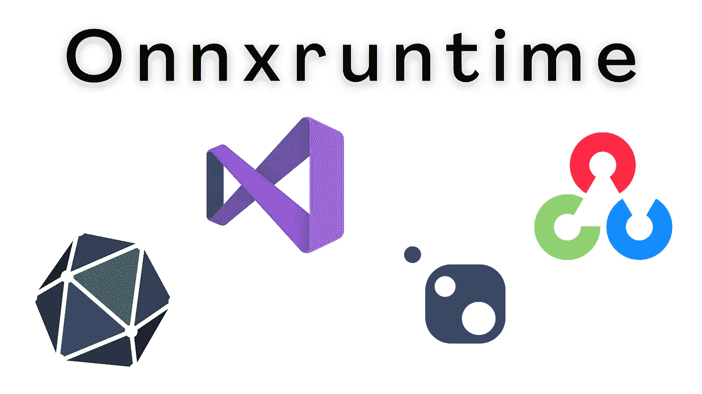

> 我网站上的博文原文是 [**此处**](https://pycad.co/onnxruntime-opencv-for-c/) 。

# 介绍

我们大多数人都在努力安装 **Onnxruntime** 、 **OpenCV** ，或者其他 **C++** 库。因此，我写这篇简短的博文来演示一种使用 Visual Studio (VS)只需点击几下鼠标就可以安装大量 C++库的技术。

# 要求

唯一的要求是，如果你还没有安装 [*微软 Visual Studio*](https://visualstudio.microsoft.com/downloads/) 。

## 安装 VS

简单又免费！只需去官网下载你需要的版本。在这个日期，VS 2022 是最新的版本，但旧版本也工作。别担心，我正在使用 VS 2019，它可以完成这项工作。在这里 可以得到 [*。*](https://visualstudio.microsoft.com/downloads/)

当您下载 VS 安装程序时，打开它并选中 C++复选框以安装 ***C++ builder*** ，然后单击安装按钮(这可能需要一些时间，因为它会同时下载和安装)。

# 安装 Onnxruntime & OpenCV

## 设置新项目

安装完 Visual Studio 后，只需打开它并创建一个新的控制台应用程序项目。 ***新建项目→控制台 app →下一步→填充方框*** 。

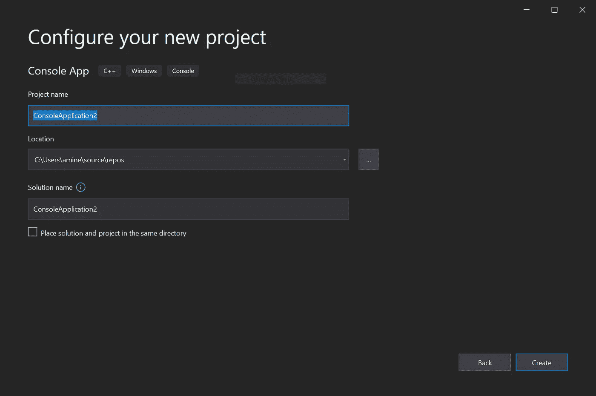

作者截取的图像

当您创建一个新项目时，您可以开始配置它(它不影响 Onnxruntime 的安装，但是最好在做任何事情之前设置您的项目)。

我唯一改变的是你系统中的 ***位数*** 和 ***调试/发布*** 模式。

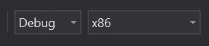

新项目总是以调试模式和 x86 启动，这适用于 32 位系统。

所以，如果你的系统是 **x64-bi** t，就在那里改吧，我推荐使用发布模式，因为代码会比在 ***调试模式*** 下运行的更快。

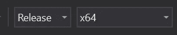

太好了！项目已经完成，现在让我们开始安装库。

## 正在安装 Onnxruntime CPU

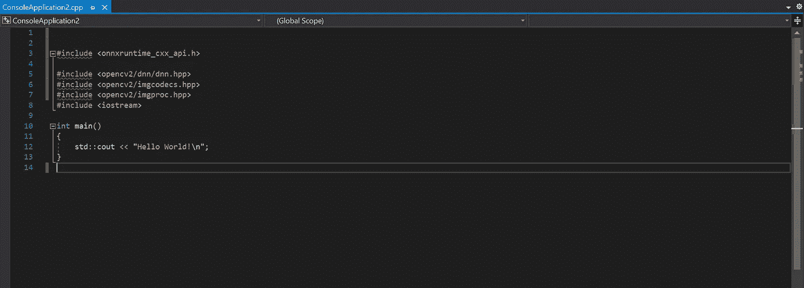

你可以看到，当我们导入 Onnxruntime 或 OpenCV 时，我们得到错误，表明它们没有安装。

***步骤:***

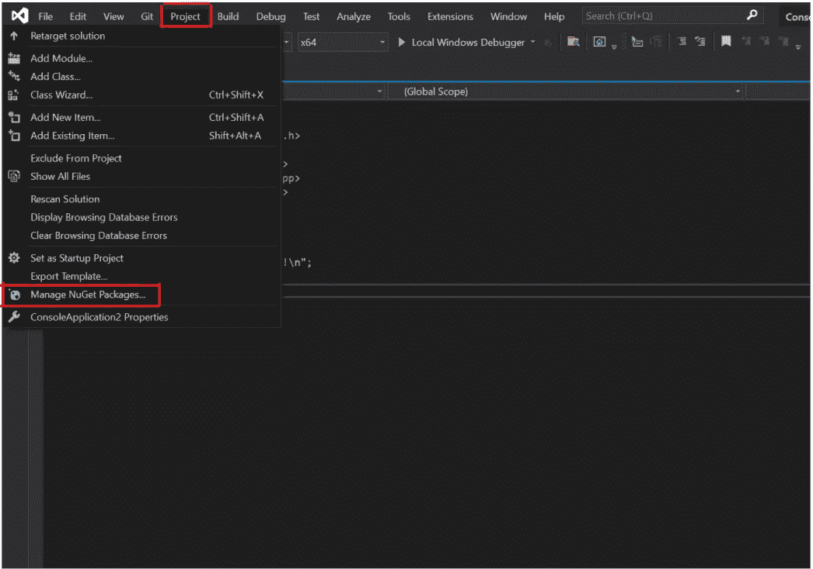

转到: ***项目→*** ***管理 NuGet 包***

然后输入`**onnxruntime**`。

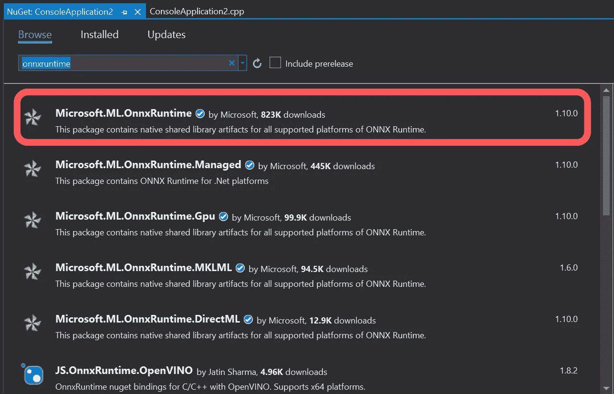

在您的项目上安装第一个获得 onnxruntime 的程序，然后享受吧！

## 安装 Onnxruntime GPU

在其他情况下，你可能需要在你的项目中使用一个***GPU***；但是要记住，我们安装的 onnxruntime 不支持 ***cuda 框架(GPU)*** 。然而，每个问题总有解决的办法。

如果要在项目中使用 GPU，必须安装`**onnxruntime.gpu**`，可以在同一个窗口中找到。

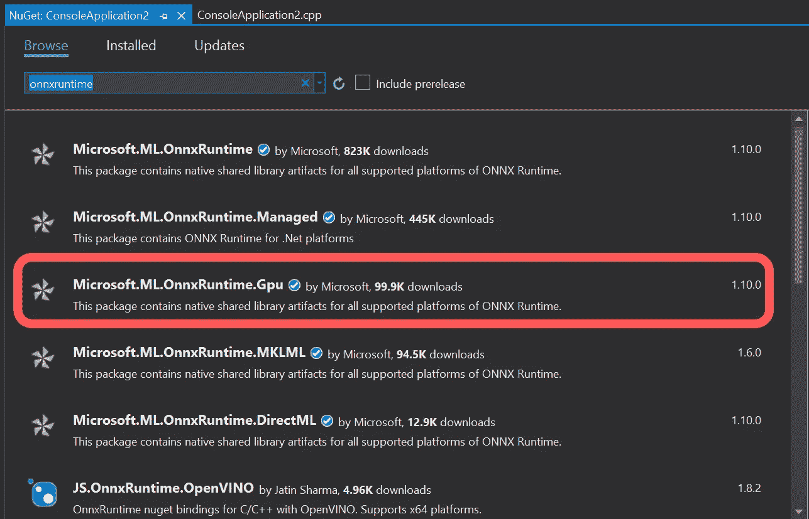

您会注意到，我们在导入 onnxruntime 时不再出现错误，这表明我们已经成功安装了它。

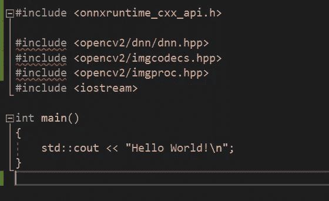

## 安装 OpenCV

我们可以做同样的事情，为您的项目安装 openCV 只需搜索 opencv 并点击安装按钮。但是如果用默认版本安装 openCV，会很旧；因此，您可以指定版本以获取最新版本。

例如你输入 ***opencv4***

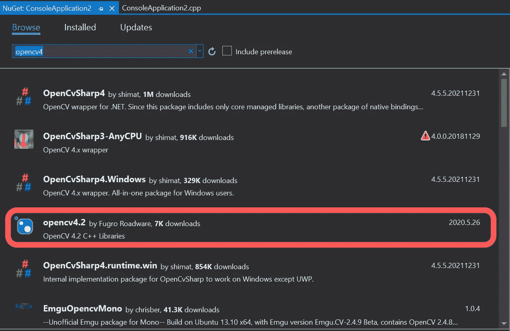

那就装着享受吧！

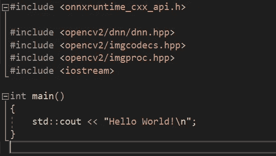

# 结论

所以你可以看到使用 Microsoft Visual Studio 和 NuGet 安装这些包是多么简单，你也可以对其他 Python 包如 Tensorflow 做同样的事情…

# 关于作者

> 穆罕默德·艾尔·阿明·莫赫塔里是我的名字。我是计算机视觉领域的研究助理(博士生),从事在线内容的创作。我在 [YouTube](https://www.youtube.com/channel/UCdYyILlPlehK4fKS5DiuMXQ) 上创作视频，在[Udemy](https://www.udemy.com/user/pycad-2/)/[Skillshare](https://www.skillshare.com/user/pycad)上开设课程，并且是 Medium 上的一名作家，此外我还有自己的网站 [Pycad](https://pycad.co/) ，我用它作为一个作品集来分享我所有的知识和作品。有时间的话请看一下:)。

如果你还不是 [*中级会员*](https://pycad.medium.com/membership) ，我建议你马上注册，这样你就可以不受限制地阅读成千上万篇文章，包括我的。

你可以用我的 [*推荐链接*](https://pycad.medium.com/membership) ，我会从你的会员中收取一点佣金:)