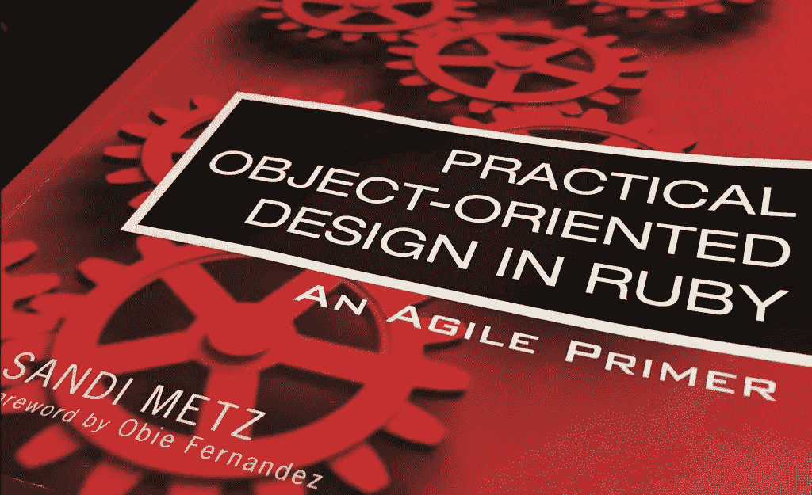

# Python 中的 OOD 管理依赖关系

> 原文：<https://levelup.gitconnected.com/ood-in-python-managing-dependencies-887cd2dc6712>

Sandi Metz 写的《实用的面向对象设计》是一部关于永恒的和基本的 OOD 知识的杰作。为了加深理解，我总结了每一章，并用 Python 重写了示例代码。当然，如果你想得到更多的细节，请得到这本书。

本文是第 3 章“管理依赖”的摘要。



[https://github . com/shotin 93/object-oriented-design-in-python](https://github.com/shotin93/object-oriented-design-in-python)

# 了解依赖关系

当一个对象依赖于另一个对象时，如果一个对象改变，另一个对象可能会被迫改变。

示例代码如下:

```
class Gear:
  def __init__(self, chainring, cog, rim, tire):
    self.chainring = chainring
    self.cog = cog
    self.rim = rim
    self.tire = tire def ratio(self):
    return self.chainring / float(self.cog) def gear_inches(self):
    return self.ratio() * Wheel(self.rim, self.tire).diameter()class Wheel:
  def __init__(self, rim, tire):
    self.rim = rim
    self.tire = tire def diameter(self):
    return self.rim + (self.tire * 2)Gear(52, 11, 26, 1.5).gear_inches()
```

齿轮类对车轮类的依赖性至少为 4。

*   Gear 希望名为 Wheel 的类存在。
*   Gear 期望轮子实例响应直径。
*   Gear 知道 Wheel()需要轮辋和轮胎。
*   Gear 知道 Wheel()的第一个参数必须是 rim，第二个参数是 tire。

这些相关性导致齿轮等级将由于车轮等级的改变而被迫改变。

Gear 类对 Wheel 类了解得越多，它们之间的耦合就越紧密。两个对象耦合得越紧密，它们就变得像一个单独的对象。

如果发生这种情况，当车轮等级改变时，你必须改变齿轮等级。当你想只使用齿轮类时，轮类就出现了。当你想测试齿轮等级时，你必须测试车轮等级。

# 编写松散耦合的代码

在下一个示例代码中，Gear 类期望用一个可以响应 diameter 的对象来初始化，而不是期望一个名为 Wheel 的类存在。

```
class Gear:
  def __init__(self, chainring, cog, wheel):
    self.chainring = chainring
    self.cog = cog
    self.wheel = wheeldef ratio(self):
    return self.chainring / float(self.cog)def gear_inches(self):
    return self.ratio() * self.wheel.diameter()class Wheel:
  def __init__(self, rim, tire):
    self.rim = rim
    self.tire = tiredef diameter(self):
    return self.rim + (self.tire * 2)Gear(52, 11, Wheel(26, 1.5)).gear_inches()
```

这个变化很小，但是这个变化带来巨大的好处。Gear 现在可以与任何具有直径的对象协作，并且对象不需要命名为 Wheel。通过代码行的数量减少而不是增加，带来好处。

## 隔离依赖性

然而，这个样本是理想情况。当您使用现有应用程序时，可能会受到严重的限制。

**隔离实例创建**

您可以隔离实例创建，如下面的两个示例:

Sample1 实例创建被移至构造函数。

```
class Gear:
  def __init__(self, chainring, cog, rim, tire):
    self.chainring = chainring
    self.cog = cog
    self.wheel = Wheel(rim, tire) def gear_inches(self):
    return self.ratio() * self.wheel.diameter()
```

示例 2 —方法中定义了实例创建。

```
class Gear:
  def __init__(self, chainring, cog, rim, tire):
    self.chainring = chainring
    self.cog = cog
    self.rim = rim
    self.tire = tire def gear_inches(self):
    return self.ratio() * self.wheel().diameter() def wheel(self):
    return Wheel(self.rim, self.tire)
```

当然，这两个样本仍然知道得太多，但是，gear_inches 中的依赖项数量已经减少。

**隔离外部消息**

现在是时候把注意力转向外部信息了，也就是“发给自己以外的人”。例如，gear_inches 向自身发送比率和车轮，但向车轮发送直径。

要删除外部依赖，您可以将其封装在如下方法中:

```
class Gear:
  def __init__(self, chainring, cog, rim, tire):
    self.chainring = chainring
    self.cog = cog
    self.rim = rim
    self.tire = tire def gear_inches(self):
    return self.ratio() * self.diameter() def wheel(self):
    return Wheel(self.rim, self.tire) def diameter(self):
    self.wheel().diameter()
```

在原始代码中，gear_inches 知道轮子有一个直径。齿轮现在隔离车轮()。diameter()和 gear_inches 可以依赖于发送给 self 的消息。

## 移除参数顺序依赖性

作为发送者，你不可避免地要知道发送消息的参数。许多方法不仅需要参数，还需要按照收集顺序传递参数。

在此示例中，Gear 类需要三个参数来初始化，即链环、齿轮和车轮。它不提供默认值，参数必须按收集顺序传递。

```
class Gear:
  def __init__(self, chainring, cog, wheel):
    self.chainring = chainring
    self.cog = cog
    self.wheel = wheel...Gear(52, 11, Wheel(26, 1.5)).gear_inches()
```

**使用字典进行初始化参数**

可以使用字典(像 Ruby 中的 hash)来避免依赖固定顺序的参数。下一个例子展示了这种技术。

```
class Gear:
  def __init__(self, args):
    self.chainring = args["chainring"]
    self.cog = args["cog"]
    self.wheel = args["wheel"]...Gear(
  {
    "chainring": 52
    , "cog": 11
    , "wheel": Wheel(26, 1.5)
  }
).gear_inches()
```

这种技术有几个优点:

*   移除对参数顺序的所有依赖
*   Gear 现在可以自由添加或删除初始化参数
*   任何改变都不会对其他代码产生副作用

**明确定义默认值**

您可以使用 Python 中的“get”设置字典的默认值，如下所示:

```
class Gear:
  def __init__(self, args):
    self.chainring = args.get("chainring", 52)
    self.cog = args.get("cog", 11)
    self.wheel = args["wheel"]...Gear(
  {
    "wheel": Wheel(26, 1.5)
  }
).gear_inches()
```

当然，我们有任何其他方法来设置默认值，发送者不需要知道使用默认值需要的参数。

# 管理依赖方向

原书用一些有用的数字和较少的代码写了许多关于依赖方向的内容。我不会在这篇文章中写这些，因为这不是这本书的副本。如果你想要更多的细节，请购买。

从上面可以看出，您可以删除对象之间的依赖关系。感谢您的阅读！