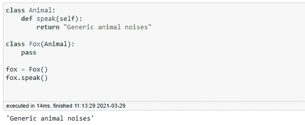
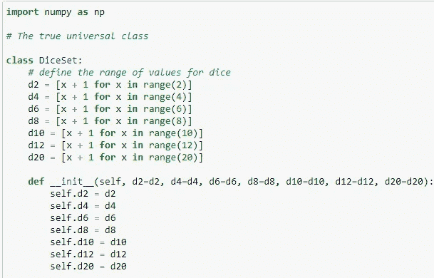
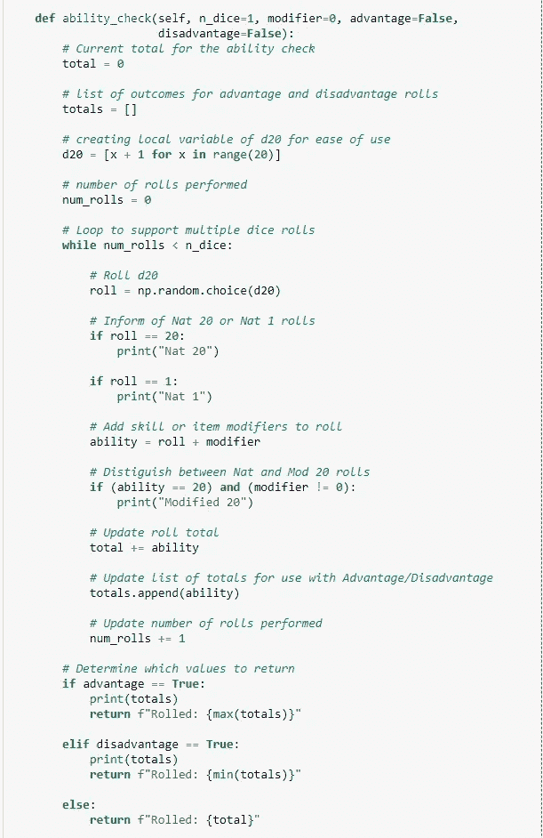
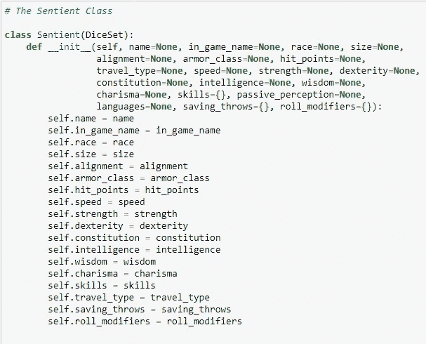
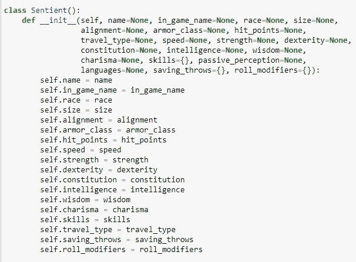
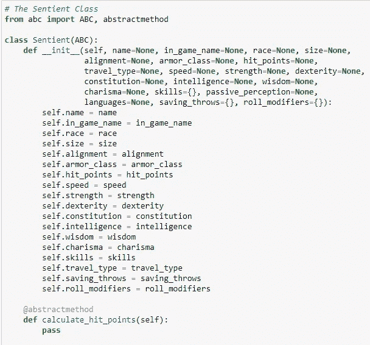
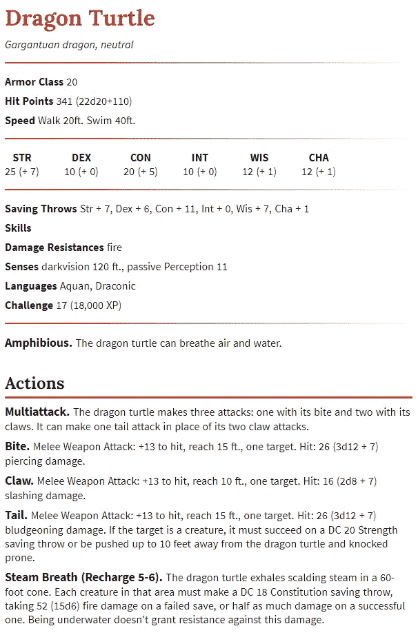
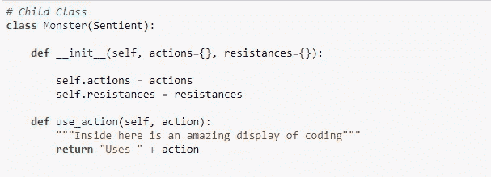
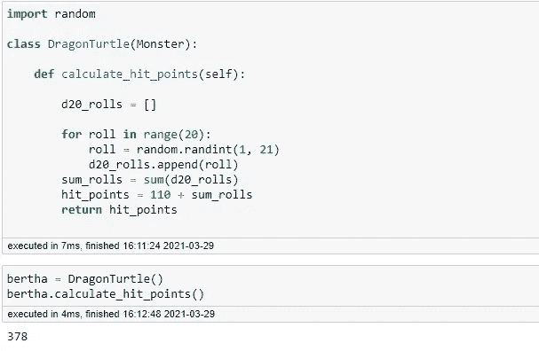

# 面向对象程序设计和 D&D:抽象和抽象类

> 原文：<https://levelup.gitconnected.com/oop-and-d-d-abstraction-and-abstract-classes-70e7336a8faf>

## 用 D&D 理解 OOP 的四大支柱，第二部分

图片来源:[RogueWatson.files.WordPress.com](https://roguewatson.files.wordpress.com/2018/09/tomb-of-annihilation-session-2-aremag.jpg)

上次，我们详细讨论了面向对象编程中的继承原则。继承是 OOP 语言中的一个特性，它允许父类/超类将属性、数据和方法传递给它们的子类/子类。这样做的一个主要好处是，开发人员可以减少冗余代码，因为他们不需要在许多具有层次关系(父子关系)的类中反复显式地编程一个方法，因为子类已经继承了这些方法，并且可以隐式地传递它们。

继承还允许方法重写，即子类与其父类共享一个方法，但实现方法不同。请考虑以下情况:

如您所见，由于继承，`Fox`对象可以隐式地访问其父类的`speak()`方法。然而，狐狸不会发出“普通的动物声音”。正如伊尔维斯曾经问过的:狐狸说了什么？

`Fox`类仍然是`Animal`类的子类，并继承了`speak()`方法。然而，`Fox`类可以为该方法提供自己的实现，覆盖它，这样它返回的东西更适合子类。这种能力打开了多态性的闸门，我们将在下周进一步讨论。现在只需要知道继承在 OOP 语言中是一个非常重要和强大的特性。

今天，我们关注 OOP 的另一个支柱:抽象。

# 什么是抽象？

抽象只是向用户展示他们需要的信息，而不是让这些信息工作的底层代码。上一次我提到过，这类似于打开汽车的过程。一般的司机只会说你只需要“转动钥匙”或者“按下按钮”就可以了。然而，任何一个齿轮头都会告诉你，这些只是过程中发生的一小部分。但是一般的司机真的需要知道整个过程才能发动他们的车吗？没有。

OOP 也是一样。开发人员可以创建充满复杂方法和代码的包，但用户不需要知道或看到所有这些。他们只需要知道如何使用它。

# 抽象和抽象类有关系吗？

没有。

## 那么我们为什么要讨论抽象类呢？？

三个原因！

1.  抽象是一个非常容易理解的概念，不需要很长时间来解释。如果您曾经导入过 Pandas 并执行过类似于`pd.DataFrame.isna().sum().sum()`(用于查找数据帧中 NaN 值的总数)的方法，您就会体验到抽象的好处。挺棒的！
2.  如果你像我一样，疯狂地学习抽象、抽象类、接口等概念，以至于几乎不记得那个周末发生的任何事情，你也可能有突触失灵，认为这两者之间有联系。
3.  当我在 D&D 机制中实现 OOP 时，我需要为自己的判断失误赎罪。

你可能还记得上一次，我强调了掷骰子是 D&D 中最重要的行为。然后我们创建了一个名为`DiceSet`的类，它创建了一组骰子，并有一个名为`ability_check`的方法。

然后我声明了`ability_check`是 D & D(玩家角色、怪物、非玩家角色)中所有众生共有的行为。这就是为什么我选择让我们的下一个班级`Sentient`成为`DiceSet`的孩子。这样,`Sentient`类将继承`ability_check`方法。

不过，这个逻辑有一个问题，我提到过。OOP 的要点是用代码表示真实世界的对象(或者在 D&D 的例子中是虚构的对象)。这意味着父子类这样的层次关系应该是有意义的。然而，`Sentient`对象不是`DiceSet`。那么是哪里出了问题呢？我太专注于游戏机制和继承，以至于没有考虑对象之间的关系。

在这一点上，我不得不再次向弗洛里安·萨利霍维奇喊一声。不仅让我注意到这个问题，还因为他的[优秀文章](https://tigerarcades.medium.com/object-oriented-dungeons-dragon-ccc54e2586ff)，他用自己的方法解决了这个问题。我强烈推荐阅读这本书，因为他出色地展示了对象和类的关系应该如何决定你的设计选择。这表现在他如何将游戏机制和角色/NPC(在他的文章中称为`Agents`)视为两个独立的实体。这太有道理了！游戏机制类似于物理定律；它们定义了什么是可能的，什么是不可能的，所有的物理实体都服从于它们。玩家不是规则(父子关系)，他们也没有规则(这是复合，你在类中创建一个引用另一个对象的实例)。所以，我再次强烈推荐阅读他的文章“[面向对象的地下城&龙](https://tigerarcades.medium.com/object-oriented-dungeons-dragon-ccc54e2586ff)”。

所以现在我们知道我做错了什么，让我们来弥补吧！我们需要做的第一件事是删除对`DiceSet`类的引用。

很好，我们修好了！现在，您可能会注意到这个类的一些奇怪之处。默认参数全部为空或`None`。这是为什么呢？嗯，我们有意将`Sentient`职业设计成尽可能通用的，这样我们就可以为玩家、怪物和 NPC 设计更多的子类。这样，每个子类都可以提供自己的实现。以这种方式设计的类被称为“抽象类”。正式定义是包含一个或多个抽象方法(没有定义实现的方法)的类。它们的目的是为其他类提供一个框架，同时给它们定义适合它们需求的方法的自由。

因为我们的`Sentient`类很大程度上是一个抽象类(它只是缺少了抽象方法来使它符合正式定义),所以让我们继续把它正式化。我们将添加一个名为`calculate_hit_points`的抽象方法，以确保它符合定义，同时使这个类不仅仅是一个数据容器。

在 Python 中，要创建一个抽象类或方法，首先需要从`abc`包中导入`ABC` (抽象基类的首字母缩写)和`abstractmethod`。我们用`class Sentient(ABC):`声明我们的类是抽象的。要创建一个抽象方法，首先用`@abstractmethod`声明它，并命名你的方法，将`self`作为参数传入。用`pass`将方法留空，以便其他类可以设置自己的实现。

你可能想知道，如果在初始化器中已经列出了一个属性，为什么还有一个计算命中点的方法。好吧，让我们来看看龙龟的条目:

注意它的生命值是 341，还有(22d20 + 110)。这是给地下城主的选择。他们可以选择一个默认的，所有龙龟生命值的中间值 341，或者对于一个更多样化的体验，每只龙龟可以有生命值是 22 个 20 面骰子的总和加上额外的 110 生命值。这意味着你可以拥有一只 132 (22*(1) + 110)生命值的“矮子”(最小值)，或者一只 550 (22*(20) + 110)生命值的特别强壮的龙龟(最大值)。

让我们继续制作我们的`Monster`类:

您会注意到`Monster`也有一个具体的方法(它提供了一个实现。尽管如此，`Monster`仍然是抽象的，因为它没有为`calculate_hit_points`方法提供实现。抽象类的子类必须提供所有方法的实现，使它们变得“具体”和可实例化。

为此，我们来为龙龟们上一堂课。

> 注意:通常，当我们定义`DragonTurtle`类时，我会检查并确保每个属性也被填充，因为这些属性在`DragonTurtle`对象的所有实例中是共享的。然而，为了节省时间，我跳过了这一步，因为主要焦点是抽象方法的实现。

现在`DragonTurtle`已经为`calculate_hit_points`方法提供了一个实现，这个类被认为是具体的。我们甚至创造了一个名叫伯莎的`DragonTurtle`，她拥有 378 点生命值。

# 为什么这很重要？

正如类是对象的模板一样，抽象类也是其他类的模板。当你想为一个方法的不同实现提供一个公共接口时，抽象类是个不错的选择。它们用于帮助创建程序的 API 和插件。

下周加入我们对多态性的讨论吧！