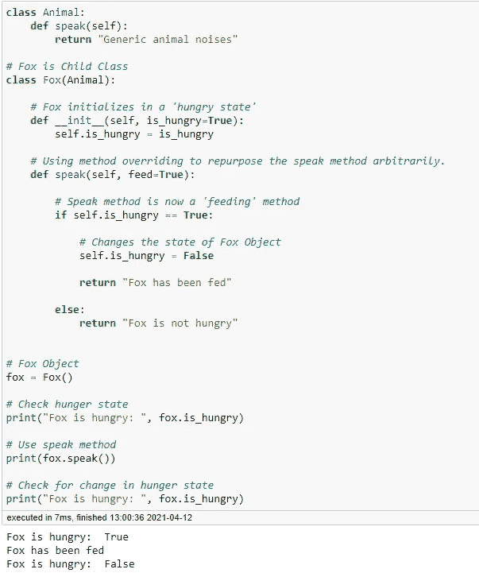
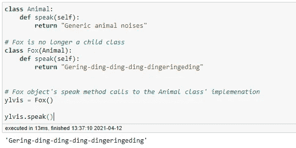
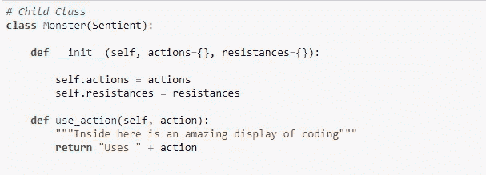
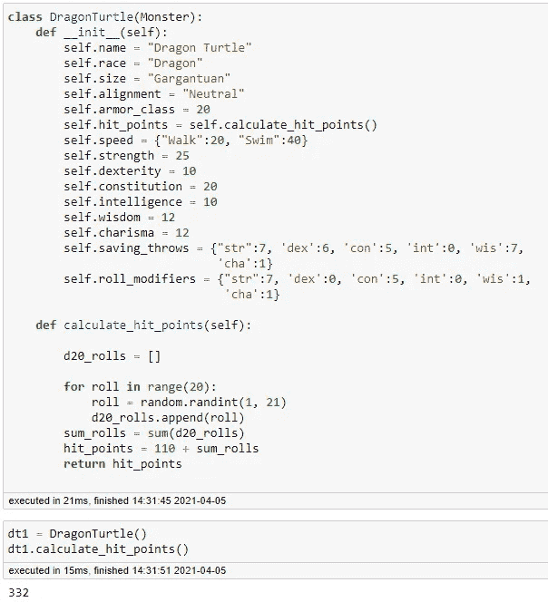
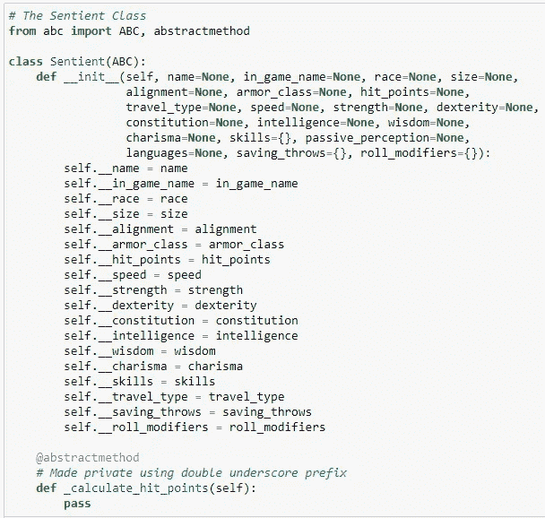
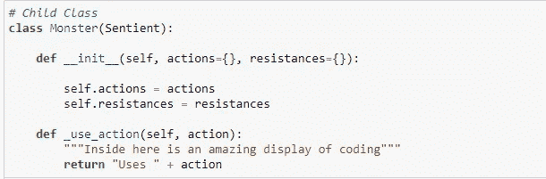
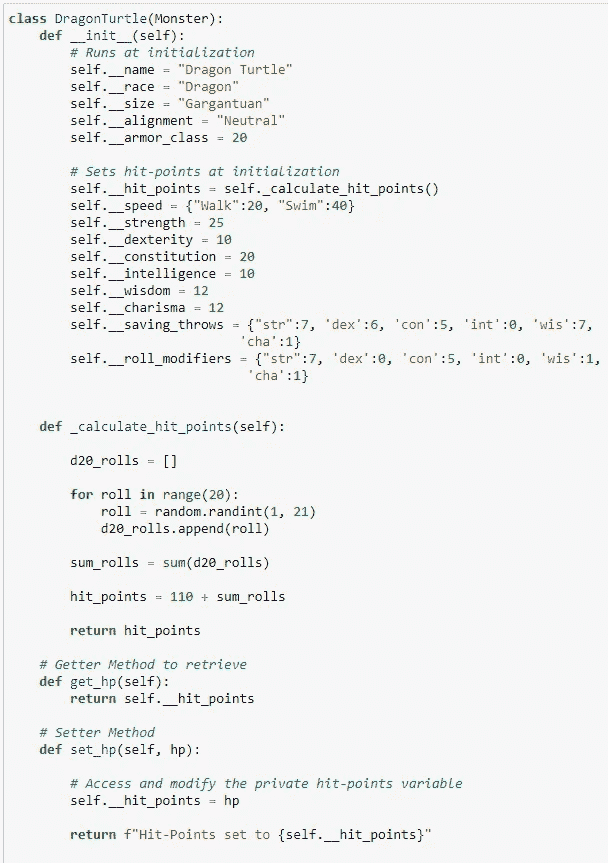
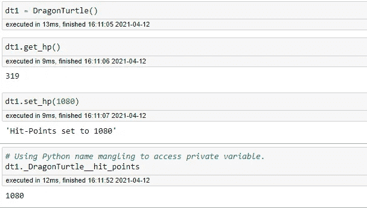

# 面向对象和 D&D:封装

> 原文：<https://levelup.gitconnected.com/oop-and-d-d-encapsulation-4e7ccbd24319>

## 用 D&D 理解 OOP 的四个支柱，第四部分

到目前为止，我们已经讨论了面向对象编程的四个支柱中的三个:继承、抽象和多态。今天，我们将用最后一个支柱:封装来结束这个系列(不，我并没有计划这个系列来建立这个双关语；只是一个幸福的意外)。但是首先，简单回顾一下！

## 遗产

如果您还记得，继承是一个具有层次关系的类(父子类)将数据、变量和方法传递给它们的子类的能力。如果`Animal`类有一个名为`speak()`的方法，那么`Animal`的任何子类(比如`Fox`)都会继承那个方法。

## 抽象

这是开发人员隐藏源代码的能力，只向用户提供使用存储在类和包中的方法和数据所需的细节。这对开发者和用户来说都是好事。开发人员可以保护他们的源代码，用户不需要为自己编写复杂的代码来执行某个功能。如果您曾经使用过 Pandas 库中的`pd.read_csv()`方法将`.csv`文件转换成数据帧，那么您已经从抽象的力量中获益匪浅。你不需要知道所有的底层代码和流程。您只需要知道调用什么方法和传递什么参数。同时，熊猫可以保护他们的知识产权。

## 多态性

我必须向 Angelo Hulshout 大声疾呼，他为我提供了一个更好的多态定义。上一次，我犯了一个错误，说多态性允许类共享相同的名称，但服务于“不同的目的”。虽然这在技术上是可能的，但这是一个糟糕的想法。考虑以下情况:

这里，我们用`speak()`方法创建了`Animal`类。`Fox`类是`Animal`类的子类，因为狐狸是——一种动物。`Fox`类将初始化所有处于“饥饿”状态的`Fox`对象。然后，我们决定使用方法覆盖来改变`speak()`方法的用途(它从父类`Animal`继承而来),这样它就可以“喂养”我们的 fox 并改变饥饿状态。

如您所见，代码仍然有效，但也非常愚蠢和不合逻辑。为什么不做一个`feed()`方法来代替呢？我们本可以提供一个`speak()`的实现，让它打印出狐狸特有的声音，但是没有！我们选择不当，现在必须自食其果。

不管怎样，安吉洛向我指出了这个问题，并提供了一个更好的定义:

> 多态性允许相同功能的不同实现。

换句话说，类可以为一个方法提供不同的实现来实现相同的功能。因此，`speak()`方法可以在`Animal`和`Fox`类之间以不同的方式*实现，但是它们仍然提供相同的功能:让对象“说话”。*

是的，多态性不仅仅是方法覆盖，比如向上转换/向下转换类和方法重载，但是让我们看看这些就够了。

是时候转向封装了！

# 包装

封装是将数据和方法包装在一个单元或类中。这限制了对变量和数据的直接操作，以防止意外修改。让我们来看看龙龟的例子。

所以`Sentient`是一个抽象的祖先类，`Monster`就是从它派生出来的。`Monster`也是抽象的，因为它没有为继承的抽象方法`calculate_hit_points()`提供实现。`DragonTurtle`是`Monster`类的子类(因此，是`Sentient`的孙类)。它为`calculate_hit_points()`提供了一个实现，因此是一个具体的类。

正如您所看到的，`DragonTurtle`类还提供了默认的 stats 来定义实例化的所有龙龟对象。你会注意到在初始化器中，`hit_points`是通过调用`calculate_hit_points()`方法来初始化的。这使得地下城主(DM)在创建对象后不需要运行该方法。

然而，我们确实有一个问题。目前，所有的方法、变量及其相关数据都是“公共”的。这意味着任何类(我是说任何类)都可以访问和修改它们。这就是数据的脆弱性。

那么我们如何限制访问呢？嗯，我们可以让我们的数据**受到保护**或者**成为私有**。

## 有什么区别？

一般来说，**保护的**方法和数据可以被任何子类访问，也可以被同一个包中的任何类访问。请注意我所说的任何子类都可以访问这些数据。这包括位于不同包中的子类。只要他们在“家谱”中，他们就可以访问这些数据。

(再次)一般来说， **private** 方法和数据只能从同一个类内部访问(或者通过 Python name mangling，不过现在不用担心这个)。子类不能访问这些数据。

> 注意:在 Python 中，没有只能在对象内部访问的私有实例变量。相反，为了实现相同的目标，通常会实现某些约定。

那么我们应该选择哪一个呢？嗯，我们在这里的三个类之间有层次关系，但同时，我们不希望任何人改变与变量相关的数据。所以让我们保护我们的方法，保护我们的数据。在 Python 中，要保护变量和方法，只需在它们前面加一个下划线(例如`self._hit_points`)。为了使它们成为私有的，您可以在它们前面加上两个下划线(例如`self.__hit_points`)。让我们继续对我们的`Sentient`类这样做。

我们将对`Monster`做同样的事情。

这样一来，让我们考虑一下我们的`DragonTurtle`类。这是一个能够创建对象的具体类。我们希望用户能够与这些对象进行交互。如果他们能让 50 只不同的龙龟攻击一艘载满玩家的小型捕鲸船，而玩家却不能访问和检索与他们相关的任何数据，这对 DM 有什么好处呢？正因为如此，我们公开了“getter”和“setter”方法，这样用户就可以间接地与对象交互。我们将通过为`hit_points`创建一个 getter 和 setter 方法来用`DragonTurtle`类实现这一点。

如您所见，我们的 getter 方法`get_hp()`只是返回私有变量的值。变量和用户/开发者之间的这种额外的距离防止了任何意外的修改。

你可能想知道为什么我包含了一个设置方法，如果这些是通过方法计算的话。嗯，这更多的是为了 DM。假设你的竞选团队中有一个玩家太强了，正在破坏游戏。你想要创造一个具有挑战性的遭遇，但对团队中的其他人来说并非不可能，同时也要积极地确保你能摧毁那个玩家的角色并给战役带来平衡。`set_hp()`方法允许更“自制”的方法。

让我们测试一下这些方法吧！

我们的 getter 和 setter 都工作得很好！现在在底部，你会注意到我们没有使用 getter 方法来获取生命值。相反，我们使用 Python 名称 mangling。这是一种绕过 getters 和 setters 的方法。如您所见，如果不采取谨慎的步骤，您仍然无法更改这些值(没有人会意外地键入`x._DragonTurtle__hit_points`)。

# 摘要

封装是一种隐藏变量、数据和方法的方式，可以防止它们被意外修改。虽然 Python 没有像 C++和 Java 那样创建私有实例变量的传统方法，但还是采用了简单的实践来帮助创建相同的效果。

至此，我们结束了对 OOP 四大支柱的讨论！这四个概念有一定的统一性，因此缺少一个将导致语言基础的崩溃。他们都在共生关系中工作，相互受益。相当了不起！