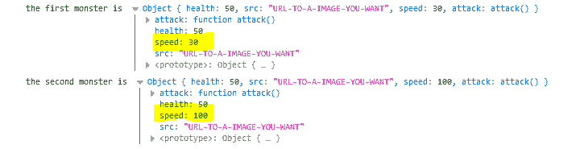
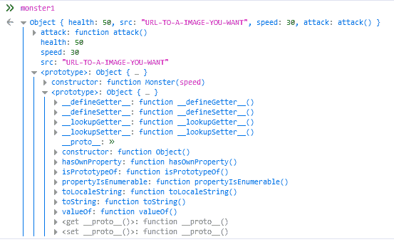
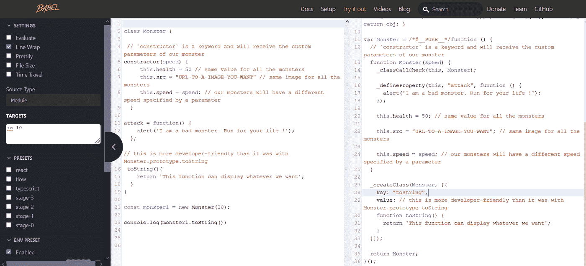

# JavaScript 中的 OOP:用游戏解释

> 原文：<https://levelup.gitconnected.com/oop-in-javascript-explained-using-games-1c3537956b9>

在本文中，我们将讨论使用 prototype 和 ES6 类的 JavaScript 面向对象编程。

在 Javascript 中有两种实现 OOP 的方法:

**1)使用函数和原型
2)使用新的** `**class**` **关键字。(这是 sugar 在 ES6–2015 中引入的语法)**

# 让我们玩一个游戏

马里奥游戏——OOP 真实用例

首先，我们来谈谈为什么要在代码中使用类。
有多种用例，但最常见的可能是视频游戏。

假设你想创建一个有多个相同类型的怪物和相似物品(例如硬币)的游戏。

现在，我们的怪物将拥有相同的形象，相同的生命值，伤害，甚至相同的移动模式。这是定义一个模板(一个类)并创建多个相同类型的相同(或几乎相同)对象的最佳时机。(OOP 中使用的术语是一个类的**实例**

## 等等，所以你说 OOP 只和游戏有关？

一点也不。在商店中，您可以拥有具有相同结构的产品(标题、描述、价格、检查可用性的功能等)。OOP 有无数有效的用例。

让我们写一些代码。

## 1)使用功能和原型

我们需要做的:
—为我们的怪物定义一个自定义结构。
—生命值、src 是**属性**，对所有的怪物
都有相同的值——速度是**可变属性**，我们将其指定为参数
—攻击是**方法***；*在 OOP 术语中，这些函数被称为*方法* ——使用我们的**构造函数** *(* 怪物函数)
——创建 2 个怪物(**类怪物**的实例)，记录这些怪物，并查看它们的区别。

使用原型的怪物类

您应该注意两件事:

怪物类的 2 个实例是什么样子的

a)我们得到了我们所期望的。两个速度值不同的相似怪物。

b)我们有一个怪异的原型 *<原型>* 尽管事实上它不是我们创造的。嗯，这是棘手的部分。JavaScript 会自动为我们创建一个原型对象。

即使对于有经验的开发人员来说，原型也是 JavaScript 最难的部分之一，所以如果一开始看起来像火箭科学，也不要害怕。我们会一步一步来。

## 普罗托呼吸装置..什么？

看起来是这样的:

一个“简单”的原型

首先，它是巨大的:D

你看到了什么？我们的原型有一个构造函数(怪物函数)和**另一个原型？**

第二个原型是 JavaScript 中的通用类型对象，定义了所有的公共属性。

例如，对于每个 JavaScript 对象，我们可以使用函数 **hasOwnProperty** 和 **toString** ，这是因为每个新的类都将继承通用对象的属性。

这就是在 OOP 中**继承**的工作方式。子类将从父类继承特征。

toString 未按预期工作

再介绍一个模糊的词，它会让你在下一次面试中听起来很聪明:**原型链接。→** 和我们之前看到的一模一样。怪物对象有一个原型，这个原型有另一个指向父类的原型。

假设我们有一个特殊类型的 monster **Flyingmonster** ，它具有来自其父类(Monster 类)的所有特征——所以我们说 FlyingMonster **扩展了 Monster 类**，Monster 类**扩展了 JavaScript 的通用对象类**。

飞行怪兽→怪兽→通用物体

在这种情况下，FlyingMonster 将生成一个原型，它包含对 Monster 类的原型的引用，Monster 类包含对一般对象的原型的引用。

现在，让我们后退一步，谈谈重写一个方法。(简单地说，这意味着修改我们的 monster 从父类继承的一个方法)。

## 覆盖“toString”*方法*

现在，让我们为 **toString** 方法实现*覆盖*并尝试一下。

重写 toString 方法

关于原型，我们可以讨论很多事情，但目前已经足够了。对于更复杂的 OOP 概念，我将写一篇不同的文章。

## 2)使用新的*类*关键字。(这是 sugar 在 ES6–2015 中引入的语法)

使用 ES6 class 关键字的 Monster 类

这个解决方案对开发者来说只是语法糖。ES6 代码将被转移到 ES5，因为旧浏览器不支持 JavaScript 中的所有新功能。

根据 transpiler 的设置，代码看起来会有所不同。这是它在 Internet Explorer 10 中的外观。你可以看到它类似于我们的第一个实现。(用函数代替类)

巴别塔 ES6 代码传输到 ES5

## 家庭作业

你能使用 ES6 重新创建扩展 Monster 类的 FlyingMonster 类吗？一点也不难。让我给你一个提示:

 [## 类- JavaScript | MDN

### 类是创建对象的模板。他们用代码封装数据来处理这些数据。JS 中的类是…

developer.mozilla.org](https://developer.mozilla.org/en-US/docs/Web/JavaScript/Reference/Classes) 

## **结论**

我希望你今天能学到一些关于 JavaScript 的新的有趣的东西。作为回顾，我们介绍了一些 OOP 术语:
**-原型
-类
-实例
-构造器
-继承
-扩展类
-原型链接**

请在评论中告诉我你的想法，以及我是否应该继续写一篇关于 JavaScript 中 OOP 的更高级的文章。