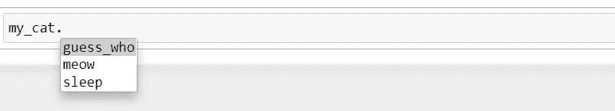

# OOP——Python 中的继承和多态

> 原文：<https://levelup.gitconnected.com/oop-inheritance-and-polymorphism-in-python-fd04878e4ffa>


在 [Unsplash](https://unsplash.com?utm_source=medium&utm_medium=referral) 上由[Meagan carscience](https://unsplash.com/@mcarsience_photography?utm_source=medium&utm_medium=referral)拍摄的照片

详细了解 Python 中继承和多态的面向对象编程概念的指南

继承是使用已经定义的类来形成新类的一种方式。优点是能够重用代码并降低程序的复杂性。

# 遗产

我们首先创建一个名为“animal”的基类，它没有任何参数，只是使用“init”方法打印一条语句。然后再创建两个方法。

```
**>>> class** Animal():
        **def** __init__(self):
            print("Animal class created") **def** guess_who(self):
            print("I am an animal") **def** sleep(self):
            print("I am sleeping")>>> my_animal **=** Animal()
Animal class created>>> my_animal.sleep()
I am sleeping
```

您可以看到创建的实例的方法。


现在，如果需要的话，新类可以继承这个基类的一些方法。就像我们需要一个“猫”类，那么动物类的一些特性对狗类是有用的。所以我们可以继承基类“动物”。在创建派生类时，我们将“Animal”作为参数传递。然后定义一个“init”方法，我们称之为“Animal__init__”方法。这样，当我们创建“猫”类的实例时，我们就创建了一个动物类的实例。你会发现“动物”类的方法是由“猫”类派生出来的。您也可以覆盖现有的方法。就用同一个名字。添加新方法也是可能的。

```
**>>> class** Cat(Animal):
        **def** __init__(self):
            Animal.__init__(self)
            print("Cat class created") **def** guess_who(self):
            print("I am a cat") **def** meow(self):
            print("MEOWW!")>>> my_cat **=** Cat()
Animal class created
Cat class created>>> my_cat.guess_who()
I am a cat>>> my_cat.meow()
MEOWW!
```

您可以看到为“Cat”类创建的实例的方法。



# 多态性

它指的是不同的对象类可以共享同一个方法名的方式。我们创建了两个类“狗”和“猫”,它们有相同的方法“说话”。当我们调用每个对象的 speak 方法时，它返回一个对该对象来说唯一的结果。

```
**>>> class** Doggy():
        **def** __init__(self,name):
            self.name **=** name **def** speak(self):
            **return** self.name **+** " says WOOF"**>>> class** Catty():
        **def** __init__(self,name):
            self.name **=** name **def** speak(self):
            **return** self.name **+** " says MEOW">>> my_dog **=** Doggy("Buzo")
>>> my_cat **=** Catty("Tim")>>> print(my_dog.speak())
Buzo says WOOF>>> print(my_cat.speak())
Tim says MEOW
```

所以请注意“我的狗”和“我的猫”有相同的方法名“speak ”,但是它们有不同类型的类。

```
**>>> for** pet **in** [my_dog, my_cat]:
       print(type(pet))
       print(type(pet.speak()))
       print(pet.speak())<class '__main__.Doggy'>
<class 'str'>
Buzo says WOOF
<class '__main__.Catty'>
<class 'str'>
Tim says MEOW
```

# 抽象类和继承

抽象类永远不会被实例化。这样一个类的实例永远不会出现。它被设计成仅用作基类。

```
**>>> class** Animal():
        **def** __init__(self,name):
            self.name **=** name **def** speak(self):
            **raise** NotImplementedError("Subclass must implement this abtract method")>>> my_animal **=** Animal("Tia")>>> my_animal.speak()**---------------------------------------------------------------------------**
**NotImplementedError**                       Traceback (most recent call last)
**<ipython-input-28-ed4198de9ea6>** in <module>
**----> 1** my_animal**.**speak**()****<ipython-input-26-977e7051d647>** in speak**(self)**
      5 
      6     **def** speak**(**self**):**
**----> 7         raise** NotImplementedError**("Subclass must implement this abtract method")****NotImplementedError**: Subclass must implement this abtract method
```

所以现在出现了一个错误，因为这个类不应该被实例化。这是一个抽象类，因为在基类中它不做任何事情，并期望你继承这个类并覆盖这个方法。事实上，我们需要创建一个子类并实现这个方法，我们将在下面看到。注意，这里我们不必对“init”方法进行分类。

```
**>>> class** Dog(Animal):
        **def** speak(self):
            **return** self.name **+** " says Woof!"**>>> class** Cat(Animal):
        **def** speak(self):
            **return** self.name **+** " says Meow!">>> jim **=** Dog("Jim")
>>> tim **=** Cat("Tim")>>> print(jim.speak())
Jim says Woof!>>> print(tim.speak())
Tim says Meow!
```

参考笔记本[这里](https://github.com/jayashree8/Python_guide/blob/master/Python%20object%20oriented%20programming/OOP%E2%80%8A-%E2%80%8AInheritance%20and%20Polymorphism%20in%C2%A0Python.ipynb)。

## 学习 Python 可以参考的入门书籍:

[](https://amzn.to/3yDY4To) [## Python 速成班，第二版:基于项目的编程入门实践

### 世界上最畅销的 Python 书籍的第二版。一个快速的，没有废话的 Python 编程指南…](https://amzn.to/3yDY4To) [](https://amzn.to/3vtvQZv) [## 艰难地学习 Python:一个非常简单的介绍可怕的美丽世界…

### 你会学习 Python！Zed Shaw 完善了世界上最好的学习 Python 的系统。遵循它，你会…](https://amzn.to/3vtvQZv) [](https://amzn.to/3urluYI) [## 思考 Python，2e:如何像计算机科学家一样思考

### 思考 Python，2e:如何像计算机科学家一样思考](https://amzn.to/3urluYI) 

## 学习 Python 可以参考的高级书籍:

[](https://amzn.to/3fMzVBn) [## 编程 Python:强大的面向对象编程

### 如果你已经掌握了 Python 的基础，你就可以开始使用它来完成真正的工作了。编程 Python 将…](https://amzn.to/3fMzVBn) [](https://amzn.to/34oFFMl) [## 高级 Python 编程:使用以下工具构建高性能、并发和多线程应用

### 关键特性使用 Dask 和 PySpark Master 技能在集群上设置和运行分布式算法，以准确地…](https://amzn.to/34oFFMl) 

> *联系我:* [*LinkedIn*](https://www.linkedin.com/in/jayashree-domala8/)
> 
> *查看我的其他作品:* [*GitHub*](https://github.com/jayashree8)