# 与 D&D 的 OOP:继承

> 原文：<https://levelup.gitconnected.com/oop-with-d-d-e8fef2b3b6e7>

## 用 D&D 理解 OOP 的四大支柱，第一部分

> 更新 3/24/2021:我想花点时间感谢[弗洛里安·萨利霍维奇](https://tigerarcades.medium.com/)帮助我确定需要澄清的领域。

今天，我们将讨论“面向对象编程的四大支柱”之一的继承。我们将在讨论中使用的编程语言是 Python。我应该声明我对 Python 有偏见。为什么？因为语法更简单。就是这样。

所以让我们开始吧！

# OOP 的四大支柱是什么？

四大支柱如下:

**继承**:子类中的对象从其父类继承行为和属性的能力。

**抽象**:你只显示“相关”数据，而对用户“隐藏”不必要的细节的过程。就像开汽车一样。汽车制造商知道“转动钥匙”(或按下按钮)只是启动汽车发动机过程的一部分。另一方面，司机不需要知道这个过程的每一个细节，他们只需要知道如果你转动钥匙/按下按钮，引擎就会启动。那是抽象。在 OOP 中，它赋予开发者创建类和包的能力，用户只需要知道如何/何时访问和使用这些方法，而不需要知道它是如何工作的。

**多态性**:一个函数或方法操作许多不同类型的能力。例如，`print(len("hello")`和`print(len([1, 2, 3, 4, "a", "b", "c"]))`都是函数`len()`的有效用法，尽管它是在字符串和列表上操作。在 OOP 中，这也允许我们在子类中定义与父类同名的方法(称为方法覆盖)。

**封装**:将数据(变量)和方法包装在一个单元(比如一个类)中，以限制对它们的直接访问，并防止意外修改的能力。

这四个原则为所有面向对象编程语言奠定了坚实的基础。缺少一个组件会导致语言变得容易出错/出错，占用太多内存，并且需要比必要的代码多得多的代码(这种情况会让我对 Java 的抱怨看起来像是我太小气了……我的确是这样，但是你知道我的意思)。

今天，我们将讨论继承是如何工作的。龙与地下城的时间到了！

# D&D

D&D 非常适合练习 OOP 有几个原因。首先，这是一个游戏，有数百种不同的生物和其他独特的资产，但仍有相似的特征(例如，精灵和人类都是“类人生物”，尽管他们是不同的种族，拥有不同的能力)。

D&D 与 OOP 合作良好的另一个原因是因为大多数视频游戏都有一些类似于 D&D 的机制。从显而易见的 RPG 到第一人称射击游戏，所有游戏都实现了某种“掷骰子”机制。不相信我？想想在 FPS 中，如果你的角色模型处于静止状态，你的武器是如何更加精确的。这相当于 D&D 的“优势”机制，你通过两次滚动你的能力检定并使用较大的数字来增加击中目标的几率。在电子游戏中，你通过降低移动速度和蹲下来获得“优势”。另一方面，通过奔跑和射击，你处于劣势(掷出你的能力检定两次，使用较少的数字)，并且不太可能击中你的目标。

说完了，让我们开始吧！

## 原始阶级

想到我们的第一个家长班级可能很难。父类应该很一般。如果我们想创建一个父类，游戏中所有有意识的物体都是从这个父类派生出来的，那么它应该只包含所有有意识的角色、NPC 和怪物共有的属性和行为。你可能会想，一个优秀的职业会有名字、种族、生命值、阵营、盔甲等级等属性。就像这里的统计表一样。

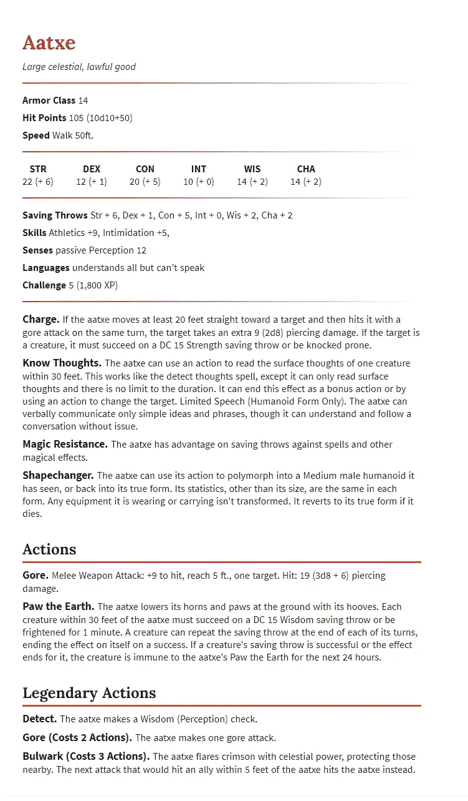

来源:[Open5e.com](https://open5e.com/monsters/aatxe)

上面的大部分统计都是通用的，只有少数例外，比如传奇动作。这将是一个很好的起点！但是还有一样东西是游戏中所有东西都共享的:骰子！

掷骰子决定了游戏中每一个有知觉的生物的每一个行动的成败。因此，我们希望我们所有的生物和角色都继承掷骰子的方法。

所以我们就从那里开始吧！

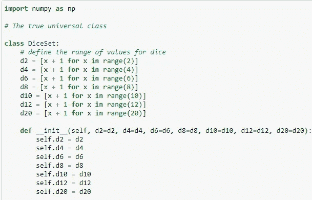

这里，我们已经开始了一个类，它定义了集合中的骰子是什么，以及单次掷骰子可能得到的结果(注意:d2，或者有两面的骰子，不是骰子。它本质上是一个抛硬币的游戏，不在正常的 D&D 机制中，但它是供地下城主酌情使用的，例如当 NPC 有 50%的成功机会时)。在 Python 中,`__init__`方法是初始化器(或者“构造器”,如果你是 Java 爱好者的话)。此方法中的属性被视为所有子类的默认属性。参数`self`是一个 Python 参数。当一个类被实例化为一个对象时，对象本身作为所有方法中的第一个参数被隐式传递。考虑到这一点，标准的做法是添加参数`self`作为参数。当我们添加下一个方法:能力检查时，您将看到一个这样的例子！

能力检定是 D&D 中最重要的机制。在游戏中，如果你想执行一些需要技巧的动作(比如说服某人为了一颗豆子卖掉他们所有的财产，或者在墙上跑)，你必须执行能力检定。为此，您滚动 d20 并添加角色可能有的任何修改器。地下城主会分配一个数字来代表这个动作的难度，这个数字被称为难度等级(DC)。你的能力检定(掷骰子和你可能有的任何修正值的总和)必须大于或等于 DC。

举个例子，假设你想让你的角色在墙上跑。在墙上跑很难，但你不需要成为专业的杂技演员才能做到，所以你的 DM 说你至少需要滚一个 14。这意味着对于你的能力检定，你的掷骰和你的修正值需要加起来至少是 14。

修正值与你的角色的属性有关。如果你的角色真的擅长杂技，他们自然会有更高的成功几率，所以他们会有更大的正面修正值，比如“所有杂技能力检定加 5”。因此，如果你的掷骰子是 9，你仍然会在墙跑中成功，因为你的+5 修正值把你的 9 变成了 14。

然而，让我们假设你的角色不是运动型的，你有一个-1 修正值。好吧，即使你掷出了 14，修改量-1 会把它变成 13，你失败了，因为表演特技对你来说很难。

掷出一个“自然 20”，意思是掷骰子本身的结果是 20，没有修饰，保证你的成功(DM 不能因为破坏了他们的计划就强迫你失败)。

然而，掷出 1(一个“自然的 1”)肯定会失败，而且是大失败(无论什么坏事都会发生)。不管你的修正值是多少，一个力量过大的角色都无法逃脱 DM 的愤怒。

我知道这有点跑题，但是如果我们要用代码重新创建它，我们需要知道机制是如何工作的。因此，有了所有这些知识，我们将创建`ability_check`方法(注意:一个方法就像一个函数，除了绑定到一个类和它的实例变量)。

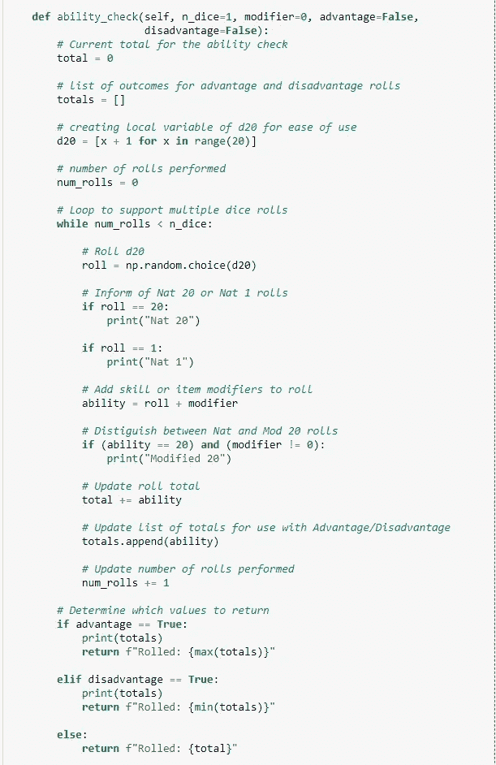

正如你所看到的，我们有优势和劣势的参数，一个角色的修饰符，以及掷骰子的数量(记住，对于优势和劣势，你必须掷出两次 d20，并分别选择较大或较小的数字)。让我们来测试一下！

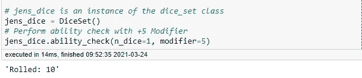

回到墙的例子。Jennifer 是我们角色的名字，我们通过创建一个`DiceSet`类的实例为她掷骰子。詹妮弗运动能力极强，擅长杂技，因此她的杂技能力检定有+5 调整值。可悲的是，她有一个休息日，她推出了一个“修改”10，她失败了，在墙上滑倒。即使是奥运选手也有不顺利的时候。

假设她喝了一杯很棒的咖啡，这给了她一点动力:

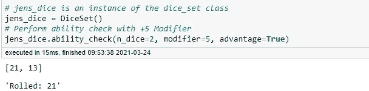

太棒了，她通过了！现在，如果有人在她早晨的咖啡里掺了药，而现在她的判断力丧失了，这让她处于不利地位:

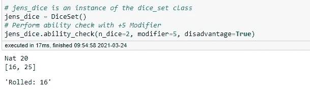

幸运的是，她的肌肉记忆能够帮助她避免摔倒！(注意:仅仅因为你处于劣势，并不意味着你一定会失败。它只是增加了失败的概率，迫使你掷出两次并选择较低的数字，即使你掷出的其中一次是如上所示的 Nat20。这就是詹妮弗通过能力检查的原因。较低的数字，修正后的 16，仍然高于在墙上跑步的难度等级 14。)

## 遗产

好吧！我们的方法起作用了，我们的第一个父类工作正常。现在让我们创建一个子类，它将成为游戏中有感知物体的蓝图。我们称它为`Sentient`，因为它的所有属性都是怪物和角色共有的。

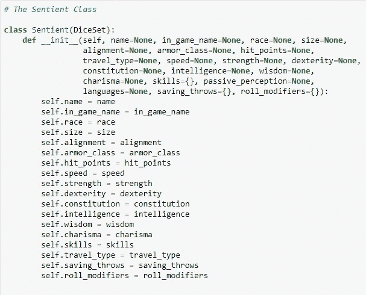

上面，你可以看到当我们声明`sentient`类时，我们在括号内传递了`DiceSet`。这就建立了父子关系；`Sentient`是`DiceSet`的孩子。这提出了一个很好的问题。作为所有感知类的父类的类应该是代表骰子的类的子类吗？通常，您会希望父类和子类的名称相互关联，以反映它们之间的关系。例如，`Sparrow`类的层次结构如下所示:

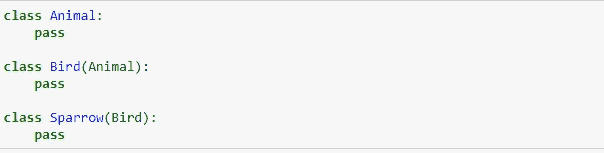

在这里，我们看到一种明确的关系；家谱的一种形式。还有祖先类`Animal`，它是`Bird`的父类(因为鸟是一种动物)，它有子类`Sparrow`(麻雀是一种鸟)。因此，类应该遵循 IS-A(N)关系。但是我们都知道有感觉的东西不是骰子的例子。一个有知觉的生物有一套骰子。这涉及到继承的一个更微妙的特征，叫做“组合”，我们现在不讨论它，因为我已经在教你玩 D & D 了，那么我的例子合适吗？绝对不行。我们到底要不要接受它？是的，但是要明白一个更恰当的用法是要么让`DiceSet`成为一个其他类可以*实现*的接口，要么让规则和游戏机制与`Sentient`类对象及其子对象完全分离。

当我们下周讨论抽象时，我们将解决这个突出问题的一部分。现在，让我们检查一下`Sentient`类是否继承了`DiceSet`类的所有东西。

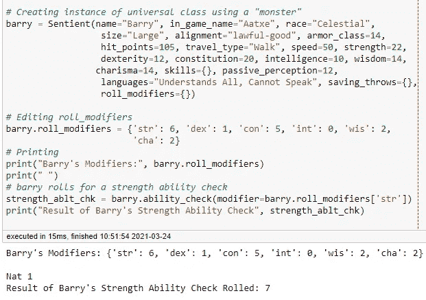

正如我们所看到的，我们的 Aatxe(名为 Barry)从它的父类继承了一切！詹妮弗呢。她从这段新关系中继承了什么吗？

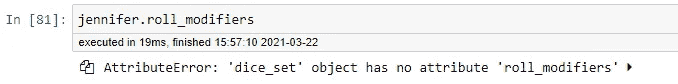

Jennifer 没有滚动修改器，因为她是一个`DiceSet`对象。父类对象不能继承子类的特征。

现在，让我们创建一个`Monster`类，它是`Sentient`类的子类。我们前面提到过，角色和怪物的一个很大的区别是，只有怪物才有传奇的动作。因此，`Monster`类将拥有自己的属性和使用它们的方法。

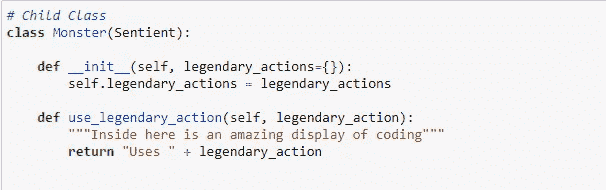

接下来我们将创建一个新的 Aatxe 怪物，这次它将是一个`Monster`类的对象。因为它的父类是`Sentient`类，我们应该能够在实例化时定义怪物的属性，就像我们可以定义它的父类一样。我们还将定义`legendary_actions`方法的 Aatxe 实现。

好吧，让我们看看莱斯利能做什么！我们能访问她的种族(一个父属性)吗？

她有哪些传奇动作的选项？

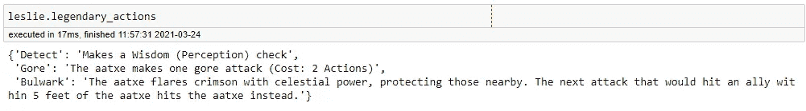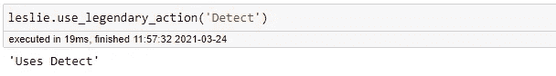

如果在佛罗里达州奥兰多销售分时度假产品的难度等级为 15，她能完成销售吗？

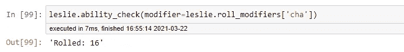

我们通过了 Leslie 的魅力修正值(毕竟，她需要一个圆滑的谈话者)作为我们的`ability_check`方法的`modifier`参数，她投了 16 分。分时度假已经卖出去了，宝贝！

撇开轻佻不谈，这证明了后代类和对象也从它们的祖先继承属性和方法。

兄弟类(共享同一个父类的类)呢？兄弟类可以互相继承对方的方法吗？让我们创建一个`character`类，看看它是否继承了它的兄弟类的`legendary_actions`方法。

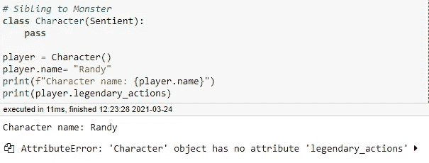

因此`Character`类的对象可以覆盖它们从其父类继承的`name`属性，但是不能从其兄弟类继承`legendary_actions`方法。

# 为什么上课？

您可能已经注意到，我主要使用类作为数据存储。那为什么不直接用数组或者字典呢？好问题！

一个类创建一个蓝图或模板来创建对象，您可以存储数据(如角色信息)或行为(允许您的对象执行功能的方法，如滚动能力检查)。由于有了继承，我们可以大大减少需要编写的代码量，因为子类可以访问他们能够继承的所有方法和属性。因此，我不需要为每个怪物或角色重写`ability_check`方法。

下一次，我们将讨论 OOP 的另一个支柱:抽象。到时候见！