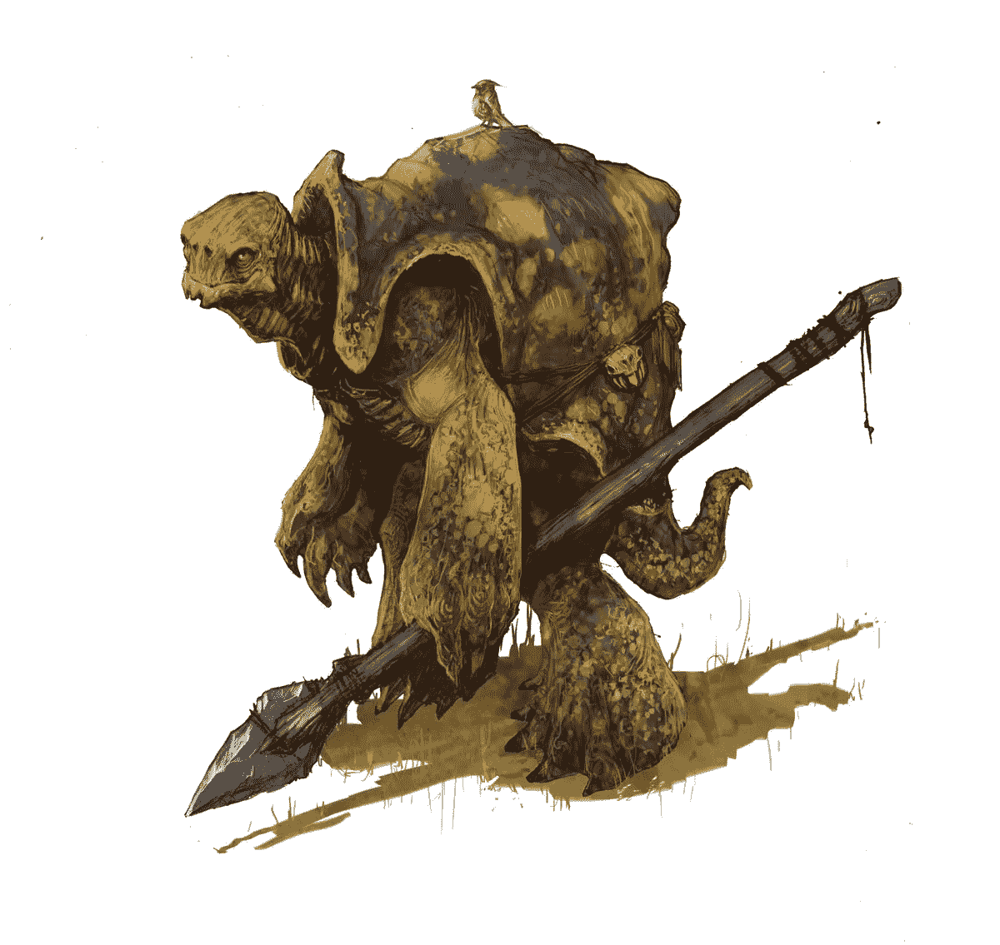
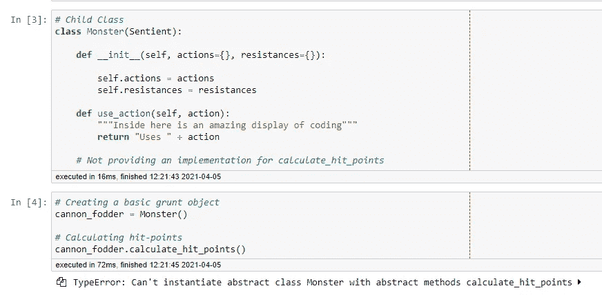
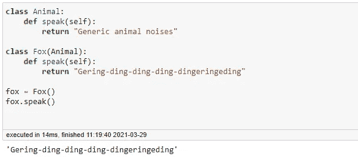
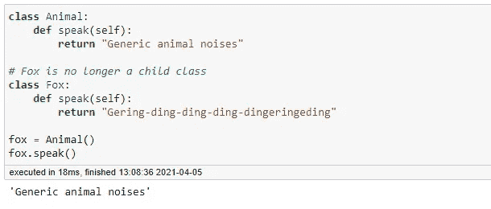
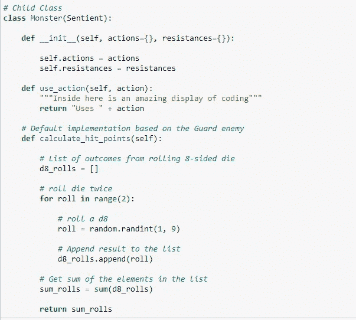
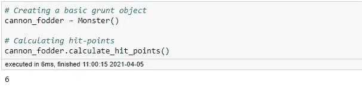
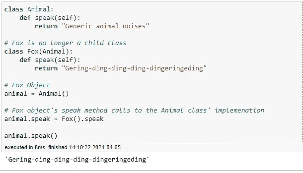
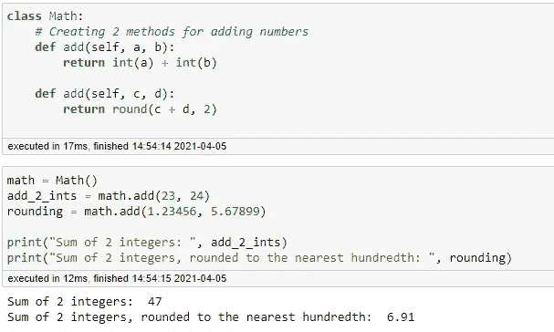

# 面向对象的 D&D:多态性

> 原文：<https://levelup.gitconnected.com/oop-with-d-d-polymorphism-b1974435063b>

## 用 D&D 理解 OOP 的四个支柱，第三部分

上周，我们讨论了抽象，这是一种开发人员只提供使用各种类及其方法所需的细节，而不将它们暴露给底层代码的能力。这为你的源代码提供了保护，同时也节省了用户的时间，因为当他们想要使用你的方法、类、包等的时候，他们不需要重新发明轮子。这是一个非常简单的概念！

我们还讨论了抽象类，即至少有一个未定义方法的类。在 Python 中，首先需要从`abc`包中导入`ABC` (抽象基类的首字母缩写)和`abstractmethod`。我们通过使我们的类成为`ABC`类的伪子类来声明我们的类是抽象的。要创建一个抽象方法，首先用`@abstractmethod`声明它，并命名你的方法，将`self`作为参数传入。我们用`pass`将方法留空，以便其他类可以设置自己的实现。

`Sentient`类现在是一个抽象类。这意味着它不是可实例化的。这是因为抽象类不是用作对象的蓝图，而是用于其他类。此外，抽象类的任何子类也将是抽象的，直到它们为它们继承的所有抽象方法提供实现。因此，`Monster` class 也是一个抽象类，尽管它没有被声明为“抽象”。它通过继承变得抽象。

一旦提供了一个实现，这个类就变得具体和可实例化了，正如我们在`DragonTurtle`类中看到的:

子类如何为一个方法(抽象的或不抽象的)提供实现的想法为今天的主题:多态性提供了一个很好的开端。

> 2021 年 4 月 12 日更新:特别感谢[Angelo hul shour](https://angelohulshout.medium.com/)花时间向我阐明多态性的定义。之前，我说错了，方法可以“共享相同的名称，但用于不同的目的。”这是**很差的做法**。毕竟，你不会想要两个叫做`add()`的方法，并让其中一个打印一首歌的歌词！我冒昧地用 Angelo 提供的更合适的定义更新了这篇文章。

# 什么是多态性？

多态性真的很奇怪。在编程中，多态性是一种允许方法共享相同名称但具有不同实现的属性。正如这个词的定义(“多种形式”)所暗示的，多态性以不同的方式表现出来:动态和静态多态性。

## 动态多态性(Python 中)

在 Python 中，动态多态通常是通过方法重写来实现的。这是指子类为从其父类继承的方法提供自己的实现。你可能记得我们上周用`Animal`和`Fox`类和`speak()`方法做了这个。

在这里，即使我们有两个共享方法的独立实现，程序也不会混淆使用哪个版本，因为实现与对象的类相关联。然而，正如我们在下面看到的，这种多态的好处并不仅仅局限于父子关系:

> 注意:虽然这是动态多态的一个例子，但这是 ***而不是*** 方法覆盖。方法重写只能发生在具有父子层次结构的类之间。

在这里，我们已经剥离了类的层次关系，但是 Python 仍然不会对使用哪个版本感到困惑，因为方法还是与对象的类联系在一起。

## 在 D&D

为此，让我们通过为`calculate_hit_points`提供一个实现来使`Monster`类具体化。

我们的方法基于一个人形警卫，因为这是一个很好的基线。现在，我们将测试它是可实例化的。

好吧！该类现在是具体的，并且该方法正在按预期工作。现在，让我们再次创建`DragonTurtle`类，并提供它自己的实现。

如您所见，`DragonTurtle`类的实现覆盖了`Monster`类。这允许更大的灵活性和更具体的实现。

## 为什么这很重要？

首先，你不需要为每一个方法取一个唯一的名字。您也不必使用长而复杂的名称来区分这些方法。当你考虑到程序员经常有类似的想法时，这是非常重要的。如果两个程序员做了一个叫`mean()`的方法会怎么样。它们唯一不同的地方是，只在数组上运行，而另一个在 Pandas 系列上运行。你以完全相同的方式调用这些方法。如果没有多态，你会得到一个错误，因为程序员碰巧用相同的名字命名了他们的函数，尽管它们的操作不同。然而，由于多态性，我们不必担心这一点。

## 动态多态性(其他语言)

一般认为，动态多态是指将一个*子*对象赋给一个*父*类型的引用变量，但表现出子类方法的行为。本质上，对象看起来像父类，但是当你调用它的一个方法时，它的行为就像子类。如果你把一个父对象赋给一个子类型的引用变量，而结果正好相反:它看起来像子类，行为像父类。同样的事情在 Python 中也可以实现，但是看起来有点不一样。

在这种情况下，对象看起来像一个`Animal`，但行为像一个`Fox`。我们实现这个的方式基本上是通过覆盖对象的`speak`方法，这样它就调用了`fox`类的实现。这不同于像 Java 这样的语言，在 Java 中，你将引用变量声明为一个`Animal`类型，并将它赋给一个`Fox`对象。Python 之所以不同，是因为所有变量都是动态的；它们不像在 Java 中那样被赋予“类型”。

这可能比它需要的更令人困惑。请记住，动态多态性允许您将一个方法的实现更改为另一个类的实现，以便进一步定制。

## 静态多态性

静态多态允许一个类有多个同名的方法，只要它们采用不同的参数。这被称为方法重载。

这里，我们提供了两个名为`add`的方法，它们接受不同的参数。一个显式地接受整数。另一个隐式接受浮点(由`round`函数隐含)。尽管有相同的名称，Python 并不会混淆使用哪种方法，因为参数接受的数据类型不同。当传递浮点数时，Python 知道执行第二个方法。如果参数是整数，那么它执行第一个定义的方法。

## 为什么这很重要？

这使得用户体验更加流畅。想象一下，如果必须根据所引用的对象或变量的数据类型来不同地调用`print`函数，那该有多烦人。必须指定`print_string`、`print_int`、`print_float`、`print_list`等。每次都会变得很老，很快！

# 摘要

多态有很多好处。为了更好的用户体验和跨不同类的标准化接口，可以重用方法名。您还可以控制对更加定制的实现应用什么方法。

下周:封装！