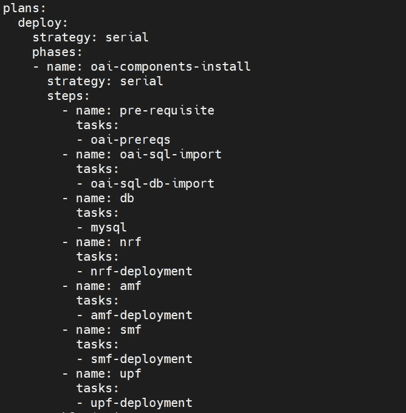
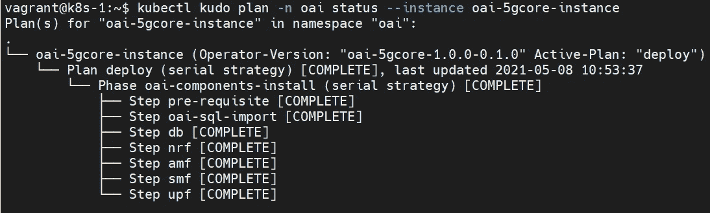
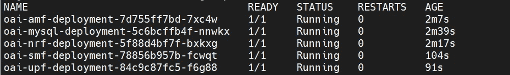
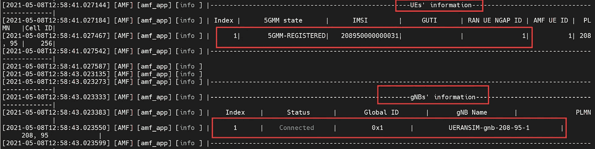
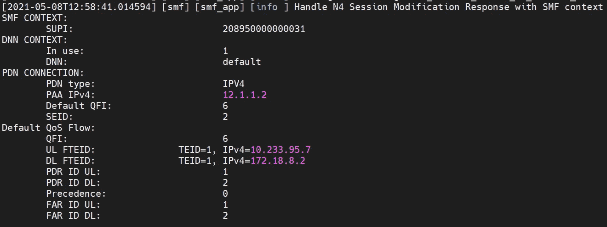
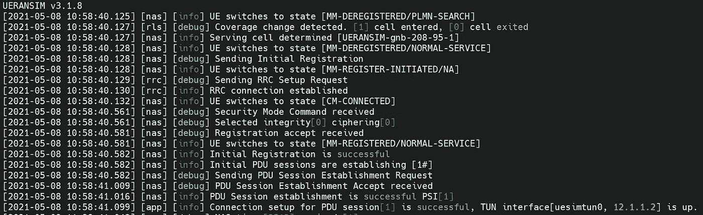

# Kubernetes 上的开放空中接口 5G 核心

> 原文：<https://levelup.gitconnected.com/open-air-interface-5g-core-on-kubernetes-de4867893c59>

我们逐渐看到了几个 5G 核心的开源解决方案。当我读到 OAI 发布云原生开源 5G 核心时，我很高兴。

OAI 5g 核心让我兴奋的是，它具备一些容器化功能:

*   用于构建容器映像的 docker 文件:当你看一看 docker 文件时，你会同意我的看法，他们做得很好！
*   活性和就绪脚本:这有助于确保只有健康的 pod 用于流量处理
*   示例 docker 合成文件:您可以利用 docker 合成文件快速启动 5G 核心，它还包含一个用于 NAT 卸载测试的额外容器！

我修改了 docker compose 以在 Kubernetes 集群上部署解决方案。你必须注意的一件事是部署吊舱有严格的顺序:

**Mysql DB → NRF → AMF →SMF →UPF**

因此，我决定深入运营商的世界，我决定让 Kudo 试一试。Kudo 有一个功能，允许有序创建 Kubernetes 资源，下面是我使用的计划:

组件部署的状态:

如您所见，组件以正确的顺序部署，这确保了干净的启动:

*注意——有其他的方法可以做到这一点，我只是决定走使用工藤来学习的路线，这也可能通过使用头盔挂钩来实现。*

在使用 ueransim 进行测试时，OAI 的开发人员帮助解决了一些问题。我想感谢他们在这方面的支持，所以是的，你可以使用 OAI 5G 核心的 ueransim。我面临的唯一问题是，从 ue 对 UPF 接口(根据 OAI 逻辑称为 pdn 接口)的 ping 测试不工作，但如果您通过 UPF(启用 SNAT)ping 远程 IPs，这可以工作。

一些示例日志输出:

**AMF 日志**

**SMF 日志**

**UERANSIM UE 日志**

OAI 5G 核心仍在开发中，未来几个月计划推出许多功能，但到目前为止，努力是巨大的。

有关所需文件的更多信息，请访问:

 [## 文件主 oai / cn5g / oai-cn5g-fed

### OpenAir CN 5G 存储库联盟

gitlab.eurecom.fr](https://gitlab.eurecom.fr/oai/cn5g/oai-cn5g-fed/-/tree/master) 

名词（noun 的缩写）b——对于这篇博文，由于我面临的问题，我不得不使用一些特定的分支，这是 OAI 开发团队建议的:

AMF — *奎克特尔分公司*
SMF — *开发分公司*

我相信随着时间的推移，develop 分支应该会用完，直到它最终发布。

页（page 的缩写）S —如果您想深入了解使用 Multus、SR-IOV、pods 中的多个网络接口等技术的裸机/本地 kubernetes 网络，那么您可以在 Udemy 上查看我的课程(您可以使用课程页面上的优惠券代码获得折扣):

[https://www . udemy . com/course/kubernetes-bare metal-networking-using-GNS 3/？referral code = 99 D5 F4 aafcf 769 E8 deb 6](https://www.udemy.com/course/kubernetes-baremetal-networking-using-gns3/?referralCode=99D5F4AAFCF769E8DEB6)