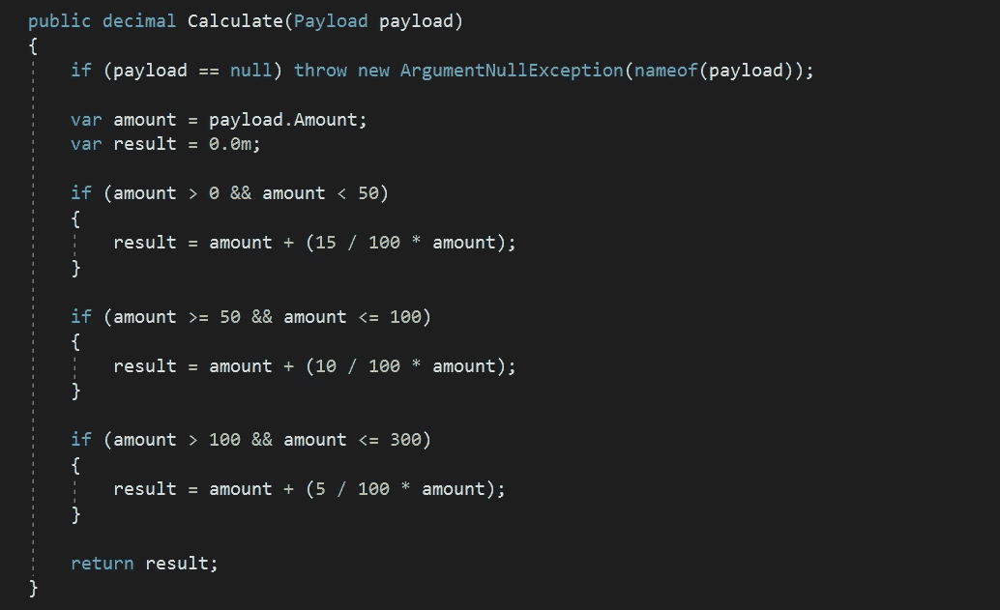
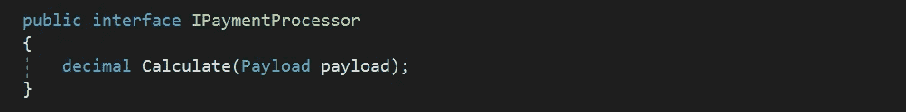
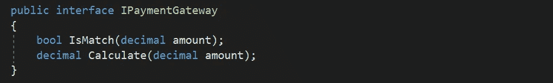
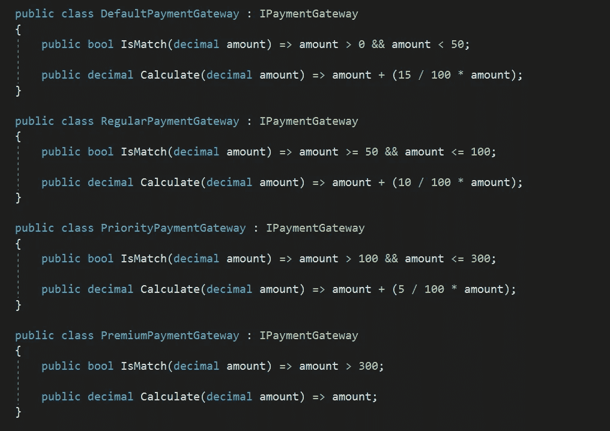
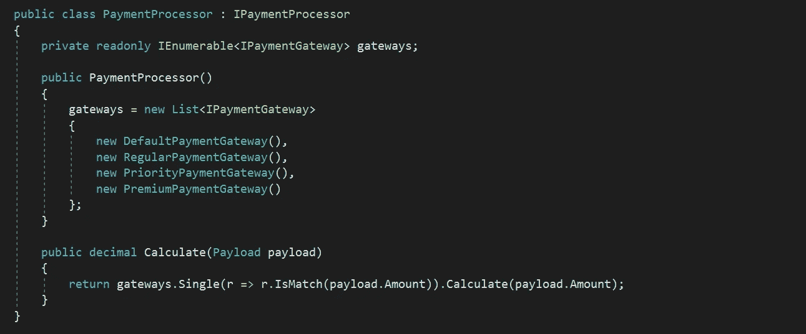
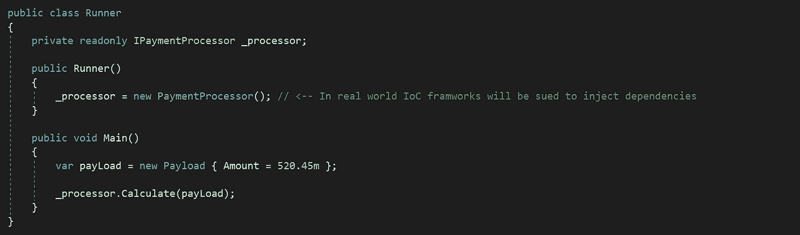

# 开放/封闭原则和向后兼容性

> 原文：<https://levelup.gitconnected.com/open-closed-principle-and-backward-compatibility-cab2f462bc0f>

**背景:**网络、文章和书籍上已经有很多解释 [S.O.L.I.D 原则](https://en.wikipedia.org/wiki/SOLID)和[编码最佳实践](https://www.oreilly.com/library/view/97-things-every/9780596809515/)的资源，但是我还是忍不住要分享一个我非常热爱的概念的简短例子，S.O.L.I.D 原则和[设计模式](https://en.wikipedia.org/wiki/Design_Patterns)。因此，这是另一个开放/封闭原则的例子，它确实是我从一家银行接受的编码挑战面试的一部分，因此它显示了它的重要性——让我们一劳永逸地解决它。

**简介:**原则声明一个类应该对扩展开放，但对修改关闭。当需求或规则经常改变或者至少可能改变时，这特别有帮助。遵循 OCP 将保护您的代码不受向后兼容性问题的影响。换句话说，如果新的需求必须由一个类来处理，那么就没有必要修改它，我们只需要为它引入一个子类，然后这个子类将独立地引入新的逻辑。很简单，现在我们想通过一个例子来更深入地了解这一点。

**案例研究**展示了如何处理一个支付请求，并注意财产*金额*的价值。这是关于有四个不同的网关*默认、常规、优先级和高级*——每个网关根据来自有效负载请求的金额值以不同的方式处理支付。下面是这些应该如何处理付款:

*   默认值—1 到 50 之间的值，服务成本为 15%
*   常规-值从 50 到 100，服务成本为 10%
*   优先级—值从 100 到 300，服务成本为 5%
*   高级—价值超过 300 英镑，不考虑服务成本

简单但足够有趣，可以开始实现。首先，我们将看到如何简单地实现这个逻辑，然后我们如何使用 OCP 来保护我们的代码不受向后兼容性问题的影响。

**天真的方法**

图 1 —对于大于 300 的值，有三个显式 If 和一个隐式 If 的简单方法

关注 OCP 的更好方法

我们现在需要抽象出这些 if 语句，这样我们就可以停止用任何引入的新变化来修改代码，除此之外，我们还需要单独测试每个条件。请记住，在现实世界的例子中，这些条件可能比图 1 所示的更复杂、更长，这意味着我们需要有一个更好的策略来处理向后兼容性以及模块化编码实践。我们将通过以下步骤共同完成。

第一步——我们创建一个接口，它将是我们上述功能的任何消费者的唯一接触点。这将为我们抽象出逻辑并将它们分开提供一个起点。

图 2 —负责与客户端通信的接口

步骤 2——现在我们定义网关接口，它包含两个操作，一个是查看传入的请求是否符合标准，第二个操作是实际的支付处理器。

图 3-支付网关接口，通过 Is 匹配方法解析正确的支付处理器

第 3 步——现在是时候实现前面提到的四个不同的网关了，每个网关都带有不同的金额值逻辑。

图 4 —独立托管实际逻辑的支付网关(为*单元测试做好准备)*

步骤 4——最后，支付处理器类负责处理来自请求的支付。该类将托管所有网关规则，并应用准确满足所需条件的规则。

*注意:添加网关本身也可以使用* [*反射*](https://docs.microsoft.com/en-us/dotnet/csharp/programming-guide/concepts/reflection) *进行重构，这样每当一个新规则被添加到系统中时，开发者就不需要在支付处理器或任何其他依赖于它们的模块中手动添加。但是为了简单和集中于主题，它被忽略了。*

图 5 —支付处理器类(不再使用 if 语句—对扩展开放，对修改关闭)

太棒了，不是吗？我喜欢这段代码，它将所有 if 语句抽象成独立的类，为单元测试做好了准备。如图所示，我们的支付处理器类现在可以扩展，因为我们可以添加无限的支付网关，但不能修改，因为我们不需要对这个类进行任何更改，不管可能添加多少个网关。

下面是一个虚拟类，展示了调用者如何调用上面的代码:

图 6 —调用计算的消费者类

希望，现在这证明了实现 OCP 是多么容易，并且通过一点实践和挑战，将它应用到现实世界的场景中。

编码快乐！