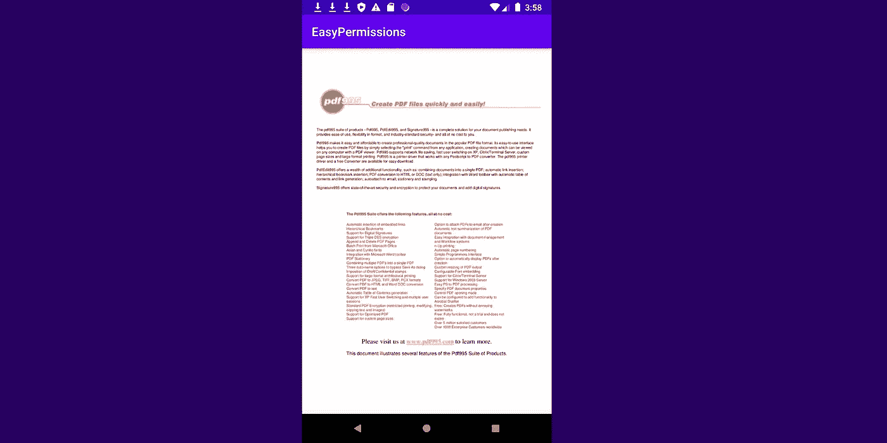

# 在 Android 中打开 PDF 文件，无需网络浏览或意图

> 原文：<https://levelup.gitconnected.com/open-pdf-files-in-android-without-webviews-or-intents-3cc960752cca>

## 如何从 url 预览 Android 中的 PDF 文件


> 我最近一直在做一个项目，用户可以因为他们的成就获得证书，我希望他们能够在应用程序内打开这些 PDF 文件，而不必重定向到外部应用程序来打开 PDF 文件。所以我在寻找一个可以帮我处理这个任务的 Android 库，事实上我找到了一个很好的库可以做到这一点！

我在 Stackoverflow 的一个帖子中偶然发现了这个库“PdfViewPager ”,其中一个用户推荐了它。这个库的好处是，除了能够从资源或 SD 卡加载 PDF 文件，它还可以轻松地从 URL 加载 PDF 文件，这就是我在本文中要向您展示的。

以下是 Github 上 PdfViewPager 库的链接:

[](https://github.com/voghDev/PdfViewPager) [## voghDev/PdfViewPager

### Android 小部件在您的活动或片段中显示 PDF 文档。重要说明:PDFViewPager 使用 PdfRenderer…

github.com](https://github.com/voghDev/PdfViewPager) 

注意，PDFViewPager 使用了 [PdfRenderer](http://developer.android.com/reference/android/graphics/pdf/PdfRenderer.html) 类，该类只能在 API 21 或更高版本上工作。

因此，在本文中，我将创建一个简单的应用程序，它将从 FirebaseStorage url 打开 pdf 文件。

## 添加 **PDFViewPager 库**依赖项

首先将该库的依赖项添加到 build.gradle 文件中:

如果您使用的是 `androidx`，请将这一行添加到您的 *app/build.gradle 中*

```
implementation 'es.voghdev.pdfviewpager:library:1.1.2'
```

如果您想使用旧的`android.support`而不是`androidx`，请添加这个依赖项

```
implementation 'es.voghdev.pdfviewpager:library:1.0.6'
```

## 创建主活动的 xml 布局

然后，创建主活动的布局，如下所示:

注意，我在这里添加了一个 LinearLayout，它将作为将在 java 代码中动态添加的`PDFViewPager`的父元素。

另外，不要忘记在 AndroidManifest.xml 文件中添加 internet 权限:

```
<**uses-permission android:name="android.permission.INTERNET"** />
```

## 修改主活动 Java 代码

现在在 MainActivity.java，您需要实现下载文件。监听器接口。

我们需要实现接口的三个方法，即 onSuccess、onFailure 和 onProgressUpdate，如下所示。

现在我假设您已经有了想要打开的 PDF 的 url，无论它是来自 FirebaseStorage 还是其他来源。在我的例子中，我想打开存储在 FirebaseStorage 中的 PDF 文件，我有链接，所以我将声明一个全局字符串 url 变量。我还将另外四个变量声明为全局变量，它们是 **progressBar** 、 **pdfLayout** 、**remotepdfviewparager**和 **pdfPagerAdapter** ，如下所示。现在，在 onCreate 方法中，我将为 url 赋值，初始化 progressBar，初始化 pdfLayout，将 progressBar 的可见性设置为 visible，并通过将 url、上下文和活动作为侦听器传递来创建*remotepdfviewparager 对象。*

现在回到 onSuccess 方法，如果 pdf 下载顺利，我们需要实现我们的逻辑。这里，我们将初始化 **pdfPagerAdapter** ，将适配器设置为**remotepdfviewparager**，更新布局，然后在完成所有操作后隐藏进度条。现在，为了更新布局并显示 PDF，我们需要将**remotepdfviewparager**作为子视图添加到 pdfLayout 中，并设置其参数 width 和 height。

您还可以在下载失败时调用的 onFailure 方法中添加您自己的关于如何处理 PDF 下载失败的逻辑。onProgressUpdate 方法将允许你以一种确定的方式向用户显示下载进度，但是我们目前通过不确定的 progressBar 显示进度。但是请随意实现您自己的逻辑！

不要忘记关闭 *onDestroy* 中的适配器以释放所有资源

这是 MainActivity.java 的全部代码:

## 最终的应用预览

瞧啊。这就是我们如何从应用程序内的 Url 打开 PDF 文件，而不使用 WebView 或 intent。



就知道这些，祝你有美好的一天！