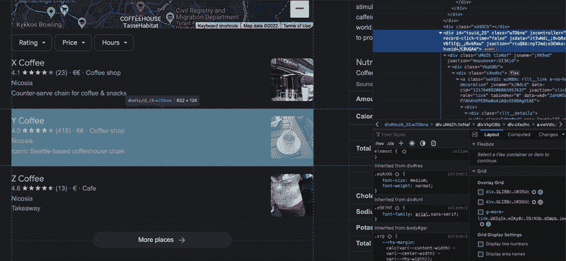
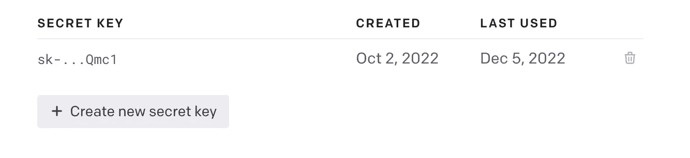
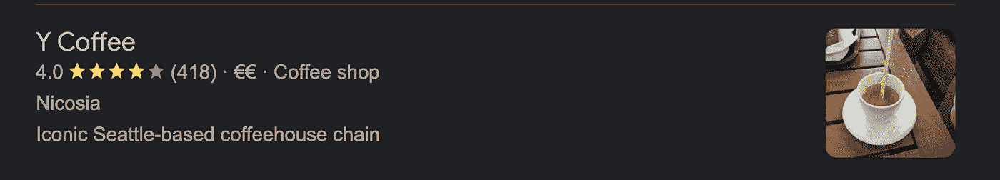

# HTML 元素的开源人工智能解析器

> 原文：<https://levelup.gitconnected.com/open-source-ai-parser-for-html-elements-d434c0a80722>


# 人工智能分析器

[Daath AI Parser](https://github.com/kagermanov27/daath-ai-parser) 是一个开源应用，使用 OpenAI 解析 HTML 元素的可视文本。它构建在 FastAPI 之上。它已准备好设置为服务器，并从任何语言进行呼叫。它目前在[ai.kagermanov.com](https://ai.kagermanov.com)举办。

[Replit 上的交互示例](https://replit.com/@EmirhanAkdeniz1/Example-with-one-element#main.py)
[链接到存储库](https://github.com/kagermanov27/daath-ai-parser)

# 基本用法

*   *复制想要解析的元素的外部 HTML*



*   *使用预设解析器的路径*

您可以在 [Daath 预设解析器页面](https://www.kagermanov.com/daath-preset-parsers)找到支持的预设解析器及其字段

*   *使用您的 OpenAI API 密钥*

你需要先[注册一个免费账号](https://beta.openai.com/signup)。你可以在这里找到你的 API 密匙。



*   向端点发出 POST 请求

```
import requests
uri = "https://ai.kagermanov.com/classify"

headers = {"Content-Type": "application/json"}
data = {
  "path": "google.google_local_results",
  "targets": [
    "<div jscontroller=\"AtSb\" class=\"w7Dbne\" data-record-click-time=\"false\" id=\"tsuid_25\" jsdata=\"zt2wNd;_;BvbRxs V6f1Id;_;BvbRxw\" jsaction=\"rcuQ6b:npT2md;e3EWke:kN9HDb\" data-hveid=\"CBUQAA\"><div jsname=\"jXK9ad\" class=\"uMdZh tIxNaf\" jsaction=\"mouseover:UI3Kjd\"><div class=\"VkpGBb\"><div class=\"cXedhc\"><a class=\"vwVdIc wzN8Ac rllt__link a-no-hover-decoration\" jsname=\"kj0dLd\" data-cid=\"12176489206865957637\" jsaction=\"click:h5M12e;\" role=\"link\" tabindex=\"0\" data-ved=\"2ahUKEwiS1P3_j-P7AhXnVPEDHa0oAiAQvS56BAgVEAE\"><div><div class=\"rllt__details\"><div class=\"dbg0pd\" aria-level=\"3\" role=\"heading\"><span class=\"OSrXXb\">Y Coffee</span></div><div><span class=\"Y0A0hc\"><span class=\"yi40Hd YrbPuc\" aria-hidden=\"true\">4.0</span><span class=\"z3HNkc\" aria-label=\"Rated 4.0 out of 5,\" role=\"img\"><span style=\"width:56px\"></span></span><span class=\"RDApEe YrbPuc\">(418)</span></span> · <span aria-label=\"Moderately expensive\" role=\"img\">€€</span> · Coffee shop</div><div>Nicosia</div><div class=\"pJ3Ci\"><span>Iconic Seattle-based coffeehouse chain</span></div></div></div></a><a class=\"uQ4NLd b9tNq wzN8Ac rllt__link a-no-hover-decoration\" aria-hidden=\"true\" tabindex=\"-1\" jsname=\"kj0dLd\" data-cid=\"12176489206865957637\" jsaction=\"click:h5M12e;\" role=\"link\" data-ved=\"2ahUKEwiS1P3_j-P7AhXnVPEDHa0oAiAQvS56BAgVEA4\"><g-img class=\"gTrj3e\"></g-img></a></div></div></div></div>"
  ],
  "openai_key": "<OPENAI KEY>"
}
r = requests.post(url=uri, headers=headers, json=data)
print(r.json()["results"])
```

*   *结果:*



```
{
    "results": [
      {
          "Address": "Nicosia",
          "Description Or Review": "Iconic Seattle-based coffeehouse chain",
          "Expensiveness": "€€",
          "Number Of Reviews": "418",
          "Rating": "4.0",
          "Title": "Y Coffee",
          "Type": "Coffee shop"
      }
    ]
}
```

这些说明是基本用法。不建议与第三方应用程序共享 API 密钥。建议您设置自己的服务器，或者使用一次性 API 密钥来检查此功能。在不共享凭证的情况下在服务器端进行调用将在接下来的部分中解释。

# 解析多个元素

除了使用元素的 HTML 之外，使用从元素复制的文本也是可以接受的。您可以在同一个列表中传递 HTML 和文本的混合体。如果所有元素都超过了模型的令牌大小，`Daath AI Parser`将为您分离提示，并以相同的顺序返回结果。请注意，重复的项目将导致错误的解析。

```
import requests

uri = "https://ai.kagermanov.com/classify"
headers = {"Content-Type": "application/json"}
data = {
  "path": "google.google_local_results",
  "targets": [
    "X Coffee 4.1(23) · €€ · Coffee shop Nicosia Counter-serve chain for coffee & snacks",
    "<div jscontroller=\"AtSb\" class=\"w7Dbne\" data-record-click-time=\"false\" id=\"tsuid_25\" jsdata=\"zt2wNd;_;BvbRxs V6f1Id;_;BvbRxw\" jsaction=\"rcuQ6b:npT2md;e3EWke:kN9HDb\" data-hveid=\"CBUQAA\"><div jsname=\"jXK9ad\" class=\"uMdZh tIxNaf\" jsaction=\"mouseover:UI3Kjd\"><div class=\"VkpGBb\"><div class=\"cXedhc\"><a class=\"vwVdIc wzN8Ac rllt__link a-no-hover-decoration\" jsname=\"kj0dLd\" data-cid=\"12176489206865957637\" jsaction=\"click:h5M12e;\" role=\"link\" tabindex=\"0\" data-ved=\"2ahUKEwiS1P3_j-P7AhXnVPEDHa0oAiAQvS56BAgVEAE\"><div><div class=\"rllt__details\"><div class=\"dbg0pd\" aria-level=\"3\" role=\"heading\"><span class=\"OSrXXb\">Y Coffee</span></div><div><span class=\"Y0A0hc\"><span class=\"yi40Hd YrbPuc\" aria-hidden=\"true\">4.0</span><span class=\"z3HNkc\" aria-label=\"Rated 4.0 out of 5,\" role=\"img\"><span style=\"width:56px\"></span></span><span class=\"RDApEe YrbPuc\">(418)</span></span> · <span aria-label=\"Moderately expensive\" role=\"img\">€€</span> · Coffee shop</div><div>Nicosia</div><div class=\"pJ3Ci\"><span>Iconic Seattle-based coffeehouse chain</span></div></div></div></a><a class=\"uQ4NLd b9tNq wzN8Ac rllt__link a-no-hover-decoration\" aria-hidden=\"true\" tabindex=\"-1\" jsname=\"kj0dLd\" data-cid=\"12176489206865957637\" jsaction=\"click:h5M12e;\" role=\"link\" data-ved=\"2ahUKEwiS1P3_j-P7AhXnVPEDHa0oAiAQvS56BAgVEA4\"><g-img class=\"gTrj3e\"></g-img></a></div></div></div></div>",
    # Some other elements in between ...
    "Z Coffee 4.6(13) · € · Cafe Nicosia Takeaway"
  ],
  "openai_key": "<OPENAI KEY>"
}
r = requests.post(url=uri, headers=headers, json=data)
print(r.json()["results"])
```

*   *多个结果*

```
{
    "results": [
      {
          "Address": "Nicosia",
          "Description Or Review": "Counter-serve chain for coffee & snacks",
          "Expensiveness": "€€",
          "Number Of Reviews": "23",
          "Rating": "4.1",
          "Title": "X Coffee",
          "Type": "Coffee shop"
      },
      {
          "Address": "Nicosia",
          "Description Or Review": "Iconic Seattle-based coffeehouse chain",
          "Expensiveness": "€€",
          "Number Of Reviews": "418",
          "Rating": "4.0",
          "Title": "Y Coffee",
          "Type": "Coffee shop"
      },
      # Some Other Results in between ...
      {
          "Address": "Nicosia",
          "Description Or Review": "Takeaway",
          "Expensiveness": "€",
          "Number Of Reviews": "13",
          "Rating": "4.6",
          "Title": "Z Coffee",
          "Type": "Cafe"
      }
    ]
}
```

# 设计定制解析器

除了预置的解析器，在`Daath AI Parser`中也允许设计自己的解析器。所需要的就是在`classifier`键下提供一个`prompt`、`examples`和`details about the OpenAI model`。下面是这种自定义解析器的分类:

```
{
  "classifier": {
    "main_prompt": "String, A prompt commanding the model to classify each item you desire. `NUMBER_OF_LABELS` is used to automatically determine the size of all unique labels in each example by `Daath AI Parser`."
    "data": "Dictionary, Details of the model you want to employ. Same data field you would use in a normal OpenAI API call, excluding `max_tokens`",
    "model_specific_token_size": "Integer, The maximum number of tokens allowed for the model. This is used to determine where to split multiple prompt calls in a given command. It is wise to set it just below the maximum number of tokens allowed by the model. For example, if the model allows 4000 tokens, you can set it to 3800\. This is because the token count made by `Daath AI Parser` is determined by GPT-2 standards, and it might be higher than the actual token count of the model.",
    "openai_endpoint": "String, Endpoint you want to call the model from. For example: `https://api.openai.com/v1/completions`",
    "explicitly_excluded_strings": "List, A list of strings that you want to exclude from the results. For example, if you want to exclude new lines, you may add \"\n\" to the list.",
    "examples_for_prompt": [
      {
        "text": "String, The text you want to classify.",
        "classifications": {
          "label_1": "String, The value of the label_1 for the given text.",
          "label_2": "String, The value of the label_2 for the given text.",
          # More Labels
        }
      },
      # More examples
    ]
  }
}
```

下面是一个带有自定义解析器的示例脚本:

```
import requests

uri = "https://ai.kagermanov.com/classify"
headers = {"Content-Type": "application/json"}
data = {
  "targets": [
    "<div jscontroller=\"AtSb\" class=\"w7Dbne\" data-record-click-time=\"false\" id=\"tsuid_25\" jsdata=\"zt2wNd;_;BvbRxs V6f1Id;_;BvbRxw\" jsaction=\"rcuQ6b:npT2md;e3EWke:kN9HDb\" data-hveid=\"CBUQAA\"><div jsname=\"jXK9ad\" class=\"uMdZh tIxNaf\" jsaction=\"mouseover:UI3Kjd\"><div class=\"VkpGBb\"><div class=\"cXedhc\"><a class=\"vwVdIc wzN8Ac rllt__link a-no-hover-decoration\" jsname=\"kj0dLd\" data-cid=\"12176489206865957637\" jsaction=\"click:h5M12e;\" role=\"link\" tabindex=\"0\" data-ved=\"2ahUKEwiS1P3_j-P7AhXnVPEDHa0oAiAQvS56BAgVEAE\"><div><div class=\"rllt__details\"><div class=\"dbg0pd\" aria-level=\"3\" role=\"heading\"><span class=\"OSrXXb\">Y Coffee</span></div><div><span class=\"Y0A0hc\"><span class=\"yi40Hd YrbPuc\" aria-hidden=\"true\">4.0</span><span class=\"z3HNkc\" aria-label=\"Rated 4.0 out of 5,\" role=\"img\"><span style=\"width:56px\"></span></span><span class=\"RDApEe YrbPuc\">(418)</span></span> · <span aria-label=\"Moderately expensive\" role=\"img\">€€</span> · Coffee shop</div><div>Nicosia</div><div class=\"pJ3Ci\"><span>Iconic Seattle-based coffeehouse chain</span></div></div></div></a><a class=\"uQ4NLd b9tNq wzN8Ac rllt__link a-no-hover-decoration\" aria-hidden=\"true\" tabindex=\"-1\" jsname=\"kj0dLd\" data-cid=\"12176489206865957637\" jsaction=\"click:h5M12e;\" role=\"link\" data-ved=\"2ahUKEwiS1P3_j-P7AhXnVPEDHa0oAiAQvS56BAgVEA4\"><g-img class=\"gTrj3e\"></g-img></a></div></div></div></div>"
  ],
  "openai_key": "<OPENAI KEY>",
  "classifier": {
    "main_prompt": "A table with NUMBER_OF_LABELS cells in each row summarizing the different parts of the text at each line even if they are not unique:\n\n",
    "data": {
      "model": "text-davinci-003",
      "temperature": 0.001,
      "top_p": 0.9,
      "best_of": 2,
      "frequency_penalty": 0,
      "presence_penalty": 0
    },
    "model_specific_token_size": 3800,
    "openai_endpoint": "https://api.openai.com/v1/completions",
    "explicitly_excluded_strings": [
      "Order",
      "Website",
      "Directions",
      "\n"
    ],
    "examples_for_prompt": [
      {
        "text": "Houndstooth Coffee 4.6(824) · $$ · Coffee shop 401 Congress Ave. #100c · In Frost Bank Tower Closed ⋅ Opens 7AM Cozy hangout for carefully sourced brews",
        "classifications": {
          "line": "1",
          "title": "Houndstooth Coffee",
          "rating": "4.1",
          "number_of_reviews": "824",
          "expensiveness": "$$",
          "type": "Coffee Shop",
          "address": "401 Congress Ave. #100c · In Frost Bank Tower",
          "open_hours": "Opens 7AM",
          "description_or_review": "Cozy hangout for carefully sourced brews"
        }
      },
      # More examples ...
    ]
  }
}
r = requests.post(url=uri, headers=headers, json=data)
print(r.json()["results"])
```

自定义解析器结果将与预设结果相同:

```
{
    "results": [
      {
          "Address": "Nicosia",
          "Description Or Review": "Iconic Seattle-based coffeehouse chain",
          "Expensiveness": "€€",
          "Number Of Reviews": "418",
          "Rating": "4.0",
          "Title": "Y Coffee",
          "Type": "Coffee shop"
      }
    ]
}
```

通过用一个特殊的双字符`#$`分隔结果，您也可以从提示中获得数组。下面是在下面的例子中提供的`product_options`键中的这种效用的表示:

```
{
  # ...
  "examples_for_prompt": [
    {
      "text": "Stumptown Coffee Roasters, Medium Roast Organic Whole Bean Coffee Gifts - Holler Mountain 12 Ounce Bag with Flavor Notes of Citrus Zest, Caramel and Hazelnut 12 Ounce 4.3 4.3 out of 5 stars (8,311) Options: 2 sizes, 6 flavors 2 sizes, 6 flavors Climate Pledge Friendly uses sustainability certifications to highlight products that support our commitment to help preserve the natural world. Time is fleeting. Learn more Product Certification (1) USDA Organic",
      "classifications": {
        "line": "3",
        "title": "Stumptown Coffee Roasters, Medium Roast Organic Whole Bean Coffee Gifts - Holler Mountain 12 Ounce Bag with Flavor Notes of Citrus Zest, Caramel and Hazelnut",
        "scale": "12 Ounce",
        "rating": "4.3",
        "reviews": "8,311",
        "product_options": "2 sizes#$6 flavors#$",
        "tags": "Climate Pledge Friendly#$USDA Organic#$"
      }
    },
    #...
  ]
  #...
}
```

使用这样的示例构建自定义解析器将产生以下结构:

```
{
  "results": [
    {
      "Line": "X",
      "Product Options": [
        "X",
        "X"
      ],
      "Rating": "X",
      "Reviews": "X",
      "Scale": "X",
      "Tags": [
        "X",
        "X"
      ],
      "Title": "X"
    }
  ]
}
```

# 在不公开 API 密钥的情况下进行服务器端调用

*   *只提示呼叫*

使用`prompts_only`键，您可以只获得调用 OpenAI 端点所需的提示。

```
import requests

uri = "https://ai.kagermanov.com/classify"
headers = {"Content-Type": "application/json"}
data = {
  "prompts_only": True,
  "path": "google.google_local_results",
  "targets": [
    "<div jscontroller=\"AtSb\" class=\"w7Dbne\" data-record-click-time=\"false\" id=\"tsuid_25\" jsdata=\"zt2wNd;_;BvbRxs V6f1Id;_;BvbRxw\" jsaction=\"rcuQ6b:npT2md;e3EWke:kN9HDb\" data-hveid=\"CBUQAA\"><div jsname=\"jXK9ad\" class=\"uMdZh tIxNaf\" jsaction=\"mouseover:UI3Kjd\"><div class=\"VkpGBb\"><div class=\"cXedhc\"><a class=\"vwVdIc wzN8Ac rllt__link a-no-hover-decoration\" jsname=\"kj0dLd\" data-cid=\"12176489206865957637\" jsaction=\"click:h5M12e;\" role=\"link\" tabindex=\"0\" data-ved=\"2ahUKEwiS1P3_j-P7AhXnVPEDHa0oAiAQvS56BAgVEAE\"><div><div class=\"rllt__details\"><div class=\"dbg0pd\" aria-level=\"3\" role=\"heading\"><span class=\"OSrXXb\">Y Coffee</span></div><div><span class=\"Y0A0hc\"><span class=\"yi40Hd YrbPuc\" aria-hidden=\"true\">4.0</span><span class=\"z3HNkc\" aria-label=\"Rated 4.0 out of 5,\" role=\"img\"><span style=\"width:56px\"></span></span><span class=\"RDApEe YrbPuc\">(418)</span></span> · <span aria-label=\"Moderately expensive\" role=\"img\">€€</span> · Coffee shop</div><div>Nicosia</div><div class=\"pJ3Ci\"><span>Iconic Seattle-based coffeehouse chain</span></div></div></div></a><a class=\"uQ4NLd b9tNq wzN8Ac rllt__link a-no-hover-decoration\" aria-hidden=\"true\" tabindex=\"-1\" jsname=\"kj0dLd\" data-cid=\"12176489206865957637\" jsaction=\"click:h5M12e;\" role=\"link\" data-ved=\"2ahUKEwiS1P3_j-P7AhXnVPEDHa0oAiAQvS56BAgVEA4\"><g-img class=\"gTrj3e\"></g-img></a></div></div></div></div>"
  ]
}
r = requests.post(url=uri, headers=headers, json=data)
print(r.json())
```

以下是对这一呼吁的回应:

```
{
  "prompts": [
    "String, Individual Prompts You need to call OpenAI endpoint with. Separated into multiple calls if the calls exceed the maximum number of tokens allowed by the endpoint."
  ],
  "prompt_objects": {
    "invalid_lines_indexes": "List, An array of elements that their texts are already exceeding the allowed threshold. These results will be skipped and will be returned with an error in the final response.",
    "desired_lines": "List, An array of text contents of HTML elements.",
    "labels": "List, An array of labels the user wants to classify from."
  }
}
```

以下是一个示例响应:

```
{
  "prompts": [
    "A table with 12 cells in each row summarizing the different parts of the text at each line:\n\nHoundstooth Coffee 4.6(824) · $$ · Coffee shop 401 Congress Ave. #100c · In Frost Bank Tower Closed ⋅ Opens 7AM Cozy hangout for carefully sourced brews\nStarbucks 4.4(471) · $$ · Coffee shop 301 W 3rd St Opens soon ⋅ 5:30AM Iconic Seattle-based coffeehouse chain\nProgress Coffee Bank of America Building 5.0(1) · Cafe 515 Congress Ave. Closed ⋅ Opens 7AM Dine-in·Takeout·No delivery\nCoffee Cantata Nicosia 5.0(3) · Tea store Nicosia Closed ⋅ Opens 10AM Mon In-store shopping\nLa Bella Bakery - Gloria Jean's Coffees K. Kaymaklı 4.4(251) · €€ · Coffee shop Şehit mustafa Ruso Caddesi no:148 - Küçük Kaymaklı - Lefkoşa - KKTC Mersin 10 Turkey Lefkoşa · In Aydın Oto Camları & Döşeme Ltd. On the menu: tea\nA.D.A. Auto Repair Center 4.8(26) · Auto repair shop 30+ years in business · Nicosia · 99 639471 Closes soon ⋅ 3PM \"I strongly recommend this repair shop.\"\nEvolution GYM No reviews · Gym Nicosia · +90 533 821 10 02 Open ⋅ Closes 6PM\nA McDonald's 420 Fulton St · (929) 431-6994 Open ⋅ Closes 1AM Dine-in · Curbside pickup · No-contact delivery\nY Coffee 4.0 (418) · €€ · Coffee shop Nicosia Iconic Seattle-based coffeehouse chain\n| Address | Description Or Review | Expensiveness | Line | Number Of Reviews | Open Hours | Rating | Title | Type | Delivery Options | Phone | Years Of Business |\n| --- | --- | --- | --- | --- | --- | --- | --- | --- | --- | --- | --- |\n| 401 Congress Ave. #100c · In Frost Bank Tower | Cozy hangout for carefully sourced brews | $$ | 1 | 824 | Opens 7AM | 4.1 | Houndstooth Coffee | Coffee Shop | - | - | - |\n| 301 W 3rd St | Iconic Seattle-based coffeehouse chain | $$ | 2 | 471 | Opens soon ⋅ 5:30AM | 4.1 | Starbucks | Coffee Shop | - | - | - |\n| 515 Congress Ave. | - | - | 3 | 1 | Closed ⋅ Opens 7AM | 5.0 | Progress Coffee Bank of America Building | Cafe | Dine-in·Takeout·No delivery | - | - |\n| Nicosia | - | - | 4 | 3 | Closed ⋅ Opens 10AM Mon | 5.0 | Coffee Cantata Nicosia | Tea store | In-store shopping | - | - |\n| Şehit mustafa Ruso Caddesi no:148 - Küçük Kaymaklı - Lefkoşa - KKTC Mersin 10 Turkey Lefkoşa · In Aydın Oto Camları & Döşeme Ltd. | On the menu: tea | €€ | 5 | 251 | - | 4.4 | La Bella Bakery - Gloria Jean's Coffees K. Kaymaklı | Coffee shop | - | - | - |\n| Nicosia | \"I strongly recommend this repair shop.\" | - | 6 | 26 | Closes soon ⋅ 3PM | 4.8 | A.D.A. Auto Repair Center | Auto repair shop | - | 99 648261 | 30+ years in business |\n| Nicosia | - | - | 7 | - | Closes 6PM | - | Evolution GYM | Gym | - | +90 555 827 11 12 | - |\n| 420 Fulton St | - | - | 8 | - | Open ⋅ Closes 1AM | A | McDonald's | - | Dine-in · Curbside pickup · No-contact delivery | (959) 451-6894 | - |"
  ],
  "prompt_objects": {
    "invalid_lines_indexes": [],
    "desired_lines": [
      "Y Coffee 4.0 (418) · €€ · Coffee shop Nicosia Iconic Seattle-based coffeehouse chain"
    ],
    "labels": [
      "Address",
      "Description Or Review",
      "Expensiveness",
      "Line",
      "Number Of Reviews",
      "Open Hours",
      "Rating",
      "Title",
      "Type",
      "Delivery Options",
      "Phone",
      "Years Of Business"
    ]
  },
}
```

*   *对 OpenAI 进行服务器端调用*

您可以从服务器端代码调用 OpenAI。对模型参数的调整应该与您使用的预设解析器或您提供的自定义解析器一样。需要在服务器端对每个调用计算`max_tokens`。下面是一个进行服务器端调用的例子:

```
import os
import openai
import requests

uri = "https://ai.kagermanov.com/classify"
headers = {"Content-Type": "application/json"}
data = {
  "prompts_only": True,
  "path": "google.google_local_results",
  "targets": [
    "<div jscontroller=\"AtSb\" class=\"w7Dbne\" data-record-click-time=\"false\" id=\"tsuid_25\" jsdata=\"zt2wNd;_;BvbRxs V6f1Id;_;BvbRxw\" jsaction=\"rcuQ6b:npT2md;e3EWke:kN9HDb\" data-hveid=\"CBUQAA\"><div jsname=\"jXK9ad\" class=\"uMdZh tIxNaf\" jsaction=\"mouseover:UI3Kjd\"><div class=\"VkpGBb\"><div class=\"cXedhc\"><a class=\"vwVdIc wzN8Ac rllt__link a-no-hover-decoration\" jsname=\"kj0dLd\" data-cid=\"12176489206865957637\" jsaction=\"click:h5M12e;\" role=\"link\" tabindex=\"0\" data-ved=\"2ahUKEwiS1P3_j-P7AhXnVPEDHa0oAiAQvS56BAgVEAE\"><div><div class=\"rllt__details\"><div class=\"dbg0pd\" aria-level=\"3\" role=\"heading\"><span class=\"OSrXXb\">Y Coffee</span></div><div><span class=\"Y0A0hc\"><span class=\"yi40Hd YrbPuc\" aria-hidden=\"true\">4.0</span><span class=\"z3HNkc\" aria-label=\"Rated 4.0 out of 5,\" role=\"img\"><span style=\"width:56px\"></span></span><span class=\"RDApEe YrbPuc\">(418)</span></span> · <span aria-label=\"Moderately expensive\" role=\"img\">€€</span> · Coffee shop</div><div>Nicosia</div><div class=\"pJ3Ci\"><span>Iconic Seattle-based coffeehouse chain</span></div></div></div></a><a class=\"uQ4NLd b9tNq wzN8Ac rllt__link a-no-hover-decoration\" aria-hidden=\"true\" tabindex=\"-1\" jsname=\"kj0dLd\" data-cid=\"12176489206865957637\" jsaction=\"click:h5M12e;\" role=\"link\" data-ved=\"2ahUKEwiS1P3_j-P7AhXnVPEDHa0oAiAQvS56BAgVEA4\"><g-img class=\"gTrj3e\"></g-img></a></div></div></div></div>"
  ]
}
response_from_daath_ai_parser = requests.post(url=uri, headers=headers, json=data)
openai.api_key = os.getenv("OPENAI_API_KEY")
prompts = response_from_daath_ai_parser["prompts"]
responses = []
for prompt in prompts:
  response = openai.Completion.create(
    model="text-davinci-003",
    prompt=prompt,
    temperature=0.001,
    max_tokens=400,
    top_p=0.9,
    best_of=2,
    frequency_penalty=0,
    presence_penalty=0
  )
  responses.append(response)
print(responses)
```

*   *只解析调用*

您可以在服务器端收集响应，然后调用`parse_only`来获得解析的结果。下面是一个打`parse_only`电话的例子:

```
import os
import openai
import requests

# Prompts Only Call
uri = "https://ai.kagermanov.com/classify"
headers = {"Content-Type": "application/json"}
data = {
  "prompts_only": True,
  "path": "google.google_local_results",
  "targets": [
    "<div jscontroller=\"AtSb\" class=\"w7Dbne\" data-record-click-time=\"false\" id=\"tsuid_25\" jsdata=\"zt2wNd;_;BvbRxs V6f1Id;_;BvbRxw\" jsaction=\"rcuQ6b:npT2md;e3EWke:kN9HDb\" data-hveid=\"CBUQAA\"><div jsname=\"jXK9ad\" class=\"uMdZh tIxNaf\" jsaction=\"mouseover:UI3Kjd\"><div class=\"VkpGBb\"><div class=\"cXedhc\"><a class=\"vwVdIc wzN8Ac rllt__link a-no-hover-decoration\" jsname=\"kj0dLd\" data-cid=\"12176489206865957637\" jsaction=\"click:h5M12e;\" role=\"link\" tabindex=\"0\" data-ved=\"2ahUKEwiS1P3_j-P7AhXnVPEDHa0oAiAQvS56BAgVEAE\"><div><div class=\"rllt__details\"><div class=\"dbg0pd\" aria-level=\"3\" role=\"heading\"><span class=\"OSrXXb\">Y Coffee</span></div><div><span class=\"Y0A0hc\"><span class=\"yi40Hd YrbPuc\" aria-hidden=\"true\">4.0</span><span class=\"z3HNkc\" aria-label=\"Rated 4.0 out of 5,\" role=\"img\"><span style=\"width:56px\"></span></span><span class=\"RDApEe YrbPuc\">(418)</span></span> · <span aria-label=\"Moderately expensive\" role=\"img\">€€</span> · Coffee shop</div><div>Nicosia</div><div class=\"pJ3Ci\"><span>Iconic Seattle-based coffeehouse chain</span></div></div></div></a><a class=\"uQ4NLd b9tNq wzN8Ac rllt__link a-no-hover-decoration\" aria-hidden=\"true\" tabindex=\"-1\" jsname=\"kj0dLd\" data-cid=\"12176489206865957637\" jsaction=\"click:h5M12e;\" role=\"link\" data-ved=\"2ahUKEwiS1P3_j-P7AhXnVPEDHa0oAiAQvS56BAgVEA4\"><g-img class=\"gTrj3e\"></g-img></a></div></div></div></div>"
  ]
}
response_from_daath_ai_parser = requests.post(url=uri, headers=headers, json=data)
openai.api_key = os.getenv("OPENAI_API_KEY")
prompts = response_from_daath_ai_parser["prompts"]
responses = []
# Server-Side Call to OpenAI
for prompt in prompts:
  response = openai.Completion.create(
    model="text-davinci-003",
    prompt=prompt,
    temperature=0.001,
    max_tokens=400,
    top_p=0.9,
    best_of=2,
    frequency_penalty=0,
    presence_penalty=0
  )
  responses.append(response)
# Parse Only Call
data = {
  "path": "google.google_local_results",
  "parse_only": {
    "responses": responses
    "prompt_objects": response_from_daath_ai_parser["prompt_objects"]
  }
}
response_from_daath_ai_parser = requests.post(url=uri, headers=headers, json=data)
print(response_from_daath_ai_parser.json()) 
```

下面是一个只有 parse 的响应示例:

```
{
  "results": [
    {
        "Address": "Nicosia",
        "Description Or Review": "Iconic Seattle-based coffeehouse chain",
        "Expensiveness": "€€",
        "Number Of Reviews": "418",
        "Rating": "4.0",
        "Title": "Y Coffee",
        "Type": "Coffee shop"
    }
  ]
}
```

# 预期错误响应

响应中提供了不同的 OpenAI 错误，以省去用户来回查看的麻烦:

```
{
  "results": [
    {
      "message": "Incorrect API key provided: <Your Op*****Key>. You can find your API key at https://beta.openai.com.",
      "type": "invalid_request_error",
      "param": null,
      "code": "invalid_api_key"
    }
  ]
}
```

```
{
  "results": [
    {
      "message": "You exceeded your current quota, please check your plan and billing details.",
      "type": "insufficient_quota",
      "param": null,
      "code": null
    }
  ]
}
```

如果一个或多个并发请求的托管端点中存在通信错误，将导致以下形式:

```
{
  "results": [
    {"error": "Error from Local Machine"}
  ]
}
```

如果您传递的元素已经超过最大标记大小，则错误将采用以下形式:

```
{
  "results": [
    {"error": "Maximum Token Size is reached for this prompt. This is skipped."}
  ]
}
```

如果您遇到任何其他错误，请随意创建一个关于它们的问题。

# 定制客户端调用的默认允许并发和 API 键

您可以使用`allowed_concurrency`键调整客户端调用允许的并发数。您每分钟可以拨打的最大电话数量仍然需要由您来配置。你可以在调用`Daath AI Parser`之间设置睡眠时间，以避免超过 OpenAI 的限制。下面是一个示例脚本，其中允许的并发数为 2:

```
import requests

uri = "https://ai.kagermanov.com/classify"
headers = {"Content-Type": "application/json"}
data = {
  "allowed_concurrency": 2,
  "path": "google.google_local_results",
  "targets": [
    "<div jscontroller=\"AtSb\" class=\"w7Dbne\" data-record-click-time=\"false\" id=\"tsuid_25\" jsdata=\"zt2wNd;_;BvbRxs V6f1Id;_;BvbRxw\" jsaction=\"rcuQ6b:npT2md;e3EWke:kN9HDb\" data-hveid=\"CBUQAA\"><div jsname=\"jXK9ad\" class=\"uMdZh tIxNaf\" jsaction=\"mouseover:UI3Kjd\"><div class=\"VkpGBb\"><div class=\"cXedhc\"><a class=\"vwVdIc wzN8Ac rllt__link a-no-hover-decoration\" jsname=\"kj0dLd\" data-cid=\"12176489206865957637\" jsaction=\"click:h5M12e;\" role=\"link\" tabindex=\"0\" data-ved=\"2ahUKEwiS1P3_j-P7AhXnVPEDHa0oAiAQvS56BAgVEAE\"><div><div class=\"rllt__details\"><div class=\"dbg0pd\" aria-level=\"3\" role=\"heading\"><span class=\"OSrXXb\">Y Coffee</span></div><div><span class=\"Y0A0hc\"><span class=\"yi40Hd YrbPuc\" aria-hidden=\"true\">4.0</span><span class=\"z3HNkc\" aria-label=\"Rated 4.0 out of 5,\" role=\"img\"><span style=\"width:56px\"></span></span><span class=\"RDApEe YrbPuc\">(418)</span></span> · <span aria-label=\"Moderately expensive\" role=\"img\">€€</span> · Coffee shop</div><div>Nicosia</div><div class=\"pJ3Ci\"><span>Iconic Seattle-based coffeehouse chain</span></div></div></div></a><a class=\"uQ4NLd b9tNq wzN8Ac rllt__link a-no-hover-decoration\" aria-hidden=\"true\" tabindex=\"-1\" jsname=\"kj0dLd\" data-cid=\"12176489206865957637\" jsaction=\"click:h5M12e;\" role=\"link\" data-ved=\"2ahUKEwiS1P3_j-P7AhXnVPEDHa0oAiAQvS56BAgVEA4\"><g-img class=\"gTrj3e\"></g-img></a></div></div></div></div>"
  ],
  "openai_key": "<OPENAI KEY>"
}
r = requests.post(url=uri, headers=headers, json=data)
print(r.json()["results"])
```

默认情况下，允许的并发是`1`。当您设置自己的服务器时，您可以从`credentials.py`更改默认`allowed_concurrency`和默认`openai_key`。

# 投稿指南

如果您想参与此项目，您可以打开一个拉式请求。如果您有任何问题或建议，也可以创建一个问题。

*   *添加新的预设解析器*

您可以在 OpenAI Playground 中设计一个提示来创建一个表，如下所示:


然后你可以把它变成字典形式，如下例所示:

```
# app/classify/parsers/google/google_local_results.py

from app.schemas import *
def commands():
  return json_to_pydantic({
    "main_prompt": "A table with NUMBER_OF_LABELS cells in each row summarizing the different parts of the text at each line:\n\n",
    "data": {
      "model": "text-davinci-003",
      "temperature": 0.001,
      "top_p": 0.9,
      "best_of": 2,
      "frequency_penalty": 0,
      "presence_penalty": 0
    },
    "model_specific_token_size": 3800,
    "openai_endpoint": "https://api.openai.com/v1/completions",
    "explicitly_excluded_strings": [
      "Order",
      "Website",
      "Directions",
      "\n"
    ],
    "examples_for_prompt": [
      {
        "text": "Houndstooth Coffee 4.6(824) · $$ · Coffee shop 401 Congress Ave. #100c · In Frost Bank Tower Closed ⋅ Opens 7AM Cozy hangout for carefully sourced brews",
        "classifications": {
          "line": "1",
          "title": "Houndstooth Coffee",
          "rating": "4.1",
          "number_of_reviews": "824",
          "expensiveness": "$$",
          "type": "Coffee Shop",
          "address": "401 Congress Ave. #100c · In Frost Bank Tower",
          "open_hours": "Opens 7AM",
          "description_or_review": "Cozy hangout for carefully sourced brews"
        }
      },
      # More examples ...
    ]
  })
```

*   *单元测试*

您可以使用`mock_name`轻松地将单元测试添加到您的贡献中。

## 编写一个指向模拟名称的单元测试:

将结果指向`app/classify/tests/data/results`文件夹，或者将提示指向`app/classify/tests/data/prompts`文件夹，这取决于您在单元测试中得到的最终结果。

```
# app/classify/tests/unit_tests/test_google_local_results.py
# ...
def test_google_local_results_successful_response():
  targets = [
    "app/classify/tests/data/targets/electronic-shops-successful.json"
  ]

for target_filename in targets:
    with open(target_filename) as json_file:
      target = json.load(json_file)
    r = client.post("/classify", json=target)
    result_filename = target['mock_name'].replace('.json','-result.json')
    result_filename = result_filename.replace('/targets/', '/results/')
    with open(result_filename) as json_file:
      result = json.load(json_file)
    assert r.status_code == 200
    assert r.json() == result
    assert len(r.json()['results']) > 0
    assert ("message" not in r.json()['results'][0])
# ...
```

## 创建一个 json 来调用本地主机服务器:

```
# app/classify/tests/data/targets/coffee-shops-successful.json
{
  "path": "google.google_local_results",
  "targets": [
    "<div jscontroller=\"AtSb\" class=\"w7Dbne\" data-record-click-time=\"false\" id=\"tsuid_25\" jsdata=\"zt2wNd;_;BvbRxs V6f1Id;_;BvbRxw\" jsaction=\"rcuQ6b:npT2md;e3EWke:kN9HDb\" data-hveid=\"CBUQAA\"><div jsname=\"jXK9ad\" class=\"uMdZh tIxNaf\" jsaction=\"mouseover:UI3Kjd\"><div class=\"VkpGBb\"><div class=\"cXedhc\"><a class=\"vwVdIc wzN8Ac rllt__link a-no-hover-decoration\" jsname=\"kj0dLd\" data-cid=\"12176489206865957637\" jsaction=\"click:h5M12e;\" role=\"link\" tabindex=\"0\" data-ved=\"2ahUKEwiS1P3_j-P7AhXnVPEDHa0oAiAQvS56BAgVEAE\"><div><div class=\"rllt__details\"><div class=\"dbg0pd\" aria-level=\"3\" role=\"heading\"><span class=\"OSrXXb\">Y Coffee</span></div><div><span class=\"Y0A0hc\"><span class=\"yi40Hd YrbPuc\" aria-hidden=\"true\">4.0</span><span class=\"z3HNkc\" aria-label=\"Rated 4.0 out of 5,\" role=\"img\"><span style=\"width:56px\"></span></span><span class=\"RDApEe YrbPuc\">(418)</span></span> · <span aria-label=\"Moderately expensive\" role=\"img\">€€</span> · Coffee shop</div><div>Nicosia</div><div class=\"pJ3Ci\"><span>Iconic Seattle-based coffeehouse chain</span></div></div></div></a><a class=\"uQ4NLd b9tNq wzN8Ac rllt__link a-no-hover-decoration\" aria-hidden=\"true\" tabindex=\"-1\" jsname=\"kj0dLd\" data-cid=\"12176489206865957637\" jsaction=\"click:h5M12e;\" role=\"link\" data-ved=\"2ahUKEwiS1P3_j-P7AhXnVPEDHa0oAiAQvS56BAgVEA4\"><g-img class=\"gTrj3e\"></g-img></a></div></div></div></div>"
  ],
  "mock_name": "app/classify/tests/data/results/coffee-shops-successful-result.json"
}
```

## 使用`pytest`运行一次单元测试来生成 json。

它们只会在初始调用中创建，不会在测试中耗尽信用。以下是一个示例结果:

```
# app/classify/tests/data/results/coffee-shops-successful-result.json
{
  "results": [
    {
        "Address": "Nicosia",
        "Description Or Review": "Iconic Seattle-based coffeehouse chain",
        "Expensiveness": "€€",
        "Number Of Reviews": "418",
        "Rating": "4.0",
        "Title": "Y Coffee",
        "Type": "Coffee shop"
    }
  ]
}
```

# 分级编码

感谢您成为我们社区的一员！在你离开之前:

*   👏为故事鼓掌，跟着作者走👉
*   📰查看[升级编码出版物](https://levelup.gitconnected.com/?utm_source=pub&utm_medium=post)中的更多内容
*   🔔关注我们:[Twitter](https://twitter.com/gitconnected)|[LinkedIn](https://www.linkedin.com/company/gitconnected)|[时事通讯](https://newsletter.levelup.dev)

🚀👉 [**加入升级人才集体，找到一份神奇的工作**](https://jobs.levelup.dev/talent/welcome?referral=true)