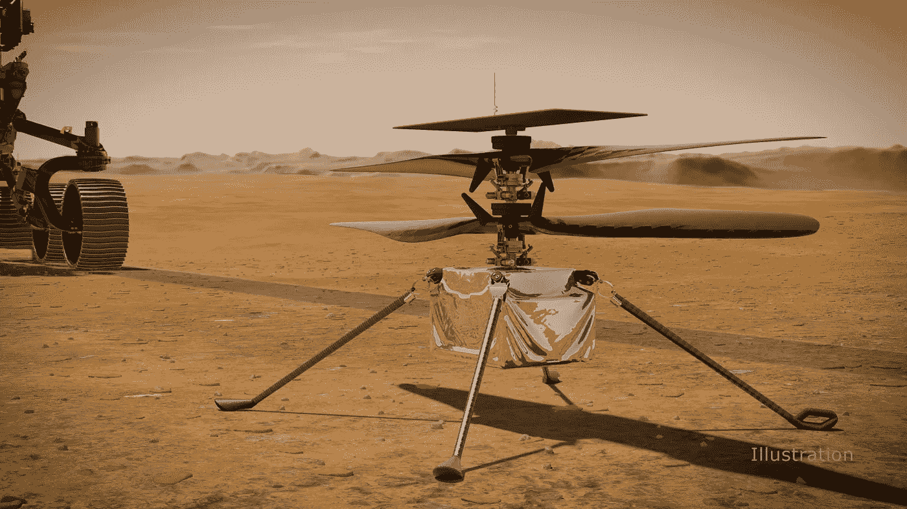
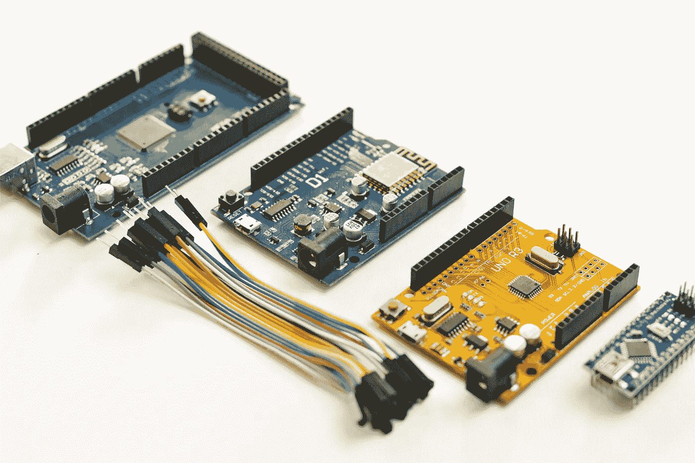

# 开源和 Linux 进入太空，推动了人类想象力的极限。

> 原文：<https://levelup.gitconnected.com/open-source-and-linux-makes-it-to-space-pushing-the-limits-of-human-imagination-a05e032aa884>

## 你可以获得在火星直升机上运行的软件框架，并将其用于你的项目。开源是如何推动人类超越想象的。

匠心火星直升机在火星表面(艺术家的概念)。鸣谢: [NASA](https://mars.nasa.gov/resources/25117/ingenuity-mars-helicopter-on-the-martian-surface-artists-concept/)

经过 7 个月的旅程，毅力号于 2021 年 2 月 18 日开始向红色星球高速下降。“坚持”号上有一架名为“独创性”的小直升机。这将是另一个星球上的第一架无人直升机。它的唯一目的是在火星上做一系列飞行测试。

这架直升机重 1.8 公斤，但火星的大气密度大约是地球地面大气密度的百分之一，其重力只有地球重力的三分之一。独创性必须克服所有这些挑战，更不用说电力和通信限制了。

图片来源:美国宇航局/JPL 加州理工大学| [完整图片和说明](https://www.jpl.nasa.gov/images/portrait-of-perseverance-and-ingenuity-artists-concept/)

根据 Tim Canham 对[IEEE Spectrum](https://spectrum.ieee.org/automaton/aerospace/robotic-exploration/nasa-designed-perseverance-helicopter-rover-fly-autonomously-mars)**，**的介绍，匠心直升机以 Linux 为主要操作，结合了被 Nasa 做成开源项目的 F `(读作 F prime)。板载的是第一部 Oneplus 手机中使用的骁龙 801 CPU，这确实是一个非常旧的芯片，但该芯片比板上的芯片“毅力”快得多。

NASA 为什么选择 Linux 作为直升机的操作系统？

根据 Canham 的说法，锲而不舍号火星车和许多其他太空设备的操作系统 VxWorks 不支持骁龙 801，因此他们别无选择，只能尝试使用 Linux 和他们的框架 f`。

## Linux 作为操作系统有什么特别之处？

> [*坎汉姆说:*](https://spectrum.ieee.org/automaton/aerospace/robotic-exploration/nasa-designed-perseverance-helicopter-rover-fly-autonomously-mars) *“这是我们第一次在火星上飞行 Linux。我们运行的是 Linux 操作系统。我们正在使用的软件框架是我们在 JPL 为立方体卫星和仪器开发的，几年前我们* [*开源了*](https://github.com/nasa/fprime) *它。所以，你可以得到在火星直升机上运行的软件框架，并在你的项目中使用它。这是一种开源的胜利，因为我们正在运行一个开源的操作系统和一个开源的飞行软件框架，并且运行商业部件，如果你有一天想自己做这个的话，你可以从货架上买下来。这对 JPL 来说是一个新事物，因为他们倾向于喜欢非常安全和经过验证的东西，但许多人对此非常兴奋，我们期待着这样做。”*

[Frank Wang](https://unsplash.com/@nicetomeetyou?utm_source=unsplash&utm_medium=referral&utm_content=creditCopyText) 在 [Unsplash](https://unsplash.com/s/photos/electronics?utm_source=unsplash&utm_medium=referral&utm_content=creditCopyText) 上的照片

对于开源项目来说，这是一个巨大的胜利，甚至你和我都可以为自己构建一个。但是使用 Linux 的主要原因不是让我们修补东西，而是 Linux 操作系统的强大。为什么我们这样说呢？独创性的内部是一个飞行控制程序，这是一个控制车辆以 500 赫兹的速度运行的制导回路。一个同样以 30hz 运行的程序也在捕捉图像，分析它们，并逐帧跟踪它们。这个过程会占用七年前的 Soc 的大量资源，这需要使用非常轻量级但健壮可靠的操作系统。许多人会同意我的观点，Linux 比大多数操作系统都要快。

这为包括我在内的许多人打开了新的机会之门，这意味着我们也可以改进创新直升机，因为正如坎汉姆所说，直升机的所有部件都来自商店的货架，其软件也是开源的，因此我们也可以为其开发做出贡献。

Alex Kotliarskyi 在 [Unsplash](https://unsplash.com/collections/1670329/open-source?utm_source=unsplash&utm_medium=referral&utm_content=creditCopyText) 上的照片

## 开源的未来？

我认为开源是推进技术的最安全、最快、最具成本效益的方式。可以肯定的说，早在 20 世纪 60 年代，NASA 就已经开始接受开源了。IBM、亚马逊网络服务、谷歌的 Kubernetes 和 TensorFlow，甚至[微软](https://www.theverge.com/2020/5/18/21262103/microsoft-open-source-linux-history-wrong-statement)的 Azure 功能都是无所不包的开源软件，这是人类成长的必由之路。

开源已经走了很长一段路，今天它仍在增长，我决定也加入这场竞赛，我将通过在 GitHub 这样的论坛上贡献我关于编程和游戏开发的一点知识来帮助开源变得更好。

如果你喜欢这篇文章，你可以给我 50 次掌声👏👏👏，如果你对技术和软件开发感兴趣，你也可以关注我的 [***媒体***](https://konaduakwasiakuoko.medium.com/) 和社交媒体。您可以关注我的[***Twitter***](https://twitter.com/akuoko_konadu)因为我们将讨论编码和一般的技术世界，所以我的 DM 一直是开放的。加入我的[***YouTube***](https://www.youtube.com/channel/UCYKFy3oPn2b6gbjAzmgNgJg)让我们一起做一些编码。祝你有愉快的一天。下一次快乐编码。

如果你希望有人为你写科技文章，我很乐意为你写一篇**低至 5 美元的******。****