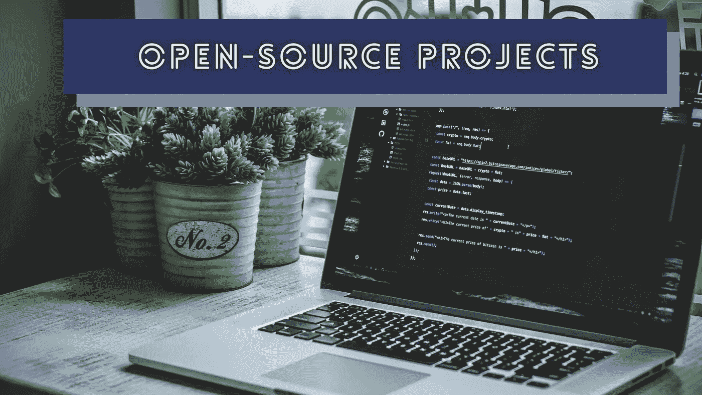
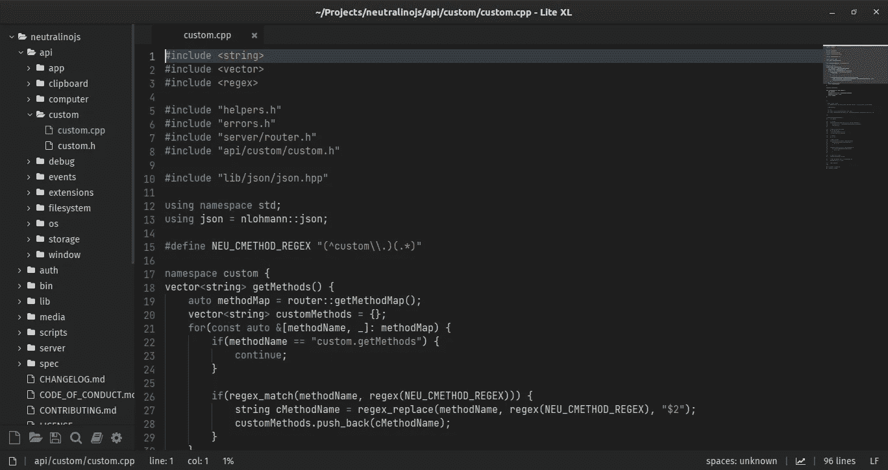

# 激励每个人创新的 5 个开源项目

> 原文：<https://levelup.gitconnected.com/open-source-innovations-that-motivate-every-developer-to-experiment-5ead142b45f>

## 这些项目将激励你去试验和构建新的开源项目



由 [Unsplash](https://unsplash.com/s/photos/programming?utm_source=unsplash&utm_medium=referral&utm_content=creditCopyText) 上的 [Safar Safarov](https://unsplash.com/@safarslife?utm_source=unsplash&utm_medium=referral&utm_content=creditCopyText) 拍摄，Canva 编辑

程序员处理属于不同领域的各种软件开发项目。例如，一些程序员为电子商务软件做出贡献，并支持企业在现代市场中保持竞争力。同时，一些程序员从事基础软件项目，帮助其他程序员构建创新的软件解决方案。Flutter 是一个受欢迎的基金会项目，激励开发人员创建跨平台、高性能、用户友好的应用程序。

大多数程序员通常启动开源项目，作为解决他们日常软件工程问题的实验。然后，大型组织和开发人员社区通过贡献代码库、捐款和提供基础设施支持来支持这些开源创新。最后，程序员作为实验发起的开源创新增强了数百万开发者和用户的力量。

我通常会在 GitHub 上浏览新的开源项目，并检查它们的源代码，以了解内部概念和设计模式。以下令人印象深刻的创新性开源项目激励我去试验和构建新项目。一旦你研究了这些项目的架构和目标，你就会像那些项目作者一样经常为开发者社区试验和开发新的项目。

# Webview:智能使用特定于平台的 API

如果你需要通过制作一个混合 app 把一个 web app 变成桌面 app 怎么办？大多数开发人员通常会选择 Electron，因为它允许您将 web 应用程序嵌入到本机窗口中，并使用基于节点的后端制作类似本机的混合应用程序。Electron 通过 Chromium 实例在所有支持的平台上呈现 web 内容，因此您会无意中为您发布的每个 Electron 应用程序提供一个完整的浏览器。我在下面的故事中解释了这个问题:

[](https://medium.com/swlh/goodbye-electron-welcome-flutter-22b3dc10d2f3) [## 再见电子，你好颤振

### 原生跨平台应用程序开发很困难，但现在我们有了更好的解决方案。

medium.com](https://medium.com/swlh/goodbye-electron-welcome-flutter-22b3dc10d2f3) 

程序员尝试用内置的操作系统 API 来代替 Chromium 实例，并提供一种轻量级的高效方式来构建混合桌面应用。 [Webview](https://github.com/webview/webview) 可让您将混合网络应用嵌入原生窗口，而无需将浏览器实例嵌入应用捆绑包。它在 GNU/Linux 上使用内置的特定于平台的 GTKWebkit API，在 Windows 上使用 Webview2 运行时，在 macOS 上使用 Cocoa Webkit API。

Webview 现在支持许多轻量级桌面应用程序。像 Neutralinojs 这样的框架使用 Webview 作为依赖。此外，现在我们有几乎所有流行语言的 Webview [绑定](https://github.com/webview/webview#bindings)！

# Lite/Lite-XL:硬件友好的代码替代方案

VS Code 因为其内置的生产力特性和丰富的插件生态系统而成为现代软件行业的默认代码编辑器程序。对于任何软件开发团队来说，VS 代码无疑都是一个高效的工具，但是它有两个隐藏的问题。VS Code[不是原生应用](https://medium.com/swlh/i-switched-to-lite-after-using-vscode-for-3-years-16f2fffa6143)——它是一个消耗高于平均水平计算资源的电子应用。

第二个问题很难理解，但是有经验的开发人员在使用现代编辑器时经常会感觉到这种情况，并且永远使用像 Vim 这样的最小化工具。VS 类似代码的未来派编辑器促使开发人员使用限制他们自由、灵活性和知识性的自动特性。这就像驾驶手动汽车和自动汽车一样——喜欢百分百控制代码的开发人员忽略了类似代码的未来主义编辑器。

Lite 代码编辑器是一个用 C 和 Lua 编写的最小化、现代化、跨平台的程序。它不是一个渲染假本地元素的混合应用程序——它通过 SDL 图形库在你的屏幕上绘制本地图形。 [Lite-XL](https://github.com/lite-xl/lite-xl) 是一个积极维护的 Lite 分支，具有额外的内置功能。Lite/Lite-XL 程序的架构设计良好，具有核心模块和独立的插件驱动的编辑器功能。



Lite-XL，作者截图

# Serenity OS:用更少的依赖项目来构建任何东西都是可能的

开发最复杂、最耗时的软件项目是什么？从头开始构建一个可用的全功能操作系统无疑是一项复杂的任务。如果你开始开发一个操作系统，你将不得不用一种低级语言编写一个内核，内核 API，一个图形库，以及所有用首选语言编写的通用应用程序。如果您从零开始开发 web 浏览器，您可能需要在正确实现之前检查所有标准的 web API 规范。

Serenity OS 项目实现了一个 x86 内核、核心库和通用应用。现在，Serenity OS 团队启动了一个名为 [Jakt](https://github.com/SerenityOS/jakt) 的自托管编译器，将源代码转换成 C++。他们从头开始开发每一个操作系统组件，包括他们的 JavaScript 引擎和网络浏览器。

大多数软件开发项目选择依赖关系作为基础。比如安卓用的是 Linux 内核。大多数流行的浏览器都使用 Chromium 源代码。同时，Serenity OS 项目向我们展示了从零开始构建一切的可行性！

# Zx:即使一个简单的语言语法也能引发一个伟大的创新

Bash 无疑是编写 shell 脚本最简单的方法，因为它让您无需过多的语法就可以执行和获得二进制文件的输出。例如，如果您需要在 Unix 或类似 Unix 的系统上创建一个新文件，您可以使用以下命令，而不使用任何其他语法:

```
touch main.cpp
```

Bash 将一切都视为命令，因为它是一种命令语言——这就是为什么不能在等号两边添加空格来美化代码。在 Bash 中编写复杂的脚本或调用操作系统 API 需要变通方法，因此大多数开发人员倾向于使用 Python 或 JavaScript 作为这种场景的 Bash 替代方案。

但是，如果您使用 JavaScript，由于函数调用、API 使用和 JavaScript 特性，您的 shell 脚本看起来像另一个通用计算机程序源。 [zx](https://github.com/google/zx) 项目让基于 JavaScript 的 shell 脚本看起来像带有包装 API 和令人印象深刻的语法用法的 Bash。

例如，它允许您生成一个进程，甚至不使用 JavaScript 函数调用语法:

```
await $`touch main.cpp`
```

[zx 实现](https://github.com/google/zx/blob/main/src/core.ts#L92)使用[标记的模板文字](https://developer.mozilla.org/en-US/docs/Web/JavaScript/Reference/Template_literals#tagged_templates)来调用函数，而不使用括号。

# TanStack 查询:解决每个 Web 开发人员面临的问题

如今，大多数前端开发团队倾向于选择 React 来构建他们的应用程序，因为它简单、丰富的库生态系统和高效的样板/框架。在 React 应用中，开发人员经常调用 RESTful 或 GraphQL 服务来与服务器通信。React 不是一个全功能的框架——它是一个面向组件的前端库，所以它不提供处理网络调用的内置机制。

因此，大多数 React 开发人员通常使用 Fetch 浏览器 API 或 Axios 库来进行 RESTful API 调用。一旦他们决定优化和改进网络调用，他们可能需要编写代码来处理重复数据删除请求、实施缓存、添加加载动画以及开发与网络相关的可用性增强功能(例如，在浏览器选项卡 activate 上刷新数据)。 [TanStack Query](https://github.com/TanStack/query) 库为管理 web 应用程序上的服务器数据状态提供了一个全功能的解决方案。

TanStack Query 提供钩子来实现缓存、分页、无限加载、预取等。，在 React 应用中。TanStack Query 提供了 React、Solid 和 Vue 的库 API(Svelte 和 Angular 支持即将推出)，其源代码向我们展示了如何为多个前端库构建一个 JavaScript 库。它使用与前端库无关的核心包中的主要逻辑，并提供独立的特定于前端库的包。

# 结论

如果您检查上述创新项目的初始提交，您会注意到程序员开始这些项目是作为实验。后来，他们与开发人员社区一起改进和扩展了那些项目。检查开源代码库和尝试计算机程序是享受我们编程之旅的好方法。

有时候，数以百万计的开发人员会开始使用你今天发起的项目作为实验。例如，几年前，TanStack Query 是一个[的单文件包](https://github.com/TanStack/query/blob/08f61bd524c9c2a1544d39e6fbe33ff17fabac7d/src/index.js)，但是现在它支持数百万个 React 应用程序！

检查上述项目，开始试验并为开发人员社区构建一些东西。

感谢阅读。