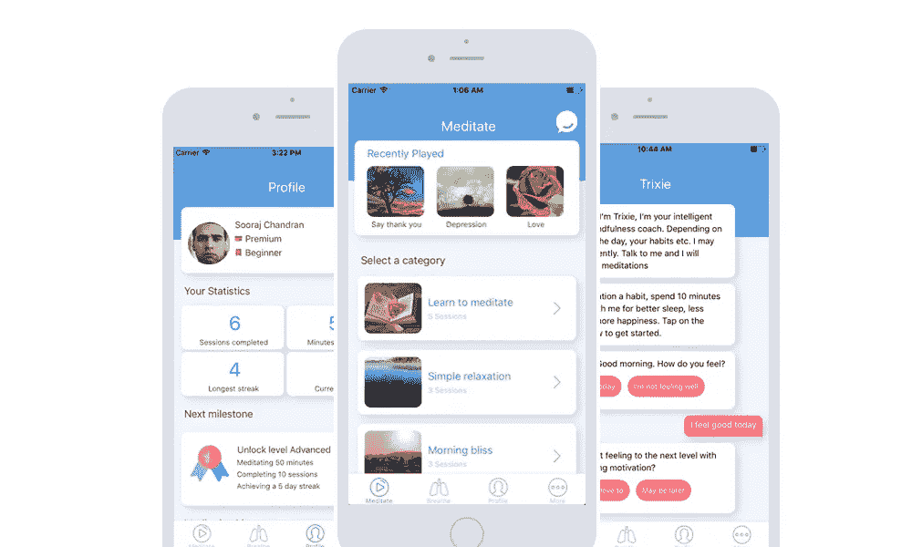

# 开源我们的代码是有史以来最好的决定——原因如下

> 原文：<https://levelup.gitconnected.com/open-sourcing-our-code-was-the-best-decision-ever-here-is-why-bfb0c51f6149>

我们最近制作了[Trixie](http://thetrixieapp.com)——一个冥想聊天机器人，根据你的心情和一天中的时间来建议冥想时间。

这是 Trixie 的样子:

Trixie 屏幕

在收到关于应用程序设计的良好反馈后，我们决定发布一个 UI 工具包，其中包含我们使用的所有组件，并对其进行开源。

> 事实证明，这是我们做出的最好的工程决策之一。

在不到 24 小时的时间里，我们就有了超过 100 颗星，我们是 Github 中最受欢迎的 javascript repos 之一。该套件是发布日[产品搜索](https://www.producthunt.com/posts/trixie)中的第三号产品。此外，在撰写本文时，我们的 [Github 回购](https://github.com/Trixieapp/react-virgin)上现在有 973 颗星。

# 1.社区

开发者一般都是好灵魂。他们总是乐于互相帮助。他们有一个共同的动力来支持和持续改进他们喜欢的解决方案。拿你今天使用的一些伟大的技术来说，你会发现它们中的大多数都是由一群充满热情的人构建的，他们对改善其他开发者的生活充满热情。

# 2.修复大量糟糕的代码

作为 react-native 的初学者，我们故意编写了许多糟糕的代码🙈而且不知不觉。大部分是由编码爱好者在几天内修复的。代码的标准呈指数级上升，我们得到了大量关于最佳实践的建议，我们学到了仅仅从教科书和 youtube 教程中学不到的东西。人群的力量是真实的！

# 3.注册

在发布后的三天里，我们的注册人数是平时的四倍。用户的质量也很好。发布 UI 套件后，我们的用户参与度提高了两倍。

# 4.满意

作为一名开发者，你在回馈社区时获得的满足感是首屈一指的。虽然不是一个巨大的贡献，但这是一个新的开始，有一天会成为一个巨大的开始。只要记住你每天用多少开源贡献就行了。所有这些都是免费的，开发者选择花费他们宝贵的时间来使软件受益。

# 5.可靠性和安全性

对代码的更多关注意味着更好的代码质量、问题和安全漏洞的快速修复。我们的代码库中的一些问题被指出，我们能够快速修复它们。

我们的使命是为 react-native 构建最佳的引导程序。如果您是开发人员，请随时提出拉取请求并为[回购](https://github.com/Trixieapp/react-virgin)做出贡献。