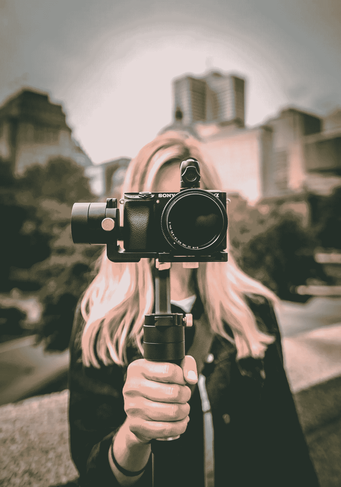
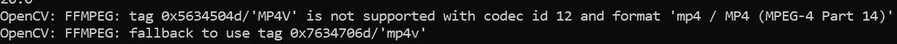

# OpenCV-Python:读取和写入图像和视频

> 原文：<https://levelup.gitconnected.com/opencv-python-reading-and-writing-images-and-videos-ed01669c660c>

## 用相机捕捉实时流的分步指南



威廉·拜罗伊特在 [Unsplash](https://unsplash.com/?utm_source=unsplash&utm_medium=referral&utm_content=creditCopyText) 上拍摄的照片

通过阅读这篇文章，您将学会使用笔记本电脑中内置的网络摄像头捕捉视频。如果您使用的是个人电脑，请确保它与外部网络摄像头相连。

此外，本教程将涵盖保存一个帧作为一个图像，以及保存为一个视频在您的机器。我们将使用 OpenCV 自带的内置`VideoCapture`和`VideoWriter`类。

这篇文章分为三个部分:

1.  设置
2.  履行
3.  结论

让我们继续下一部分，开始安装必要的模块

# 1.设置

强烈建议您在继续安装之前创建一个虚拟环境。完成后，运行以下命令

```
pip install opencv-python
```

您可以通过以下方式检查安装是否正确

```
pip show opencv-python
```

让我们转到实现的下一部分。

# 2.履行

## 导入

OpenCV 包使用`cv2`作为 Python 绑定。您可以导入如下内容:

```
import cv2
```

如果您喜欢使用 cv 作为 Python 绑定，可以通过以下代码来实现:

```
import cv2 as cv
```

## 变量

接下来，根据您的偏好初始化以下变量。请注意，显示窗口的最终尺寸可能与您在此处指定的尺寸不同，因为每个网络摄像头都有自己的尺寸。例如，您将大小指定为 720 x 480，但最终输出可能是 680 x 480。

```
frame_width = 680
frame_height = 480
fps = 30.0
```

## 视频捕捉

调用`VideoCapture()`函数并传递一个整数给它。它代表摄像机的索引值(对于多个摄像机)。在我的用例中，我将使用 0，因为我只有一个摄像头。

```
video_capture = cv.VideoCapture(0)
```

作为参考，您可以传入一个表示视频文件名称的字符串。它将读取并显示视频内容。

```
video_capture = cv.VideoCapture('sample.mp4')
```

## 设置并获取

此外，您可以通过`set`或`get`功能访问`VideoCapture`的一些属性。常用的标志如下:

*   `CAP_PROP_POS_MSEC` —视频文件的当前位置，单位为毫秒。标志值为 0。
*   `CAP_PROP_POS_FRAMES` —下一个要解码/捕获的帧的基于 0 的索引。标志值为 1。
*   `CAP_PROP_POS_AVI_RATIO` —视频文件的相对位置:0 =影片开始，1 =影片结束。标志值为 2。
*   `CAP_PROP_FRAME_WIDTH` —视频流中帧的宽度。标志值为 3。
*   `CAP_PROP_FRAME_HEIGHT` —视频流中帧的高度。标志值为 4。
*   `CAP_PROP_FPS` —帧率。标志值为 5。
*   `CAP_PROP_FOURCC` —编解码器的 4 字符代码。标志值为 6。
*   `CAP_PROP_FRAME_COUNT` —视频文件中的帧数。标志值为 7。
*   `CAP_PROP_FORMAT`—`VideoCapture`返回的 mat 对象的格式。设置值-1 以获取未解码的原始视频流。标志值为 8。
*   `CAP_PROP_MODE` —表示当前捕获模式的后端特定值。标志值为 9。
*   `CAP_PROP_BRIGHTNESS` —图像的亮度(仅适用于支持的相机)。标志值为 10。
*   `CAP_PROP_CONTRAST`—图像的对比度(仅适用于摄像机)。标志值为 11。
*   `CAP_PROP_SATURATION` —图像的饱和度(仅适用于摄像机)。标志值为 12。
*   `CAP_PROP_HUE`—图像的色调(仅适用于摄像机)。标志值为 13。
*   `CAP_PROP_GAIN` —图像的增益(仅适用于支持的摄像机)。标志值为 14。
*   `CAP_PROP_EXPOSURE`—图像曝光(仅适用于支持的相机)。标志值为 15。
*   `CAP_PROP_CONVERT_RGB` —指示图像是否应转换为 RGB 的布尔标志。标志值为 16。

您可以使用标志枚举器或标志值。下面的代码片段设置了`VideoCapture`的宽度和高度。

```
# using flag enumerator
video_capture.set(cv.CAP_PROP_FRAME_WIDTH, frame_width)
video_capture.set(cv.CAP_PROP_FRAME_HEIGHT, frame_height)# using flag value
video_capture.set(3, frame_width)
video_capture.set(4, frame_height)
```

让我们来看看下面的例子，它获得了宽度和高度，并将它们作为整数存储在一个元组中。

```
# using flag enumerator
size = (int(video_capture.get(cv.CAP_PROP_FRAME_WIDTH)), int(video_capture.get(cv.CAP_PROP_FRAME_HEIGHT)))# using flag value
size = (int(video_capture.get(3)), int(video_capture.get(4)))
```

## 打开并读取

有时，摄像机可能没有正确打开，解决这个问题的最好方法是基于`isOpened()`功能启动一个循环。在里面调用`read()`函数，通过`imshow()`函数显示到窗口，如下:

```
while(video_capture.isOpened()):
    ret, frame = video_capture.read()
    cv.imshow('frame', frame) key = cv.waitKey(1)
    if key & 0xFF == ord('q') or key == 27 or 'x' == chr(key & 255):
        break
```

## 等待键

`waitKey`在渲染显示时，调用函数引入 n 秒的延迟。它还返回用户在活动窗口上按下的键。我们可以利用这一点，根据某些特定的击键来退出程序。。返回值基于 ASCII 值。你可以用下面的方法来比较它们

*   `key == 27` —基于 ASCII 表的直接比较。在这种情况下，27 代表`ESC`。
*   `key & 0xFF == ord(‘q’)` —使用返回整数表示的 ord 函数。此外，我们使用按位运算获得前 8 位。
*   `‘x’ == chr(key & 255)` —以字符串形式比较两个值。使用按位运算获得前 8 位。

## 释放并破坏所有窗口

一旦你完成了，你需要释放资源并销毁窗口

```
video_capture.release()
cv.destroyAllWindows()
```

## 以灰度显示

通过修改返回的帧，可以很容易地将内容显示为灰度。最简单的方法是调用`cvtColor()`函数。让我们来看看下面这段将 **BGR** 转换为**灰色**的代码片段。

```
gray = cv.cvtColor(frame, cv.COLOR_BGR2GRAY)
```

之后，替换下面一行

```
# BGR
# cv.imshow('frame', frame)# GRAY
cv.imshow('frame', gray)
```

## 将帧保存为图像

为了将帧保存为图像，您应该使用`imwrite()`功能。调用下面的`video_capture.read()`函数如下:

```
ret, frame = video_capture.read()
cv.imwrite('sample.png', frame)
```

## 将帧存储为视频

视频的话，需要依靠`VideoWriter`类。在 while 循环之前初始化它

```
fourcc = cv.VideoWriter_fourcc(*'MP4V')
video_writer = cv.VideoWriter('haha.mp4', fourcc, fps, size)
```

`VideoWriter_fourcc`是代表视频编解码器的 4 字节代码。它依赖于平台，要么作为 4 个字符传入，要么通过字符串解包。以下示例说明了为 MJPG 初始化它的正确方法

```
# 4 character input
fourcc = cv2.VideoWriter_fourcc('M','J','P','G')# string unpacking using *
fourcc = cv.VideoWriter_fourcc(*'MJPG')
```

您可能会得到以下警告。



作者图片

忽略它是安全的，或者您可以修改代码以使用推荐的回退编解码器，如下所示:

```
fourcc = 0x7634706d
```

接下来，调用`video_capture.read()`正下方的`write()`函数。

```
ret, frame = video_capture.read()
video_writer.write(frame)
```

查看以下[要点](https://gist.github.com/wfng92/91ddbe27f5f8c5b9f80ea84eb3db5ffb)获取完整代码。

如果您遇到乱码输出问题，请确保`VideoWriter`的尺寸与`VideoCapture`相同。

# 结论

让我们回顾一下今天所学的内容。

我们从通过`pip install`安装 OpenCV-Python 开始。

然后，我们继续深入探索由`VideoCapture`和`VideoWriter`类提供的功能。

我们测试了打开网络摄像头，以灰度显示并保存一帧图像。最后，我们还合并了所有的帧，并将其保存为视频。

感谢你阅读这篇文章。希望在下一篇文章中再见到你！

# 参考

1.  [OpenCV 视频入门](https://opencv-python-tutroals.readthedocs.io/en/latest/py_tutorials/py_gui/py_video_display/py_video_display.html)
2.  [视频 IO 的 OpenCV 标志](https://docs.opencv.org/3.4/d4/d15/group__videoio__flags__base.html)
3.  [ASCII 表](http://www.asciitable.com/)