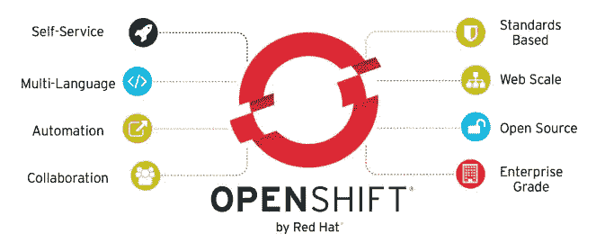
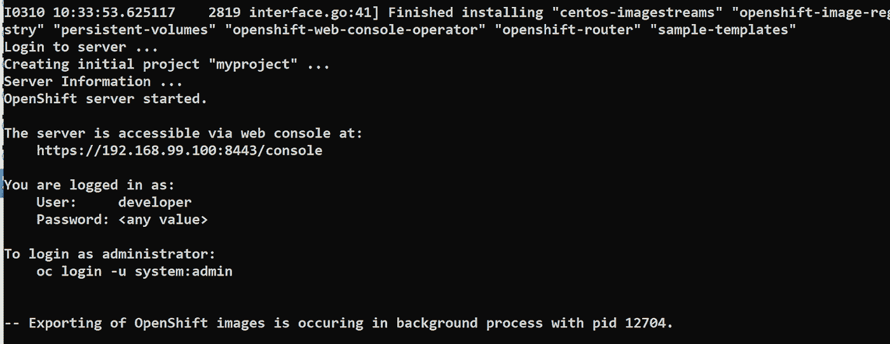
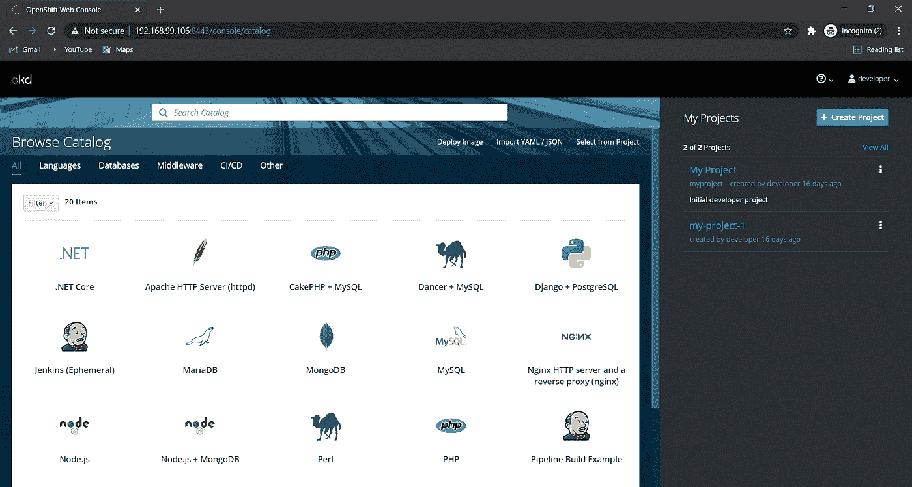

# open shift——Kubernetes 的下一个级别

> 原文：<https://levelup.gitconnected.com/openshift-the-next-level-of-kubernetes-6d58ad722b26>

## 关于 OpenShift 你应该知道的事情


米尔科·布利克在 [Unsplash](https://unsplash.com/collections/1560710/next-level?utm_source=unsplash&utm_medium=referral&utm_content=creditCopyText) 上拍摄的照片

当谈到容器编排时，首先想到的是“ **Kubernetes** ”，但现在 **OpenShift** 是主导者。这并不是说我们应该停止使用 Kubernetes，因为在容器领域没有什么能打败 Kubernetes。事实上，Kubernetes 是 OpenShift 中主要的底层技术。

OpenShift 和 Kubernetes 看起来很相似，都是为了容器编排，唯一的区别是 OpenShift 提供了额外的特性和功能，我们将详细讨论它们。

在本文中，我们将分析这两个流行的容器编排平台，并探索它们的根本区别。最后，我将向你展示 OpenShift 的快速安装，你可以使用下面的链接跳到安装部分。

[**快速安装 OpenShift**](#0cb4)

# 红帽 OpenShift

Red Hat 将 OpenShift 作为一个平台即服务(PaaS)产品进行营销，其中包括 Kubernetes，在此基础上添加了许多其他功能和一个支持计划。在其核心，OpenShift 是一个开源工具，利用 Kubernetes 平台来管理 [Docker 容器](https://www.bmc.com/blogs/3-steps-to-introduce-docker-containers-in-enterprise/)以实现一致性:

*   [工作量管理](https://www.bmc.com/blogs/what-is-workload-automation/)
*   自我监控
*   集中式策略供应



使用 OpenShift，开发人员可以在集成开发环境(IDE)中部署容器化的应用程序，同时使用 Kubernetes 来管理它们。

# 差异

OpenShift 和 Kubernetes 基本上做同样的事情，有了 Kubernetes，你可以部署和管理容器，同样的 openshift 也可以为你做同样的事情。两者之间没有太多的区别，但区别在于 **OpenShift 本身如何处理应用从构建到部署的完整工作流程，而 Kubernetes 不能。**

你可能会认为 OpenShift 是 kubernetes 的抽象层，因为 kubernetes 是 openshift 中的主要底层技术，但不仅仅是 Kubernetes， ***Openshift 是多种工具和技术*** 的集合，如 CI/CD、监控、编排、私有存储库等。

## OpenShift —接近单一解决方案

有了 Kubernetes，你可以做很多事情，比如部署应用、自动伸缩、公开应用(或负载平衡)、存储协调、自我监控等。但是在 Kubernetes 中，要为你的应用程序启动一个 pod，你需要提供一个容器图像(或 Docker 图像),比如来自 DockerHub 或任何其他存储库的图像。

首先对于容器映像，您需要为您的应用程序构建映像，然后将其推送到某个存储库。所以，这个**构建映像**的过程不能用 Kubernetes 来完成，你需要借助一些其他工具来自动化这个过程，比如你可以使用 [**詹金斯**](https://www.jenkins.io/) 这是一个 **CI/CD** 工具。但是这里你需要整合 Jenkins 和 Kubernetes，同时确保安全性，这是非常关键的。

因此，这里只是为了建立你的应用程序的形象，你必须做这么多的工作和配置多种东西。**建立形象是我们在集装箱领域最常做的事情，但我们仍然需要在这方面投入时间和金钱。但是现在没有 OpenShift 了。**

Openshift 提供了内置的功能来构建图像，你只需要提供你的网页的源代码，如 PHP，HTML 等，然后 openshift 会自动确定网页编写的语言，然后为其构建图像并推送图像。是不是很神奇！！

Openshift 创建您自己的私有存储库，并将所有图像存储在那里，因此它可以确保您的应用程序图像的安全，并且使用 openshift，您不需要进行多次集成，它将为您完成几乎所有事情。同样，在 Kubernetes 中进行监控，您需要集成一些可视化工具，如 Grafana，但 OpenShift 将监控一切，并创建一些图表。

因此，只需使用 OpenShift，您就可以创建从构建到部署的完整工作流，而使用 Kubernetes，您需要集成其他工具来设置这样的结构。并做一些额外的安全工作。**因此，OpenShift 遵循的方法是成为主要用例的单一解决方案。**

## 装置

随着 Kubernetes 越来越受欢迎，使用案例越来越多，与 Kubernetes 兼容的工具也呈指数级增长。这在开发者中仍然是一个重要的考虑因素，当涉及到平台、复杂性和升级时，这实质上提供了选择的自由。

更重要的是，Kubernetes 的广泛接受也是因为 Kubernetes 在所有三个主要的公共云平台上管理服务:

*   谷歌 GCP 的 GKE
*   AKS for Azure
*   亚马逊 AWS 的 EKS

相反，OpenShift 提供了有限的安装选项，因为您只能在三个 Linux 发行版上安装它:

*   对于 OpenShift 3，您需要使用 Red Hat Atomic 或 Red Hat Enterprise Linux (RHEL)。
*   要安装 OpenShift 4，您需要 RedHat CoreOS。
*   安装开源版本(OKD)需要 CentOS 或 RHEL。

[最近 AWS 也推出了在 AWS 上部署红帽 OpenShift 容器平台的服务。](https://aws.amazon.com/quickstart/architecture/openshift/)

## 易用性

Kubernetes web 界面很复杂，不推荐新手使用。要访问 Kubernetes Web GUI，您需要安装 Kubernetes 仪表板，并使用 **kube-proxy** 将本地机器的端口地址转发给集群服务器。因为仪表板缺少登录页面，所以您还必须创建不记名令牌，以便于授权和身份验证。

相反，OpenShift 有一个直观的 web 控制台，带有一键登录页面。控制台为您提供了一个简单的基于表单的界面，让您可以轻松地修改、添加和删除资源。可视化集群角色、项目和服务器也更加容易。

OpenShift 的 CLI 提供了`oc`命令，该命令结合了许多 Kubernetes 命令的功能，如 kubectl、kubens 和 kubectx。它允许许多操作，比如支持日志记录、在项目和名称空间之间切换以及从源代码构建容器映像，这些都需要 Kubernetes 上的外部工具。

## 集成图像注册表

Kubernetes 使您能够建立自己的 Docker 注册中心，但是您不会得到一个集成的图像注册中心。

OpenShift 提供了一个集成的图像注册表，您可以使用 Red Hat 或 [Docker Hub](https://hub.docker.com/) 。image registry 有一个控制台，您可以在其中搜索有关图像和图像流的信息，并将其传送到集群中的项目。

## 安全性

OpenShift 提供了严格的安全策略，比 Kubernetes 更加严格。例如，默认情况下，它不允许以 root 用户身份运行容器，这就是为什么 DockerHub 上的许多官方图像都不被允许的原因。但是，您可以使用 root 权限运行一些容器(一些容器，如 Redis 或 Postgres，需要 root 权限)。

基于角色的访问控制(RBAC)是作为 [OpenShift 的安全方法](https://blog.openshift.com/understanding-service-accounts-sccs/)的一部分而实施的，这很有意义，因为权限至关重要，尤其是在生产系统中。

认证是 OpenShift 的另一个亮点。它特别支持 LDAP 和 Active Directory 集成，还支持外部应用程序的身份验证和授权。所有这些都是通过集中式 OAuth 实现来完成的。虽然大部分——如果不是全部的话——可以通过像 GKE 上的 Firebase 这样的服务在 Kubernetes 上实现，但它需要更多的努力，这给了 OpenShift 一个明显的优势。

# OpenShift 的快速安装

如果您可能已经安装了 Kubernetes，那么您可能知道“[**”Minikube**](https://minikube.sigs.k8s.io/)**”**，它用于在本地设置单节点 Kubernetes 集群。同样，对于 OpenShift，有一个相同类型的程序，即“[**Minishift**](https://www.okd.io/minishift/)**”**，通过它我们可以在本地系统中设置单节点 OpenShift 集群。

OpenShift 有 2 个版本 [**OKD**](https://www.okd.io/) 和 **RHOCP** ， **OKD(原社区分布)**是 OpenShift 的开源版本，由某开源社区维护。但是 RHOCP 是 [**Red Hat OpenShift 容器平台**](https://www.openshift.com/products/container-platform) 由 Red Hat 的人维护，它附带了一个费用巨大的订阅。

Minishift 将安装 OpenShit 的开源版本，即 **OKD。** Minishift 在虚拟机中设置 openshift 集群，因此为此您需要已经安装了**虚拟盒**或 **VMWare** 。你可以从[这里](https://github.com/minishift/minishift/releases/tag/v1.34.3)下载 Minishift。

下载 minishift 后，您只需在 Windows 命令提示符或 Powershell 中运行该命令。

```
**minishift start --vm-driver virtualbox  --network-nameserver  8.8.8.8**
```

*在运行该命令之前，您需要切换到您下载 minishift 的目录，或者您可以在 windows 环境变量中添加 minishift。*

当 OpenShift 安装成功时，您将看到这个屏幕



您可能会遇到一些超时错误。为此，首先删除 minishift 虚拟机，然后再次运行 start 命令。

```
minishift stop
minishift delete -f
```

安装完成后，使用此命令访问 openshift 控制台或 WebUI

```
minishift console
```

OpenShift OKD 控制台看起来像这样



openshift webui

OpenShift 已经准备好了，你现在可以使用它了！！

# 结论

Kubernetes 和 OpenShift 都是不可忽视的容器编排的突出选择。两者在工作中都是最好的，唯一的区别是我们通常在现实世界中做的一些其他功能，如 CI/CD，我们不能用 Kubernetes 做，我们必须将 Kubernetes 与其他一些工具集成才能实现这些功能，这很耗时，但 OpenShift 内置了所有这些功能，所以它使我们的工作更容易，更安全。

因此，如果您希望快速部署应用程序，而不太担心容器环境的复杂性，Redhat 的 OpenShift 更适合您。但是，如果你更喜欢完全控制，那么像 GKE 管理 Kubernetes 供应商是一条路要走。

我希望现在你能够判断 Kubernetes 和 OpenShift 之间的实际区别，以及为什么 OpenShift 是 Kubernetes 的下一个级别。

在 [LinkedIn](https://www.linkedin.com/in/pathak-ajay) 上联系我