# 具有服务网格的开源 5G 核心

> 原文：<https://levelup.gitconnected.com/opensource-5g-core-with-service-mesh-bba4ded044fa>

这篇博客文章展示了如何在 Kubernetes 上部署带有服务网格的开源 5G 核心。

*注意——假设对 kubernetes 和电信有所了解。*

# 组件:

*   Kubernetes v1.21 版
*   印花布 CNI
*   Open5gs 5G 内核
*   Linkerd 稳定版-2.10.0
*   头盔 v3
*   UERANSIM v3.1.4 (gNB 和 UE 模拟器)

服务网格使这变得有趣，因为 5G 组件 SBI 是 http2 流量，以便它们可以像任何其他 http 应用一样被处理(服务路由、电路中断等)。唯一的例外是 UPF，它只使用 GTP 大学和 PFCP 大学。这意味着 UPF 将不会有一个链接代理侧车。

部署步骤:

1.  创建一个 kubernetes 集群(kubespray、rancher、eks、gke 等)。
2.  在 kubernetes 集群中安装 Linkerd:

```
linkerd install | kubectl apply -f -linkerd viz install | kubectl apply -f - # on-cluster metrics stack
```

3.克隆 git repo:[https://bit bucket . org/infinity don/open source-5g-core-service-mesh . git](https://bitbucket.org/infinitydon/opensource-5g-core-service-mesh/src/main/)

4.舵图很简单，你可以保持默认值不变，或者改变一些参数，如 mnc，mcc 等。

5.安装 open5gs 5G 内核:

```
## Create the namespace with linkerd auto injection
kubectl create -f namespace.yaml## Install open5gs 5G helm chart
helm -n open5gs install -f values.yaml 5gcore ./
```

6.一些组件的状态:

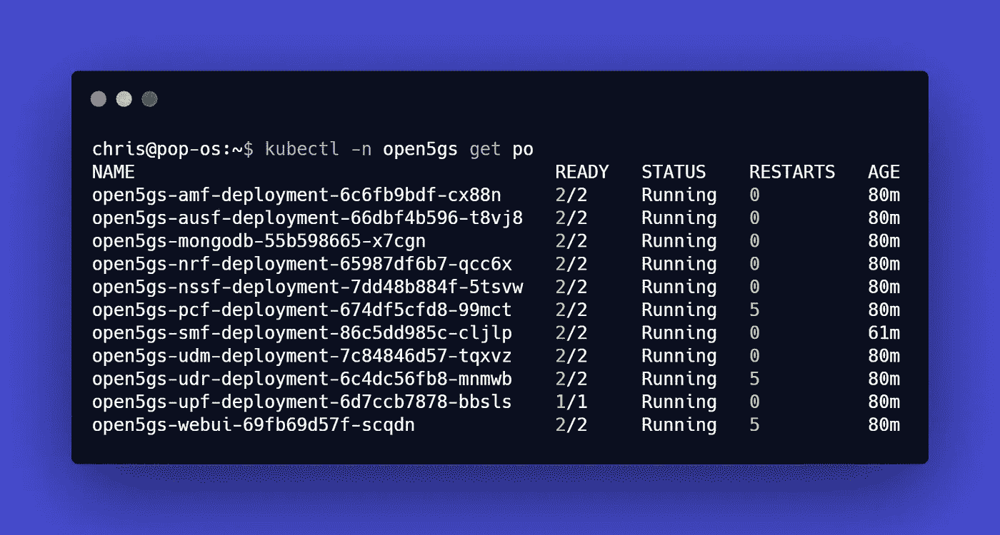

除 UPF 外，5G Pods 采用 Linkerd 侧车代理

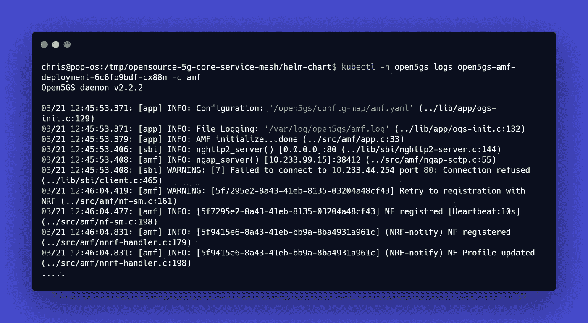

AMF 吊舱

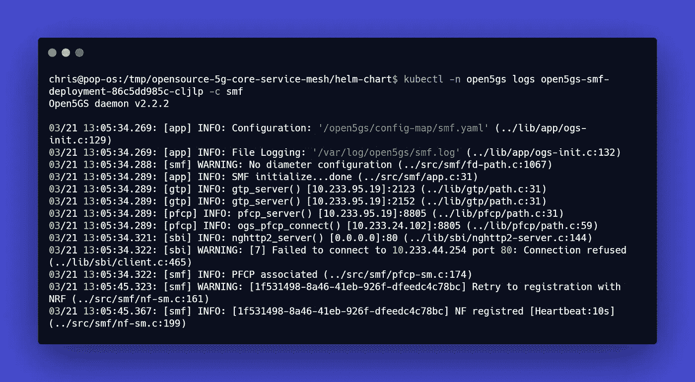

SMF 吊舱

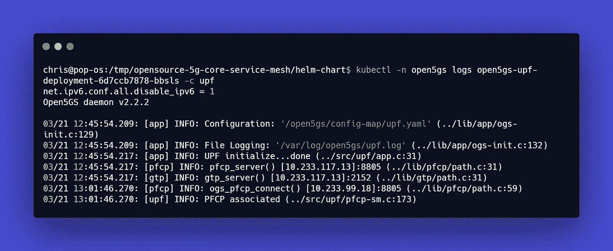

UPF 吊舱

***UE 和 gNB 测试:***

1.  在 open5gs web-ui 中创建一个订户，您可以使用端口转发来访问 pod
2.  在单独的虚拟机中安装 UERANSIM，并配置必要的参数。
3.  gNB 和 UE 状态的输出:

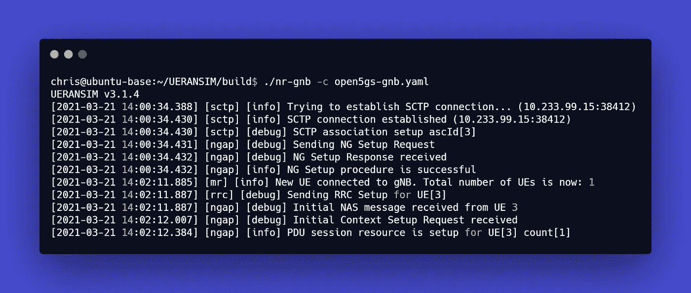

gNB 状态

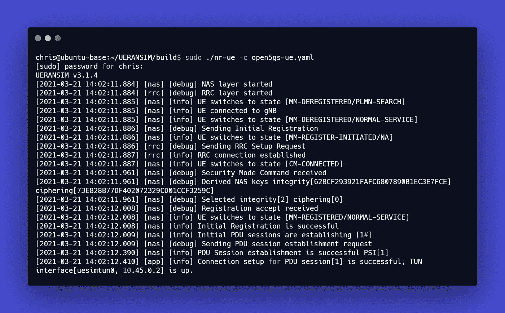

UE 状态

UE 已经能够成功地向 5G 核心注册。

现在让我们看看 Linkerd 服务网格统计的状态:

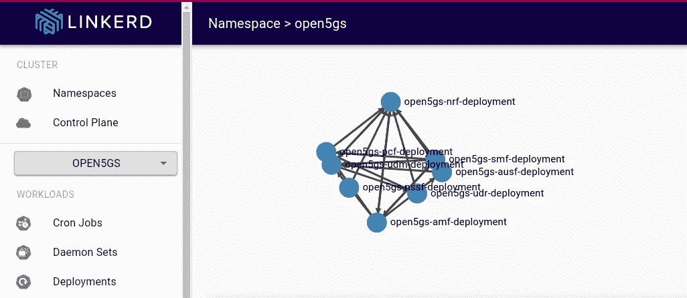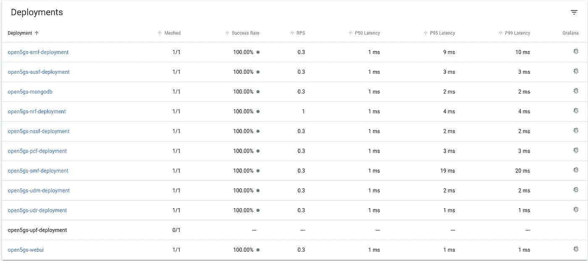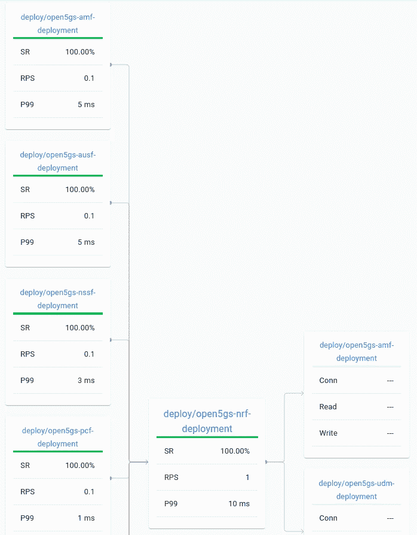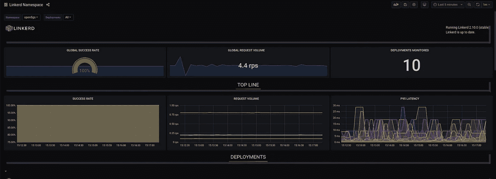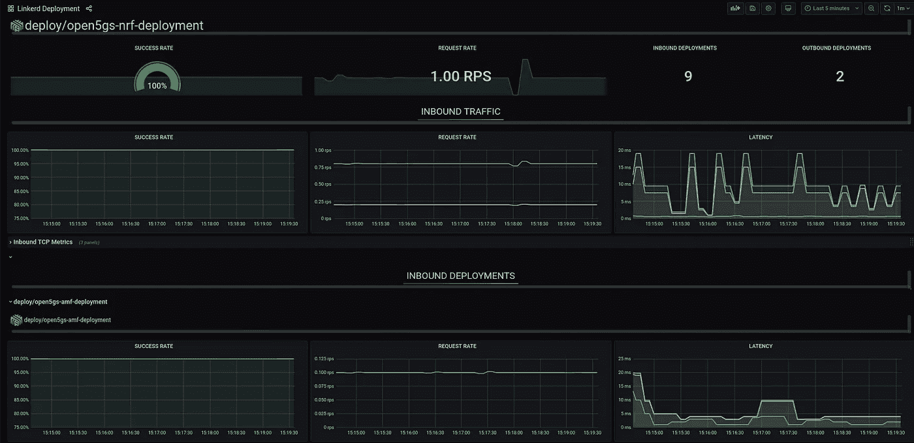

总之，我很高兴看到电信堆栈有可能使用企业技术堆栈。有了像 Linkerd 这样的服务网状网络，就可以使用 SBI 来完成像服务路由这样的进一步配置。当我们开始看到服务通信代理(本质上是服务网格所做的)的实现时，这将是非常有趣的。

参考资料:

*   [https://github.com/open5gs/open5gs](https://github.com/open5gs/open5gs)
*   [https://linkerd.io/2.10/getting-started/](https://linkerd.io/2.10/getting-started/)
*   [https://github.com/aligungr/UERANSIM/wiki/Installation](https://github.com/aligungr/UERANSIM/wiki/Installation)

页（page 的缩写）S —如果您想深入了解使用 Multus、SR-IOV、pods 中的多个网络接口等技术的裸机/本地 kubernetes 网络，那么您可以在 Udemy 上查看我的课程(您可以使用课程页面上的优惠券代码获得折扣):

[https://www . udemy . com/course/kubernetes-bare metal-networking-using-GNS 3/？referral code = 99 D5 F4 aafcf 769 E8 deb 6](https://www.udemy.com/course/kubernetes-baremetal-networking-using-gns3/?referralCode=99D5F4AAFCF769E8DEB6)