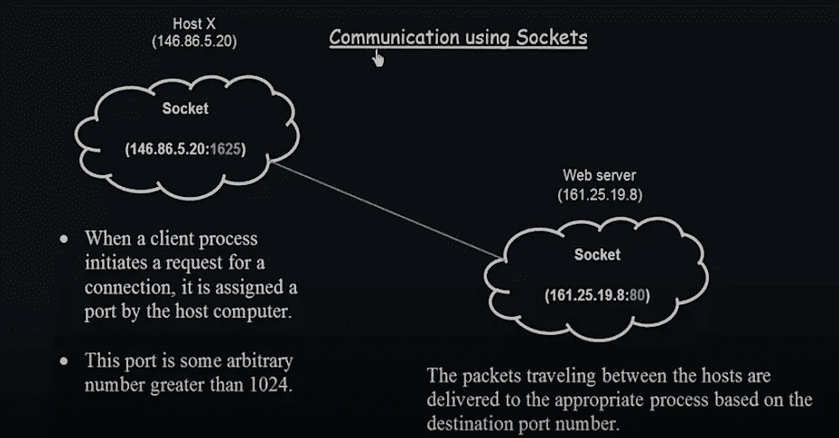

# 操作系统概念—套接字

> 原文：<https://levelup.gitconnected.com/operating-system-concepts-sockets-a78ddb9b5f9c>

格雷格·罗森克在 Unsplash 上的照片

套接字是用于进程间通信的策略。它主要用于基于客户机-服务器的系统。当两个系统想要相互通信时，套接字是通信进程两端的端点。

*   通过网络通信的一对进程使用一对套接字，每个进程一个套接字。

> 当两个进程想要通信时，它们之间需要有一个连接，并且在连接的每一端，每个进程都将使用一个套接字，因此一对通过网络进行通信的进程将使用一对套接字，每个进程一个套接字。

我们如何识别插座？

*   套接字由一个 IP 地址和一个端口号来标识。
    实现特定服务(如 TELNET、FTP 和 HTTP)的服务器监听众所周知的端口。
    比如说，
*   TELNET 服务器用于监听端口 23 的远程日志记录
*   FTP(文件传输协议)用于传输文件，服务器监听端口 21
*   Web 或 Http(超文本传输协议)服务器监听端口 80
*   端口号将标识将要提供的每个进程和服务。

> 所有低于 1024 的端口都被认为是已知的；我们可以用它们来实现标准服务。

**使用一对套接字的这些进程之间的通信是如何发生的？**

*   服务器通过监听指定的端口来等待传入的客户端请求。一旦接收到请求，服务器就接受来自客户机套接字的连接以完成连接。

> 在客户机-服务器系统中，客户机向服务器请求信息，服务器向客户机提供信息。为了让客户端与服务器通信，而服务器又与客户端通信，客户端和服务器之间需要有一个连接。为了建立这种连接，我们将使用套接字。

**使用套接字进行通信**

从上图来看，第一部分是主机，第二部分是 Web 服务器。第一部分是客户端，第二部分是服务器。

*   客户想要从服务器请求一些东西，服务器必须满足客户对服务器的任何要求。换句话说，要做到这一点，服务器和客户端之间必须有通信链路。使用我们前面定义的套接字概念建立通信链路。
*   从图的第一部分开始，客户端进程试图在客户端和服务器之间建立连接。主机将分配一个端口号给这个想要与服务器通信的进程。
*   上图中主机的 IP 地址是`146.86.5.20`一个属于主机的进程想要与 Web 服务器通信。为此，主机将为客户端进程分配一个特定的端口号。
    然后 IP 地址被分配一个端口号`146.86.5.20:1625:1625`端口号是大于 1024 的任意数字。它大于 1024，因为小于 1024 的端口号被认为是众所周知的，用于实现标准服务。
*   类似地，在 B 部分(Web 服务器)中，Web 服务器有一个套接字。套接字属于 Web 服务器中将要与客户端进程通信的进程。它有一个 IP 地址和端口号`161.25.19.8:80`

端口号 80 小于 1024，因为它是 Web 服务器而不是客户端。客户端试图从服务器访问一些服务，端口号 80 属于标准服务。

从客户端进程传输到服务器进程的数据包会根据端口号进行适当的传递

如果来自主机的另一个进程想要与 Web 服务器的同一个套接字通信，该进程将再次被分配另一个套接字。插槽号将是一个不同于`1625`且大于`1024`的新号码

**结论**

这就是使用套接字在系统/进程之间进行通信的方式。这是用于进程间通信的另一种策略，非常专门用于客户端-服务器系统。

> 套接字专门用于基于客户机-服务器的系统。

*   你也可以在 Twitter 上联系我或者在 G 上找到我。

**如果这篇文章有帮助，请点击拍手👏按钮下面几下，以示你对作者的支持！⬇**