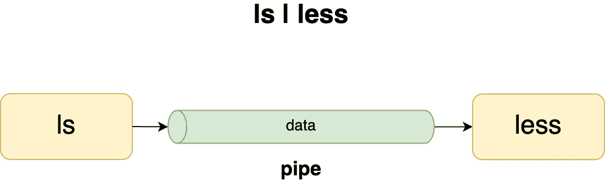
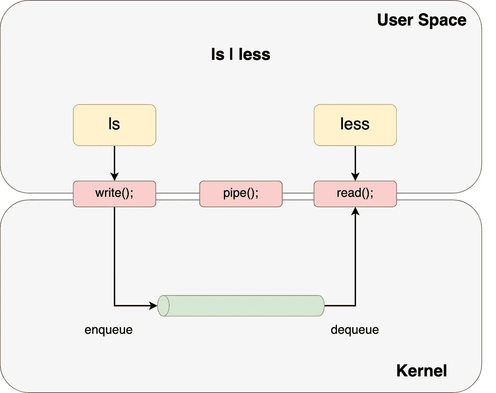
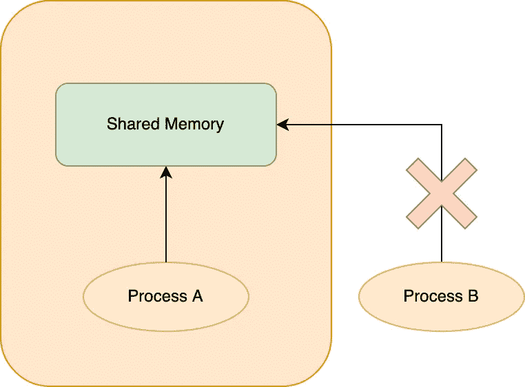
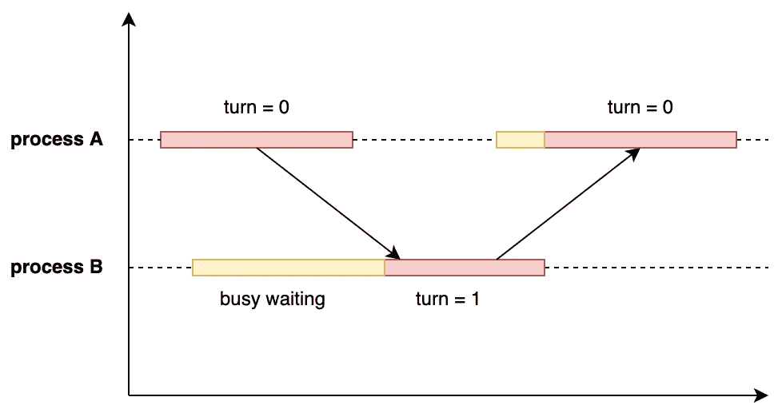

# 操作系统—进程间通信(IPC)

> 原文：<https://levelup.gitconnected.com/operating-system-inter-process-communication-ipc-60a288b11d18>

## 仅用 3 分钟了解 IPC

进程间通信 ( **IPC** )只是进程管理共享数据的一种机制。在两个进程之间共享数据最常用的对象是管道。

## **什么是烟斗？**

管道是两个进程之间的共享对象，用于相互传输数据。它是单向的，这意味着数据只能从左向右流动。



进程间通信的示例

在内核深处，pipe()系统调用在内核空间中创建了一个共享 FIFO 队列。



在本例中，“ls”进程是一个生产者，它将数据写入管道。“less”进程是一个消费者，它从管道中读取数据。

然而，你可能会意识到可能会有问题。缓冲区的大小有限。如果“ls”生产太快而“less”消耗太慢怎么办？

这被称为**生产者-消费者问题**，是一个同步问题。生产者-消费者问题是经典的 IPC 问题之一，我稍后会谈到它。

由于用户空间内存不能在进程间共享，即使它们是父进程和子进程，因此共享对象在内核级提供。除了管道，还有其他 IPC 问题。您可能必须直接使用共享内存和共享文件。并发访问可能会导致不可预知的结果，内核不会帮助你解决这个问题。

## 竞争条件

当进程共享同一个内存时，我们不能不讨论竞争条件。如果我们不好好照顾它，它可能会变成一只虫子。

竞争条件意味着执行的结果取决于访问共享资源的特定顺序。这可能发生在以下情况:

1.  有共享对象
2.  有多个过程
3.  这些进程同时访问共享对象

竞争条件总是一场噩梦，因为很难调试。

## 如何解决共享对象上的竞争情况？

**互斥**



互斥现象

当我玩共享内存时，没有人能碰它。如果保证*互斥*，一组进程就不会有竞争条件的问题。

请记住。共享对象仍然是可共享的，但是:
-共享对象不能同时共享 **-必须逐个共享**

**为了实现互斥，程序代码可以分为 3 个部分:**

1.  ****区段入口**:临界区段的开始。告诉其他进程共享内存正在被使用。**
2.  ****临界区**:访问共享对象的代码段。它应该尽可能的紧。**
3.  ****断面出口**:临界断面结束。告诉其他进程共享内存现在是空闲的。**

**简而言之，互斥是通过在一个进程已经在访问临界区时阻止其他进程进入临界区来实现的。**

## ****如何通过编程实现互斥？****

****旋转锁****

**它是在另一个共享对象上循环，**转**，检测其他进程的状态。**

**例如，流程 A:**

```
while (TRUE) {
  while( turn != **0** ) /* busy waiting */ **----------------------
  critical_section();** **----------------------** 

  **turn = 1;**

  remainder_section();
}
```

**流程 B:**

```
while (TRUE) {
  while( turn != **1**) /* busy waiting */**----------------------
  critical_section();****----------------------** 

  **turn = 0;**

  remainder_section();
}
```

****

**自旋锁示例**

****彼得森的解决方案****

****彼得森的解决方案**类似于自旋锁。除了“ **turn** 之外，还使用了一个额外的共享对象“**interest”**。如果我不表现出兴趣，我会让其他进程使用共享内存。如果所有的进程都表现出兴趣，那么所有的进程必须轮流进行。**

**例如，流程 A:**

```
**interested[process] = TRUE**;while( **turn == process** && **interested[other process] == TRUE** )/* busy waiting */**----------------------
  critical_section();****----------------------** 

  **interested[process] = FALSE**;

  remainder_section();
}
```

**流程 B(与流程 A 相同):**

```
**interested[process] = TRUE**;while( **turn == process** && **interested[other process] == TRUE** )/* busy waiting */**----------------------
  critical_section();****----------------------** 

  **interested[process] = FALSE**;

  remainder_section();
}
```

**然而，互斥有一个明显的缺点。它阻碍了并行计算的性能。**

## **后续步骤**

**如果你正在读这一行，恭喜你！！！你做到了。您已经学习了 IPC 的基础知识以及如何解决进程的竞争情况。有一些有趣的 IPC 问题，如生产者-消费者问题和用餐哲学家问题，绝对值得一提。希望我能在未来讨论其中的一些。**

**请随意查看下面关于操作系统的其他文章:**

**[](https://mattchw.medium.com/overview-of-operating-system-cc3f6f6bb062) [## 操作系统概述

### 操作系统一般是如何工作的？

mattchw.medium.com](https://mattchw.medium.com/overview-of-operating-system-cc3f6f6bb062) 

要了解更多关于我的后端学习路径，请点击这里查看我的旅程:

[](https://medium.com/@matthew.chohin/my-backend-developer-learning-journey-%E6%88%91%E7%9A%84%E5%BE%8C%E7%AB%AF%E5%AD%B8%E7%BF%92%E4%B9%8B%E6%97%85-5315fe2fefc2) [## My Backend Developer Learning Journey 我的後端學習之旅

### 毕业一年多了。拥有 2 年以上的前端和后端工作经验…

medium.com](https://medium.com/@matthew.chohin/my-backend-developer-learning-journey-%E6%88%91%E7%9A%84%E5%BE%8C%E7%AB%AF%E5%AD%B8%E7%BF%92%E4%B9%8B%E6%97%85-5315fe2fefc2)**