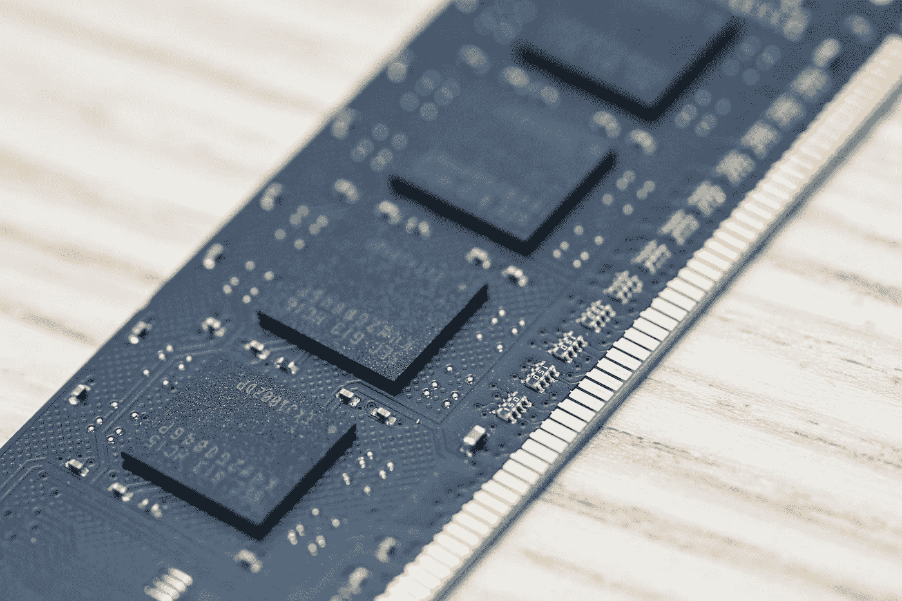
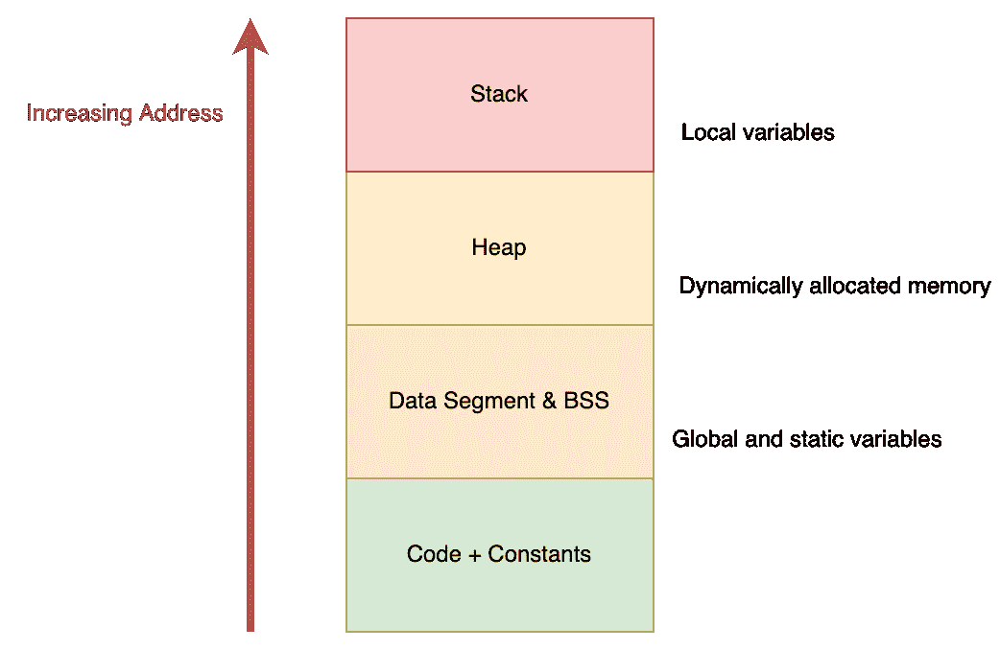
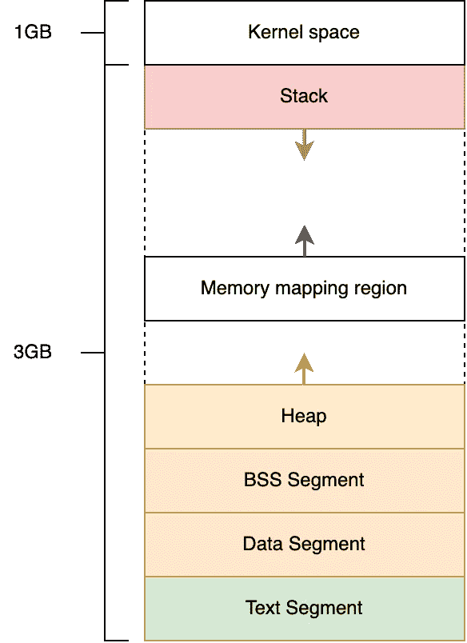
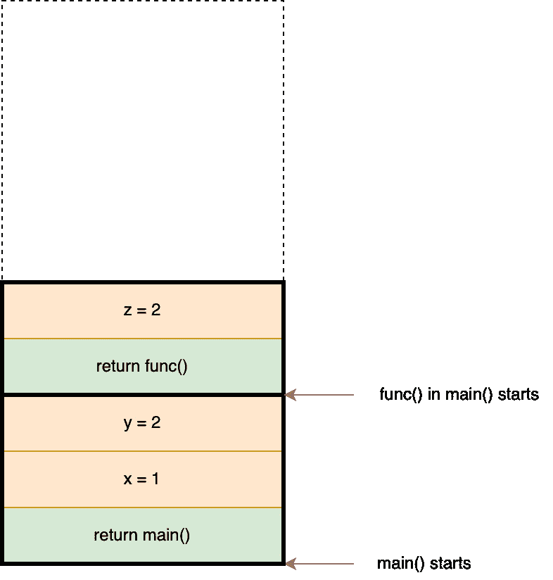
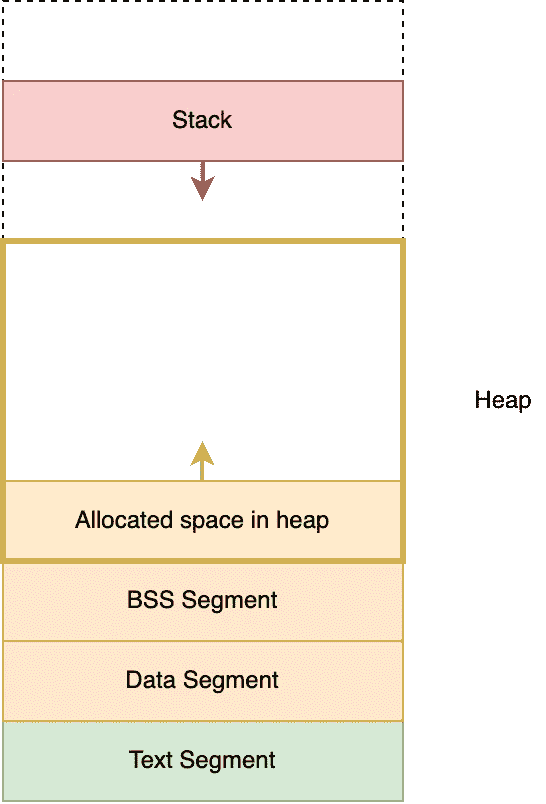

# 操作系统—内存管理

> 原文：<https://levelup.gitconnected.com/operating-system-memory-management-7f130d242e68>

## 仅用 5 分钟了解内存管理



杰瑞米·泽罗在 [Unsplash](https://unsplash.com?utm_source=medium&utm_medium=referral) 上的照片

**内存管理**是管理计算机内存的过程，在主存和磁盘之间移动进程以提升系统的整体性能。它非常重要，因为它帮助操作系统跟踪每个内存位置，包括分配内存和释放内存。

在本文中，我将只关注用户空间内存，因为它直接影响应用软件的执行，每个软件工程师都应该了解它。

# 用户空间内存管理

## 地址空间



地址空间

一个地址映射到一个字节。在 32 位系统上，一个进程的最大内存量是 2^32 字节，这意味着 **4GB** 。这意味着 64 位系统上一个进程的内存可以是 **16EB** 。



关于地址空间的更多细节

每个进程都有自己的地址空间，并且应该有 2^32 字节(4GB)的内存。(我说的是 32 位系统)

地址空间由 4 种主要的内存组成。它们是:

1.  程序代码和程序段
2.  数据段
3.  堆
4.  许多

## 程序代码和常量

让我们来看一个代码段的例子:

```
int main(void) {
  **char *string = "hello";** //string constant
  printf("\"hello\" = %p\n", **"hello"**); // "hello" is used
  printf("String pointer = %p\n", **string**); // same constant is used
  return 0;
}
```

电脑很聪明。在这个例子中，程序总是使用相同的字符串常量，只要它是唯一的。

大多数具有基本编程知识的开发人员或软件工程师肯定知道它。代码和常量都是只读的。

*   我们不能在运行时改变代码或常量的值。
*   常数存储在代码段中，并且只存储唯一的常数。

## 数据段和 BSS

全局和静态变量存储在数据段和 BSS(以符号开始的块)中。数据段用于存储初始化的变量，而 BSS 用于存储未初始化的变量。

让我们看看下面的例子:

```
int global_int = 1; // globalint main(void) {
  int local_int = 1;
  static int static_int = 1; // static printf("local_int addr = %p\n", &local_int ); // e.g. 0xbf8bb8ac
  printf("static_int addr = %p\n", &static_int ); // e.g. **0xxxxxx18**
  printf("global_int addr = %p\n", &global_int ); // e.g. **0xxxxxx14**
  return 0;
}
```

如果你想在自己的机器上运行 c 程序。我们会发现全局变量和静态变量是紧挨着存储的。这意味着它们在同一个分段中。

让我们看另一个例子:

```
int global_bss; // uninitialized
int global_data = 1; // initializedint main(void) {
  static int static_bss; // uninitialized
  static int static_data = 1; // uninitialized printf("global bss = %p\n", &global_bss ); // e.g. **0xxxxxx88**
  printf("static bss = %p\n", &static_bss ); // e.g. **0xxxxxx84**
  printf("global data = %p\n", &global_data ); // e.g. **0xxxxxx14**
  printf("static data = %p\n", &static_data ); // e.g. **0xxxxxx18**
}
```

这表明数据和 BSS 是分开存储的。

## 堆

堆栈是存储以下内容的区域:

*   **局部变量**，
*   **功能参数**，以及
*   **环境变量**

由函数创建。



堆栈示例

当一个函数被调用时，一个堆栈框架将被压入。当函数返回时，堆栈帧将被弹出。这项工作不是由内核完成的，而是由编译器完成的。它将这种机制硬编码到我们的程序中。

函数可以在堆栈中的任何地方读写，而不局限于自己的堆栈框架。

但是，编译器无法在编译时估计堆栈的大小。函数调用的次数取决于许多因素，如程序状态、用户输入等。内核只能为堆栈保留一定的空间。

让我们再多考虑一点。**如果栈中没有更多的空间了怎么办？**操作系统会做什么？放大堆栈？如果是一串无休止的
递归函数调用怎么办？

会发生什么？

*   CPU 捕捉到异常
*   **堆栈溢出**异常
*   程序终止

**解决方案**

*   最小化参数的数量
*   最小化局部变量的数量
*   最大限度地减少通话次数
*   使用全局变量
*   使用 malloc

## 许多

当一个程序刚刚运行时，整个堆空间是未分配的或空的。



调用 malloc 时，堆正在增长

分配空间的增长或收缩取决于 **malloc()** 和 **free()** 系统调用。 **malloc()** 增加堆空间，而 **free()** 减少堆空间。

当调用“ **malloc()** ”或“ **free()** ”时，可能会调用“brk()”系统调用。系统调用标记堆地址结束的地方。

[](https://man7.org/linux/man-pages/man3/malloc.3.html) [## malloc(3) - Linux 手册页

### MALLOC(3) Linux 程序员手册 MALLOC(3) malloc，free，calloc，realloc，reallocarray - allocate 和 free dynamic…

man7.org](https://man7.org/linux/man-pages/man3/malloc.3.html)  [## 免费(3) - Linux 手册页

### malloc()函数分配大小字节并返回…

linux.die.net](https://linux.die.net/man/3/free) [](https://man7.org/linux/man-pages/man2/brk.2.html) [## brk(2) - Linux 手册页

### include int brk(void * addr)；void * sbrk(int ptr _ t increment)；glibc 的功能测试宏要求(参见…

man7.org](https://man7.org/linux/man-pages/man2/brk.2.html) 

" **free()** "取消分配任何已分配的内存。当一个程序调用“ **free(ptr)** ”时，那么地址“ptr”一定是之前“ **malloc()** ”调用获得的内存的开始。

## 后续步骤

如果你正在读这一行，恭喜你！！！你做到了。您已经学习了用户空间内存管理的基础知识。当然，内存管理还有更复杂的问题，比如分段错误。希望我能在未来讨论其中的一些。

请随意查看下面关于操作系统的其他文章:

[](https://mattchw.medium.com/overview-of-operating-system-cc3f6f6bb062) [## 操作系统概述

### 操作系统一般是如何工作的？

mattchw.medium.com](https://mattchw.medium.com/overview-of-operating-system-cc3f6f6bb062) 

要了解更多关于我的后端学习路径，请点击这里查看我的旅程:

[](https://mattchw.medium.com/my-backend-developer-learning-journey-%E6%88%91%E7%9A%84%E5%BE%8C%E7%AB%AF%E5%AD%B8%E7%BF%92%E4%B9%8B%E6%97%85-5315fe2fefc2) [## My Backend Developer Learning Journey 我的後端學習之旅

### 毕业一年多了。拥有 2 年以上的前端和后端工作经验…

mattchw.medium.com](https://mattchw.medium.com/my-backend-developer-learning-journey-%E6%88%91%E7%9A%84%E5%BE%8C%E7%AB%AF%E5%AD%B8%E7%BF%92%E4%B9%8B%E6%97%85-5315fe2fefc2)