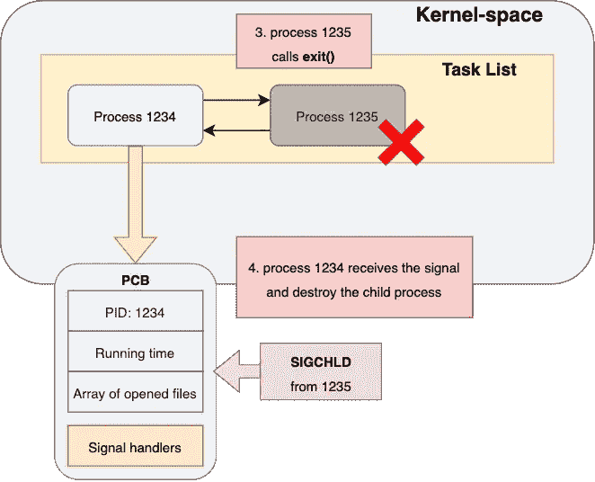

# 操作系统—流程管理

> 原文：<https://levelup.gitconnected.com/operating-system-process-management-26c73901166>

## 关于过程的基础、中级和高级知识


迈克尔·泽兹奇在 [Unsplash](https://unsplash.com?utm_source=medium&utm_medium=referral) 上的照片

操作系统中的进程管理是一个重要的概念，因为我们在一天中执行不同的程序时会生成成百上千个进程。为了让您更容易理解流程管理，我将它分为三个级别，从最容易到最难:

1.  **基础(工艺、PCB、工艺生命周期)**
2.  **中间(用户空间中的进程)**
3.  **高级(内核空间中的进程)**

# 第 1 级—你必须知道的基本概念

## 什么是过程？

一个**进程**是一个正在执行的程序。它包含该运行程序的所有信息:

*   当前程序计数器
*   累计运行时间
*   该程序当前打开的文件列表
*   页面表

## 什么是过程控制块(PCB)？

每个过程都由一个称为**过程控制块(PCB)** 的数据结构表示。PCB 保存了工艺的所有重要信息。


过程控制块

*   **指针**:指向父进程的指针。
*   **进程 ID** :代表一个进程的唯一 ID 号。
*   **进程状态**:任何进程当前所处的状态(就绪、等待、退出等)。
*   **进程优先级**:表示进程紧急程度的数值。具有最高优先级的进程将首先分配给 CPU。
*   **程序计数器**:进程中下一条指令的地址。
*   **记账信息**:CPU 使用量、时间限制、作业或进程号等。
*   **CPU 寄存器**:累加器、变址寄存器、通用寄存器等。
*   **I/O 信息**:分配给进程的打开文件和 I/O 设备的数组。

## 什么是流程生命周期？

每个过程都有一个生命周期。流程的状态包括开始、就绪、运行、等待和终止。


流程生命周期

**开始**:一个流程的诞生。
除了第一个进程“init”，每个进程都是使用 **fork()** 创建的。

**就绪**:流程准备就绪。
表示准备运行，但没有运行。在以下情况之后，流程可能会变为“就绪”
(可运行):

*   它是由 **fork()** 创建的
*   它已经在 CPU 上运行了一段时间，操作系统选择运行另一个进程(预定的上下文切换)
*   从阻塞状态返回

**正在运行**:进程正在运行。
操作系统选择这个进程在 CPU 上运行，并将其状态改为“运行中”。

**等待/阻塞**:进程被阻塞。
当进程运行时，它可能会等待一些东西(例如 getc()、wait())。有两种类型的等待，可中断的和不可中断的。

*   可中断等待(Interruptible wait):有时，一个进程必须等待设备的响应，因此它被阻塞了。这种阻塞状态是可中断的。意思是按“Ctrl + C”可以让进程脱离等待状态。
*   **不可中断等待**:有时候，一个流程需要等待一个资源，直到它真正得到响应。它处于不可中断状态。这意味着它不会被“Ctrl + C”中断。

**终止:**进程即将死亡。
流程可以选择自行终止或者强制终止。

# 第 2 级—中级知识(用户空间)

有了基本概念后，我们将更深入地了解进程的系统调用，但重点是用户空间(从程序员的角度)。

1.  如何识别流程？
2.  如何创建新流程？

## 我们如何从一个到另一个识别过程？

每个进程都有一个唯一的 ID 号，称为进程 ID(PID)。系统调用 **getpid()** 打印调用进程的 pid。

getpid()的示例:

```
#include <stdio.h> // printf()
#include <unistd.h> // getpid()int main(void) { printf(“My PID is %d\n”, **getpid()** ); return 0;}
```

## 我们如何创建一个新的流程？

为了创建一个流程，我们使用系统调用 **fork()** 。


fork()的示例:

```
int main(void) {
  printf(“Parent (PID = %d)\n”, getpid());
  **fork()**;
  printf(“My PID is %d\n”, getpid() );
  **return** 0;
}
```

输出:

```
Parent (PID = 1234) <- parent process
My PID is 1234 <- parent process
My PID is 1235 <- child process
```

在上面的例子中，我们可以观察到:

*   父进程和子进程都执行相同的程序
*   **子进程从返回 fork()的位置开始执行，而不是从程序的开头开始执行**

系统调用 **fork()** 就像“细胞分裂”。它通过从父进程克隆来创建子进程，包括所有用户空间数据。

如果一个进程只能复制自己，并且总是运行同一个程序，那就没什么意义了。那么，这里又来了一个问题——我们如何执行其他程序？

让我们来认识一下 **exec*()** 系统调用家族！

## 我们怎样才能执行一个程序？

**exec*()** 是一个系统调用族，该族有 6 个成员(execl、execv、execlp、execvp、execle、execve)。

我们以 execl()为例:

```
**execl(“/bin/ls”, “/bin/ls”, NULL);**
```

在这种情况下，我们希望运行“/bin/ls”命令。

*   第一个参数“/bin/ls”:我们要执行的文件
*   第二个参数“/bin/ls”:当进程切换到“/bin/ls”时，
    该字符串为程序参数[0]
*   第三个参数“NULL”:表示程序参数列表的结尾

下面是 execl()的另一个例子:

```
**execl("/bin/ls", "/bin/ls", "-l", NULL);**
```

在这种情况下，我们有 4 个参数:

*   第一个参数“/bin/ls”:我们要执行的文件
*   第二个参数“/bin/ls”:当进程切换到“/bin/ls”时，
    该字符串是程序参数[0]
*   第三个参数"- l ":当进程切换到"/bin/ls "，
    这个字符串就是程序参数[1]
*   第四个参数“NULL”:表示程序参数列表的结尾

这是一个如何在 C 程序中使用 execl()的例子:

```
int main(void) {
  printf(“before execl\n”);
  **execl(“/bin/ls”, “/bin/ls”, NULL);**
  printf(“after execl\n”);
  return 0;
}
```

但是，如果运行此程序，则不会打印“after execl”。这意味着没有到达“execl()”之后的代码行。父进程被终止。

**记住这一点**:exec 系统调用族不仅仅是一个调用命令的函数。“/bin/ls”中的“return”或“exit()”语句将终止该进程。所以，流程肯定回不到原程序了！

**问:怎样才能做出有意义的过程创作？**
**答案:fork()+exec *()+wait()= system()**
创建有意义流程的例子:

```
int exec(const char *cmd) {
  if(cmd == -1)
    return -1; // if fork() returns 0, this is a child process  
  if(**fork()** == 0) { 
    **execl("/bin/sh", "/bin/sh", "-c", cmd_str, NULL);** fprintf(stderr, "%s: command not found\n", cmd_str);
    exit(-1);
  } **wait(NULL)**;
  return 0;
}// main
int main(void) {
  printf("before exec\n\n");
  **exec("/bin/ls");**
  printf("after exec\n");
  return 0;
}
```

中止父进程的执行和在子进程终止后唤醒父进程的关键是使用 **wait()** 。


wait()如何挂起父进程

**wait()** 用于将调用进程挂起至等待状态，当其子进程之一终止或收到信号时返回(唤醒)。

现在，你知道了:

*   系统()创建了一个新进程
*   进程是由 **exec*()** 带入内存的程序
*   c 库调用， **system()** ，由 **fork()** ， **exec*()** ，以及
    **wait()** 实现

# 第 3 级—高级知识(内核空间)

到目前为止，我们只讨论了用户空间中的过程。这是在进入内核空间之前的全貌:


## 当我们调用系统调用时发生了什么？


由于代码在用户空间内存中，程序计数器指向用户空间内存。

当进程调用系统调用(例如 getpid())时，CPU 从用户空间切换到内核空间，并从内核读取进程的 pid。

当 CPU 执行完系统调用后，它切换回用户空间内存，并继续运行该程序代码。

因此，CPU 总是在用户空间和内核空间之间切换。我们可以检查执行程序时花费在用户空间和内核空间的时间。

*   **用户时间**:花费在用户空间内存代码上的 CPU 时间
*   **Sys time** :花在内核空间内存代码上的 CPU 时间


在 Linux 中，有一个命令叫做 **time** 来检查用户时间和系统时间。要了解更多信息，请查看:

[](https://man7.org/linux/man-pages/man1/time.1.html) [## 时间(1) - Linux 手册页

### time 命令使用给定的参数运行指定的程序命令。当命令结束时，时间写一个…

man7.org](https://man7.org/linux/man-pages/man1/time.1.html) 

## fork()是如何工作的？


当一个进程调用 fork()时，会有一段处理时间，因为内核需要做一些事情。让我们看看内核到底在做什么。


在内核空间中，进程被安排成一个双向链表，称为**任务列表**。

这就是 **fork()** 在用户空间和内核空间更新内存的方式:

1.  父进程 1234 调用 **fork()**
2.  PCB 在内核空间被复制，用户空间内存中的代码也被复制
3.  在内核空间中，复制的 PCB 的一些细节被更新


调用 **fork()** 后，父进程和子进程都会从 fork()返回。最后，在 PCB 中添加一个返回值。父进程的返回值将是其子进程的 PID，子进程的返回值将是 0。

## exec*)是如何工作的？


当一个进程调用 **exec()** 时，用户空间的内存会发生变化:

*   **局部变量** & **动态分配的内存**被清除
*   **全局变量**根据新代码重置
*   **代码&常量**更改为新代码

当然，内核也会重置 PCB 中的寄存器值(例如程序计数器)。

## wait()和 exit()是如何工作的？

## 退出()

我想先说说 **exit()** 由于调用 exit()而不调用 wait()会导致一个严重的问题，**僵尸进程**。你很快就会明白的。


这就是 **exit()** 释放用户空间和内核空间内存的方法:

1.  子进程 1235 调用 **exit()**
2.  内核空间中所有分配的内存都被释放。打开的文件列表全部关闭。(所以跳过 fclose()没问题，但不建议)
3.  用户空间中所有分配的内存都被释放。(包括程序代码
    和分配的内存)
4.  内核通知子进程的父进程关于其子进程的终止
    。内核向父进程发送一个信号。

由于父进程 1234 没有调用 wait()，它将忽略 **SIGCHLD** 信号。因此，进程 ID 1235 仍然在内核的任务列表中。子进程的状态现在被称为**僵尸进程**。

## 等待()


默认情况下，每个进程不响应 **SIGCHLD** 信号。父进程忽略他的子进程，除非它真的在等待子进程。

如果一个进程调用了 **wait()** ，内核将为该进程注册一个信号处理
例程。



当内核向父进程发送 **SIGCHLD** 时，相应的信号处理例程将被调用。

这是默认处理程序将要做的:

1.  接受并移除 **SIGCHLD** 信号；
2.  销毁子进程(将其从进程表、任务列表等中移除。)


在移除子进程之后，内核取消注册父进程的信号处理例程，并返回被终止的子进程的 PID。

因此，调用 **wait()** 非常重要！！！主要原因是**系统资源管理**。一个僵尸进程占用一个 PID，但是 PID 的总数是有限的(32，768)。所以，永远记住首先在父进程中调用 **wait()** 。

如果你正在读这一行，恭喜你！！！你做到了。从一级读到三级不容易。我相信您现在对流程管理有了非常具体的理解。

要了解更多关于我的后端学习路径，请点击这里查看我的旅程:

[](https://medium.com/@matthew.chohin/my-backend-developer-learning-journey-%E6%88%91%E7%9A%84%E5%BE%8C%E7%AB%AF%E5%AD%B8%E7%BF%92%E4%B9%8B%E6%97%85-5315fe2fefc2) [## My Backend Developer Learning Journey 我的後端學習之旅

### 毕业一年多了。拥有 2 年以上的前端和后端工作经验…

medium.com](https://medium.com/@matthew.chohin/my-backend-developer-learning-journey-%E6%88%91%E7%9A%84%E5%BE%8C%E7%AB%AF%E5%AD%B8%E7%BF%92%E4%B9%8B%E6%97%85-5315fe2fefc2)