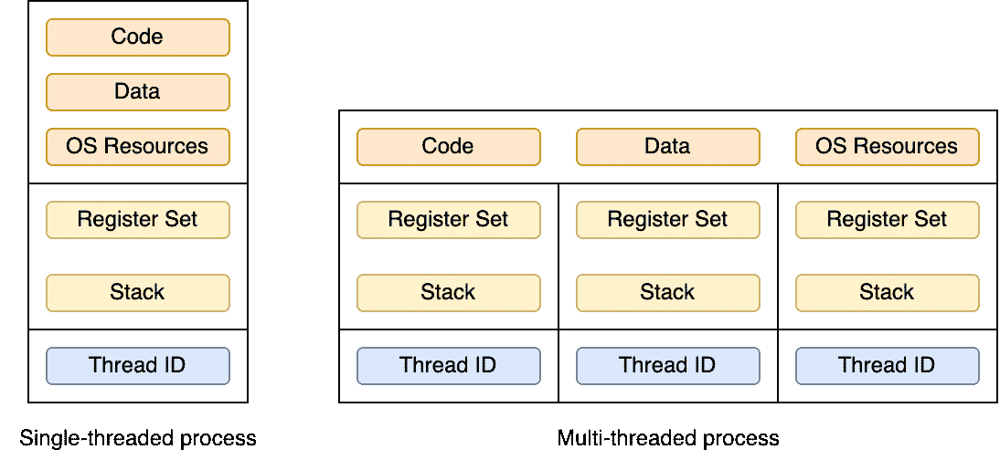
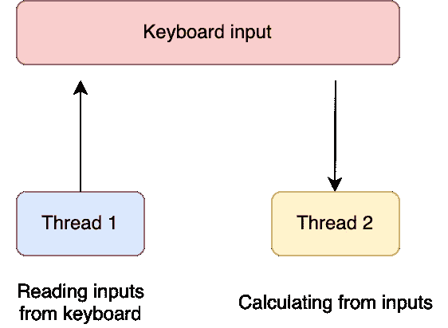
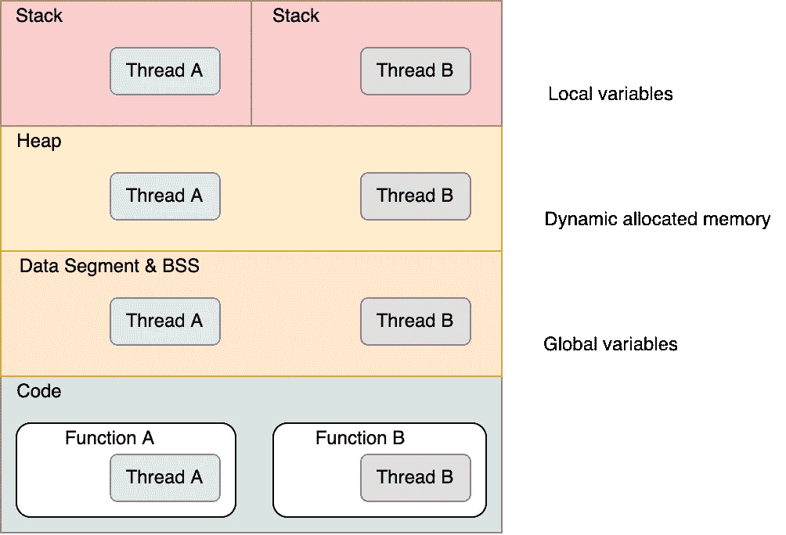

# 操作系统—线程

> 原文：<https://levelup.gitconnected.com/operating-system-threading-ae9697322efb>

## 仅用 4 分钟了解线程


约翰·安维克在 [Unsplash](https://unsplash.com?utm_source=medium&utm_medium=referral) 上的照片

**线程**是软件工程师最重要的概念之一。它允许一个程序同时运行多个任务。你一定经常听说过线程。但是你真的知道那是什么吗？流程呢？你知道**螺纹**和**工艺**的区别吗？你知道如何**创建一个线程**吗？

如果您是高级开发人员或计算机科学专业的毕业生，请将本文作为复习资料。如果你是操作系统世界的新手，它是为你量身定做的。

# 什么是线程？

线程是 CPU 利用率的基本单位，它包括:

*   threadID
*   程序计数器
*   寄存器组
*   堆

对于属于同一进程的线程，它们共享:

*   代码部分
*   数据部分
*   其他操作系统资源(例如，打开的文件和信号)



单线程进程与多线程进程

# 进程与线程

## 流程:

1.  重量级
2.  创建成本高(需要更多内存)
3.  无法访问其他进程的内存区域
4.  昂贵的过程转换
5.  不同的过程意味着不同的程序

## 线程:

1.  轻量
2.  廉价创建(需要更少的内存)
3.  与其他线程共享相同的内存区域
4.  廉价的线程切换
5.  多线程意味着相同的代码段

# 用户空间内存中的多线程

多线程的好处之一是易于数据共享。

数据共享可以通过以下方式完成:

*   全局变量
*   动态分配的内存。

所有线程共享全局变量区和堆，它们可以从这两个区域读取数据，也可以向这两个区域写入数据。



多线程一起共享数据

但是，这导致了**互斥**和**同步**的问题。如果你想了解更多关于互斥的知识，可以查看我之前的文章。

[](/operating-system-inter-process-communication-ipc-60a288b11d18) [## 操作系统—进程间通信(IPC)

### 仅用 3 分钟了解 IPC

levelup.gitconnected.com](/operating-system-inter-process-communication-ipc-60a288b11d18) 

进程的用户空间内存

## 代码和线程功能

所有线程共享相同的代码，一个线程可以从一个特定的函数开始，这个函数就是线程函数。

一个线程函数可以调用其他函数或系统调用。但是线程永远不会返回线程函数的调用者。

## 局部变量

每个线程都有自己的局部变量堆栈。

# 如何创建线程？

## Pthread 库

让我们来看看进程和线程的系统调用之间的区别。

系统调用流程

*   创作: **fork()**
*   ID 类型: **PID** ，为整数
*   获取身份: **getpid()**
*   终止:**退出()**
*   等待子终止: **wait()** **/ waitpid()**
*   Kill: **kill()**

线程的系统调用

*   创建: **pthread_create()**
*   id 类型: **pthread_t** ，是一个结构
*   获取身份: **pthread_self()**
*   终止: **pthread_exit()**
*   等待子进程终止: **pthread_join()**
*   Kill: **pthread_kill()**

## 使用 pthread_create()创建线程的示例

线程功能:

```
void * hello( void *input ) {
  printf(“%s\n”, (char *) input);
  pthread_exit(NULL);
}
```

主要功能:

```
int main(void) {
  pthread_t tid;
  **pthread_create(&tid, NULL, hello, “hello world”);**
  pthread_join(tid, NULL);
  return 0;
}
```

# Pthread 中的互斥

信号量可以用作锁，但是它很难编码和读取。

POSIX 线程提供了可以和 POSIX 信号量一起使用的**互斥**和**条件变量**。

## **互斥**

**初始化**

```
pthread_mutex_t mutex = PTHREAD_MUTEX_INITIALIZER;
```

**锁定**

```
pthread_mutex_lock(&mutex);
```

*   如果互斥体没有被锁定，请锁定互斥体。
*   如果互斥被锁定，阻塞调用线程。

**解锁**

```
pthread_mutex_unlock(&mutex);
```

使用互斥的线程函数示例:

```
while(TRUE) { **pthread_mutex_lock(&mutex);** if(shared < 100)
    **shared++; // shared object**
  else {
    **pthread_mutex_unlock(&mutex);**
    break;
  } **pthread_mutex_unlock(&mutex);** sleep(rand() % 10);}
```

## pthread_mutex vs POSIX 信号量

POSIX 信号量

*   由内核拥有
*   可以跨进程/线程同步
*   任何线程/进程都可以对
    任何信号量执行**SEM _ wait()**&**SEM _ post()**

pthread _ 互斥

*   **仅在同一进程的线程间同步**

pthread_mutex 在使用和调试上肯定要容易得多。

## 条件变量

**初始化**

```
pthread_cond_t cond = PTHREAD_COND_INITIALIZER;
```

**等待**

```
pthread_cond_wait(&cond, &mutex);
```

**唤醒 1 号**

```
pthread_cond_signal(&cond);
```

此功能**唤醒一个等待**条件变量**“cond”**的线程。如果有多个线程在等待，那么这些线程中至少有一个会被唤醒。

**唤醒 2 号**

```
pthread_cond_broadcast(&cond);
```

此功能**唤醒所有等待条件变量“cond”的线程**。

## 后续步骤

如果你正在读这一行，恭喜你！！！你做到了。你已经学习了线程的基础知识以及如何创建线程。

请随意查看下面关于操作系统的其他文章:

[](https://mattchw.medium.com/overview-of-operating-system-cc3f6f6bb062) [## 操作系统概述

### 操作系统一般是如何工作的？

mattchw.medium.com](https://mattchw.medium.com/overview-of-operating-system-cc3f6f6bb062) 

要了解更多关于我的后端学习路径，请点击这里查看我的旅程:

[](https://mattchw.medium.com/my-backend-developer-learning-journey-%E6%88%91%E7%9A%84%E5%BE%8C%E7%AB%AF%E5%AD%B8%E7%BF%92%E4%B9%8B%E6%97%85-5315fe2fefc2) [## My Backend Developer Learning Journey 我的後端學習之旅

### 毕业一年多了。拥有 2 年以上的前端和后端工作经验…

mattchw.medium.com](https://mattchw.medium.com/my-backend-developer-learning-journey-%E6%88%91%E7%9A%84%E5%BE%8C%E7%AB%AF%E5%AD%B8%E7%BF%92%E4%B9%8B%E6%97%85-5315fe2fefc2)