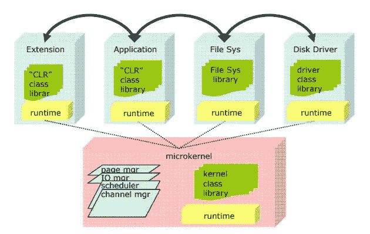
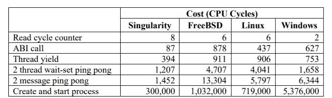
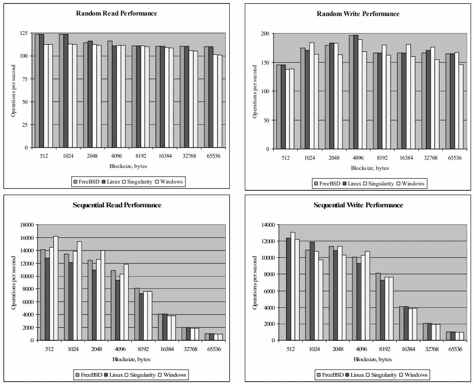
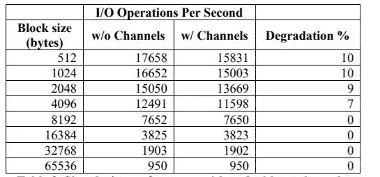

# 奇点——微软的实验性操作系统

> 原文：<https://levelup.gitconnected.com/operating-systems-are-more-exciting-than-you-think-d10e3c4a8d3e>

## 实验操作系统一瞥

在 [Unsplash](https://unsplash.com/s/photos/coding?utm_source=unsplash&utm_medium=referral&utm_content=creditCopyText) 上拍摄的 [ThisisEngineering RAEng](https://unsplash.com/@thisisengineering?utm_source=unsplash&utm_medium=referral&utm_content=creditCopyText)

如果我们现在从头开始写一个新的操作系统会发生什么？我们能做得更好吗？我们能提高安全性和健壮性吗？我们能防止应用程序之间的意外交互吗？

> “如果软件平台是以可靠性为主要目标从头开始设计的，那么它会是什么样子？”[1]

这些是微软研究团队在大约 18 年前试图回答的问题，当时他们为他们的新操作系统想出了一个非常酷的名字— ***奇点*** 。

# 目标

Singularity 旨在消除现有操作系统的一些缺点，例如

*   一般安全漏洞
*   由于扩展、驱动程序、附件导致的故障。
*   应用程序之间的意外交互
*   缺乏稳健性

# 战略

*   利用一种安全的编程语言——不再有 C 的诡计，我们不想从整数中“煮”出指针，不再手动释放内存，不再有缓冲区溢出。
*   使用验证工具——施加约束，使验证更容易。
*   改进系统架构和设计。

# 奇异建筑

[微软奇点项目概述](https://www.microsoft.com/en-us/research/wp-content/uploads/2005/10/tr-2005-135.pdf)

奇点提供了 3 个主要的抽象概念:

*   软件隔离进程(sip)
*   基于合同的渠道
*   基于清单的程序(MBPs)

让我们深入了解其中的每一项。

## 软件隔离的进程

SIP 就像一个普通的进程——拥有处理资源、上下文和一个线程容器。

令人惊讶的是，所有的 sip 和内核都运行在同一个地址空间，这也意味着用户代码以完全的硬件特权运行。

这不是完全违背直觉吗？我们刚刚提到，我们希望将提高安全性作为我们的目标之一，而这一变化似乎使情况变得更糟。

首先，让我们想想他们为什么要做出这样的改变

> 有什么改善吗？

答案是肯定的(很明显)，它提高了 ***的性能。***

由于所有 sip 都在相同的地址空间中，*上下文切换*执行得更快

*   不需要切换页表
*   无需无效和重新填充 TLB

而且，*系统调用*也更快

*   我们总是在 CPL=0
*   不需要加载内核堆栈
*   我们可以调用一个函数来代替发送中断

[微软奇点项目概述](https://www.microsoft.com/en-us/research/wp-content/uploads/2005/10/tr-2005-135.pdf)

在我们确信这一改变会使性能更好之后，让我们来解决表面上的安全问题。

每一口实际上都是**密封的**——不能从外面修改。
不同 sip 之间没有共享内存，没有信号，只有明确的 IPC。
也没有来自内部的代码修改——没有 JIT、类加载器、动态库。

为了确保 sip 实际上是密封的，我们采用以下约束

*   SIP 只指向它自己的数据，没有指向其他 SIP 的指针
*   没有指向内核的指针
*   SIP 独占访问内核给它的内存
*   SIP 不能创建新的指针——指针可以由可信的来源(如内核)提供。

有了这些限制，虽然有共享的地址空间，但没有数据共享。

## 基于合同的渠道

我们可以把渠道看作是能力。每个 SIP 可以有多个通道，通过它们我们可以创建 IPC(进程间通信)。
例如，打开的文件是从文件服务器接收的通道。
如果 SIP 获得该通道，则意味着它有权限访问该通道。

## 基于清单的程序

清单描述 SIP 的能力、所需资源和依赖性。没有清单和渠道，SIP 什么也做不了。
安装清单时，我们会验证它是否符合所有安全要求，它的所有依赖项是否都得到满足，并且它不会与以前安装的清单产生冲突。
例如，一个驱动程序的清单提供了“证据”来证明它不会访问另一个驱动程序的硬件。

在我们分道扬镳之前，这里有更多的图表来说明 Singularity 和其他众所周知的操作系统之间的比较

# 结论

奇点只是众多实验性操作系统中的一个例子。它的最后一次发布是在 2008 年 11 月，从那以后这个项目就停止了。

你可以在 [Github](https://github.com/lastweek/source-singularity) 上找到源代码。如果你想更多地了解这个话题，这里有一些不错的材料

*   [微软奇点项目概述](https://www.microsoft.com/en-us/research/wp-content/uploads/2005/10/tr-2005-135.pdf)
*   [重新思考软件堆栈](https://www.microsoft.com/en-us/research/wp-content/uploads/2016/02/osr2007_rethinkingsoftwarestack.pdf)

在上学期，我上了一门高级操作系统课程，我确实认为这个主题非常有趣，但至少在 Medium 上没有太多的曝光，因此写了这篇短文。希望我能让它读起来相对轻松有趣。

如果你想更熟悉操作系统，我可以推荐以下材料/书籍

*   麻省理工学院的计算机系统工程课程
*   [操作系统:三易其稿(书)](https://amzn.to/2UoNy2Z)
*   [操作系统概念(书)](https://amzn.to/3BcoDQW)

# 你怎么支持我？

*   通过我的[推荐链接](https://eliran9692.medium.com/membership)加入中级会员。

暂时就这样了。哦，等等，你也可以在推特上关注我。

# 参考

[1] [微软奇点项目概述](https://www.microsoft.com/en-us/research/wp-content/uploads/2005/10/tr-2005-135.pdf)