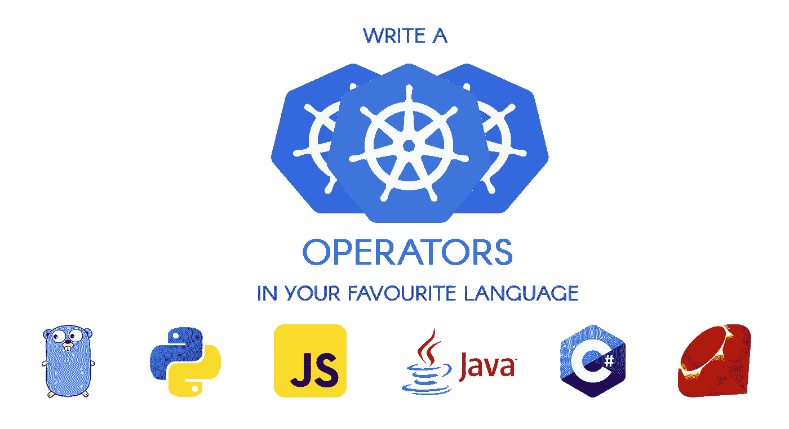
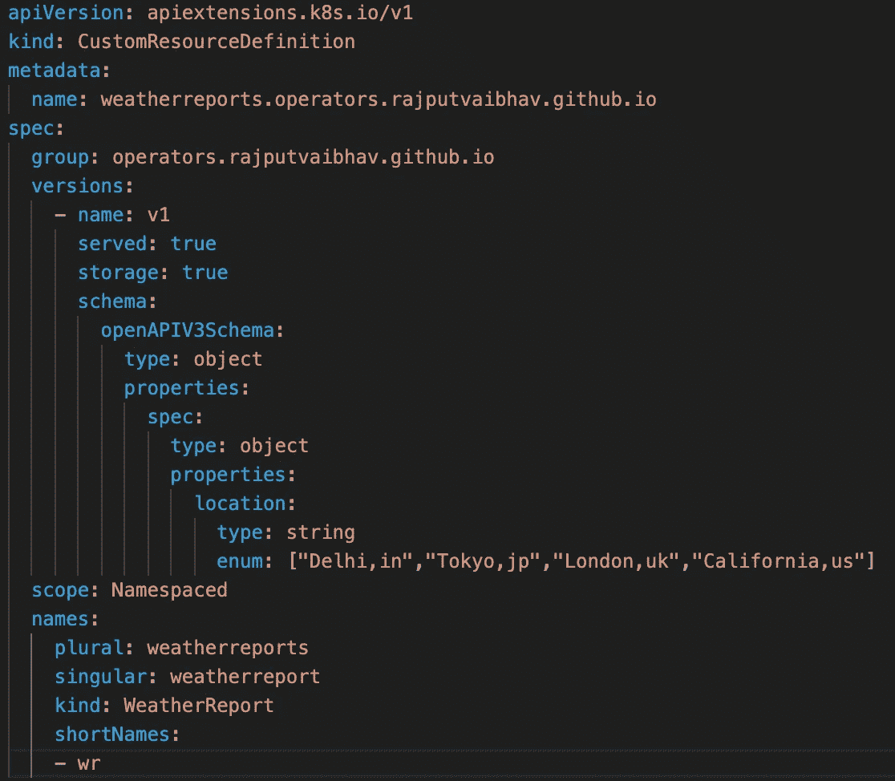
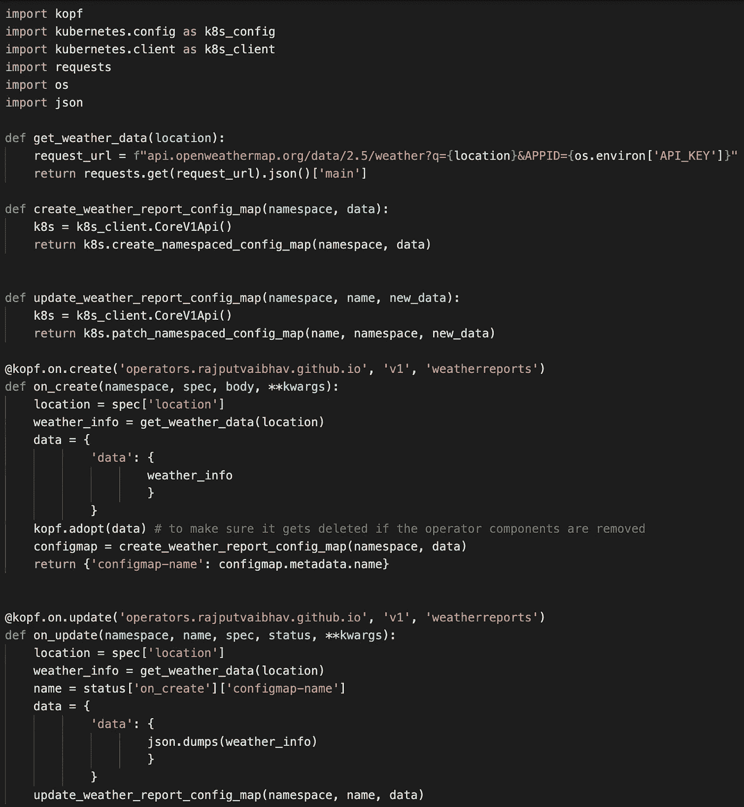
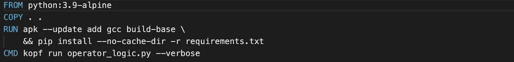
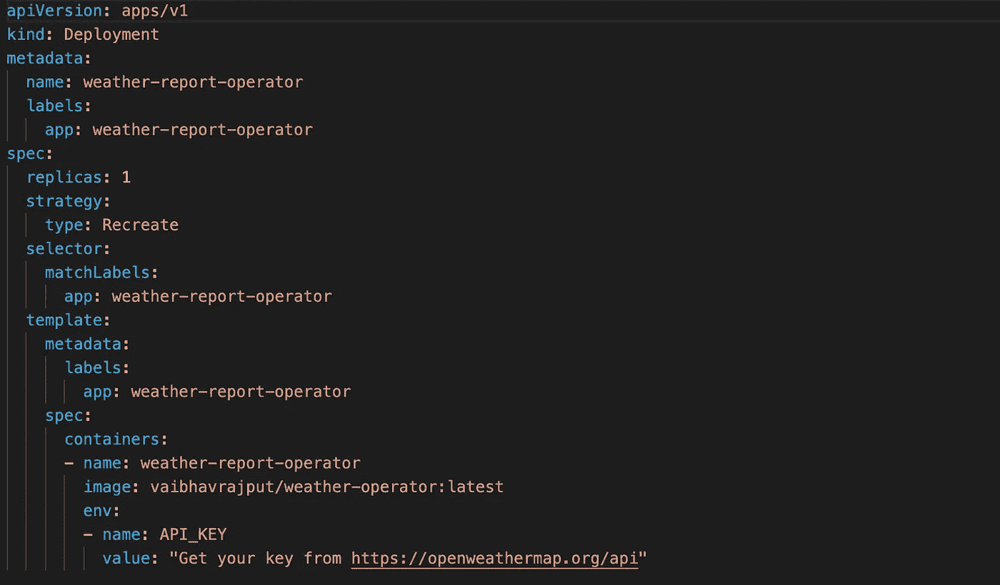
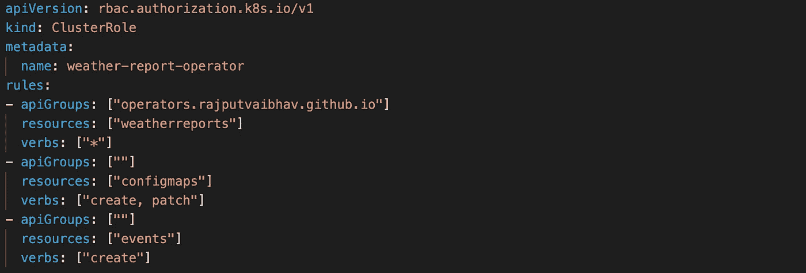
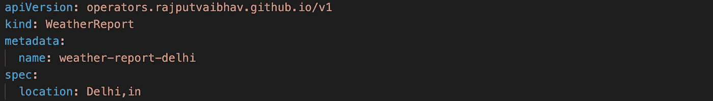
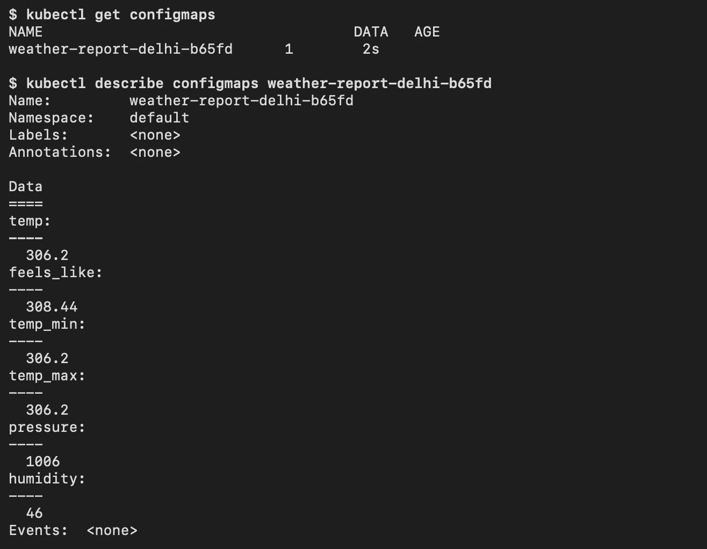

# 运营商:扩展 Kubernetes 功能

> 原文：<https://levelup.gitconnected.com/operators-extending-kubernetes-capabilities-184df001b7e>

操作员是 Kubernetes 的软件扩展，它利用[定制资源](https://kubernetes.io/docs/concepts/extend-kubernetes/api-extension/custom-resources/)来管理应用程序及其组件。这意味着，有些应用的部署和管理可能需要手动干预，而运营商是实现自动化的解决方案。

假设您需要部署一个数据库集群，每个 pod 在部署后都需要同步，或者每当部署一个新组件时都需要执行安全扫描，或者可能需要根据某个事件填充某些配置。这种功能在 Kubernetes 中不是现成的，但是可以使用操作符来实现。

让我们经历一次创建操作符的旅程，每一步我们都将详细了解它是如何工作的

## 第一步:为控制器想一个主意

很明显，对吧？
因此，我们将在这里创建一个自定义资源，该资源将指定一个位置，我们的操作员将读取该事件并调用 [OpenWeather](https://openweathermap.org/api) API 来获取该位置的天气详情，并将其填充到配置图中。

## 步骤 2:创建自定义资源定义

首先创建一个自定义资源定义，我们将在其中定义自定义资源的配置。因此，基本上对于我们的用例，我们将定义我们的自定义资源可以在其 spec 部分保存一个位置变量。

 [## RajputVaibhav/open weather _ operator

### 使用 Open Weather API 填充数据的 Kubernetes 运算符-RajputVaibhav/Open Weather _ operator

github.com](https://github.com/RajputVaibhav/openweather_operator/blob/master/crd.yaml) 

在这里，您可以注意到，我们已经创建了一个自定义 API 组，我们将使用它来创建自定义资源。

使用`kubectl apply -f crd.yaml`命令部署这个文件。

## 步骤 3:创建主操作符逻辑

您可以通过[从这里选择一个客户端](https://github.com/kubernetes-client)来创建多种语言的 kubernetes 操作符。我将在这里使用 python

 [## RajputVaibhav/open weather _ operator

### 使用 Open Weather API 填充数据的 Kubernetes 运算符-RajputVaibhav/Open Weather _ operator

github.com](https://github.com/RajputVaibhav/openweather_operator/blob/master/python-operator/operator_logic.py) 

让我们来分解这个代码…
我们需要一个代码，它可以像 kubernetes 控制循环一样工作，通过不断观察、检查差异并采取行动将实际状态带到所需状态。您当然可以自己实现它，但是对于 python，您可以直接使用 [kopf](https://kopf.readthedocs.io/en/stable/) 库，它抽象了所有这些逻辑，使您可以轻松地专注于您的需求。

现在让我们将它打包到一个简单的 docker 文件中

 [## RajputVaibhav/open weather _ operator

### 使用 Open Weather API 填充数据的 Kubernetes 运算符-RajputVaibhav/Open Weather _ operator

github.com](https://github.com/RajputVaibhav/openweather_operator/blob/master/python-operator/Dockerfile) 

## 步骤 4:部署操作员

我们将以通过部署创建的 pod 的形式部署操作员。

 [## RajputVaibhav/open weather _ operator

### 使用 Open Weather API 填充数据的 Kubernetes 运算符-RajputVaibhav/Open Weather _ operator

github.com](https://github.com/RajputVaibhav/openweather_operator/blob/master/deployment.yaml) 

现在使用`kubectl apply -f deployment.yaml`部署它

## 步骤 5:向操作员提供许可

为了确保安全性，您需要明确地为操作员提供所需的权限。为此，我们将创建一个集群角色

 [## RajputVaibhav/open weather _ operator

### 使用 Open Weather API 填充数据的 Kubernetes 运算符-RajputVaibhav/Open Weather _ operator

github.com](https://github.com/RajputVaibhav/openweather_operator/blob/master/rbac.yaml) 

并使用`kubectl apply -f rbac.yaml`部署它

## 步骤 6:创建自定义资源

现在我们的定义已经准备好了，我们将使用 location 的一个允许值来创建一个定制资源

 [## RajputVaibhav/open weather _ operator

### 使用 Open Weather API 填充数据的 Kubernetes 运算符-RajputVaibhav/Open Weather _ operator

github.com](https://github.com/RajputVaibhav/openweather_operator/blob/master/weather_report.yaml) 

一旦使用`kubectl apply -f weather_report.yaml`命令进行了部署，您就可以使用这个命令`kubectl api-resources --api-group=operators.rajputvaibhav.github.io`查看定制资源

创建完成后，你应该很快就能看到德里天气详细信息的配置图。

## 离别赠言

这里我们看到了如何基于 kubernetes 集群中的事件触发一组命令。同样，您可以为运营商找到各种应用程序来扩展您的集群的功能。

你还可以在 [operatorhub.io](https://operatorhub.io) 找到一长串由 kubernetes 社区创建的现有运营商。此外，您可以创建自己的运营商，并将其列在那里，为社区做出贡献。