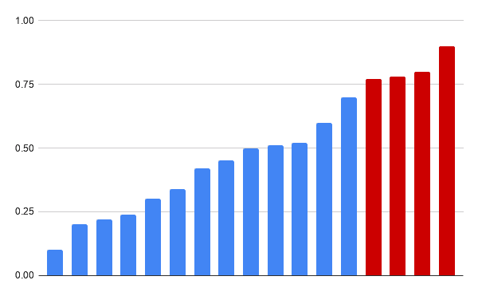

# 对数组的最佳浮点调整

> 原文：<https://levelup.gitconnected.com/optimal-floating-point-adjustments-to-an-array-ee6ea90cfa55>

*一些最有趣的编程面试问题都是基于数组的。这些面试问题的输入是简单的整数数组或浮点数。作为候选人，您的任务是对这些数字执行一些操作(可能找到最频繁出现的一个，或者数组中最大的和；或者，找到对数组的最佳浮点调整，就像今天的问题所要求的那样)。*

大多数基于数组的问题很容易陈述和理解。对于这些问题，想出并编写最简单、效率最低的解决方案也是极其容易和快速的。(确保您能够在几分钟内编写出最简单的解决方案！).与此同时，通常需要一个聪明的技巧或对数据结构的巧妙使用来提出最佳、最有效的解决方案。在这两种情况下，解决方案通常需要不到 50 行代码。

*今天，我们有一篇很长的帖子来讨论 Airbnb 提出的一个基于阵列的问题。我们提出三种难度越来越大、效率越来越高的解决方案。随意浏览* [*老帖子*](https://medium.com/swlh/smallest-missing-positive-integer-in-an-array-b6f197e78a16) *了解更多基于数组的问题。*

# 问题:

给你一个浮点数数组`X`，`x1`，`x2`，… `xn`。这些可以向上或向下舍入，以创建一个相应的整数数组`Y``y1`、`y2`、… `yn`

编写一个算法，找到具有以下属性的适当的`Y`数组:

*   两个数组的舍入总和应该相等。
*   元素之间的绝对成对差异被最小化。换句话说，`|x1- y1| + |x2- y2| + ... + |xn- yn|`应该越小越好。

比如，假设你的输入是`[1.3, 2.3, 4.4]`。在这种情况下，你不可能比`[1, 2, 5]`做得更好，它有一个`|1.3 - 1| + |2.3 - 2| + |4.4 - 5| = 1`的绝对差值。

# 解决方案 1:递归

数组中的每个索引`i`有两种可能的舍入模式:(1)使用`ceil`向上舍入，和(2)使用`floor`向下舍入。我们简单的递归解决方案只需执行以下步骤:

1.  它尝试索引的这两种模式`i`
2.  对于每种模式，它递归地为数组的后缀`[i+1, ..., n]`和剩余的目标差找到最优解
3.  在一种情况下，它将解与差`numbers[i] - floor(numbers[i])`相结合，在另一种情况下与`ceil(numbers[i]) - numbers[i]`相结合，以找到从索引`i`开始的数组后缀的最优解。

下面是最简单解决方案的递归 c++代码。

## 复杂性

原始数组中每个可能的索引`i`有 2 个可能的值(`floor`和`ceil`)，我们正在尝试每个索引的每个可能的值。由于数组中有`n`个索引，尝试的值的总数。因为我们对每个值的组合都执行恒定量的工作，所以总的时间复杂度也是 O(2ⁿ).

还有另一种计算时间复杂度的方法。对`adjust_recursive`的每一次调用都会使*对*进行两次具有较小值的递归调用。它还花费 O(n)时间复制数组。结果，大小为 n 的输入的时间复杂度 T(n)由`T(n) = 2T(n-1) + O(n)`给出。这个递归公式的解是 T(n) = O(2ⁿ).

我们显然可以做得比这更好！

# 解决方案 2:记忆化

我们的第一个突破来自于观察到我们在重复执行！特别是，我们用*同一套参数多次重复调用`adjust_recursive`！。*当问题的不同实例共享它们的子问题时，可以通过*动态规划来有效地计算解决方案。我们简单地缓存或记忆子问题的解，并在执行计算之前首先查找缓存的解。*

对于我们的问题，我们的*记忆表*的关键由两部分组成

*   *offset:* 记忆表中的条目只计算原数组后缀`numbers[offset...]`的有效解
*   *target:* 该表还对后缀施加了约束—调整后(向上或向下舍入)后缀的总和`numbers[offset...]`应该完全等于 target！

因此记忆表的元素`table[(offset, target)]`返回原始数组后缀`numbers[offset...]`的最优解，这样调整后的数组加起来就是`target`！

下面介绍使用记忆表对递归算法的修改。该解决方案还增加了一个额外的函数，使用记忆表重新计算调整后的数组:

## 复杂性

一个简单的记忆技巧对基本递归算法进行了重大改进！然而，分析这个算法的复杂性有点困难。这里有一种计算复杂度的方法

*   记忆键的`target`部分的下限是`floor(numbers[0]) + floor(numbers[1]) + ... + floor(numbers[n])`，上限是`ceil(numbers[0]) + ceil(number[1]) + ... + ceil(numbers[n])`。还有`target`可以拿的`O(N)`值！
*   记忆键的`offset`部分也采用`O(N)`值。因此，存储表中插入的键的总数。
*   对于表中插入的每一个值，我们都要执行一定量的工作，因此，该算法的总复杂度也是 O(N)。

我们能做得更好吗？事实证明我们可以！

# 解决方案 3:贪婪

这个问题的有效解决方案取决于关键的洞察力:

假设我们根据*原始数和它的底的差对原始`numbers`数组进行排序。*即索引`i`，使得`numbers[i] - floor(numbers[i])`最小，最先出现，等等。我们把排序后的数组叫做`floors`。然后，在最佳解决方案中，

> *存在一个索引，* `*best_idx*` *，这样整个前缀* `*floors[0...best_idx]*` *向下舍入***(使用 floor)，整个后缀* `*floors[best_idx+1...]*` *向上舍入***(使用 ceil)。***

**情况如下图所示:**

****

**调整阵列的单个元素**

**这里，条形的高度表示原始数字的(排序的)小数部分。最终解中，所有蓝色数字*向下取整(floor)* ，所有红色数字*向上取整(ceil)。***

**这种*局部优化*产生全局解的方法是 ***贪婪算法的标志。*** 下面是这个问题的贪婪算法的一个实现**

1.  **首先根据`(numbers - floors(numbers))`差对数组进行排序。**
2.  **从末尾开始遍历排序后的数组，找到最优的`best_idx`索引。**

## **复杂性**

**我们终于找到了解决这个问题的最有效的算法！这种解决方案的大部分复杂性集中在`std::sort`调用中，其最坏情况的复杂性为 O(N logN)。所有后续代码都只是使用 O(N)时间在数组上迭代一次。因此，这个解决方案的总复杂度是 O(N logN)。**

# **测试**

**让我们用 [GUnit 测试](https://github.com/cpp-testing/GUnit)测试几个案例**

*   **空列表**
*   **单一元素列表(向上或向下舍入)**
*   **示例中的复杂列表**

***原载于 2021 年 2 月 3 日***。****