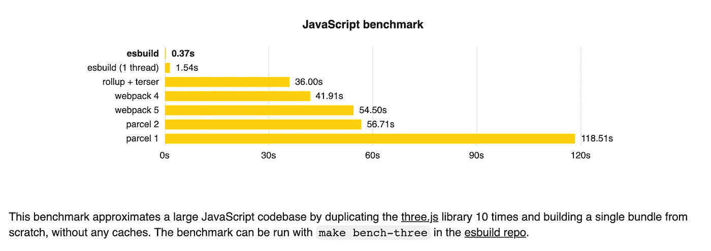
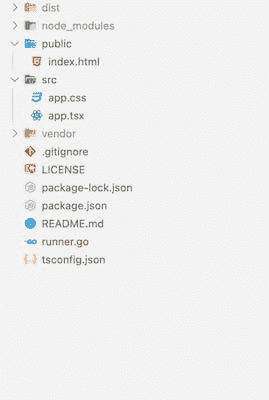
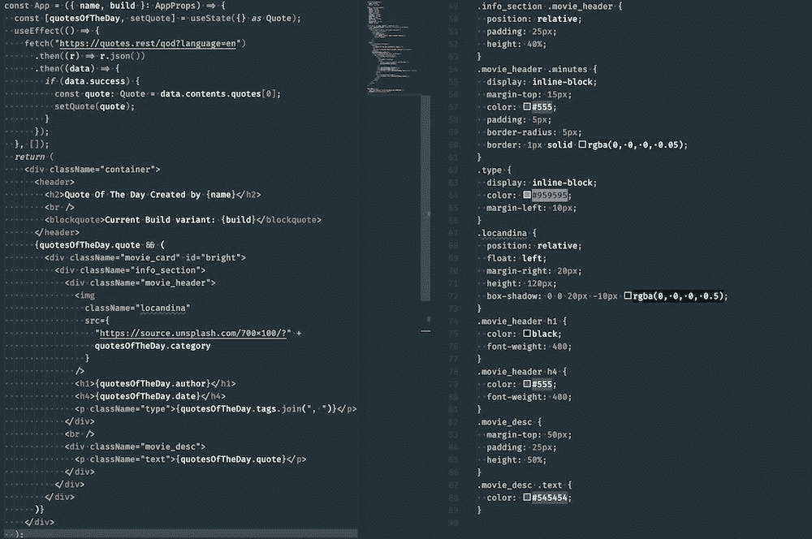
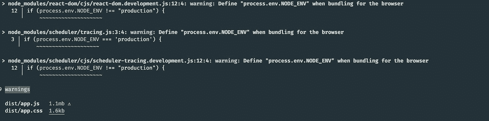
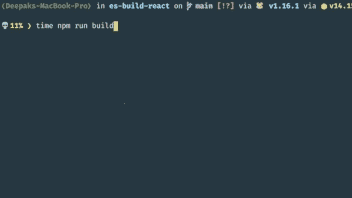

# 使用 Go 和 ESBuild 优化您的前端 CI/CD 管道

> 原文：<https://levelup.gitconnected.com/optimise-your-frontend-ci-cd-pipeline-with-go-and-esbuild-a9044809df76>


涉及

如果你听说过 [Snowpack](https://www.snowpack.dev/) ，你可能对 [ESBuild](https://esbuild.github.io/) 很熟悉。ESBuild 是前端库最快的捆绑器/编译器之一。ESBuild 是用 [Golang](https://golang.org/) 写的，这使得它很快。ESBuild 不是满足您所有需求的完整解决方案。然而，在您的管道中实现它可以显著地提高您的团队生产率和部署构建时间。

**先决条件:**

1.  go[1.6 及以上版本]
2.  NPM (nodejs 包管理器)

**注:** [ESBuild](https://esbuild.github.io/getting-started/#install-esbuild) 在 nodejs 中也有。然而，我发现使用 Go 和创建二进制 CLI 要快得多，而且可重用。

# 有了 webpack 为什么还要用 ESBuild？

*您没有理由停止使用*[*web pack*](https://webpack.js.org/)*。但是有很多理由至少可以开始考虑使用 ESBuild。下面是一些最好的例子。更多信息，可以访问* [*官方页面。*](https://esbuild.github.io/faq/#why-is-esbuild-fast)

1.  用 Go 写的，编译成**原生码**。
2.  **排比**大量使用。
3.  **内存**使用效率高。
4.  默认添加的加载程序和插件

**【编译器时间比较】**



# 从哪里开始

要构建管道，您需要一个应用程序。你可以从零开始一个项目，正如这里的[所记录的](https://esbuild.github.io/getting-started/#your-first-bundle)。然而，出于演示目的，我将使用我在 Github 中创建的[每日报价](https://github.com/deepakshrma/es-build-react)应用程序。

# 项目结构



*   **公共:**保存所有公共文件如图像的地方
*   src: 它包含用 TypeScript 和 ReactJS 编写的源代码
*   **package.json:** 这将包含 nodejs 应用程序的所有公共脚本和依赖项
*   **runner.go:** 构建脚本用 Golang 编写，使用 ESBuild 编译和捆绑 typescript
*   **ts config . JSON:**TypeScript 和 react 项目的基本配置。

*其余的文件和文件夹你暂时可以忽略。*

**注意:**本文的目的是展示如何使用 ESBuild。所以我不打算深入 react app 的细节。你可以在当天回购的[报价中找到源代码。](https://github.com/deepakshrma/es-build-react)



[代码截图]

# 编写您的第一个 Go 脚本

**打开** `**runner.go**` **并在下面添加代码**

```
package mainimport (
    "os""github.com/evanw/esbuild/pkg/api"
)func main() {
    result := api.Build(api.BuildOptions{
        EntryPoints: []string{"src/app.tsx"},
        Outdir:      "dist",
        Bundle:      true,
        Write:       true,
        LogLevel:    api.LogLevelInfo,
    })
    if len(result.Errors) > 0 {
        os.Exit(1)
    }
}
```

**创建 go 模块并获取所有 go 依赖项**

```
## Create/init a go module
go mod init quote-of-day## Create vendor module/directory for all dependencies(similar to **node_modules**)
go mod vendor## Get all go dependencies
go mod tidy
```

一旦你完成了 go 模块，让我们更新`package.json`来构建 go 二进制 runner。

```
/*package.json*/"scripts": {
    "build:bin": "go build -o runner.exe runner.go",
    "build": "./runner.exe && cp public/* dist/",
    "serve": "http-server dist",
    "test": "echo \"Error: no test specified\" && exit 1"
  },
```

**解释:** `npm run build:bin`会创建一个可执行的二进制文件(runner.exe)。这将用于编译 react 源代码。下次要编译 react 代码，可以使用`npm run build`。

**注意:**我们可以直接使用`go run`命令。然而，二进制会快得多，并且可以在团队之间分发。

**运行构建:**一旦运行`npm run build`，您将看到如下输出。您将看到一些警告，我们稍后会修复这些警告。

*注意事项，***`*app.js*`*。大概会在* `*1mb*` *左右对于这么小的 app 来说太高了。***

****

# **优化生成设置并修复警告消息**

**为了优化 esbuild 设置，让我们在`runner.go`中添加下面的`BuildOptions`**

```
**//... rest of the codefunc main() {
    result := api.Build(api.BuildOptions{
        EntryPoints:       []string{"src/app.tsx"},
        Outdir:            "dist",
        Bundle:            true,
        Write:             true,
        LogLevel:          api.LogLevelInfo,
        ChunkNames:        "chunks/[name]-[hash]",
        MinifyWhitespace:  true,
        MinifyIdentifiers: true,
        MinifySyntax:      true,
        Splitting:         true,
        Format:            api.FormatESModule,
        Color:             api.ColorAlways,
        Define: map[string]string{
            "process.env.NODE_ENV": `"dev"`,
        },
        AssetNames: "assets/[name]-[hash]",
        Loader: map[string]api.Loader{
            ".png": api.LoaderFile,
        },
        Engines: []api.Engine{
            {api.EngineChrome, "58"},
            {api.EngineFirefox, "57"},
            {api.EngineSafari, "11"},
            {api.EngineEdge, "16"},
        },
    })
    if len(result.Errors) > 0 {
        os.Exit(1)
    }
}**
```

***现在重新构建 runner.exe 并用* `*npm run build:bin && npm run build*` *命令重新运行构建。这一次，您不会看到任何错误或警告。同时，app.js 的大小会缩小到* `*283.4kb*` *。***

## **当日报价申请**

**为了查看输出，我在`devDependencies`中添加了`http-server`。您可以使用任何其他静态服务器。**

```
**npm run serve**
```

****【今日报价 App 演示】****

****

# **与 Webpack 的比较**

**我试图比较 Webpack 在最低配置下的构建时间。为此，我们确实需要添加一些开发依赖项和 Webpack 本身。**

****添加依赖关系:**对于 webpack 配置，我们需要添加一些加载器和依赖关系**

```
**npm install --save-dev css-loader style-loader webpack webpack-cli typescript ts-loader**
```

****更新包脚本:**使用 webpack 添加新命令来运行构建**

```
**"scripts": {
    ...
    "webpack": "webpack && cp public/* dist/",
   ...
  },**
```

****创建一个 webpack 配置文件:****

```
**// webpack.config.jsconst path = require("path");module.exports = {
  entry: "./src/app.tsx",
  mode: "production",
  module: {
    rules: [
      {
        test: /\.tsx?$/,
        use: "ts-loader",
        exclude: /node_modules/,
      },
      {
        test: /\.css$/i,
        use: ["style-loader", "css-loader"],
      },
    ],
  },
  resolve: {
    extensions: [".tsx", ".ts", ".js"],
  },
  output: {
    filename: "app.js",
    path: path.resolve(__dirname, "dist"),
  },
};**
```

****让我们运行两个命令并进行比较:****

*   **运行 ESBuild: npm 运行 Build**
*   **运行网络包:npm 运行网络包**

****

**与 Webpack 的比较**

***web pack v/s es build 所用时间为* `*5.387s/0.329s*` *。正如您可以清楚地看到 Webpack 与 ESBuild 时间之间的差异。ESBuild 比 Webpack 快 16 倍。***

# **结论**

**ESBuild 不是满足您所有需求的解决方案。在我看来，ESBuild 不应该用于开发目的。它不是一个完整的工具。您可能很难启用像实时重新加载这样的功能。为此，您可以使用构建在 ESBuild APIs 之上的 [Snowpack](https://www.snowpack.dev/) 。但是，通过优化构建配置和适当的脚本管道，您可以显著优化 CI/CD 管道。**

*****可可·香奈儿*** 有一句很好听的名言**

> ***“为了不被取代，一个人必须永远与众不同”——可可·香奈儿***

**如果你喜欢并欣赏我花了几个小时去**研究**，**写代码**和**写这篇文章**。请分享你的爱和反应；)😊。提前感谢。**

**代码:你可以在[es-build-react](https://github.com/deepakshrma/es-build-react)GitHub repo 中全部编码。并且 webpack 版本的代码可以在 Github repo 的 [esbuild_vs_webpack](https://github.com/deepakshrma/es-build-react/tree/esbuild_vs_webpack) 分支中找到。**

***原发布于*[*https://blog . decipe . dev*](https://blog.decipher.dev/optimize-your-frontend-cicd-pipeline-with-go-and-esbuild)*。***